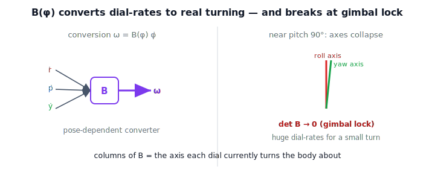

!!! abstract "You are here"
    **Module 6 — Jacobians and Differential Motion**  ·  **Unit 3 — Analytic Jacobian, Frames & Representations**  ·  **Lesson 3.2 — The Representation Map B(φ): Linking ω to Angle Rates**

# Lesson 3.2 — The Representation Map B(φ): Linking ω to Angle Rates

> Worked convention: ZYX roll-pitch-yaw (pending M2 reconciliation). The construction
> is identical for any smooth angle set.

## 1. Why This Matters
Lesson 3.1 left a gap: the analytic Jacobian reports angle-rates
$\dot{\boldsymbol{\phi}}$, the geometric one reports angular velocity
$\boldsymbol{\omega}$, and on orientation they disagree. The **representation map**
$B(\boldsymbol{\phi})$ closes that gap — it is the exact converter
$\boldsymbol{\omega}=B(\boldsymbol{\phi})\dot{\boldsymbol{\phi}}$. Beyond tidiness, it
explains a notorious failure (gimbal lock) and lets you move freely between
angle-based controllers and physical-twist reasoning.

## 2. Physical Intuition
Spin the yaw dial at a steady rate. How fast is the body actually turning? It depends
on where the pitch dial is. Near level pitch, one unit of yaw-dial spin turns the body
about vertical, fully. But tilt the pitch toward straight-up, and yaw and roll start
turning the body about *nearly the same axis* — so the dials can spin furiously while
the body barely changes its net rotation, or must spin impossibly fast to produce an
ordinary turn. The conversion from "dial rates" to "real turning" is therefore
*configuration-dependent*. That configuration-dependent converter is $B(\boldsymbol{\phi})$.

## 3. Visual Explanation

<figure markdown>
  { width="680" }
</figure>

**Diagram Specification (multi-panel)**

- **Panel 1 — conversion:** three needle-rates $\dot r,\dot p,\dot y$ entering a block
  $B(\boldsymbol{\phi})$, out comes one arrow $\boldsymbol{\omega}$.
- **Panel 2 — near gimbal:** the roll and yaw rotation axes drawn nearly coincident as
  pitch $\to 90^\circ$; a note that $B$ loses rank there (huge dial-rates needed for a
  small turn).
- Caption: "B(φ) converts dial-rates to real turning; how it converts depends on the
  current angles — and it breaks down at gimbal lock."

## 4. Mathematical Foundations
*In words first:* each angle, when its dial moves, rotates the body about some axis;
add those contributions and you get $\boldsymbol{\omega}$, so $\boldsymbol{\omega}$ is a
(pose-dependent) linear combination of the dial-rates.

Formally, with $R(\boldsymbol{\phi})$ the orientation from the angles, differentiate:
$S(\boldsymbol{\omega}) = \dot R R^\top = \sum_k \big(\partial R/\partial \phi_k\big)R^\top\,\dot\phi_k$.
Taking the vee of each term gives the columns of $B$:

$$\boldsymbol{\omega} = B(\boldsymbol{\phi})\,\dot{\boldsymbol{\phi}},\qquad
B_{:,k}(\boldsymbol{\phi}) = \Big(\tfrac{\partial R}{\partial \phi_k}\,R^\top\Big)^\vee.$$

Each column is the angular velocity produced by moving one dial at unit rate — the
"axis" that dial currently turns the body about. The bridge to the Jacobians is
immediate: since $\boldsymbol{\omega}=J_\omega\dot{\mathbf{q}}$ and
$\dot{\boldsymbol{\phi}}=J_\phi\dot{\mathbf{q}}$,

$$\boxed{\,J_\omega = B(\boldsymbol{\phi})\,J_\phi,\qquad J_\phi = B(\boldsymbol{\phi})^{-1} J_\omega\,}$$

whenever $B$ is invertible. *Back to motion:* $B$ is the dictionary between "how the
dials move" and "how the body turns," and it is the missing link that makes the
geometric and analytic Jacobians two views of one motion.

## 5. Engineering Example
An orientation controller computes a desired angular velocity $\boldsymbol{\omega}_d$
(physical, frame-natural) but actuates through an angle-based trajectory in roll-pitch-yaw.
It converts with $\dot{\boldsymbol{\phi}}_d = B(\boldsymbol{\phi})^{-1}\boldsymbol{\omega}_d$.
The danger is built into $B^{-1}$: as pitch nears $\pm 90^\circ$, $B$ becomes singular,
$B^{-1}$ blows up, and the commanded dial-rates explode for an ordinary desired turn —
the mathematical face of gimbal lock. Production code either avoids that region or
switches representations.

## 6. Worked Example
At an orientation with modest pitch, build $B(\boldsymbol{\phi})$ column by column
(each column the unit-dial angular velocity). Pick a joint-rate vector
$\dot{\mathbf{q}}$, read $\boldsymbol{\omega}$ from the geometric Jacobian and
$\dot{\boldsymbol{\phi}}$ from the analytic Jacobian; you will find
$\boldsymbol{\omega}=B(\boldsymbol{\phi})\dot{\boldsymbol{\phi}}$ to numerical
precision, and equivalently $J_\omega=B(\boldsymbol{\phi})J_\phi$. Then push pitch
toward $90^\circ$ and watch $\det B \to 0$.

## 7. Interactive Demonstration
*(Guided prediction; flagship demos at L17/L21.)*

**Predict, then check.**

1. **Predict** whether $\boldsymbol{\omega}=B\dot{\boldsymbol{\phi}}$ should hold for any
   $\dot{\mathbf{q}}$.
2. **Predict** what happens to $\det B$ as pitch $\to 90^\circ$.
3. **Check** both in the notebook.

## 8. Coding Exercise

!!! tip "Run the hands-on notebook"
    `modules/module06/notebooks/lesson10_representation_map.ipynb` — open in JupyterLab and run **Kernel → Restart & Run All**.

In the companion notebook:

1. Build `B(phi)` with columns $(\partial R/\partial \phi_k\,R^\top)^\vee$.
2. Verify $\boldsymbol{\omega}_{\text{geo}} = B(\boldsymbol{\phi})\,\dot{\boldsymbol{\phi}}_{\text{analytic}}$
   for random $\dot{\mathbf{q}}$, and $J_\omega = B J_\phi$.
3. Sweep pitch toward $90^\circ$ and plot $\det B \to 0$.

Prints `All checks passed.`

## 9. Knowledge Check

Formative — unlimited attempts, immediate feedback; does not affect your grade.

<iframe src="../../quizzes/module06/lesson10_quiz.html" title="The Representation Map B(φ): Linking ω to Angle Rates knowledge check" style="width:100%;height:720px;border:1px solid #e2e8f0;border-radius:12px"></iframe>

[Open this quiz in a new tab ↗](../quizzes/module06/lesson10_quiz.html)

1. Why are $\dot{\boldsymbol{\phi}}$ and $\boldsymbol{\omega}$ different?
2. Write the relationship between them and between the two Jacobians.
3. What is the physical meaning of a single column of $B(\boldsymbol{\phi})$?
4. What happens to $B$ at gimbal lock, and why does it matter for control?

## 10. Challenge Problem
Derive $B(\boldsymbol{\phi})$ in closed form for ZYX roll-pitch-yaw and identify the
exact pitch values where $\det B = 0$. Explain geometrically why two of the three
rotation axes become parallel there, so that no choice of finite dial-rates can produce
certain angular velocities.

## 11. Common Mistakes
- **Treating $B$ as constant.** It depends on the current angles.
- **Inverting $B$ near gimbal lock.** $B^{-1}$ blows up; the angles, not the robot, are
  the problem (Lesson 3.4).
- **Mismatched conventions.** $B$ must match the same angle convention used for
  $\boldsymbol{\phi}$.

## 12. Key Takeaways
- $\boldsymbol{\omega} = B(\boldsymbol{\phi})\,\dot{\boldsymbol{\phi}}$ converts
  angle-rates to true angular velocity.
- Each column of $B$ is the angular velocity from moving one angle at unit rate.
- The Jacobians connect through it: $J_\omega = B(\boldsymbol{\phi})\,J_\phi$.
- $B$ is pose-dependent and singular at gimbal lock — a *representation* failure, set up
  for Lesson 3.4.

---

### AI Learning Companion

- **Tutor (re-explain):** "Explain $\boldsymbol{\omega}=B(\boldsymbol{\phi})\dot{\boldsymbol{\phi}}$
  with the 'dial-rates vs real turning' picture and why $B$ depends on pose. Then quiz me."
- **Practice (generate exercises):** "Give me three problems on the representation map
  $B$, including one on its singularity. Hold solutions."
- **Explore (connect to the real world):** "Explain gimbal lock through $B(\boldsymbol{\phi})$
  and how spacecraft/IMU systems avoid it."

### Global Learning Support

- **English (authoritative):** "Explain the representation map $B(\boldsymbol{\phi})$,
  $\boldsymbol{\omega}=B\dot{\boldsymbol{\phi}}$, and $J_\omega=B J_\phi$, at robotics level."
- **Español:** "Explica el mapa de representación $B(\boldsymbol{\phi})$,
  $\boldsymbol{\omega}=B\dot{\boldsymbol{\phi}}$, y $J_\omega=B J_\phi$, a nivel de robótica."
- **中文（简体）：** "用机器人学课程的水平，解释表示映射 $B(\boldsymbol{\phi})$、
  $\boldsymbol{\omega}=B\dot{\boldsymbol{\phi}}$ 以及 $J_\omega=B J_\phi$。"
- **Türkçe:** "Temsil haritası $B(\boldsymbol{\phi})$'yi, $\boldsymbol{\omega}=B\dot{\boldsymbol{\phi}}$
  ve $J_\omega=B J_\phi$ ilişkisini robotik ders düzeyinde açıkla."

---

*Next lesson: 3.3 — Base-Frame vs Tool-Frame Jacobian.*
