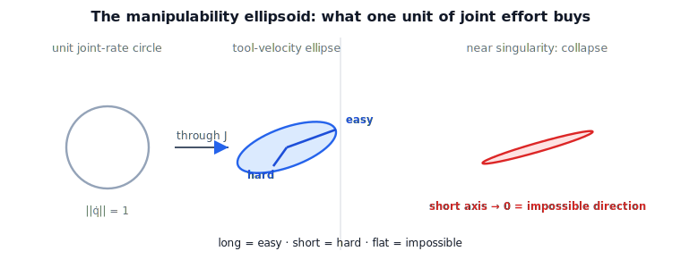

!!! abstract "You are here"
    **Module 6 — Jacobians and Differential Motion**  ·  **Unit 4 — Rank, Manipulability & the Ellipsoid**  ·  **Lesson 4.2 — The Manipulability Ellipsoid: A Picture of What the Robot Can Do**

# Lesson 4.2 — The Manipulability Ellipsoid: A Picture of What the Robot Can Do

## 1. Why This Matters
Lesson 4.1 sorted directions into available / impossible / internal. The
**manipulability ellipsoid** turns that yes/no picture into a *shape* that also shows
the in-between: not just whether the tool can move a direction, but how *easily*. It is
the single most useful picture in this module — a snapshot, at one pose, of the robot's
freedom to move. We build it as a picture first; the number that summarizes it waits for
Lesson 4.3, exactly as capability should precede metric.

## 2. Physical Intuition
Imagine spending a fixed "budget" of joint effort — every combination of joint rates with
$\lVert\dot{\mathbf{q}}\rVert=1$ — and asking how fast the tool moves for each. In some
directions that unit of effort buys a lot of tool speed (easy directions); in others it
buys very little (difficult directions). Plot all the resulting tool velocities and they
fill an **ellipsoid**: stretched long toward the easy directions, squashed short toward
the hard ones. Push the arm toward a singularity and one axis shrinks to zero — the
ellipsoid flattens into a disk or line, the geometric face of an impossible direction.

## 3. Visual Explanation

<figure markdown>
  { width="680" }
</figure>

## 4. Mathematical Foundations
*In words first:* the ellipsoid is just the image of the unit ball of joint velocities
under the Jacobian; its axes point along the easy/hard directions and their lengths say
how easy.

The set of tool velocities reachable with unit joint effort is

$$\mathcal{E} = \{\,\boldsymbol{\xi}=J\dot{\mathbf{q}} : \lVert\dot{\mathbf{q}}\rVert \le 1\,\}.$$

This is an ellipsoid. Its principal axes are the directions $\mathbf{u}_i$ and its
semi-axis lengths are the numbers $\sigma_i$ that come from the singular value
decomposition $J=U\Sigma V^\top$ (formalized in Unit 6): the $\mathbf{u}_i$ (columns of
$U$) point along the ellipsoid axes, and the $\sigma_i$ are their lengths. So:

- **largest $\sigma$ ⇒ longest axis ⇒ easiest direction;**
- **smallest $\sigma$ ⇒ shortest axis ⇒ hardest direction;**
- **a $\sigma\to 0$ ⇒ a collapsed axis ⇒ an impossible direction (singularity).**

*Back to motion:* the ellipsoid is not an abstract matrix object — it is the drawn answer
to "which way can this arm move, and how freely, right now." Unit 6 will name $U,\Sigma,V$
properly; here the shape is the point.

## 5. Engineering Example
A welding arm must drag its torch quickly along a seam. The planner checks the
manipulability ellipsoid along the seam: where the ellipsoid's long axis aligns with the
seam, the arm moves the torch fast and smoothly for little joint effort; where the seam
crosses the ellipsoid's short axis, the arm strains and joint rates climb. Choosing a
base placement (or arm posture) that keeps the easy axis along the seam is a direct,
picture-level use of manipulability — no number required to see it.

## 6. Worked Example
For a planar 2R arm at a comfortable pose, sample the unit circle of joint rates and map
each through $J_v$. The resulting points trace an ellipse whose maximum radius equals the
largest singular value of $J_v$ and whose minimum radius equals the smallest — the easy
and hard tool-speed directions. Move the arm toward straight and watch the ellipse
flatten toward a line: the radial direction's radius heads to zero. The notebook draws
the ellipse and confirms its extents equal the singular values.

## 7. Interactive Demonstration

<iframe src="../../demos/module06/lesson14_manipulability_ellipsoid.html" title="The Manipulability Ellipsoid: A Picture of What the Robot Can Do interactive demo" style="width:100%;height:520px;border:1px solid #e2e8f0;border-radius:12px"></iframe>

[Open this demo in a new tab ↗](../demos/module06/lesson14_manipulability_ellipsoid.html)

**Coming at Lesson 5.1 — the Ellipsoid Collapse demo** lets you drag the arm and watch
the ellipsoid deform and flatten at a singularity in real time. For now:

**Predict, then check.**

1. **Predict** the ellipse's longest and shortest radii relative to the singular values.
2. **Predict** what the ellipse becomes as the arm straightens.
3. **Check** in the notebook by mapping the unit circle and measuring the ellipse.

## 8. Coding Exercise

!!! tip "Run the hands-on notebook"
    `modules/module06/notebooks/lesson14_manipulability_ellipsoid.ipynb` — open in JupyterLab and run **Kernel → Restart & Run All**.

In the companion notebook:

1. Map the unit circle $\lVert\dot{\mathbf{q}}\rVert=1$ through $J_v$ for a planar 2R arm
   and plot the resulting ellipse.
2. Confirm the ellipse's max/min radii equal the max/min singular values of $J_v$.
3. Repeat near a singular pose and observe the ellipse flatten toward a line.

Prints `All checks passed.`

## 9. Knowledge Check

Formative — unlimited attempts, immediate feedback; does not affect your grade.

<iframe src="../../quizzes/module06/lesson14_quiz.html" title="The Manipulability Ellipsoid: A Picture of What the Robot Can Do knowledge check" style="width:100%;height:720px;border:1px solid #e2e8f0;border-radius:12px"></iframe>

[Open this quiz in a new tab ↗](../quizzes/module06/lesson14_quiz.html)

1. What set of inputs produces the manipulability ellipsoid?
2. What do the long and short axes mean physically?
3. What does a collapsed axis indicate?
4. Why is the ellipsoid introduced as a picture before any measure?

## 10. Challenge Problem
Explain why the ellipsoid's axes are orthogonal even though the Jacobian's columns
generally are not. (Hint: the axes come from the singular vectors of $J$, which are
orthonormal by construction — Unit 6.) What does the orthogonality of the easy/hard
directions tell you about how capability is distributed at a pose?

## 11. Common Mistakes
- **Reading the columns of $J$ as the ellipsoid axes.** The axes are the singular
  directions, not the (generally non-orthogonal) columns.
- **Thinking a long ellipsoid means "good" everywhere.** It is directional: easy one way,
  hard another. Capability is a shape, not a scalar (yet).
- **Ignoring the collapse.** A nearly flat ellipsoid is the warning sign of a singularity.

## 12. Key Takeaways
- The manipulability ellipsoid = image of the unit joint-velocity sphere under $J$.
- Long axis = easy tool direction; short axis = hard; collapsed axis = impossible
  (singularity).
- Its axes/lengths are the singular vectors/values of $J$ (named in Unit 6).
- It is a picture of capability — the metric comes next (Lesson 4.3).

---

### AI Learning Companion

- **Tutor (re-explain):** "Explain the manipulability ellipsoid as 'what one unit of joint
  effort buys in every direction,' with easy/hard/impossible axes. Then quiz me."
- **Practice (generate exercises):** "Give me three problems on the manipulability
  ellipsoid, including one near a singularity. Hold solutions."
- **Explore (connect to the real world):** "How do engineers place a robot base or pick a
  posture so the ellipsoid's easy axis aligns with the task direction?"

### Global Learning Support

- **English (authoritative):** "Explain the manipulability ellipsoid as the image of the
  unit joint-velocity sphere under J, with easy/hard/impossible directions."
- **Español:** "Explica el elipsoide de manipulabilidad como la imagen de la esfera
  unitaria de velocidades articulares bajo J, con direcciones fáciles/difíciles/imposibles."
- **中文（简体）：** "用机器人学课程的水平，把可操作度椭球解释为单位关节速度球在 J 下的像，
  含容易/困难/不可达方向。"
- **Türkçe:** "Manipülabilite elipsoidini, birim eklem-hız küresinin J altındaki görüntüsü
  olarak (kolay/zor/imkânsız yönlerle) robotik ders düzeyinde açıkla."

---

*Next lesson: 4.3 — Putting a Number on It: The Yoshikawa Manipulability Measure.*
