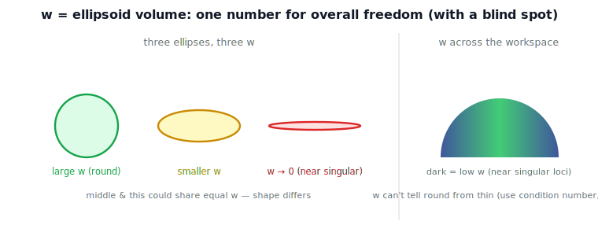

!!! abstract "You are here"
    **Module 6 — Jacobians and Differential Motion**  ·  **Unit 4 — Rank, Manipulability & the Ellipsoid**  ·  **Lesson 4.3 — Putting a Number on It: The Yoshikawa Manipulability Measure**

# Lesson 4.3 — Putting a Number on It: The Yoshikawa Manipulability Measure

## 1. Why This Matters
The ellipsoid (Lesson 4.2) is the honest picture of capability, but pictures are hard to
optimize, log, or compare across thousands of poses. So we summarize the ellipsoid with a
single number — the **Yoshikawa manipulability measure** $w$. It is the metric the
architect asked us to introduce *second*: only after the capability picture is in place.
Used well, $w$ is a fast scalar that flags how close the robot is to losing mobility;
used carelessly, it hides directionality. We do both: define it, and name its blind spot.

## 2. Physical Intuition
If the ellipsoid is "how freely the tool can move in each direction," its **volume** is a
natural one-number summary of overall freedom. A big, round ellipsoid → large volume →
the arm moves well in every direction. A long thin ellipsoid → small volume → the arm is
near a configuration where some direction is about to vanish. Squash any axis to zero —
a singularity — and the volume goes to zero. That volume is the manipulability measure.

## 3. Visual Explanation

<figure markdown>
  { width="680" }
</figure>

**Diagram Specification (multi-panel)**

- **Panel 1 — three ellipses:** round/isotropic (label "large $w$"), elongated (label
  "smaller $w$"), nearly flat (label "$w\to 0$, near singular").
- **Panel 2 — workspace heatmap:** a planar arm's reachable area shaded by $w$, bright in
  well-conditioned regions, dark along singularity loci.
- Caption: "$w$ = ellipsoid volume: one number for overall freedom — but it cannot tell a
  round shape from an elongated one of equal area."

## 4. Mathematical Foundations
*In words first:* multiply the ellipsoid's semi-axis lengths together — that product (the
volume) is the measure.

Yoshikawa's manipulability measure is

$$\boxed{\,w(\mathbf{q}) = \sqrt{\det\!\big(J(\mathbf{q})\,J(\mathbf{q})^\top\big)}\, } = \prod_i \sigma_i,$$

the product of the Jacobian's singular values — i.e. the ellipsoid's volume (up to a
constant). Special cases and properties:

- **Square $J$:** $w = \lvert\det J\rvert$. (For the planar 2R, $w=|L_1L_2\sin\theta_2|$ —
  the M5 singularity expression, now read as a capability measure.)
- **At a singularity:** the smallest $\sigma\to 0$, so $w\to 0$. $w$ is a smooth
  distance-to-singularity-style scalar.
- **Blind spot — isotropy:** $w$ measures volume, not shape. A round ellipsoid and a long
  thin one of equal area share the same $w$, yet the thin one is far worse to work near.
  Lesson 6.3 fixes this with the **condition number** (ratio of largest to smallest
  $\sigma$).

*Back to motion:* $w$ is the scalar that says "how much total freedom," and its collapse
warns of a singularity — but always read it alongside the picture, because one number
cannot capture a shape.

## 5. Engineering Example
A trajectory optimizer maximizes $\int w\,dt$ along a path to keep the arm away from
singular, low-mobility regions — a cheap scalar objective that nudges the robot toward
well-conditioned postures. But a careful designer pairs it with an isotropy/condition
check, because $w$ alone would happily accept a long, thin ellipsoid (fast one way,
nearly stuck the other). The pairing — volume for "how much," condition number for "how
balanced" — is standard practice, and it is exactly why Module 6 teaches both.

## 6. Worked Example
For the planar 2R arm, $w=|L_1L_2\sin\theta_2|$. At $\theta_2=90^\circ$, $w=L_1L_2$ — the
roundest, most capable elbow posture. As $\theta_2\to 0$ or $180^\circ$ (straight arm),
$\sin\theta_2\to 0$ and $w\to 0$ — the singular, mobility-losing configurations from M5.
The notebook confirms $w=\sqrt{\det(J_vJ_v^\top)}=\sigma_1\sigma_2=|\det J_v|$ and that it
vanishes at the straight pose.

## 7. Interactive Demonstration
*(The ellipsoid's dynamic behavior is the L17 flagship demo. Guided prediction here.)*

**Predict, then check.**

1. **Predict** the elbow angle $\theta_2$ that maximizes $w$ for a planar 2R arm.
2. **Predict** $w$ at the straight pose.
3. **Check** in the notebook, and confirm $w=\prod_i\sigma_i$.

## 8. Coding Exercise

!!! tip "Run the hands-on notebook"
    `modules/module06/notebooks/lesson15_yoshikawa_measure.ipynb` — open in JupyterLab and run **Kernel → Restart & Run All**.

In the companion notebook:

1. Compute $w=\sqrt{\det(J_vJ_v^\top)}$ for a planar 2R arm and confirm it equals
   $\prod_i\sigma_i$ and $\lvert\det J_v\rvert$.
2. Sweep $\theta_2$ and plot $w(\theta_2)$; locate the maximum and the singular zeros.
3. Show two poses with equal $w$ but different ellipse shapes — exposing the isotropy
   blind spot.

Prints `All checks passed.`

## 9. Knowledge Check

Formative — unlimited attempts, immediate feedback; does not affect your grade.

<iframe src="../../quizzes/module06/lesson15_quiz.html" title="Putting a Number on It: The Yoshikawa Manipulability Measure knowledge check" style="width:100%;height:720px;border:1px solid #e2e8f0;border-radius:12px"></iframe>

[Open this quiz in a new tab ↗](../quizzes/module06/lesson15_quiz.html)

1. Define the Yoshikawa measure and state what it equals for square $J$.
2. How does $w$ relate to the singular values and the ellipsoid?
3. What happens to $w$ at a singularity?
4. What can $w$ *not* tell you, and what metric fixes that?

## 10. Challenge Problem
Show $\sqrt{\det(JJ^\top)}=\prod_i\sigma_i$ using $J=U\Sigma V^\top$. Then construct two
$2\times 2$ Jacobians with identical $w$ but very different condition numbers, and argue
which posture you'd rather command a task in — motivating the condition number of Lesson
6.3.

## 11. Common Mistakes
- **Treating $w$ as the whole story.** It is volume only; it ignores shape/isotropy.
- **Forgetting the square root / the $JJ^\top$ form** for non-square (redundant) arms,
  where $\det J$ alone is undefined.
- **Reading large $w$ as "good in the task direction."** A big but elongated ellipsoid may
  still be poor along your specific direction.

## 12. Key Takeaways
- Yoshikawa measure: $w=\sqrt{\det(JJ^\top)}=\prod_i\sigma_i$ — the ellipsoid's volume.
- Square $J$: $w=|\det J|$; planar 2R: $w=|L_1L_2\sin\theta_2|$ (M5's expression, reread as
  capability).
- $w\to 0$ at singularities; smooth scalar mobility indicator.
- Blind to shape (isotropy); pair with the condition number (Lesson 6.3). Metric serves
  the picture, not the reverse.

---

### AI Learning Companion

- **Tutor (re-explain):** "Explain the Yoshikawa measure as ellipsoid volume, its link to
  singular values, and its isotropy blind spot. Then quiz me."
- **Practice (generate exercises):** "Give me three problems computing and interpreting
  $w$, including one exposing its blind spot. Hold solutions."
- **Explore (connect to the real world):** "How do planners use manipulability measures,
  and why must they pair $w$ with a condition-number check?"

### Global Learning Support

- **English (authoritative):** "Explain the Yoshikawa manipulability measure
  $w=\sqrt{\det(JJ^\top)}$ as ellipsoid volume and its limits, at robotics level."
- **Español:** "Explica la medida de manipulabilidad de Yoshikawa
  $w=\sqrt{\det(JJ^\top)}$ como volumen del elipsoide y sus límites, a nivel de robótica."
- **中文（简体）：** "用机器人学课程的水平，解释 Yoshikawa 可操作度度量
  $w=\sqrt{\det(JJ^\top)}$ 作为椭球体积及其局限。"
- **Türkçe:** "Yoshikawa manipülabilite ölçüsü $w=\sqrt{\det(JJ^\top)}$'yi elipsoid hacmi
  olarak ve sınırlarını robotik ders düzeyinde açıkla."

---

*Next lesson: 4.4 — Force and Velocity Duality: τ = JᵀF and the Force Ellipsoid.*
