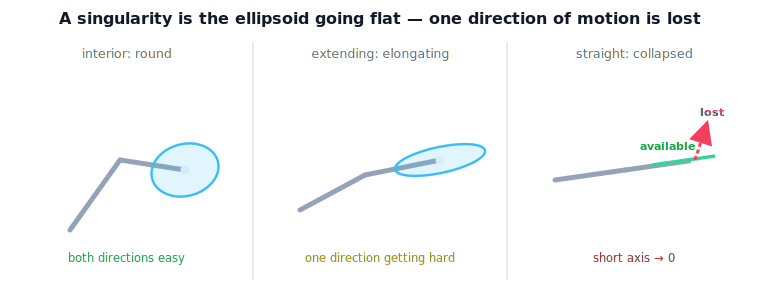

!!! abstract "You are here"
    **Module 6 — Jacobians and Differential Motion**  ·  **Unit 5 — Singularity Theory**  ·  **Lesson 5.1 — When the Ellipsoid Collapses: Singularity as Lost Motion**

# Lesson 5.1 — When the Ellipsoid Collapses: Singularity as Lost Motion

## 1. Why This Matters
In Unit 4 we drew the manipulability ellipsoid as a picture of capability. A
**kinematic singularity** is the dramatic event in that picture: the ellipsoid
*flattens*. One direction of tool motion vanishes — the robot simply cannot go that
way, instantaneously, no matter how it drives its joints — while the other directions
remain fine. Seeing the singularity this way, as **lost motion**, is the whole point of
this lesson. We will name the singular values and the SVD only in Unit 6; here the
collapse is something you watch happen.

## 2. Physical Intuition
Take the planar arm and slowly straighten it. The capability ellipse, fat and round in
the middle of the workspace, stretches and thins as the arm extends, until — at full
stretch — it is a flat sliver, a line. Along that line the tool still moves easily
(swing the whole arm sideways). Perpendicular to it — straight out along the arm — the
tool is **stuck**: you cannot push it further out by any joint motion. That stuck
direction is the lost motion. Nothing broke; the geometry simply ran out of a direction.

## 3. Visual Explanation

<figure markdown>
  { width="680" }
</figure>

**Diagram Specification (multi-panel)**

- **Panel 1 — healthy:** mid-workspace arm, round-ish ellipse (both directions easy).
- **Panel 2 — straining:** more-extended arm, elongated ellipse (one direction getting
  hard).
- **Panel 3 — collapsed:** fully extended arm, ellipse flattened to a line; mark the
  **surviving** direction (along the line) and the **lost** direction (perpendicular, with
  an ✗).
- Caption: "A singularity is the ellipsoid going flat — one direction of motion is lost,
  the rest remain."

## 4. Mathematical Foundations
*In words first:* the ellipsoid's shortest axis is the hardest direction; when that axis
shrinks to zero, that direction becomes impossible — that is the singularity.

At a configuration $\mathbf{q}$, recall the ellipsoid axes have lengths $\sigma_i$ (the
singular values, formalized in Unit 6). A **kinematic singularity** is exactly

$$\min_i \sigma_i(\mathbf{q}) \;=\; 0 \quad\Longleftrightarrow\quad \operatorname{rank} J(\mathbf{q}) < \min(6,n),$$

i.e. one axis collapses, so $J$ loses rank (Lesson 4.1). At that pose:

- the **lost direction** is the ellipsoid axis whose length went to zero — the tool
  cannot move along it;
- the **remaining available directions** are the axes that are still nonzero — the tool
  moves there normally;
- the robot is *not* damaged: it has simply, at this instant, run out of one degree of
  task motion.

*Back to motion:* "ellipsoid flattens," "a direction is lost," and "$J$ loses rank" are
three names for the same physical event. Unit 6 will give the lost/remaining directions
precise names (singular vectors); for now, watch them in the demo.

## 5. Engineering Example
A pick-and-place arm reaching for a part at the far edge of its workspace finds the
approach nearly impossible: extended almost straight, its ellipsoid is a sliver, and the
one direction it needs — further out toward the part — is the lost one. The fix is not
more motor torque (that direction is geometrically gone) but a posture or base-position
change that keeps the ellipsoid open along the approach. Recognizing "we are on the flat
axis" is the diagnosis; Units 6–7 supply the remedies.

## 6. Interactive Demonstration

<iframe src="../../demos/module06/lesson17_ellipsoid_collapse.html" title="When the Ellipsoid Collapses: Singularity as Lost Motion interactive demo" style="width:100%;height:520px;border:1px solid #e2e8f0;border-radius:12px"></iframe>

[Open this demo in a new tab ↗](../demos/module06/lesson17_ellipsoid_collapse.html)

**Ellipsoid Collapse.** Drag the arm (or sweep the elbow angle) and watch the
manipulability ellipse breathe — round in the interior, elongating as you extend, and
collapsing to a line at full stretch or full fold. The demo marks the **lost** direction
and the **remaining** direction at each pose, and lets you toggle the dual **force
ellipsoid** (which does the opposite — it stretches without bound along the lost
direction: stuck but strong).

*(Embedded widget: `lesson17_ellipsoid_collapse.html`. The student page injects it here.)*

What to notice:

- As the arm straightens, the ellipse's short axis shrinks toward zero — the lost
  direction.
- The long axis barely changes — that direction stays easy.
- Toggle the force ellipsoid: where motion is lost, force capacity diverges (Lesson 4.4).

## 7. Coding Exercise

!!! tip "Run the hands-on notebook"
    `modules/module06/notebooks/lesson17_ellipsoid_collapse.ipynb` — open in JupyterLab and run **Kernel → Restart & Run All**.

In the companion notebook:

1. Sweep a planar 2R arm toward straight and record the ellipse's two axis lengths;
   confirm the short one heads to zero.
2. At a near-singular pose, extract the lost direction and a remaining direction (the
   ellipsoid's short and long axis directions).
3. Confirm the area (manipulability) collapses with the short axis.

Prints `All checks passed.`

## 8. Knowledge Check

Formative — unlimited attempts, immediate feedback; does not affect your grade.

<iframe src="../../quizzes/module06/lesson17_quiz.html" title="When the Ellipsoid Collapses: Singularity as Lost Motion knowledge check" style="width:100%;height:720px;border:1px solid #e2e8f0;border-radius:12px"></iframe>

[Open this quiz in a new tab ↗](../quizzes/module06/lesson17_quiz.html)

1. Describe a kinematic singularity in terms of the ellipsoid.
2. At a singular pose, what is the "lost direction," and what remains?
3. Is the robot broken at a singularity? Explain.
4. State the three equivalent descriptions of the same event.

## 9. Challenge Problem
Argue, without computing an SVD, that the lost direction at a singularity is the
direction perpendicular to the flat ellipse, and that the remaining directions span the
range of $J$. Why must the lost direction be exactly the one the tool cannot move along?

## 10. Common Mistakes
- **Thinking a singularity means the robot is stuck everywhere.** Only the collapsed
  direction is lost; the rest move freely.
- **Believing more torque fixes it.** The lost direction is geometric, not a power
  problem.
- **Confusing this with gimbal lock.** That is a representation singularity (Lesson 3.4);
  this is the robot's own geometry.

## 11. Key Takeaways
- A kinematic singularity = the manipulability ellipsoid flattening: a lost direction of
  motion.
- Equivalent statements: an ellipsoid axis $\to 0$; $J$ loses rank; a task direction
  becomes impossible.
- The remaining axes stay available — the robot is not broken, just out of one direction.
- Unit 6 will name the lost/remaining directions (singular vectors) and quantify nearness
  (singular values); here the collapse is the picture.

---

### AI Learning Companion

- **Tutor (re-explain):** "Explain a kinematic singularity as the manipulability ellipsoid
  flattening, with the straightening-arm picture, then quiz me on lost vs remaining
  directions."
- **Practice (generate exercises):** "Give me three problems about identifying the lost
  and remaining directions at a singular pose. Hold solutions."
- **Explore (connect to the real world):** "Why can't extra torque move a robot in its
  lost direction at a singularity, and how do engineers avoid getting onto the flat axis?"

### Global Learning Support

- **English (authoritative):** "Explain a kinematic singularity as the manipulability
  ellipsoid collapsing to a lower dimension, at robotics-course level."
- **Español:** "Explica una singularidad cinemática como el colapso del elipsoide de
  manipulabilidad a una dimensión menor, a nivel de robótica."
- **中文（简体）：** "用机器人学课程的水平，把运动学奇异解释为可操作度椭球塌缩为更低维度。"
- **Türkçe:** "Kinematik tekilliği, manipülabilite elipsoidinin daha düşük boyuta
  çökmesi olarak robotik ders düzeyinde açıkla."

---

*Next lesson: 5.2 — Boundary vs Internal Singularities, and Joint-Rate Blow-Up.*
