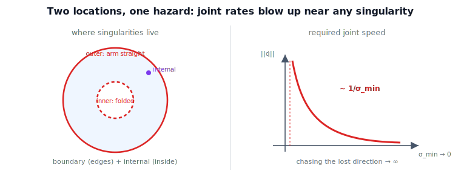

!!! abstract "You are here"
    **Module 6 — Jacobians and Differential Motion**  ·  **Unit 5 — Singularity Theory**  ·  **Lesson 5.2 — Boundary vs Internal Singularities, and Joint-Rate Blow-Up**

# Lesson 5.2 — Boundary vs Internal Singularities, and Joint-Rate Blow-Up

## 1. Why This Matters
Not all singularities sit in the same place or for the same reason. Some occur only at
the **edge** of what the arm can reach; others lurk **inside** the workspace where you'd
least expect them. Knowing which is which tells you whether a singularity is avoidable by
staying away from the boundary or whether it can ambush a path through the interior. And
both kinds share one practical hazard that this lesson makes vivid: near a singularity,
asking the tool to move in the nearly-lost direction demands enormous, often unsafe,
joint speeds.

## 2. Physical Intuition
A **boundary** singularity is the arm reaching its limit: fully stretched out (or fully
folded). You meet it only at the rim of the workspace, and it is intuitive — of course
you can't push the tool further out than the arm is long. An **internal** singularity is
sneakier: the arm is comfortably inside its reach, nothing looks extreme, yet a special
alignment of joints quietly costs a direction of motion. Either way, as you *approach*
the singular pose and still insist on moving in the fading direction, the joints have to
thrash faster and faster to produce less and less tool motion — the blow-up you can hear
in a real robot as a sudden frantic whir.

## 3. Visual Explanation

<figure markdown>
  { width="680" }
</figure>

## 4. Mathematical Foundations
*In words first:* to move the tool a given way you invert the velocity map; if the way you
want is the nearly-lost direction, dividing by the tiny shrinking axis makes the joint
rates explode.

To realize a desired tool velocity $\boldsymbol{\xi}$, the joint rates are
$\dot{\mathbf{q}} = J^{-1}\boldsymbol{\xi}$ (inverse velocity kinematics, Unit 7; use the
pseudoinverse if non-square). Decomposing $\boldsymbol{\xi}$ along the ellipsoid axes, the
component along the axis of length $\sigma_i$ costs joint rate proportional to
$1/\sigma_i$. So if $\boldsymbol{\xi}$ has any component along the **shrinking** axis,

$$\lVert\dot{\mathbf{q}}\rVert \;\sim\; \frac{1}{\sigma_{\min}} \;\to\; \infty \quad\text{as}\quad \sigma_{\min}\to 0.$$

Two cases for *where* $\sigma_{\min}=0$ happens:

- **Boundary singularity:** at the workspace edge, where the reachable position set ends
  (e.g. planar 2R fully extended, $|\text{reach}| = L_1+L_2$). Avoidable by staying off the
  rim.
- **Internal singularity:** strictly inside the workspace, from a special joint alignment
  (e.g. a wrist axis lining up — Lesson 5.3). It can sit right across an otherwise
  reasonable interior path.

*Back to motion:* the singularity itself is one pose, but the danger is a *neighborhood* —
the closer you get, the more violently the joints must move to fake the dying direction.

## 5. Engineering Example
A trajectory that looks perfectly safe — entirely inside the workspace, smooth, modest
speeds — can still spike the joints if it passes near an **internal** singularity, because
$1/\sigma_{\min}$ ramps up along the way. This is why production motion planners monitor
$\sigma_{\min}$ (or manipulability) along a path and either reroute or switch to a
singularity-robust inverse (damped least squares, Unit 6) that trades a little tracking
error for bounded, safe joint rates. Unbounded commanded rates are not just inelegant —
they trip limits, saturate motors, and can be dangerous.

## 6. Worked Example
For a planar 2R arm approaching straight ($\theta_2 \to 0$), command a unit tool velocity
along the **lost** (radial) direction and solve for the joint rates. As $\theta_2$ shrinks,
$\sigma_{\min}$ falls and $\lVert\dot{\mathbf{q}}\rVert$ rises in lockstep — the notebook
shows $\lVert\dot{\mathbf{q}}\rVert = 1/\sigma_{\min}$ exactly, reaching tens of rad/s for a
1 m/s command within a few degrees of the singularity. Meanwhile a command along the
*remaining* direction stays cheap. Same pose, wildly different cost depending on the
direction asked.

## 7. Interactive Demonstration
*(The L17 Ellipsoid Collapse demo shows the shrinking axis; reading $1/\sigma_{\min}$ off
it gives the blow-up. Guided prediction here.)*

**Predict, then check.**

1. **Predict** how $\lVert\dot{\mathbf{q}}\rVert$ scales as $\sigma_{\min}\to 0$ for a
   command in the lost direction.
2. **Predict** whether a command in the remaining direction also blows up.
3. **Check** in the notebook by sweeping toward the singular pose.

## 8. Coding Exercise

!!! tip "Run the hands-on notebook"
    `modules/module06/notebooks/lesson18_boundary_internal_singularities.ipynb` — open in JupyterLab and run **Kernel → Restart & Run All**.

In the companion notebook:

1. Sweep a planar 2R arm toward straight; command a unit velocity in the lost direction and
   compute $\lVert\dot{\mathbf{q}}\rVert$; confirm it tracks $1/\sigma_{\min}$.
2. Repeat for a command in the remaining direction; confirm it stays bounded.
3. Show the boundary singularity sits at $|\text{reach}| = L_1+L_2$ (workspace edge).

Prints `All checks passed.`

## 9. Knowledge Check

Formative — unlimited attempts, immediate feedback; does not affect your grade.

<iframe src="../../quizzes/module06/lesson18_quiz.html" title="Boundary vs Internal Singularities, and Joint-Rate Blow-Up knowledge check" style="width:100%;height:720px;border:1px solid #e2e8f0;border-radius:12px"></iframe>

[Open this quiz in a new tab ↗](../quizzes/module06/lesson18_quiz.html)

1. Define boundary and internal singularities and where each occurs.
2. Why do joint rates blow up near a singularity, and along which direction?
3. State the scaling of $\lVert\dot{\mathbf{q}}\rVert$ with $\sigma_{\min}$.
4. Why is an internal singularity more dangerous to a "safe-looking" path than a boundary
   one?

## 10. Challenge Problem
Explain why a command purely along a *remaining* (large-$\sigma$) direction stays cheap
even arbitrarily close to a singularity, while any component along the dying axis dominates
the cost. What does this imply for designing paths that skirt singularities?

## 11. Common Mistakes
- **Treating the singularity as a single dangerous point.** The hazardous region is the
  whole neighborhood (the blow-up grows continuously).
- **Assuming all singularities are at the workspace edge.** Internal ones exist inside.
- **Ignoring direction.** The blow-up only hits commands with a component along the lost
  axis.

## 12. Key Takeaways
- Boundary singularities live at the workspace edge (arm straight/folded); internal ones
  live inside (special alignments).
- Near any singularity, realizing the lost direction costs joint rate $\sim 1/\sigma_{\min}$
  — unbounded as $\sigma_{\min}\to 0$.
- The danger is a neighborhood, not a point; commands along remaining directions stay cheap.
- This motivates singularity-robust inversion (damped least squares, Unit 6) and
  singularity-aware planning (Unit 7).

---

### AI Learning Companion

- **Tutor (re-explain):** "Explain boundary vs internal singularities and why joint rates
  blow up like 1/sigma_min near them. Then quiz me."
- **Practice (generate exercises):** "Give me three problems on classifying singularities
  and computing joint-rate blow-up. Hold solutions."
- **Explore (connect to the real world):** "How do motion planners detect and avoid
  singularities along a path, and what is damped least squares for?"

### Global Learning Support

- **English (authoritative):** "Explain boundary vs internal singularities and the
  $1/\sigma_{\min}$ joint-rate blow-up, at robotics-course level."
- **Español:** "Explica singularidades de frontera vs internas y la explosión de
  velocidades articulares $1/\sigma_{\min}$, a nivel de robótica."
- **中文（简体）：** "用机器人学课程的水平，解释边界奇异与内部奇异，以及 $1/\sigma_{\min}$
  关节速度发散。"
- **Türkçe:** "Sınır ve iç tekillikleri ve $1/\sigma_{\min}$ eklem-hızı patlamasını
  robotik ders düzeyinde açıkla."

---

*Next lesson: 5.3 — Classifying Singularities: Shoulder, Elbow, and Wrist.*
