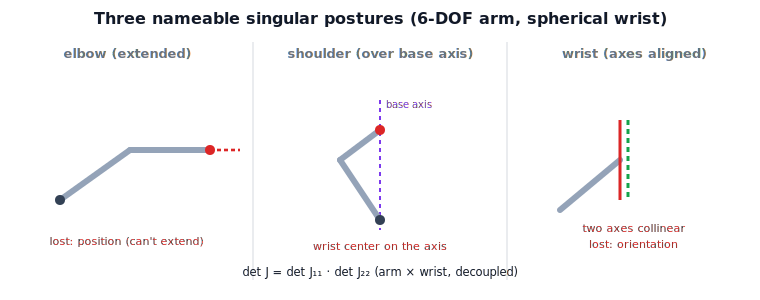

!!! abstract "You are here"
    **Module 6 — Jacobians and Differential Motion**  ·  **Unit 5 — Singularity Theory**  ·  **Lesson 5.3 — Classifying Singularities: Shoulder, Elbow, and Wrist**

# Lesson 5.3 — Classifying Singularities: Shoulder, Elbow, and Wrist

## 1. Why This Matters
"Avoid singularities" is useless advice unless you know *which* singularities a given arm
has and *where* they sit. For the workhorse design — a 6-DOF arm with a spherical wrist —
the answer is clean: the Jacobian splits, and singularities come in exactly three named,
recognizable postures. Learn the three pictures and you can spot a singularity by eye and
predict the lost direction before computing anything.

## 2. Physical Intuition
Three postures to picture on an anthropomorphic arm:

- **Elbow singularity:** the arm is **fully extended** (or fully folded) — the classic
  straight-arm boundary case. The lost direction is along the reach: you can't extend
  further.
- **Shoulder singularity:** the **wrist center lies directly over the base (shoulder)
  axis**. Spinning the base no longer moves the wrist center sideways the way it should —
  a direction of horizontal motion collapses.
- **Wrist singularity:** **two of the wrist's rotation axes line up** (e.g. the arm's
  middle wrist joint flattens so the first and third wrist axes become collinear). Two
  joints now do the same rotation, so an orientation direction is lost.

Each is a *picture*, not a formula — a posture you could pose with your own arm.

## 3. Visual Explanation

<figure markdown>
  { width="680" }
</figure>

## 4. Mathematical Foundations
*In words first:* for a spherical wrist the position and orientation parts of the Jacobian
separate, so you can test the arm and the wrist for rank loss independently.

With a spherical wrist (last three axes intersecting at the wrist center), the $6\times 6$
Jacobian, referenced at the wrist center, becomes block-triangular:

$$J = \begin{bmatrix} J_{11} & \mathbf{0} \\ J_{21} & J_{22} \end{bmatrix},\qquad \det J = \det J_{11}\,\det J_{22}.$$

So $J$ loses rank when **either** block does:

- **$\det J_{22}=0$ — wrist singularities:** the three wrist axes fail to span all
  orientations (two axes collinear). An orientation direction is lost.
- **$\det J_{11}=0$ — arm singularities:** the first three joints fail to span wrist-center
  positions. These split into **elbow** (arm extended/folded — a column's position
  contribution collapses, $\mathbf{z}\times(\mathbf{o}_n-\mathbf{o})\to 0$ along the reach)
  and **shoulder** (wrist center on the base axis — the base joint's contribution to
  horizontal wrist motion vanishes).

The decoupling is what makes classification tractable: you test two $3\times 3$ blocks
instead of one $6\times 6$. *Back to motion:* each vanishing determinant is a specific
posture losing a specific direction — orientation for the wrist, position for the arm.

## 5. Engineering Example
Industrial controllers ship with named singularity detectors for exactly these three:
many a robot programmer has watched a wrist joint spin wildly as a path crossed a **wrist
singularity** at $\theta_5=0$ (the two outer wrist axes aligned), even though the tool path
itself was gentle. The standard mitigations are type-specific: reorient the approach to
dodge a wrist singularity, lift the target off the shoulder axis to dodge a shoulder
singularity, keep a margin from full extension to dodge the elbow. Naming the type tells
you which way to move.

## 6. Worked Example
On a Puma-like 6-DOF arm, set the wrist joint that flattens the wrist (here $\theta_5=0$)
and the Jacobian's rank drops from 6 to 5 — a **wrist** singularity, with the lost
direction an orientation. The notebook builds this arm, validates its Jacobian against
finite differences, and shows the rank drop at $\theta_5=0$ with the smallest singular
value falling to zero. Separately, the straight-arm (elbow) case from earlier lessons shows
an **arm** singularity losing a position direction.

## 7. Interactive Demonstration

<iframe src="../../demos/module06/lesson19_classifying_singularities.html" title="Classifying Singularities: Shoulder, Elbow, and Wrist interactive demo" style="width:100%;height:520px;border:1px solid #e2e8f0;border-radius:12px"></iframe>

[Open this demo in a new tab ↗](../demos/module06/lesson19_classifying_singularities.html)

*(The L17 Ellipsoid Collapse demo shows the planar elbow case dynamically. Guided
prediction for the spatial types here.)*

**Predict, then check.**

1. **Predict** which block ($J_{11}$ or $J_{22}$) loses rank at a wrist singularity.
2. **Predict** whether the lost direction at a wrist singularity is position or orientation.
3. **Check** in the notebook: set $\theta_5=0$ on the 6-DOF arm and inspect the rank.

## 8. Coding Exercise

!!! tip "Run the hands-on notebook"
    `modules/module06/notebooks/lesson19_classifying_singularities.ipynb` — open in JupyterLab and run **Kernel → Restart & Run All**.

In the companion notebook:

1. Build a 6-DOF arm with a spherical wrist and validate its Jacobian by finite differences.
2. Set the wrist into a singular alignment ($\theta_5=0$) and show $\operatorname{rank}J$
   drops with $\sigma_{\min}\to 0$ — a wrist singularity.
3. Demonstrate the shoulder mechanism: a joint whose axis is parallel to
   $(\mathbf{o}_n-\mathbf{o})$ contributes zero position velocity
   ($\mathbf{z}\times(\mathbf{o}_n-\mathbf{o})=\mathbf{0}$).

Prints `All checks passed.`

## 9. Knowledge Check

Formative — unlimited attempts, immediate feedback; does not affect your grade.

<iframe src="../../quizzes/module06/lesson19_quiz.html" title="Classifying Singularities: Shoulder, Elbow, and Wrist knowledge check" style="width:100%;height:720px;border:1px solid #e2e8f0;border-radius:12px"></iframe>

[Open this quiz in a new tab ↗](../quizzes/module06/lesson19_quiz.html)

1. How does a spherical wrist decouple the Jacobian, and why does that help?
2. Describe the elbow, shoulder, and wrist singular postures.
3. Which block vanishes for a wrist singularity, and what direction is lost?
4. For each type, name the lost direction (position or orientation).

## 10. Challenge Problem
Show that for a spherical wrist, choosing the wrist center as the reference point makes the
Jacobian block-triangular, so $\det J = \det J_{11}\det J_{22}$. Explain why this means arm
and wrist singularities can be detected independently, and why a generic non-decoupled
manipulator lacks this clean split.

## 11. Common Mistakes
- **Assuming all 6-DOF arms decouple.** Only those with a spherical (intersecting-axis)
  wrist give the clean block-triangular split.
- **Mixing up lost directions.** Wrist singularities lose **orientation**; arm
  (elbow/shoulder) singularities lose **position**.
- **Treating elbow/shoulder as the same.** Elbow = extension; shoulder = wrist center on
  the base axis. Different postures, different fixes.

## 12. Key Takeaways
- A spherical wrist makes $J$ block-triangular, so $\det J=\det J_{11}\det J_{22}$ —
  arm and wrist tested independently.
- Three named types: **elbow** (extended), **shoulder** (wrist center over base axis),
  **wrist** (axes aligned).
- Wrist singularities lose orientation; arm singularities lose position.
- Each is a recognizable posture — spot the picture, predict the lost direction.

---

### AI Learning Companion

- **Tutor (re-explain):** "Explain how a spherical wrist decouples the Jacobian and the
  three singularity types (elbow/shoulder/wrist) as postures. Then quiz me."
- **Practice (generate exercises):** "Give me three problems classifying robot
  singularities by type and lost direction. Hold solutions."
- **Explore (connect to the real world):** "Why do industrial robots whir wildly near
  wrist singularities, and how do programmers dodge each type?"

### Global Learning Support

- **English (authoritative):** "Explain shoulder, elbow, and wrist singularities and the
  spherical-wrist Jacobian decoupling, at robotics-course level."
- **Español:** "Explica las singularidades de hombro, codo y muñeca y el desacoplamiento
  del jacobiano con muñeca esférica, a nivel de robótica."
- **中文（简体）：** "用机器人学课程的水平，解释肩、肘、腕奇异以及球形手腕的雅可比解耦。"
- **Türkçe:** "Omuz, dirsek ve bilek tekilliklerini ve küresel-bilek Jacobian
  ayrışmasını robotik ders düzeyinde açıkla."

---

*Next lesson: 5.4 — Singularity Loci and Workspace Boundaries; from M5 Recognition to Full Theory.*
