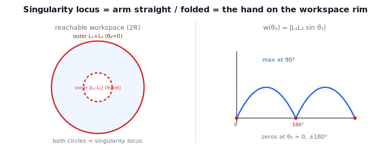

!!! abstract "You are here"
    **Module 6 — Jacobians and Differential Motion**  ·  **Unit 5 — Singularity Theory**  ·  **Lesson 5.4 — Singularity Loci and Workspace Boundaries; from M5 Recognition to Full Theory**

# Lesson 5.4 — Singularity Loci and Workspace Boundaries; from M5 Recognition to Full Theory

## 1. Why This Matters
A single singular pose is one snapshot; the **set** of all singular configurations — the
singularity locus — is the map you actually plan against. This lesson draws that map for
the planar 2R arm and shows it coincides with the boundaries of the reachable workspace,
closing Unit 5 by upgrading Module 5's "spot when $\det J = 0$" into a geometric theory:
*where* mobility is lost, and *why* those places are exactly the workspace edges.

## 2. Physical Intuition
Sweep the elbow of a 2-link arm through every angle and ask, at each, whether the tool can
still move in all directions. The answer is "yes" everywhere except two angles: arm
**straight** ($\theta_2=0$) and arm **folded** ($\theta_2=\pi$). At straight, the hand sits
on the **outer** rim of the workspace — the largest circle it can reach. At folded, it sits
on the **inner** rim — the smallest. The singular configurations are precisely the poses
that put the hand on the edge of where it can go. Mobility is lost exactly at the border of
the reachable region — which is intuitive once you see it: at a boundary, "outward" is a
direction with nowhere to go.

## 3. Visual Explanation

<figure markdown>
  { width="680" }
</figure>

## 4. Mathematical Foundations
*In words first:* the singularity locus is just the solution set of "manipulability is
zero," and for the 2R that equation is $\sin\theta_2=0$.

The **singularity locus** is

$$\mathcal{S} = \{\,\mathbf{q} : \operatorname{rank}J(\mathbf{q}) < \min(6,n)\,\} = \{\,\mathbf{q}: w(\mathbf{q})=0\,\}.$$

For the planar 2R, $w=|L_1L_2\sin\theta_2|$ (Lesson 4.3), so

$$\mathcal{S} = \{\theta_2 = 0\ \text{or}\ \theta_2 = \pi\}\quad (\text{independent of }\theta_1).$$

Mapping these into task space: $\theta_2=0$ gives reach $L_1+L_2$ (the **outer** boundary
circle, swept by $\theta_1$); $\theta_2=\pi$ gives reach $|L_1-L_2|$ (the **inner** boundary
circle). Both are **boundary** singularities (Lesson 5.2) — they bound the reachable
workspace. There is no *internal* singularity for the planar 2R; internal ones appear in
arms with more structure (e.g. the wrist singularities of Lesson 5.3).

This is the promised upgrade of Module 5: M5 taught you to *recognize* $\det J=0$ for the
2R; now you know the full story — the locus is $\theta_2\in\{0,\pi\}$, its type is boundary,
the lost direction is radial, and it traces the workspace rim. *Back to motion:* the map of
"where can't I move freely" is literally the edge of "where can I reach."

## 5. Engineering Example
A planner for the planar arm encodes the locus directly: keep $\theta_2$ bounded away from
$0$ and $\pi$ (equivalently, keep the hand off the inner/outer rims) and the arm never
loses mobility. For richer arms, the locus is a surface in configuration space rather than
two angles, and planners sample manipulability along candidate paths to stay clear of it.
Either way, the locus — not the isolated pose — is the object you plan against.

## 6. Worked Example
Sweeping $\theta_2$ for the planar 2R ($L_1=L_2=1$), $w=|\sin\theta_2|$ peaks at
$\theta_2=\pm 90^\circ$ ($w=1$, roundest ellipse) and vanishes at $\theta_2=0,\pi$. At
$\theta_2=0$ the reach is $2=L_1+L_2$ (outer circle); the arm cannot move radially outward —
a boundary singularity. The notebook maps the locus, confirms the reach values at the two
singular angles, and shows there is no interior singular set.

## 7. Interactive Demonstration

<iframe src="../../demos/module06/lesson20_singularity_loci.html" title="Singularity Loci and Workspace Boundaries; from M5 Recognition to Full Theory interactive demo" style="width:100%;height:520px;border:1px solid #e2e8f0;border-radius:12px"></iframe>

[Open this demo in a new tab ↗](../demos/module06/lesson20_singularity_loci.html)

*(The L17 Ellipsoid Collapse demo lets you sweep $\theta_2$ and watch the ellipse collapse
exactly at $\theta_2=0,\pi$ — the locus, felt directly. Guided prediction here.)*

**Predict, then check.**

1. **Predict** the singular angles of a planar 2R arm.
2. **Predict** the reach (workspace radius) at each.
3. **Check** in the notebook by mapping $w(\theta_2)$ and the reach.

## 8. Coding Exercise

!!! tip "Run the hands-on notebook"
    `modules/module06/notebooks/lesson20_singularity_loci.ipynb` — open in JupyterLab and run **Kernel → Restart & Run All**.

In the companion notebook:

1. Map $w(\theta_2)$ for a planar 2R arm; locate the zeros (the locus).
2. Confirm the reach at $\theta_2=0$ is $L_1+L_2$ and at $\theta_2=\pi$ is $|L_1-L_2|$
   (the workspace boundary circles).
3. Confirm no interior singular configurations exist for this arm.

Prints `All checks passed.`

## 9. Knowledge Check

Formative — unlimited attempts, immediate feedback; does not affect your grade.

<iframe src="../../quizzes/module06/lesson20_quiz.html" title="Singularity Loci and Workspace Boundaries; from M5 Recognition to Full Theory knowledge check" style="width:100%;height:720px;border:1px solid #e2e8f0;border-radius:12px"></iframe>

[Open this quiz in a new tab ↗](../quizzes/module06/lesson20_quiz.html)

1. Define the singularity locus.
2. What is the locus for a planar 2R arm, and is it boundary or internal?
3. How do the singular angles map to the workspace boundary?
4. How does this extend Module 5's treatment of $\det J=0$?

## 10. Challenge Problem
For a planar 2R with $L_1\neq L_2$, derive both boundary circles ($L_1+L_2$ and $|L_1-L_2|$)
and explain why the arm can never reach inside the inner circle. Then argue why a 3-link
*redundant* planar arm has a singularity locus that is a surface (not isolated angles), and
what that means for planning.

## 11. Common Mistakes
- **Thinking the singularity is one point.** It is a locus (a set); for the 2R, two angle
  values for any $\theta_1$.
- **Forgetting the inner boundary.** Folded ($\theta_2=\pi$) is singular too, on the inner
  rim.
- **Expecting internal singularities everywhere.** The simple 2R has only boundary ones;
  structure (wrists, redundancy) creates internal loci.

## 12. Key Takeaways
- The singularity locus is the set where $J$ loses rank ($w=0$).
- Planar 2R: $\theta_2\in\{0,\pi\}$, both **boundary** singularities tracing the outer
  ($L_1+L_2$) and inner ($|L_1-L_2|$) workspace circles.
- Boundary singularities coincide with the edges of the reachable workspace.
- This completes Unit 5: M5's "recognize $\det J=0$" is now a full geometric theory of
  where, why, and what-kind.

---

### AI Learning Companion

- **Tutor (re-explain):** "Explain the singularity locus and how the planar 2R locus
  θ₂ = 0, π traces the workspace boundary circles. Then quiz me."
- **Practice (generate exercises):** "Give me three problems on singularity loci and
  workspace boundaries, including a 2R with unequal links. Hold solutions."
- **Explore (connect to the real world):** "How do planners use the singularity locus to
  keep an arm mobile along a path?"

### Global Learning Support

- **English (authoritative):** "Explain the singularity locus and its link to workspace
  boundaries for a planar 2R arm, at robotics-course level."
- **Español:** "Explica el lugar geométrico de singularidad y su relación con los límites
  del espacio de trabajo de un brazo 2R planar, a nivel de robótica."
- **中文（简体）：** "用机器人学课程的水平，解释奇异轨迹及其与平面 2R 臂工作空间边界的关系。"
- **Türkçe:** "Tekillik yer eğrisini ve düzlemsel 2R kolun çalışma-uzayı sınırlarıyla
  ilişkisini robotik ders düzeyinde açıkla."

---

*Next: Unit 6 — SVD and the Geometry of the Jacobian. (L21 flagship demo: SVD Bars + Condition Number)*
