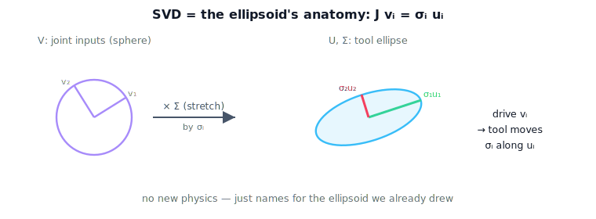

!!! abstract "You are here"
    **Module 6 — Jacobians and Differential Motion**  ·  **Unit 6 — SVD & Geometry of the Jacobian**  ·  **Lesson 6.1 — The SVD as the Ellipsoid's Anatomy: U, Σ, V Explain the Picture**

# Lesson 6.1 — The SVD as the Ellipsoid's Anatomy: U, Σ, V Explain the Picture

## 1. Why This Matters
We have spent two units *looking* at the manipulability ellipsoid — its long and short
axes, its collapse at a singularity. The **singular value decomposition** is the tool
that names what we have been seeing. It does not add new physics; it dissects the
ellipsoid into three labeled parts. Meeting the SVD this way — as the *anatomy of a
picture you already understand* — is the whole point: geometry first, factorization as
its explanation.

## 2. Physical Intuition
Recall how we built the ellipsoid: feed every unit-effort combination of joint rates
through $J$ and watch where the tool goes. The SVD answers three questions about that
process. **Which** special joint-rate combinations map to the cleanest tool motions?
(the directions $V$). **How much** tool speed does each of those buy? (the gains
$\Sigma$, the axis lengths). And **which way** does the tool actually move for each?
(the directions $U$, the ellipsoid axes). Three questions, three parts of the
decomposition — all describing the same ellipsoid.

## 3. Visual Explanation

<figure markdown>
  { width="680" }
</figure>

## 4. Mathematical Foundations
*In words first:* every matrix turns a sphere into an ellipsoid by rotating to special
input axes, stretching along them, and rotating to output axes — the SVD just lists
those three steps.

For the Jacobian,

$$J = U\,\Sigma\,V^\top,$$

with $U$ and $V$ orthonormal (their columns are unit, mutually perpendicular directions)
and $\Sigma=\operatorname{diag}(\sigma_1\ge\sigma_2\ge\cdots\ge 0)$. Reading it against the
ellipsoid:

- **$\mathbf{v}_i$ (columns of $V$)** — orthonormal **joint-space** input directions: drive
  the joints along $\mathbf{v}_i$ and the tool moves cleanly along one ellipsoid axis.
- **$\sigma_i$ (diagonal of $\Sigma$)** — the **gain** of that direction = the length of the
  ellipsoid axis = the tool speed per unit joint effort.
- **$\mathbf{u}_i$ (columns of $U$)** — orthonormal **tool-space** output directions = the
  ellipsoid's axes. Driving $\mathbf{v}_i$ produces $\sigma_i\,\mathbf{u}_i$:

$$J\,\mathbf{v}_i = \sigma_i\,\mathbf{u}_i.$$

So the ellipsoid axes ($\mathbf{u}_i$, lengths $\sigma_i$) and the special joint inputs
($\mathbf{v}_i$) we have been gesturing at since Unit 4 are *exactly* the SVD. *Back to
motion:* nothing here is new — the SVD is the label set for the ellipsoid.

## 5. Engineering Example
When a robotics library reports "Jacobian condition" or draws a manipulability ellipsoid
in a teach pendant, it is running an SVD under the hood: $U$ orients the ellipsoid glyph,
$\Sigma$ sizes its axes, and the smallest $\sigma$ drives the singularity warning. An
engineer reading that glyph is reading the SVD geometrically — which is the literacy this
lesson builds before the next lessons quantify it.

## 6. Interactive Demonstration

<iframe src="../../demos/module06/lesson21_svd_bars.html" title="The SVD as the Ellipsoid's Anatomy: U, Σ, V Explain the Picture interactive demo" style="width:100%;height:520px;border:1px solid #e2e8f0;border-radius:12px"></iframe>

[Open this demo in a new tab ↗](../demos/module06/lesson21_svd_bars.html)

**SVD Bars + Condition Number.** Drag the arm and watch a live bar chart of the singular
values $\sigma_1,\sigma_2$ beside the ellipse. As you approach a singularity, the
$\sigma_2$ bar shrinks toward zero, the ellipse flattens, and the condition number
($\sigma_1/\sigma_2$) climbs — three views of one event. The demo also overlays the input
directions $\mathbf{v}_i$ and output axes $\mathbf{u}_i$ so you can see $J\mathbf{v}_i =
\sigma_i\mathbf{u}_i$ directly.

*(Embedded widget: `lesson21_svd_bars.html`. The student page injects it here.)*

What to notice:

- Each bar's height is an ellipse axis length — the SVD *is* the ellipse.
- The short bar and the flat axis collapse together at a singularity.
- $\mathbf{v}_i \mapsto \sigma_i\mathbf{u}_i$: input direction, stretched, to output axis.

## 7. Coding Exercise

!!! tip "Run the hands-on notebook"
    `modules/module06/notebooks/lesson21_svd_ellipsoid_anatomy.ipynb` — open in JupyterLab and run **Kernel → Restart & Run All**.

In the companion notebook:

1. Compute $J=U\Sigma V^\top$ for a planar 2R arm and confirm $J\mathbf{v}_i=\sigma_i\mathbf{u}_i$.
2. Overlay the ellipse (image of the unit circle) and the axes $\sigma_i\mathbf{u}_i$;
   confirm they coincide.
3. Confirm $U,V$ are orthonormal and the $\sigma_i$ match the ellipse's measured axis
   lengths.

Prints `All checks passed.`

## 8. Knowledge Check

Formative — unlimited attempts, immediate feedback; does not affect your grade.

<iframe src="../../quizzes/module06/lesson21_quiz.html" title="The SVD as the Ellipsoid's Anatomy: U, Σ, V Explain the Picture knowledge check" style="width:100%;height:720px;border:1px solid #e2e8f0;border-radius:12px"></iframe>

[Open this quiz in a new tab ↗](../quizzes/module06/lesson21_quiz.html)

1. What do $U$, $\Sigma$, and $V$ each represent geometrically?
2. State the relation $J\mathbf{v}_i = \,?$ and interpret it.
3. Which part of the SVD gives the ellipsoid's axis lengths?
4. Why is the SVD called the "anatomy" of the ellipsoid rather than new information?

## 9. Challenge Problem
Show that the image of the unit sphere $\{\dot{\mathbf{q}}:\lVert\dot{\mathbf{q}}\rVert=1\}$
under $J=U\Sigma V^\top$ is the ellipsoid with axes $\mathbf{u}_i$ and semi-axis lengths
$\sigma_i$. (Hint: substitute $\dot{\mathbf{q}}=V\mathbf{a}$ with $\lVert\mathbf{a}\rVert=1$.)
Explain why the orthonormality of $U$ and $V$ is what makes the axes perpendicular.

## 10. Common Mistakes
- **Treating the SVD as new, separate machinery.** It is the ellipsoid you already know.
- **Swapping $U$ and $V$.** $V$ is joint-space input; $U$ is tool-space output.
- **Forgetting the ordering.** $\sigma_1\ge\sigma_2\ge\cdots$; the smallest is the one that
  collapses.

## 11. Key Takeaways
- $J=U\Sigma V^\top$ is the manipulability ellipsoid's anatomy.
- $V$ = clean joint-space input directions; $\Sigma$ = gains / axis lengths; $U$ = tool-space
  output axes.
- $J\mathbf{v}_i=\sigma_i\mathbf{u}_i$: input direction, stretched by its gain, to its
  output axis.
- The SVD explains the geometry already observed — it adds names, not physics.

---

### AI Learning Companion

- **Tutor (re-explain):** "Explain the SVD J=UΣVᵀ as the anatomy of the manipulability
  ellipsoid (V input, Σ gains, U output axes). Then quiz me."
- **Practice (generate exercises):** "Give me three problems linking SVD components to
  ellipsoid features. Hold solutions."
- **Explore (connect to the real world):** "How do robotics tools use the SVD to draw
  manipulability ellipsoids and warn of singularities?"

### Global Learning Support

- **English (authoritative):** "Explain the SVD as the anatomy of the manipulability
  ellipsoid, with U, Σ, V geometric meanings, at robotics-course level."
- **Español:** "Explica la SVD como la anatomía del elipsoide de manipulabilidad, con los
  significados geométricos de U, Σ, V, a nivel de robótica."
- **中文（简体）：** "用机器人学课程的水平，把 SVD 解释为可操作度椭球的解剖：U、Σ、V 的几何意义。"
- **Türkçe:** "SVD'yi manipülabilite elipsoidinin anatomisi olarak, U, Σ, V'nin geometrik
  anlamlarıyla robotik ders düzeyinde açıkla."

---

*Next lesson: 6.2 — Singular Values and the Condition Number.*
