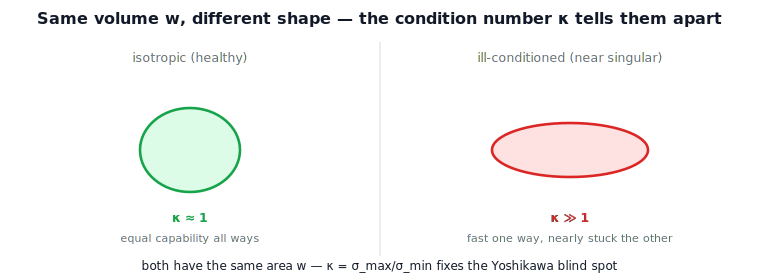

!!! abstract "You are here"
    **Module 6 — Jacobians and Differential Motion**  ·  **Unit 6 — SVD & Geometry of the Jacobian**  ·  **Lesson 6.2 — Singular Values and the Condition Number**

# Lesson 6.2 — Singular Values and the Condition Number

## 1. Why This Matters
Lesson 4.3 gave us a one-number capability summary, $w$ — the ellipsoid's *volume* — and
flagged its blind spot: volume cannot tell a healthy round ellipsoid from a dangerous
thin one. The SVD hands us the fix. The **singular values** are the axis lengths, and
their ratio, the **condition number**, measures *shape*. Together, volume ($w$) and shape
(condition number) describe capability completely — "how much" and "how balanced."

## 2. Physical Intuition
Two arms can have ellipsoids of equal area yet feel completely different. A round
ellipsoid moves the tool about equally well in every direction — pleasant, predictable,
far from trouble. A long thin ellipsoid of the *same area* is fast one way and nearly
stuck the other — it is sitting close to a singularity, and a path that needs the thin
direction will strain. The number that distinguishes them is the ratio of the longest
axis to the shortest: near 1 means round and healthy; very large means thin and nearly
singular.

## 3. Visual Explanation

<figure markdown>
  { width="680" }
</figure>

## 4. Mathematical Foundations
*In words first:* singular values are the axis lengths; their ratio is the shape; equal
volume can hide very different shapes, so report both.

From $J=U\Sigma V^\top$, the singular values $\sigma_1\ge\cdots\ge\sigma_r>0$ are the
ellipsoid axis lengths (gains). Two scalars summarize them:

- **Manipulability (volume):** $w=\prod_i\sigma_i$ (Lesson 4.3) — "how much" total
  capability.
- **Condition number (shape):** $\displaystyle \kappa(J)=\frac{\sigma_{\max}}{\sigma_{\min}}\ \ge 1$ —
  "how balanced." $\kappa=1$ is perfectly isotropic (a sphere); $\kappa\to\infty$ as
  $\sigma_{\min}\to 0$ (approaching a singularity). The reciprocal $1/\kappa$ is a
  convenient **isotropy index** in $[0,1]$.

The blind spot, made precise: two configurations can share the same $w$ (equal axis-length
*product*) while having very different $\kappa$ (different axis-length *ratio*). Reporting
both removes the ambiguity. *Back to motion:* $w$ says how much room the tool has overall;
$\kappa$ says whether that room is a comfortable circle or a dangerous sliver.

## 5. Engineering Example
A motion planner that maximized only $w$ would happily accept long, thin, near-singular
postures (high volume, terrible shape). Production planners therefore also bound $\kappa$
(or maximize $1/\kappa$) to keep the ellipsoid round and the inverse-kinematics
well-behaved. Control engineers watch $\kappa$ as an early-warning gauge: it climbs *before*
$\sigma_{\min}$ reaches zero, giving room to react (reroute, damp) ahead of the
singularity.

## 6. Worked Example
For the planar 2R arm, the configurations $\theta_2=0.6$ and $\theta_2=\pi-0.6$ have the
**same** manipulability — $w=|\sin\theta_2|$ is identical because $\sin(0.6)=\sin(\pi-0.6)$ —
yet different shapes: the more-extended pose is elongated (condition $\approx 8.1$) while
the more-folded pose is rounder (condition $\approx 1.9$). Equal volume, different
conditioning: exactly the blind spot, now quantified. The notebook computes both and
confirms $\kappa\to\infty$ as the arm straightens.

## 7. Interactive Demonstration

<iframe src="../../demos/module06/lesson22_condition_number.html" title="Singular Values and the Condition Number interactive demo" style="width:100%;height:520px;border:1px solid #e2e8f0;border-radius:12px"></iframe>

[Open this demo in a new tab ↗](../demos/module06/lesson22_condition_number.html)

*(The L21 SVD Bars demo shows $\kappa=\sigma_{\max}/\sigma_{\min}$ live. Guided prediction
here.)*

**Predict, then check.**

1. **Predict** $\kappa$ for a near-isotropic pose vs a near-singular pose.
2. **Predict** how $\kappa$ behaves as $\sigma_{\min}\to 0$.
3. **Check** in the notebook, including the equal-$w$/different-$\kappa$ pair.

## 8. Coding Exercise

!!! tip "Run the hands-on notebook"
    `modules/module06/notebooks/lesson22_condition_number.ipynb` — open in JupyterLab and run **Kernel → Restart & Run All**.

In the companion notebook:

1. Compute $\sigma_i$, $w$, and $\kappa$ for several planar 2R poses.
2. Exhibit the equal-$w$/different-$\kappa$ pair ($\theta_2$ vs $\pi-\theta_2$).
3. Sweep toward straight and confirm $\kappa\to\infty$ while $w\to 0$.

Prints `All checks passed.`

## 9. Knowledge Check

Formative — unlimited attempts, immediate feedback; does not affect your grade.

<iframe src="../../quizzes/module06/lesson22_quiz.html" title="Singular Values and the Condition Number knowledge check" style="width:100%;height:720px;border:1px solid #e2e8f0;border-radius:12px"></iframe>

[Open this quiz in a new tab ↗](../quizzes/module06/lesson22_quiz.html)

1. What do the singular values measure?
2. Define the condition number and its range; what does $\kappa=1$ mean?
3. How does $\kappa$ fix the Yoshikawa blind spot?
4. Why is $\kappa$ a useful early warning before a singularity?

## 10. Challenge Problem
Construct two configurations of a planar 2R arm with equal $w$ but condition numbers
differing by a factor of several, and explain geometrically why the more-extended posture
is worse-conditioned than the more-folded one at equal manipulability. What does this say
about preferring $\kappa$ over $w$ for *safety*, and $w$ over $\kappa$ for *overall reach*?

## 11. Common Mistakes
- **Using $w$ alone.** It misses shape; pair it with $\kappa$.
- **Reading small $\kappa$ as "high capability."** $\kappa$ is shape, not size; a round but
  tiny ellipsoid has small $\kappa$ and small $w$.
- **Waiting for $\sigma_{\min}=0$.** $\kappa$ warns earlier; act on the trend.

## 12. Key Takeaways
- Singular values = ellipsoid axis lengths (gains).
- Condition number $\kappa=\sigma_{\max}/\sigma_{\min}\ge 1$ measures shape: $1$ = isotropic,
  $\infty$ = singular.
- $\kappa$ fixes the Yoshikawa volume blind spot; report volume *and* shape.
- $\kappa$ rises before a singularity — a practical early-warning gauge.

---

### AI Learning Companion

- **Tutor (re-explain):** "Explain singular values as axis lengths and the condition number
  as shape, including how it fixes the Yoshikawa blind spot. Then quiz me."
- **Practice (generate exercises):** "Give me three problems on condition number and
  isotropy, including an equal-w/different-κ pair. Hold solutions."
- **Explore (connect to the real world):** "How do planners and controllers use the
  condition number as a singularity early-warning?"

### Global Learning Support

- **English (authoritative):** "Explain singular values and the condition number
  $\kappa=\sigma_{\max}/\sigma_{\min}$ and isotropy, at robotics-course level."
- **Español:** "Explica los valores singulares y el número de condición
  $\kappa=\sigma_{\max}/\sigma_{\min}$ y la isotropía, a nivel de robótica."
- **中文（简体）：** "用机器人学课程的水平，解释奇异值与条件数
  $\kappa=\sigma_{\max}/\sigma_{\min}$ 以及各向同性。"
- **Türkçe:** "Tekil değerleri ve kondisyon sayısı $\kappa=\sigma_{\max}/\sigma_{\min}$ ile
  izotropiyi robotik ders düzeyinde açıkla."

---

*Next lesson: 6.3 — The Four Fundamental Subspaces of the Jacobian.*
