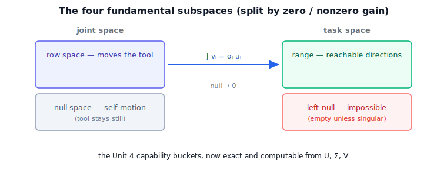

!!! abstract "You are here"
    **Module 6 — Jacobians and Differential Motion**  ·  **Unit 6 — SVD & Geometry of the Jacobian**  ·  **Lesson 6.3 — The Four Fundamental Subspaces of the Jacobian**

# Lesson 6.3 — The Four Fundamental Subspaces of the Jacobian

## 1. Why This Matters
In Unit 4 we sorted motion into available, impossible, and internal — by feel. The SVD
turns that feel into four exact, computable subspaces, two in joint space and two in task
space. They tell you precisely which joint motions move the tool, which don't, which tool
directions are reachable, and which are impossible. This is the rigorous backbone under the
capability picture — geometry first, now made exact.

## 2. Physical Intuition
Stand at the robot and ask four questions. *Which joint motions actually move the tool?*
(row space). *Which joint motions move the tool not at all — pure self-motion?* (null
space). *Which tool directions can I produce?* (range). *Which tool directions are
impossible right now?* (left-null space — empty unless the arm is singular or
under-actuated for the task). Four questions, four subspaces; the SVD answers all four at
once by sorting its directions into "nonzero gain" and "zero gain."

## 3. Visual Explanation

<figure markdown>
  { width="680" }
</figure>

## 4. Mathematical Foundations
*In words first:* split the SVD directions by whether their singular value is nonzero — that
single cut produces all four subspaces.

With $J=U\Sigma V^\top$ of rank $r$:

- **Row space** $=\operatorname{span}(\mathbf{v}_1,\dots,\mathbf{v}_r)$ — joint directions
  with nonzero gain; moving the joints here moves the tool.
- **Null space** $=\operatorname{span}(\mathbf{v}_{r+1},\dots,\mathbf{v}_n)$ — joint
  directions with zero gain; **self-motion** (Lesson 4.1), present when $n>r$ (redundancy or
  singularity).
- **Range (column space)** $=\operatorname{span}(\mathbf{u}_1,\dots,\mathbf{u}_r)$ — the
  **reachable** tool-velocity directions.
- **Left-null space** $=\operatorname{span}(\mathbf{u}_{r+1},\dots)$ — the **impossible**
  tool directions (Lesson 5.1); empty when $J$ has full row rank, nonempty at a singularity.

The pairing is exact: $J$ maps the row space one-to-one onto the range (with gains
$\sigma_i$), sends the null space to zero, and never reaches the left-null space. *Back to
motion:* the Unit 4 buckets — available (range), internal (null space), impossible
(left-null space) — are precisely these SVD subspaces, now with bases you can compute.

## 5. Engineering Example
A redundant (7-DOF) arm's controller projects desired tool motion onto the **range** while
using the **null space** for secondary goals — keeping joints centered, dodging obstacles,
maximizing manipulability — all without disturbing the tool (Unit 7 builds this). At a
singularity, the **left-null space** becomes nonempty: the controller detects an impossible
commanded direction and switches to a damped solution (Lesson 6.4) rather than demanding
the unreachable. Both behaviors are direct reads of the four subspaces.

## 6. Worked Example
For a redundant planar 3R arm, the SVD's right-singular vector with zero gain spans the
**null space**: drive the joints along it and the tool stays put — the notebook confirms
$J\dot{\mathbf{q}}_{\text{null}}\approx \mathbf{0}$. For a straight (singular) planar 2R
arm, the left-singular vector with zero gain spans the **left-null space**: it is the
impossible (radial) tool direction, and $J^\top$ annihilates it. Two arms, two of the four
subspaces, both read straight off the SVD.

## 7. Interactive Demonstration
*(The L21 SVD Bars demo distinguishes zero- from nonzero-gain directions. Guided
prediction here.)*

**Predict, then check.**

1. **Predict** which SVD vectors span the null space and the left-null space.
2. **Predict** whether a redundant arm's null space is empty.
3. **Check** in the notebook: extract null and left-null bases and verify their physical
   meaning.

## 8. Coding Exercise

!!! tip "Run the hands-on notebook"
    `modules/module06/notebooks/lesson23_four_subspaces.ipynb` — open in JupyterLab and run **Kernel → Restart & Run All**.

In the companion notebook:

1. For a redundant 3R arm, extract the null-space basis from the SVD and confirm it is
   self-motion ($J\dot{\mathbf{q}}_{\text{null}}\approx 0$).
2. For a singular 2R arm, extract the left-null-space vector and confirm it is the
   impossible direction ($J^\top\mathbf{u}=0$).
3. State which of the four subspaces each example illustrates.

Prints `All checks passed.`

## 9. Knowledge Check

Formative — unlimited attempts, immediate feedback; does not affect your grade.

<iframe src="../../quizzes/module06/lesson23_quiz.html" title="The Four Fundamental Subspaces of the Jacobian knowledge check" style="width:100%;height:720px;border:1px solid #e2e8f0;border-radius:12px"></iframe>

[Open this quiz in a new tab ↗](../quizzes/module06/lesson23_quiz.html)

1. Name the four fundamental subspaces and their physical meanings.
2. Which SVD vectors span each?
3. What does the left-null space correspond to, and when is it nonempty?
4. How do these make the Unit 4 capability buckets exact?

## 10. Challenge Problem
Show that $J$ maps the row space isomorphically onto the range (with gains $\sigma_i$) and
sends the null space to zero, and that task space decomposes as range $\oplus$ left-null
space. Explain why, for a redundant arm away from singularities, the null space is nonempty
while the left-null space is empty — and what flips at a singularity.

## 11. Common Mistakes
- **Confusing null space (joint space) with left-null space (task space).** Self-motion vs
  impossible directions.
- **Assuming the left-null space is always empty.** It appears at singularities.
- **Forgetting redundancy gives a null space even when full-rank for the task.**

## 12. Key Takeaways
- The SVD splits joint space into row space (moves the tool) + null space (self-motion), and
  task space into range (reachable) + left-null space (impossible).
- $J$ maps row space onto range with gains $\sigma_i$; null space → 0; left-null space
  unreachable.
- These are exactly the Unit 4 capability buckets, now computable from $U,\Sigma,V$.
- Left-null space is empty for full-row-rank $J$ and appears at singularities.

---

### AI Learning Companion

- **Tutor (re-explain):** "Explain the four fundamental subspaces of the Jacobian via the
  SVD and their robot meanings. Then quiz me."
- **Practice (generate exercises):** "Give me three problems identifying the four subspaces
  for given arms. Hold solutions."
- **Explore (connect to the real world):** "How do redundant-arm controllers use the null
  space, and how does the left-null space signal an impossible command?"

### Global Learning Support

- **English (authoritative):** "Explain the four fundamental subspaces of the manipulator
  Jacobian via the SVD, at robotics-course level."
- **Español:** "Explica los cuatro subespacios fundamentales del jacobiano mediante la SVD,
  a nivel de robótica."
- **中文（简体）：** "用机器人学课程的水平，通过 SVD 解释雅可比的四个基本子空间。"
- **Türkçe:** "Manipülatör Jacobian'ının dört temel alt uzayını SVD ile robotik ders
  düzeyinde açıkla."

---

*Next lesson: 6.4 — Pseudoinverse and Damped Least Squares via the SVD.*
