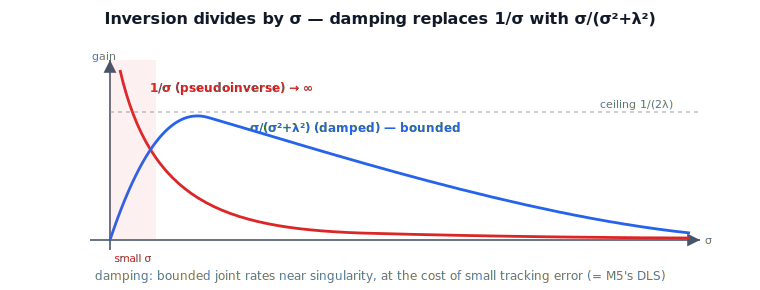

!!! abstract "You are here"
    **Module 6 — Jacobians and Differential Motion**  ·  **Unit 6 — SVD & Geometry of the Jacobian**  ·  **Lesson 6.4 — Pseudoinverse and Damped Least Squares via the SVD**

# Lesson 6.4 — Pseudoinverse and Damped Least Squares via the SVD

## 1. Why This Matters
To make the tool follow a desired velocity, we must invert the velocity map — and Unit 5
showed that doing so naively blows up near a singularity. The SVD reveals both the problem
and the cure: inversion means *dividing by the singular values*, so the smallest one
($\sigma_{\min}\to 0$) causes the explosion, and **damped least squares** replaces that
brittle division with a bounded gain. This closes Module 6's core: the damped inverse you
*used* in Module 5 is now something you can *derive and explain*.

## 2. Physical Intuition
Inverting the Jacobian undoes the ellipsoid: a desired tool velocity gets "un-stretched"
back into joint rates by dividing each component by its gain $\sigma_i$. In the easy
directions ($\sigma$ large) that division is gentle. In a dying direction ($\sigma\to 0$)
it is catastrophic — dividing by almost nothing demands almost-infinite joint speed
(Lesson 5.2). Damping says: don't trust the tiny gains. For small $\sigma$, ease off —
accept a little tracking error in exchange for sane, bounded joint rates. It is a
deliberate, graceful surrender right where pure inversion would panic.

## 3. Visual Explanation

<figure markdown>
  { width="680" }
</figure>

**Diagram Specification (multi-panel)**

- **Panel 1 — the two gains:** plot $1/\sigma$ (pseudoinverse, → ∞ as $\sigma\to 0$) and
  $\sigma/(\sigma^2+\lambda^2)$ (damped, peaks at $1/(2\lambda)$ then → 0). Shade the small-σ
  region "blow-up vs bounded."
- **Panel 2 — effect:** the same tool command near a singularity producing a huge joint-rate
  vector (pseudoinverse) vs a modest one (damped), with a small tracking-error note for the
  damped case.
- Caption: "Inversion divides by σ; damping replaces 1/σ with the bounded σ/(σ²+λ²)."

## 4. Mathematical Foundations
*In words first:* the pseudoinverse inverts each nonzero singular value; damping softens the
inversion of the small ones so nothing blows up.

From $J=U\Sigma V^\top$, the **Moore–Penrose pseudoinverse** is

$$J^{+} = V\,\Sigma^{+}\,U^\top,\qquad \Sigma^{+}=\operatorname{diag}\!\big(1/\sigma_i\big)\ \text{(nonzero }\sigma_i\text{)}.$$

It gives the minimum-norm joint rates for a reachable command and least-squares for an
unreachable one — but its gain $1/\sigma_i$ diverges as $\sigma_{\min}\to 0$ (the Unit 5
blow-up). **Damped least squares** replaces each gain with a bounded one:

$$\boxed{\,J^{+}_{\lambda} = V\,\operatorname{diag}\!\Big(\frac{\sigma_i}{\sigma_i^2+\lambda^2}\Big)\,U^\top \;=\; J^\top\big(JJ^\top+\lambda^2 I\big)^{-1}.\,}$$

The two forms are identical (the notebook verifies it). The per-direction gain
$g(\sigma)=\sigma/(\sigma^2+\lambda^2)$ behaves beautifully: $g\approx 1/\sigma$ when
$\sigma\gg\lambda$ (no harm in the easy directions), and $g\to 0$ as $\sigma\to 0$ (no
blow-up), peaking at $1/(2\lambda)$ when $\sigma=\lambda$. The damping factor $\lambda$
trades tracking accuracy for bounded joint rates.

This is exactly the damped inverse Module 5 used inside its numerical IK solver — there
introduced as a practical fix; here **derived** from the SVD, with the geometry making
plain *why* it works. *Back to motion:* damping is choosing bounded, slightly-off motion
over unbounded, exact-but-impossible motion, precisely in the dying direction.

## 5. Engineering Example
Real resolved-rate and IK controllers ship damped least squares with $\lambda$ scheduled by
nearness to singularity (small or zero far away for accuracy, growing as $\sigma_{\min}$
drops for safety). The result: smooth, bounded joint motion straight through neighborhoods
that would otherwise spike the actuators. Unit 7 puts this to work in resolved-rate control;
Module 5 already relied on it numerically. Module 6 supplies the understanding.

## 6. Worked Example
Near a singular planar 2R pose ($\sigma_{\min}\approx 0.036$), commanding a unit tool
velocity in the lost direction with the **pseudoinverse** demands $\lVert\dot{\mathbf{q}}\rVert
\approx 1/\sigma_{\min}\approx 28$, while **damped least squares** ($\lambda=0.1$) keeps it
near $3.2$ — bounded, at the cost of small tracking error. The notebook confirms the two DLS
forms agree and that the damped gain $\sigma/(\sigma^2+\lambda^2)$ stays below $1/(2\lambda)$.

## 7. Interactive Demonstration
*(The L21 SVD Bars demo shows $\sigma_{\min}$ shrinking; the gain $1/\sigma$ vs
$\sigma/(\sigma^2+\lambda^2)$ is the story. Guided prediction here.)*

**Predict, then check.**

1. **Predict** the pseudoinverse joint-rate cost in the lost direction as $\sigma_{\min}\to 0$.
2. **Predict** the damped cost and its ceiling.
3. **Check** in the notebook: compare $1/\sigma$ and $\sigma/(\sigma^2+\lambda^2)$, and the two
   DLS forms.

## 8. Coding Exercise

!!! tip "Run the hands-on notebook"
    `modules/module06/notebooks/lesson24_pseudoinverse_dls.ipynb` — open in JupyterLab and run **Kernel → Restart & Run All**.

In the companion notebook:

1. Build $J^{+}=V\Sigma^{+}U^\top$ and confirm it matches `np.linalg.pinv`.
2. Build $J^{+}_{\lambda}$ both ways — SVD-gain form and $J^\top(JJ^\top+\lambda^2 I)^{-1}$ —
   and confirm they agree.
3. Near a singular pose, compare pseudoinverse vs damped joint rates for a lost-direction
   command; confirm damping bounds the blow-up.

Prints `All checks passed.`

## 9. Knowledge Check

Formative — unlimited attempts, immediate feedback; does not affect your grade.

<iframe src="../../quizzes/module06/lesson24_quiz.html" title="Pseudoinverse and Damped Least Squares via the SVD knowledge check" style="width:100%;height:720px;border:1px solid #e2e8f0;border-radius:12px"></iframe>

[Open this quiz in a new tab ↗](../quizzes/module06/lesson24_quiz.html)

1. Write the pseudoinverse via the SVD and explain its blow-up near a singularity.
2. Give both forms of damped least squares and the per-direction gain.
3. How does $g(\sigma)=\sigma/(\sigma^2+\lambda^2)$ behave for large and small $\sigma$?
4. What does $\lambda$ trade off, and how does this relate to Module 5?

## 10. Challenge Problem
Show $J^\top(JJ^\top+\lambda^2 I)^{-1} = V\operatorname{diag}(\sigma_i/(\sigma_i^2+\lambda^2))U^\top$
using $J=U\Sigma V^\top$. Then find the $\sigma$ maximizing $g(\sigma)$ and its value, and
explain why scheduling $\lambda$ with $\sigma_{\min}$ gives accuracy far from singularities and
safety near them.

## 11. Common Mistakes
- **Using the raw pseudoinverse near singularities.** $1/\sigma_{\min}$ blows up; damp instead.
- **Treating $\lambda$ as free of cost.** Larger $\lambda$ = safer but less accurate; schedule it.
- **Forgetting the two DLS forms are the same.** SVD-gain and normal-equation forms are
  identical.

## 12. Key Takeaways
- Pseudoinverse $J^{+}=V\Sigma^{+}U^\top$ inverts the nonzero singular values; gain $1/\sigma$
  blows up near singularities.
- Damped least squares $J^{+}_{\lambda}=V\operatorname{diag}(\sigma/(\sigma^2+\lambda^2))U^\top
  = J^\top(JJ^\top+\lambda^2 I)^{-1}$ bounds the gain.
- $\lambda$ trades tracking accuracy for bounded joint rates; schedule it by nearness to
  singularity.
- This *derives* Module 5's damped inverse — the SVD explains why it works.

---

### AI Learning Companion

- **Tutor (re-explain):** "Explain the pseudoinverse and damped least squares via the SVD,
  including why 1/σ blows up and how σ/(σ²+λ²) fixes it. Then quiz me."
- **Practice (generate exercises):** "Give me three problems on pseudoinverse and damped
  least squares, including the two DLS forms. Hold solutions."
- **Explore (connect to the real world):** "How do controllers schedule the damping λ near
  singularities, and how does this relate to Module 5's IK solver?"

### Global Learning Support

- **English (authoritative):** "Explain the SVD pseudoinverse and damped least squares
  ($\sigma/(\sigma^2+\lambda^2)$), at robotics-course level."
- **Español:** "Explica la pseudoinversa por SVD y los mínimos cuadrados amortiguados
  ($\sigma/(\sigma^2+\lambda^2)$), a nivel de robótica."
- **中文（简体）：** "用机器人学课程的水平，解释基于 SVD 的伪逆与阻尼最小二乘
  ($\sigma/(\sigma^2+\lambda^2)$)。"
- **Türkçe:** "SVD ile sözde-tersi ve sönümlü en küçük kareler
  ($\sigma/(\sigma^2+\lambda^2)$) robotik ders düzeyinde açıkla."

---

*Next: Unit 7 — Inverse Velocity Kinematics and Resolved-Rate Control. (Installment D)*
