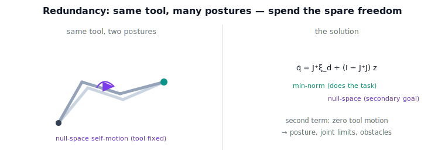

!!! abstract "You are here"
    **Module 6 — Jacobians and Differential Motion**  ·  **Unit 7 — Inverse Velocity Kinematics & Resolved-Rate Motion**  ·  **Lesson 7.2 — Redundancy Resolution: The Pseudoinverse and Null-Space Motion**

# Lesson 7.2 — Redundancy Resolution: The Pseudoinverse and Null-Space Motion

## 1. Why This Matters
Give an arm more joints than the task strictly needs and a wonderful problem appears:
many different joint motions produce the *same* tool motion. Which to choose? Redundancy
resolution answers this — the pseudoinverse picks the most efficient solution, and the
unused freedom (the null space, Lesson 6.3) becomes a budget for secondary goals like
staying away from joint limits or dodging obstacles, all while the tool does exactly what
was asked. This is the capability that makes human-like, graceful arms possible.

## 2. Physical Intuition
Watch a 7-DOF arm hold its gripper still while its elbow swings — that is self-motion, the
null space (Lesson 4.1). Now ask the arm to move the gripper somewhere: there are *many*
ways to drive the joints that achieve it, differing by how much elbow-swing they mix in.
The pseudoinverse chooses the one with the **least total joint effort** (smallest
$\lVert\dot{\mathbf{q}}\rVert$). On top of that, you can deliberately add self-motion to push
the elbow toward a comfortable posture or away from an obstacle — and because self-motion
doesn't move the tool, the task is undisturbed. Primary task plus a free secondary wish.

## 3. Visual Explanation

<figure markdown>
  { width="680" }
</figure>

## 4. Mathematical Foundations
*In words first:* take the smallest joint-rate solution that does the task, then add any
self-motion you like for a secondary purpose.

For a redundant arm (more joints than task dimensions), the general joint-rate solution is

$$\boxed{\,\dot{\mathbf{q}} = J^{+}\boldsymbol{\xi}_d + (I - J^{+}J)\,\mathbf{z}.\,}$$

- $J^{+}\boldsymbol{\xi}_d$ — the **minimum-norm** solution: among all $\dot{\mathbf{q}}$ with
  $J\dot{\mathbf{q}}=\boldsymbol{\xi}_d$, it has the smallest $\lVert\dot{\mathbf{q}}\rVert$
  (least joint effort). It lies in the row space (Lesson 6.3).
- $(I-J^{+}J)$ — the **null-space projector**: it sends any vector $\mathbf{z}$ into the
  null space, so $(I-J^{+}J)\mathbf{z}$ is pure self-motion ($J\,(I-J^{+}J)\mathbf{z}=\mathbf{0}$).
  It does **not** change the tool twist.
- $\mathbf{z}$ — a chosen secondary-objective velocity (e.g. the gradient of a "stay
  centered" or "avoid this joint limit" criterion).

Because the null-space term produces no tool motion, the tool twist is exactly
$\boldsymbol{\xi}_d$ for *any* $\mathbf{z}$. *Back to motion:* the first term does the job
efficiently; the second uses the arm's spare freedom for whatever else you care about —
without the tool ever noticing.

This stays at the **velocity layer**: choosing the secondary criterion's *gradient* is a
design choice, but resolving it into joint rates here is pure kinematics. How that velocity
stream becomes a timed path is Module 7's job.

## 5. Engineering Example
A 7-DOF assistant arm reaching across a cluttered table keeps the gripper on its target
(primary task via $J^{+}\boldsymbol{\xi}_d$) while continuously projecting an
"avoid-obstacle" and "stay off joint limits" velocity into the null space — the elbow
weaves around clutter and the joints stay comfortable, and the gripper path is unaffected.
This null-space trick is the workhorse of redundant-arm behavior; the velocity layer here
provides exactly the joint-rate command it needs.

## 6. Worked Example
For a redundant planar 3R arm, the pseudoinverse solution $J^{+}\boldsymbol{\xi}_d$ achieves
the desired tool velocity with minimum joint effort. Adding a null-space term
$(I-J^{+}J)\mathbf{z}$ for some $\mathbf{z}$ changes the posture rate but leaves the tool
velocity exactly $\boldsymbol{\xi}_d$, and the combined $\lVert\dot{\mathbf{q}}\rVert$ is no
smaller than the pseudoinverse's — confirming minimum-norm. The notebook verifies all three:
the task is met, the null-space term produces no tool motion, and the pseudoinverse is the
least-effort solution.

## 7. Interactive Demonstration
*(The capstone tracker at L29–L31 uses redundancy resolution. Guided prediction here.)*

**Predict, then check.**

1. **Predict** whether adding a null-space term changes the tool twist.
2. **Predict** whether it can reduce $\lVert\dot{\mathbf{q}}\rVert$ below the pseudoinverse.
3. **Check** in the notebook.

## 8. Coding Exercise

!!! tip "Run the hands-on notebook"
    `modules/module06/notebooks/lesson26_redundancy_resolution.ipynb` — open in JupyterLab and run **Kernel → Restart & Run All**.

In the companion notebook:

1. For a redundant 3R arm, compute $J^{+}\boldsymbol{\xi}_d$ and confirm it achieves
   $\boldsymbol{\xi}_d$.
2. Build the null-space projector $(I-J^{+}J)$ and confirm $(I-J^{+}J)\mathbf{z}$ gives zero
   tool motion.
3. Confirm the pseudoinverse solution is minimum-norm (adding null-space motion only
   increases $\lVert\dot{\mathbf{q}}\rVert$).

Prints `All checks passed.`

## 9. Knowledge Check

Formative — unlimited attempts, immediate feedback; does not affect your grade.

<iframe src="../../quizzes/module06/lesson26_quiz.html" title="Redundancy Resolution: The Pseudoinverse and Null-Space Motion knowledge check" style="width:100%;height:720px;border:1px solid #e2e8f0;border-radius:12px"></iframe>

[Open this quiz in a new tab ↗](../quizzes/module06/lesson26_quiz.html)

1. Why does a redundant arm have many joint-rate solutions?
2. What does the pseudoinverse solution optimize?
3. Write the general solution and identify each term.
4. Why does the null-space term leave the tool twist unchanged?

## 10. Challenge Problem
Show that $(I-J^{+}J)$ projects onto the null space of $J$ (i.e. $J(I-J^{+}J)=0$ and it is
idempotent), and that $J^{+}\boldsymbol{\xi}_d$ is orthogonal to the null space — hence the
minimum-norm solution. Explain why this orthogonality is exactly why adding self-motion can
only increase $\lVert\dot{\mathbf{q}}\rVert$.

## 11. Common Mistakes
- **Thinking the null-space term affects the tool.** It is pure self-motion — zero tool twist.
- **Expecting a unique solution for a redundant arm.** There is a whole family; the
  pseudoinverse picks one.
- **Confusing minimum-norm with optimal-for-everything.** It minimizes joint effort, not
  arbitrary secondary criteria — those go in $\mathbf{z}$.

## 12. Key Takeaways
- Redundant arms have a family of joint-rate solutions for one tool twist.
- $\dot{\mathbf{q}} = J^{+}\boldsymbol{\xi}_d + (I-J^{+}J)\mathbf{z}$: minimum-norm task term +
  null-space secondary term.
- The null-space term is pure self-motion — it never changes the tool twist.
- This is the velocity layer's redundancy resolution; trajectory timing is Module 7.

---

### AI Learning Companion

- **Tutor (re-explain):** "Explain redundancy resolution: pseudoinverse min-norm plus
  null-space secondary motion, with the elbow-swing picture. Then quiz me."
- **Practice (generate exercises):** "Give me three problems on the pseudoinverse + null-space
  solution. Hold solutions."
- **Explore (connect to the real world):** "How do redundant arms use null-space motion for
  obstacle and joint-limit avoidance?"

### Global Learning Support

- **English (authoritative):** "Explain redundancy resolution with the pseudoinverse and
  null-space projector, at robotics-course level."
- **Español:** "Explica la resolución de redundancia con la pseudoinversa y el proyector al
  espacio nulo, a nivel de robótica."
- **中文（简体）：** "用机器人学课程的水平，解释用伪逆与零空间投影器进行的冗余解析。"
- **Türkçe:** "Sözde-ters ve sıfır-uzayı projektörü ile fazlalık çözümünü robotik ders
  düzeyinde açıkla."

---

*Next lesson: 7.3 — Singularity-Robust Resolved Rates: Damped Least Squares in Action.*
