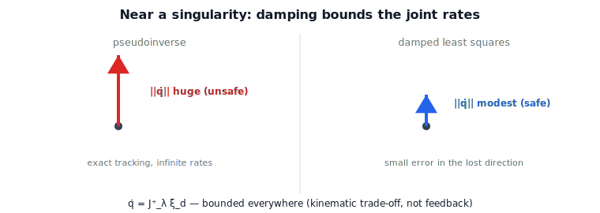

!!! abstract "You are here"
    **Module 6 — Jacobians and Differential Motion**  ·  **Unit 7 — Inverse Velocity Kinematics & Resolved-Rate Motion**  ·  **Lesson 7.3 — Singularity-Robust Resolved Rates: Damped Least Squares in Action**

# Lesson 7.3 — Singularity-Robust Resolved Rates: Damped Least Squares in Action

## 1. Why This Matters
A velocity layer that uses the raw inverse is a liability: the moment a command grazes a
singular direction, the joint rates spike toward infinity (Lesson 5.2), tripping limits and
endangering the hardware. Lesson 6.4 built the cure — damped least squares — from the SVD;
this lesson puts it to work in inverse velocity kinematics. The result is a resolver that
stays bounded everywhere, trading a sliver of accuracy for safety precisely where it is
needed.

## 2. Physical Intuition
Near a singularity, one tool direction is nearly gone, and demanding motion there is like
demanding a car go sideways — the steering goes wild. Damping says: in that fading
direction, ease off. Move *almost* the way you asked, with sane joint rates, rather than
*exactly* the way you asked with insane ones. Far from singularities the damping is
negligible and tracking is essentially exact; only near trouble does it gently sacrifice a
little accuracy to keep the motion bounded and safe.

## 3. Visual Explanation

<figure markdown>
  { width="680" }
</figure>

## 4. Mathematical Foundations
*In words first:* replace the inverse with the damped inverse from Lesson 6.4 when resolving
the desired tool twist into joint rates.

The singularity-robust resolved rate is

$$\boxed{\,\dot{\mathbf{q}} = J^{+}_{\lambda}\,\boldsymbol{\xi}_d = J^\top\big(JJ^\top+\lambda^2 I\big)^{-1}\boldsymbol{\xi}_d = V\,\operatorname{diag}\!\Big(\tfrac{\sigma_i}{\sigma_i^2+\lambda^2}\Big)U^\top\,\boldsymbol{\xi}_d.\,}$$

Per direction, the gain is $\sigma_i/(\sigma_i^2+\lambda^2)$: $\approx 1/\sigma_i$ where
$\sigma_i\gg\lambda$ (faithful tracking in healthy directions) and $\to 0$ as $\sigma_i\to 0$
(no blow-up in the lost direction), capped at $1/(2\lambda)$. The damping $\lambda$ is the
knob: small or scheduled-to-zero far from singularities for accuracy, grown as
$\sigma_{\min}$ drops for safety. The cost is a small tracking error confined to the
nearly-lost direction.

**Scope note (kinematic only):** this is still the velocity layer — desired twist in,
bounded joint rates out. The small error here is a *resolution* trade-off, **not** a
feedback correction; closing that error with sensing and a controller is Module 8's job, and
turning a path into a timed sequence of desired twists is Module 7's. We stop at producing a
safe joint-rate command.

## 5. Engineering Example
A resolved-rate velocity layer driving a 6-DOF arm along a path that clips a wrist
singularity uses DLS with $\lambda$ scheduled by $\sigma_{\min}$: away from the wrist
singularity it tracks the command exactly; as the path nears $\theta_5=0$ the damping grows,
the joint rates stay within limits, and the tool drifts only slightly off the commanded
direction for a moment before recovering. Without damping, the same path would command
enormous wrist rates. The velocity layer's job is precisely this bounded, robust resolution.

## 6. Worked Example
Near a singular planar 2R pose ($\sigma_{\min}\approx 0.036$), commanding a unit tool
velocity in the lost direction: the **pseudoinverse** demands $\lVert\dot{\mathbf{q}}\rVert
\approx 28$, while **DLS** ($\lambda=0.1$) keeps it near $3.2$ — bounded — at the cost of a
small tracking error in that direction. The notebook compares the two across a sweep toward
the singularity and confirms DLS stays bounded throughout.

## 7. Interactive Demonstration
*(The capstone tracker at L31 toggles damping on/off near a singularity. Guided prediction
here.)*

**Predict, then check.**

1. **Predict** the pseudoinverse vs DLS joint-rate magnitude near a singularity.
2. **Predict** where the DLS tracking error concentrates.
3. **Check** in the notebook by sweeping toward the singular pose.

## 8. Coding Exercise

!!! tip "Run the hands-on notebook"
    `modules/module06/notebooks/lesson27_singularity_robust_resolved_rate.ipynb` — open in JupyterLab and run **Kernel → Restart & Run All**.

In the companion notebook:

1. Resolve a desired tool twist with both $J^{+}$ and $J^{+}_{\lambda}$ across a sweep toward
   a singular pose.
2. Confirm $\lVert\dot{\mathbf{q}}\rVert$ stays bounded for DLS while the pseudoinverse blows up.
3. Quantify the DLS tracking error $\lVert J\dot{\mathbf{q}}-\boldsymbol{\xi}_d\rVert$ and show it
   is small and concentrated in the lost direction.

Prints `All checks passed.`

## 9. Knowledge Check

Formative — unlimited attempts, immediate feedback; does not affect your grade.

<iframe src="../../quizzes/module06/lesson27_quiz.html" title="Singularity-Robust Resolved Rates: Damped Least Squares in Action knowledge check" style="width:100%;height:720px;border:1px solid #e2e8f0;border-radius:12px"></iframe>

[Open this quiz in a new tab ↗](../quizzes/module06/lesson27_quiz.html)

1. Write the singularity-robust resolved rate.
2. How does the damped gain behave in healthy vs dying directions?
3. What is the cost of damping, and where does it appear?
4. Why is this a kinematic (velocity-layer) trade-off, not feedback control?

## 10. Challenge Problem
Show that the DLS tracking error $\boldsymbol{\xi}_d - J\dot{\mathbf{q}}$ lies along the
smallest-$\sigma$ direction and has magnitude $\sim \lambda^2/(\sigma_{\min}^2+\lambda^2)$ in
that component. Explain why scheduling $\lambda$ with $\sigma_{\min}$ gives near-exact
tracking away from singularities and bounded rates near them.

## 11. Common Mistakes
- **Using a fixed large $\lambda$.** It damps everywhere, hurting accuracy far from
  singularities; schedule it.
- **Calling the tracking error "feedback."** It is a resolution trade-off, not a sensed-error
  correction (Module 8).
- **Forgetting DLS still needs $J$ at the current pose.** Recompute each cycle.

## 12. Key Takeaways
- Singularity-robust resolved rate: $\dot{\mathbf{q}}=J^{+}_{\lambda}\boldsymbol{\xi}_d$ (the
  L6.4 damped inverse applied to control).
- Bounded joint rates everywhere; small tracking error confined to the dying direction.
- $\lambda$ trades accuracy for safety — schedule it by $\sigma_{\min}$.
- Purely kinematic: a safe joint-rate command, not feedback control or trajectory timing.

---

### AI Learning Companion

- **Tutor (re-explain):** "Explain singularity-robust resolved rates with DLS, the gain
  σ/(σ²+λ²), and where the small error goes. Then quiz me."
- **Practice (generate exercises):** "Give me three problems comparing pseudoinverse vs DLS
  resolved rates near singularities. Hold solutions."
- **Explore (connect to the real world):** "How do velocity layers schedule damping to stay
  safe through singular regions?"

### Global Learning Support

- **English (authoritative):** "Explain singularity-robust resolved rates via damped least
  squares, at robotics-course level."
- **Español:** "Explica las velocidades resueltas robustas a singularidades mediante mínimos
  cuadrados amortiguados, a nivel de robótica."
- **中文（简体）：** "用机器人学课程的水平，解释用阻尼最小二乘实现的奇异鲁棒解析速度。"
- **Türkçe:** "Sönümlü en küçük karelerle tekilliğe-dayanıklı çözülmüş hızları robotik ders
  düzeyinde açıkla."

---

*Next lesson: 7.4 — Resolved-Rate Motion: The Open-Loop Velocity Layer.*
