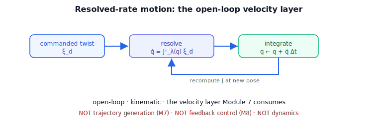

!!! abstract "You are here"
    **Module 6 — Jacobians and Differential Motion**  ·  **Unit 7 — Inverse Velocity Kinematics & Resolved-Rate Motion**  ·  **Lesson 7.4 — Resolved-Rate Motion: The Open-Loop Velocity Layer**

# Lesson 7.4 — Resolved-Rate Motion: The Open-Loop Velocity Layer

## 1. Why This Matters
Everything in Unit 7 comes together here. **Resolved-rate motion** is the scheme that lets
a robot follow a commanded tool velocity: each cycle, resolve the desired twist into joint
rates and step the joints forward. It is the **velocity layer** — the clean kinematic
interface that Module 7 (trajectories) and Module 8 (feedback control) build on top of.
Getting its scope exactly right — what it is, and pointedly what it is *not* — is the key
deliverable of this unit and the capstone.

## 2. Physical Intuition
Think of a "velocity joystick" for the tool: push it and the tool should move that way at
that speed. Resolved-rate motion is what sits behind the joystick. At every instant it asks
"what joint rates make the tool move as commanded right now?" (inverse velocity
kinematics), applies them for a short moment, then asks again at the new pose. Repeated
quickly, the tool glides along the commanded velocity. The robot is *resolving* the desired
rate into joint rates, continuously — hence "resolved-rate."

## 3. Visual Explanation

<figure markdown>
  { width="680" }
</figure>

**Diagram Specification (single flow)**

- A cycle of four boxes: **(1)** commanded tool twist $\boldsymbol{\xi}_d$ → **(2)** resolve
  $\dot{\mathbf{q}} = J^{+}_{\lambda}(\mathbf{q})\,\boldsymbol{\xi}_d$ → **(3)** integrate
  $\mathbf{q}\leftarrow\mathbf{q}+\dot{\mathbf{q}}\,\Delta t$ → **(4)** recompute
  $J(\mathbf{q})$ → back to (1).
- A small inset: the tool tracing a straight line in the commanded direction.
- Caption: "Resolved-rate motion: resolve the commanded twist into joint rates, step
  forward, repeat — the open-loop velocity layer."

## 4. Mathematical Foundations
*In words first:* loop — desired twist to joint rates, take a small Euler step, recompute the
Jacobian, repeat.

The resolved-rate update, per cycle of duration $\Delta t$:

$$\dot{\mathbf{q}} = J^{+}_{\lambda}(\mathbf{q})\,\boldsymbol{\xi}_d,\qquad \mathbf{q}\leftarrow \mathbf{q} + \dot{\mathbf{q}}\,\Delta t,$$

with $J^{+}_{\lambda}$ the pseudoinverse (or damped inverse near singularities, Lesson 7.3),
and (for a redundant arm) an optional null-space term (Lesson 7.2). Because
$J\dot{\mathbf{q}}=JJ^{+}\boldsymbol{\xi}_d=\boldsymbol{\xi}_d$ for a full-rank pose, the
*instantaneous* tool velocity equals the command; integrating produces motion along it.

This is **open-loop**: there is no sensed-pose error fed back, only the kinematic map and an
integrator. Finite $\Delta t$ causes a small integration **drift** (the tool lags the ideal
path by $\mathcal{O}(\Delta t)$), shrinking as $\Delta t$ shrinks — in the notebook, drift is
$\sim 10^{-4}$ over a short run. Correcting that drift with sensing is feedback control
(Module 8); it is deliberately *not* part of the velocity layer.

**Scope (read carefully).** Resolved-rate motion here is *only* the velocity layer:

- **Not trajectory generation.** The commanded twist $\boldsymbol{\xi}_d$ is an *input*. How a
  desired path is shaped, time-parameterized, or blended is **Module 7**.
- **Not feedback control.** There is no error term, no gains, no sensing loop. Closing the
  loop on measured pose is **Module 8**.
- **Not dynamics.** No forces, torques, or masses — pure instantaneous kinematics.

What we hand off is exactly this: given a stream of desired tool twists, a robust joint-rate
stream. *Back to motion:* the velocity layer is the bridge from "how I want the tool to move"
to "how the joints move," and nothing more.

## 5. Engineering Example
A teleoperation system maps an operator's velocity joystick directly to $\boldsymbol{\xi}_d$
and runs resolved-rate motion underneath: the operator commands tool velocity, the velocity
layer resolves and integrates, the arm follows. The operator (or, later, a Module 7
trajectory) is the source of $\boldsymbol{\xi}_d$; a Module 8 controller would add sensed-pose
correction for precision. The velocity layer itself is exactly what this lesson builds.

## 6. Worked Example
Command a planar 2R arm to move its tool at a constant velocity and run the resolved-rate
loop with a small $\Delta t$: integrating $\dot{\mathbf{q}}=J^{+}\boldsymbol{\xi}_d$ over many
steps traces a straight line in the commanded direction, with maximum drift from the ideal
line on the order of $10^{-4}$ over the run. The notebook runs this open-loop tracker and
confirms (a) the instantaneous tool velocity equals the command and (b) the drift is small
and shrinks with $\Delta t$.

## 7. Interactive Demonstration
**The capstone L29 demo** is a live resolved-rate tracker built on this loop. Here:

**Predict, then check.**

1. **Predict** whether the instantaneous tool velocity equals the command at a full-rank pose.
2. **Predict** how drift changes if you halve $\Delta t$.
3. **Check** in the notebook (velocity match + drift vs $\Delta t$).

## 8. Coding Exercise

!!! tip "Run the hands-on notebook"
    `modules/module06/notebooks/lesson28_resolved_rate_motion.ipynb` — open in JupyterLab and run **Kernel → Restart & Run All**.

In the companion notebook:

1. Implement the resolved-rate loop: $\dot{\mathbf{q}}=J^{+}_{\lambda}\boldsymbol{\xi}_d$,
   $\mathbf{q}\leftarrow\mathbf{q}+\dot{\mathbf{q}}\Delta t$.
2. Command a constant tool velocity and confirm the tool tracks the commanded direction
   (small open-loop drift).
3. Show drift shrinks as $\Delta t$ shrinks — and note that *correcting* it is Module 8.

Prints `All checks passed.`

## 9. Knowledge Check

Formative — unlimited attempts, immediate feedback; does not affect your grade.

<iframe src="../../quizzes/module06/lesson28_quiz.html" title="Resolved-Rate Motion: The Open-Loop Velocity Layer knowledge check" style="width:100%;height:720px;border:1px solid #e2e8f0;border-radius:12px"></iframe>

[Open this quiz in a new tab ↗](../quizzes/module06/lesson28_quiz.html)

1. Write the resolved-rate update and explain each step.
2. Why is the instantaneous tool velocity equal to the command at a full-rank pose?
3. What is open-loop drift, and what shrinks it?
4. State precisely what resolved-rate motion is *not* (vs M7 and M8).

## 10. Challenge Problem
Show that with exact integration the resolved-rate scheme would track the command perfectly,
and that Euler integration introduces $\mathcal{O}(\Delta t)$ drift. Explain why adding a
sensed-pose correction term would turn this open-loop velocity layer into a feedback
controller — and why that correction belongs to Module 8, not here.

## 11. Common Mistakes
- **Adding an error-feedback term.** That makes it feedback control (Module 8); the velocity
  layer is open-loop.
- **Treating $\boldsymbol{\xi}_d$ as something to *plan*.** Shaping/timing the command is
  Module 7; here it is an input.
- **Ignoring the Jacobian update.** Recompute $J(\mathbf{q})$ each cycle — it changes with pose.

## 12. Key Takeaways
- Resolved-rate motion = the open-loop kinematic velocity layer: resolve $\boldsymbol{\xi}_d$ to
  $\dot{\mathbf{q}}$, integrate, repeat.
- $\dot{\mathbf{q}}=J^{+}_{\lambda}\boldsymbol{\xi}_d$; instantaneous tool velocity equals the
  command at full rank; finite-step drift is $\mathcal{O}(\Delta t)$.
- It is **not** trajectory generation (M7), feedback control (M8), or dynamics.
- It produces exactly the joint-velocity stream the rest of the stack consumes — the
  capstone's deliverable.

---

### AI Learning Companion

- **Tutor (re-explain):** "Explain resolved-rate motion as the open-loop velocity layer and
  how it differs from trajectory generation and feedback control. Then quiz me."
- **Practice (generate exercises):** "Give me three problems on the resolved-rate loop and
  open-loop drift. Hold solutions."
- **Explore (connect to the real world):** "How does a velocity joystick / teleop system use
  resolved-rate motion, and what would Module 8 add?"

### Global Learning Support

- **English (authoritative):** "Explain open-loop resolved-rate motion as the kinematic
  velocity layer, at robotics-course level."
- **Español:** "Explica el movimiento de velocidad resuelta en lazo abierto como la capa
  cinemática de velocidad, a nivel de robótica."
- **中文（简体）：** "用机器人学课程的水平，把开环解析速度运动解释为运动学速度层。"
- **Türkçe:** "Açık-çevrim çözülmüş-hız hareketini kinematik hız katmanı olarak robotik ders
  düzeyinde açıkla."

---

*Next: Unit 8 — Capstone Mini-Project: Manipulability & Singularity Analyzer → Resolved-Rate Tracker.*
