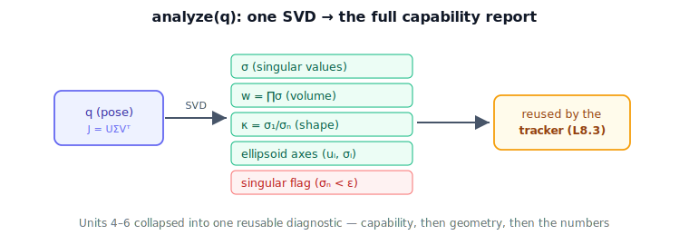

!!! abstract "You are here"
    **Module 6 — Jacobians and Differential Motion**  ·  **Unit 8 — Capstone: Analyzer → Resolved-Rate Tracker**  ·  **Lesson 8.1 — Capstone I — The Manipulability & Singularity Analyzer**

# Lesson 8.1 — Capstone I — The Manipulability & Singularity Analyzer

## 1. Why This Matters
The capstone builds the **velocity layer** for the rest of the curriculum — and a velocity
layer that can't tell when it's near trouble is dangerous. So we build the diagnostic first:
an **analyzer** that, given a configuration, reports everything we learned to compute about
capability — the singular values, the manipulability $w$, the condition number $\kappa$, the
ellipsoid, and whether the pose is near-singular. This one function is the synthesis of Units
4–6, and the tracker (next lesson) will consult it every cycle.

## 2. Physical Intuition
The analyzer is a dashboard for the arm's current freedom of motion. Point it at any pose and
it answers: How much overall room does the tool have (manipulability)? How balanced is that
room — round or dangerously thin (condition number)? Which way can it move easily, which
barely (ellipsoid axes)? And the bottom line: are we about to lose a direction (singularity
flag)? Every gauge is something we built earlier; the capstone just wires them into one
instrument.

## 3. Visual Explanation

<figure markdown>
  { width="680" }
</figure>

## 4. Mathematical Foundations
*In words first:* compute the Jacobian, take its SVD once, and read every capability metric
off the result.

The analyzer is one function $\texttt{analyze}(\mathbf{q})$:

1. $J=J(\mathbf{q})$, then $J=U\Sigma V^\top$ (one SVD).
2. **Singular values** $\sigma_i$ (ellipsoid axis lengths).
3. **Manipulability** $w=\prod_i\sigma_i$ (volume, Lesson 4.3).
4. **Condition number** $\kappa=\sigma_{\max}/\sigma_{\min}$ (shape, Lesson 6.2).
5. **Ellipsoid** axes $\mathbf{u}_i$ with lengths $\sigma_i$ (Lesson 6.1).
6. **Singularity flag** $\sigma_{\min}<\varepsilon$ (Lesson 5.1).

Every output is a direct read of $U,\Sigma$ — no extra machinery. *Back to motion:* this single
call converts a pose into a complete, honest statement of what the arm can and cannot do right
now, which is exactly what a safe velocity layer needs on tap.

## 5. Engineering Example
Robotics middleware exposes precisely such an analyzer: a service that, given the current joint
state, returns manipulability and conditioning so planners and controllers can react. The
capstone analyzer is a minimal version of that production component — and building it cements
that the ellipsoid, $w$, $\kappa$, and singularity detection are all one computation, not four.

## 6. Worked Example
Run $\texttt{analyze}$ on a healthy planar 2R pose and a near-straight one. The healthy pose
returns a round-ish ellipse, modest $\kappa$, healthy $\sigma_{\min}$, flag clear; the
near-straight pose returns a flat ellipse, large $\kappa$, tiny $\sigma_{\min}$, flag raised.
The notebook builds $\texttt{analyze}$ and prints both reports, confirming the flag fires
exactly when $\sigma_{\min}$ drops below threshold.

## 7. Interactive Demonstration

<iframe src="../../demos/module06/lesson29_resolved_rate_tracker.html" title="Capstone I — The Manipulability & Singularity Analyzer interactive demo" style="width:100%;height:520px;border:1px solid #e2e8f0;border-radius:12px"></iframe>

[Open this demo in a new tab ↗](../demos/module06/lesson29_resolved_rate_tracker.html)

**Capstone demo — Analyzer + Resolved-Rate Tracker.** The flagship widget pairs this analyzer
with the tracker (Lessons 8.2–8.3): set a commanded tool velocity, press Play, and watch the
arm move open-loop while the analyzer panel reports $\sigma$, $w$, $\kappa$ and raises the
singularity flag live — with scheduled damping keeping the joint rates bounded when the arm
enters a singular region.

*(Embedded widget: `lesson29_resolved_rate_tracker.html`. The student page injects it here.)*

What to notice (analyzer half):

- The $\sigma_2$ bar and the ellipse short axis collapse together near a singularity.
- $\kappa$ climbs and the status turns red *before* motion is fully lost.
- Every gauge updates from one SVD per frame.

## 8. Coding Exercise

!!! tip "Run the hands-on notebook"
    `modules/module06/notebooks/lesson29_capstone_analyzer.ipynb` — open in JupyterLab and run **Kernel → Restart & Run All**.

In the companion notebook:

1. Implement $\texttt{analyze}(\mathbf{q})$ returning $\sigma$, $w$, $\kappa$, ellipsoid axes,
   and a singularity flag — all from one SVD.
2. Run it on a healthy and a near-singular pose; confirm the flag fires correctly.
3. Confirm $w$, $\kappa$ match the singular values ($w=\prod\sigma_i$, $\kappa=\sigma_1/\sigma_n$).

Prints `All checks passed.`

## 9. Knowledge Check

Formative — unlimited attempts, immediate feedback; does not affect your grade.

<iframe src="../../quizzes/module06/lesson29_quiz.html" title="Capstone I — The Manipulability & Singularity Analyzer knowledge check" style="width:100%;height:720px;border:1px solid #e2e8f0;border-radius:12px"></iframe>

[Open this quiz in a new tab ↗](../quizzes/module06/lesson29_quiz.html)

1. What does the analyzer return, and from what single computation?
2. How is the singularity flag defined?
3. Which Units does the analyzer synthesize?
4. Why does a safe velocity layer need this diagnostic?

## 10. Challenge Problem
Design a single $\sigma_{\min}$-based "health score" in $[0,1]$ that smoothly combines nearness
to singularity and conditioning, and argue what threshold behavior you'd want for a controller
consuming it. How does this relate to scheduling the damping $\lambda$ (Lesson 8.3)?

## 11. Common Mistakes
- **Recomputing pieces separately.** One SVD yields all metrics; don't duplicate work.
- **A hard singular/not-singular switch only.** Conditioning ($\kappa$) gives earlier, smoother
  warning than a binary flag.
- **Ignoring the flag downstream.** The tracker must actually consult it (next lesson).

## 12. Key Takeaways
- The analyzer = one function returning $\sigma$, $w$, $\kappa$, ellipsoid, singularity flag,
  from a single SVD.
- It is the synthesis of Units 4–6 in reusable form.
- It diagnoses any pose as healthy or near-singular, with $\kappa$ as early warning.
- The tracker (next) consults it every cycle to stay safe.

---

### AI Learning Companion

- **Tutor (re-explain):** "Explain the capstone analyzer: one SVD → σ, w, κ, ellipsoid,
  singularity flag. Then quiz me."
- **Practice (generate exercises):** "Give me three problems on building/using a manipulability
  analyzer. Hold solutions."
- **Explore (connect to the real world):** "How do robotics frameworks expose manipulability and
  conditioning to planners and controllers?"

### Global Learning Support

- **English (authoritative):** "Explain a manipulability & singularity analyzer returning σ, w,
  κ, and a singularity flag from one SVD, at robotics level."
- **Español:** "Explica un analizador de manipulabilidad y singularidad que devuelve σ, w, κ y
  una bandera de singularidad desde una SVD, a nivel de robótica."
- **中文（简体）：** "用机器人学课程的水平，解释一个由单次 SVD 返回 σ、w、κ 与奇异标志的
  可操作度与奇异分析器。"
- **Türkçe:** "Tek bir SVD'den σ, w, κ ve bir tekillik bayrağı döndüren manipülabilite ve
  tekillik analizcisini robotik düzeyde açıkla."

---

*Next lesson: 8.2 — Capstone II — The Resolved-Rate Tracker.*
