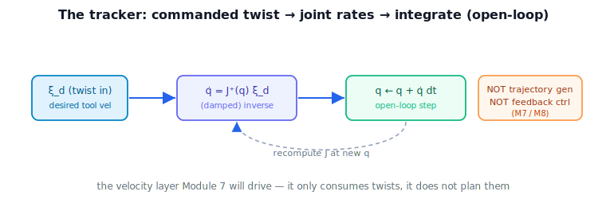

!!! abstract "You are here"
    **Module 6 — Jacobians and Differential Motion**  ·  **Unit 8 — Capstone: Analyzer → Resolved-Rate Tracker**  ·  **Lesson 8.2 — Capstone II — The Resolved-Rate Tracker**

# Lesson 8.2 — Capstone II — The Resolved-Rate Tracker

## 1. Why This Matters
With the analyzer in hand, we build the thing it protects: the **resolved-rate tracker**, the
loop that actually drives the arm to follow a commanded tool velocity. This is the velocity
layer in code — the deliverable Module 6 hands to Module 7. The discipline is to build it as a
clean, narrow interface: commanded twist in, joint rates out, integrated open-loop, with no
trajectory shaping and no feedback creeping in.

## 2. Physical Intuition
The tracker is the engine behind a tool-velocity joystick. Each cycle it asks the analyzer's
core question — "what joint rates make the tool move as commanded, right now?" — applies them
for a tick, and asks again at the new pose. Stream commands in and the tool glides along them.
It is the same resolved-rate idea from Lesson 7.4, now packaged as a reusable component with a
clean boundary.

## 3. Visual Explanation

<figure markdown>
  { width="680" }
</figure>

**Diagram Specification (component view)**

- A labeled box "Resolved-Rate Tracker": input port $\boldsymbol{\xi}_d$ (commanded twist),
  output port $\dot{\mathbf{q}}$ (joint rates); inside, the loop resolve → integrate →
  recompute $J$.
- Below: the tool tracing the commanded direction (open-loop).
- Caption: "A narrow interface: commanded twist in, joint rates out — the velocity layer."

## 4. Mathematical Foundations
*In words first:* a function that, given the current pose and a commanded twist, returns the
joint rates and the next pose — looped.

The tracker step:

$$\dot{\mathbf{q}} = J^{+}_{\lambda}(\mathbf{q})\,\boldsymbol{\xi}_d,\qquad \mathbf{q}_{\text{next}} = \mathbf{q} + \dot{\mathbf{q}}\,\Delta t,$$

run each cycle, recomputing $J(\mathbf{q})$. Its **interface** is deliberately minimal:

- **In:** current configuration $\mathbf{q}$, commanded tool twist $\boldsymbol{\xi}_d$, step
  $\Delta t$ (and damping $\lambda$, set next lesson).
- **Out:** joint rates $\dot{\mathbf{q}}$ and the integrated next configuration.

For a full-rank pose, $J\dot{\mathbf{q}}=\boldsymbol{\xi}_d$ exactly, so the tool follows the
command; finite $\Delta t$ gives the small open-loop drift of Lesson 7.4. **What is not in the
loop:** no error term, no gains, no path/time logic, no dynamics. *Back to motion:* the tracker
is a pure transducer from desired tool motion to joint motion.

## 5. Engineering Example
A robot's "Cartesian velocity controller" mode is exactly this tracker: upstream code (a teleop
device, or a Module 7 trajectory) streams desired tool twists; the tracker emits joint-rate
commands. Keeping the tracker's interface narrow is what lets the same velocity layer serve a
human joystick today and an autonomous trajectory tomorrow — the source of $\boldsymbol{\xi}_d$
changes, the tracker does not.

## 6. Worked Example
Command a planar 2R arm a constant tool velocity and run the tracker for many steps: the tool
traces a straight line along the command, drift on the order of $10^{-4}$, and the instantaneous
$J\dot{\mathbf{q}}$ equals the command at each full-rank pose. The notebook implements the
tracker as a reusable function and verifies both the velocity match and the bounded drift.

## 7. Interactive Demonstration
*(The L29 flagship demo is this tracker live; set a command and press Play. Guided prediction
here.)*

**Predict, then check.**

1. **Predict** the tool path for a constant commanded velocity.
2. **Predict** whether feeding a time-varying command would require changing the tracker.
3. **Check** in the notebook (constant-command tracking; a varying command needs no tracker
   change — only the input stream differs).

## 8. Coding Exercise

!!! tip "Run the hands-on notebook"
    `modules/module06/notebooks/lesson30_capstone_tracker.ipynb` — open in JupyterLab and run **Kernel → Restart & Run All**.

In the companion notebook:

1. Implement `track_step(q, xi_d, dt, lam)` returning `(q_next, q_dot)`.
2. Run a multi-step tracker for a constant command; confirm straight-line tracking with small
   drift.
3. Feed a (pre-supplied) time-varying command stream and confirm the tracker handles it
   unchanged — emphasizing that *generating* that stream is Module 7's job.

Prints `All checks passed.`

## 9. Knowledge Check

Formative — unlimited attempts, immediate feedback; does not affect your grade.

<iframe src="../../quizzes/module06/lesson30_quiz.html" title="Capstone II — The Resolved-Rate Tracker knowledge check" style="width:100%;height:720px;border:1px solid #e2e8f0;border-radius:12px"></iframe>

[Open this quiz in a new tab ↗](../quizzes/module06/lesson30_quiz.html)

1. Write the tracker step and its interface (in/out).
2. Why does the tool follow the command at a full-rank pose?
3. What must *not* be inside the tracker loop?
4. Why keep the interface narrow?

## 10. Challenge Problem
Argue that the tracker is a pure function of (current pose, commanded twist) — i.e. stateless
beyond the integrated pose — and explain why this statelessness is what lets Module 7 (which
*produces* the command stream) and Module 8 (which would *correct* it) bolt on without modifying
the tracker.

## 11. Common Mistakes
- **Letting the command source leak in.** The tracker takes $\boldsymbol{\xi}_d$ as input; it
  doesn't generate it.
- **Adding an error/feedback term.** That is Module 8.
- **Hard-coding $\Delta t$ or $\lambda$.** Keep them parameters of the interface.

## 12. Key Takeaways
- The resolved-rate tracker is the velocity layer as a reusable loop: twist in, joint rates out.
- $\dot{\mathbf{q}}=J^{+}_{\lambda}\boldsymbol{\xi}_d$, integrate, recompute $J$ — open-loop.
- The interface is narrow on purpose: no command generation, no feedback, no dynamics.
- It is the component Module 7 will drive and Module 8 will wrap.

---

### AI Learning Companion

- **Tutor (re-explain):** "Explain the resolved-rate tracker as a narrow velocity-layer
  component: twist in, joint rates out. Then quiz me."
- **Practice (generate exercises):** "Give me three problems implementing/testing a resolved-rate
  tracker. Hold solutions."
- **Explore (connect to the real world):** "How does a robot's Cartesian velocity mode work, and
  why keep its interface narrow?"

### Global Learning Support

- **English (authoritative):** "Explain a resolved-rate tracker as a velocity-layer component, at
  robotics-course level."
- **Español:** "Explica un rastreador de velocidad resuelta como componente de la capa de
  velocidad, a nivel de robótica."
- **中文（简体）：** "用机器人学课程的水平，把解析速度跟踪器解释为速度层组件。"
- **Türkçe:** "Çözülmüş-hız izleyiciyi bir hız-katmanı bileşeni olarak robotik ders düzeyinde
  açıkla."

---

*Next lesson: 8.3 — Capstone III — Integration: Scheduled Damping and Redundancy.*
