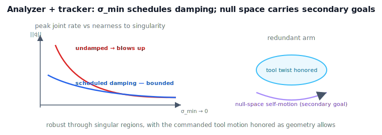

!!! abstract "You are here"
    **Module 6 — Jacobians and Differential Motion**  ·  **Unit 8 — Capstone: Analyzer → Resolved-Rate Tracker**  ·  **Lesson 8.3 — Capstone III — Integration: Scheduled Damping and Redundancy**

# Lesson 8.3 — Capstone III — Integration: Scheduled Damping and Redundancy

## 1. Why This Matters
Separately, the analyzer diagnoses and the tracker drives; wired together they become a
*robust* velocity layer. The key integration is **scheduled damping**: the analyzer's
$\sigma_{\min}$ tells the tracker how close it is to a singularity, and the tracker grows the
damping $\lambda$ accordingly — exact tracking far from trouble, bounded rates near it. For
redundant arms, the null space adds secondary goals on top. This lesson makes the system whole.

## 2. Physical Intuition
Far from singularities, the velocity layer should be faithful — move the tool exactly as
commanded. Near a singularity, it should be *graceful* — ease off the dying direction so the
joints don't thrash. Scheduled damping is that adaptive behavior: the analyzer watches
$\sigma_{\min}$ fall and the tracker turns up the damping just in time, then turns it back down
on the way out. Redundant arms get a bonus — the leftover freedom keeps the elbow comfortable
or clear of obstacles while the tool stays on command.

## 3. Visual Explanation

<figure markdown>
  { width="680" }
</figure>

## 4. Mathematical Foundations
*In words first:* read $\sigma_{\min}$ from the analyzer, turn it into a damping value, resolve
with that damping, and (if redundant) add a null-space secondary velocity.

The integrated step:

1. $\texttt{info}=\texttt{analyze}(\mathbf{q})$ → $\sigma_{\min}$ (and $\kappa$).
2. **Schedule damping** (a standard form):
   $$\lambda^2 = \begin{cases} 0, & \sigma_{\min}\ge\varepsilon \\[2pt] \big(1-(\sigma_{\min}/\varepsilon)^2\big)\,\lambda_{\max}^2, & \sigma_{\min}<\varepsilon. \end{cases}$$
3. **Resolve:** $\dot{\mathbf{q}} = J^{+}_{\lambda}\boldsymbol{\xi}_d$.
4. **Redundancy (optional):** $\dot{\mathbf{q}} \mathrel{+}= (I-J^{+}J)\,\mathbf{z}$ for a
   secondary-objective velocity $\mathbf{z}$ (posture, joint limits, obstacle gradient).
5. **Integrate:** $\mathbf{q}\leftarrow\mathbf{q}+\dot{\mathbf{q}}\,\Delta t$.

Damping is zero (exact tracking) until $\sigma_{\min}$ enters the danger band $\varepsilon$, then
grows smoothly — bounding $\lVert\dot{\mathbf{q}}\rVert$ at the cost of a small, localized error.
*Back to motion:* the system tracks faithfully where it can and yields gracefully where it must,
deciding which with the analyzer's own readings.

**Still kinematic.** Scheduled damping and null-space motion are *robustness and freedom in the
resolution*, not feedback on sensed error. Closing the loop on measured pose is Module 8;
shaping the command over time is Module 7.

## 5. Engineering Example
This integrated scheme — singularity-robust inverse with a $\sigma_{\min}$-scheduled $\lambda$,
plus null-space posture control — is essentially how production Cartesian velocity controllers
survive singular regions and keep redundant arms well-behaved. The capstone reproduces its
kinematic core: a velocity layer that is both faithful and safe.

## 6. Worked Example
Drive the tracker with a command that pushes a planar 2R arm toward full extension. With
scheduled damping, $\lVert\dot{\mathbf{q}}\rVert$ stays bounded (a few rad/s) through the
near-singular region; without it, the same command spikes the rates toward tens of rad/s. For a
redundant 3R arm, adding a "stay centered" null-space velocity changes the posture rate while
the tool twist remains exactly the command. The notebook runs both and confirms bounded rates
and preserved tool motion.

## 7. Interactive Demonstration

<iframe src="../../demos/module06/lesson31_scheduled_damping_redundancy.html" title="Capstone III — Integration: Scheduled Damping and Redundancy interactive demo" style="width:100%;height:520px;border:1px solid #e2e8f0;border-radius:12px"></iframe>

[Open this demo in a new tab ↗](../demos/module06/lesson31_scheduled_damping_redundancy.html)

**The L29 flagship demo** integrates all of this: toggle damping and run a command into the
singular region — watch $\sigma_{\min}$ fall, the flag turn red, and the joint-rate readout stay
bounded (damping on) or blow up (damping off).

**Predict, then check.**

1. **Predict** $\lVert\dot{\mathbf{q}}\rVert$ near the singularity with vs without scheduled damping.
2. **Predict** whether a null-space term disturbs the tool twist.
3. **Check** in the notebook (bounded rates; preserved tool motion).

## 8. Coding Exercise

!!! tip "Run the hands-on notebook"
    `modules/module06/notebooks/lesson31_capstone_integration.ipynb` — open in JupyterLab and run **Kernel → Restart & Run All**.

In the companion notebook:

1. Wire the analyzer into the tracker: schedule $\lambda$ from $\sigma_{\min}$.
2. Drive a command toward a singularity; confirm scheduled damping bounds
   $\lVert\dot{\mathbf{q}}\rVert$ while undamped blows up.
3. For a redundant arm, add a null-space secondary velocity and confirm the tool twist is
   unchanged.

Prints `All checks passed.`

## 9. Knowledge Check

Formative — unlimited attempts, immediate feedback; does not affect your grade.

<iframe src="../../quizzes/module06/lesson31_quiz.html" title="Capstone III — Integration: Scheduled Damping and Redundancy knowledge check" style="width:100%;height:720px;border:1px solid #e2e8f0;border-radius:12px"></iframe>

[Open this quiz in a new tab ↗](../quizzes/module06/lesson31_quiz.html)

1. How does $\sigma_{\min}$ schedule the damping?
2. What does scheduled damping achieve far from vs near a singularity?
3. How is a secondary objective added without disturbing the tool?
4. Why is this still kinematic, not feedback control?

## 10. Challenge Problem
Show that with the given schedule, $\lambda$ is continuous at $\sigma_{\min}=\varepsilon$ and that
$\lVert\dot{\mathbf{q}}\rVert$ remains bounded as $\sigma_{\min}\to 0$. What goes wrong if $\lambda$
jumps discontinuously, and why does smooth scheduling matter for the joint-rate stream Module 7
will consume?

## 11. Common Mistakes
- **Constant damping.** Hurts accuracy far from singularities; schedule it by $\sigma_{\min}$.
- **Discontinuous $\lambda$.** Causes joint-rate jumps; use a smooth schedule.
- **Putting the secondary objective into the primary task.** Keep it in the null space so the tool
  is undisturbed.

## 12. Key Takeaways
- Wire the analyzer's $\sigma_{\min}$ into the tracker to schedule damping: faithful far away,
  bounded near singularities.
- Standard schedule: $\lambda^2=(1-(\sigma_{\min}/\varepsilon)^2)\lambda_{\max}^2$ inside the danger
  band, else $0$.
- Null-space motion adds secondary goals for redundant arms without disturbing the tool.
- The integrated system is robust and kinematic — not feedback control or trajectory generation.

---

### AI Learning Companion

- **Tutor (re-explain):** "Explain scheduled damping (σ_min → λ) and null-space secondary
  objectives in the integrated tracker. Then quiz me."
- **Practice (generate exercises):** "Give me three problems on damping schedules and null-space
  control in a velocity layer. Hold solutions."
- **Explore (connect to the real world):** "How do production Cartesian velocity controllers stay
  safe through singularities?"

### Global Learning Support

- **English (authoritative):** "Explain scheduled damping and null-space secondary objectives in an
  integrated resolved-rate velocity layer, at robotics level."
- **Español:** "Explica el amortiguamiento programado y los objetivos secundarios en el espacio
  nulo en una capa de velocidad de tasa resuelta, a nivel de robótica."
- **中文（简体）：** "用机器人学课程的水平，解释集成解析速度层中的调度阻尼与零空间次级目标。"
- **Türkçe:** "Entegre çözülmüş-hız katmanında programlı sönümlemeyi ve sıfır-uzayı ikincil
  hedeflerini robotik düzeyde açıkla."

---

*Next lesson: 8.4 — Capstone IV — The Velocity Layer for Module 7.*
