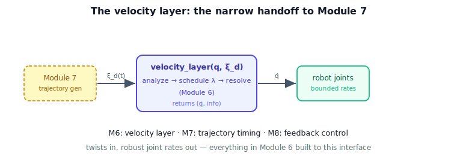

!!! abstract "You are here"
    **Module 6 — Jacobians and Differential Motion**  ·  **Unit 8 — Capstone: Analyzer → Resolved-Rate Tracker**  ·  **Lesson 8.4 — Capstone IV — The Velocity Layer for Module 7**

# Lesson 8.4 — Capstone IV — The Velocity Layer for Module 7

## 1. Why This Matters
Everything in Module 6 — twists, the Jacobian, the ellipsoid, singularities, the SVD, the
damped inverse, resolved rates — was building one deliverable: a **velocity layer** that turns
desired tool motion into safe joint motion. This final lesson packages it behind a single clean
interface, documents the contract, and marks the boundary where Module 7 takes over. It is both
the capstone's conclusion and the module's synthesis.

## 2. Physical Intuition
Picture the finished component as a sealed box with two ports. Into the left port flows a stream
of "move the tool like this" commands (tool twists). Out of the right port flows a stream of
"drive the joints like this" commands (joint rates), already made safe near singularities and,
for redundant arms, already spending spare freedom wisely. Whoever supplies the commands — a
person with a joystick today, a Module 7 trajectory tomorrow — plugs into the same port. The box
doesn't care where the commands come from; it only resolves them.

## 3. Visual Explanation

<figure markdown>
  { width="680" }
</figure>

**Diagram Specification (stack)**

- Top block: "Module 7 — trajectory generation (produces $\boldsymbol{\xi}_d(t)$)" — greyed,
  *future*.
- A dashed boundary line "Module 6 / Module 7 handoff."
- Middle block: "Module 6 velocity layer = analyzer + resolved-rate tracker" with ports
  $\boldsymbol{\xi}_d$ in, $\dot{\mathbf{q}}$ out.
- Bottom: "robot joints."
- Caption: "Module 6 delivers the velocity layer; Module 7 drives it; Module 8 would wrap it
  with feedback."

## 4. Mathematical Foundations
*In words first:* one function — twist in, joint rates out — with everything robust handled
inside.

The packaged interface:

$$\texttt{velocity\_layer}(\mathbf{q},\,\boldsymbol{\xi}_d)\ \longrightarrow\ (\dot{\mathbf{q}},\ \texttt{info}),$$

which internally (1) runs $\texttt{analyze}(\mathbf{q})$ for $\sigma_{\min},\kappa$; (2) schedules
$\lambda$; (3) resolves $\dot{\mathbf{q}}=J^{+}_{\lambda}\boldsymbol{\xi}_d$ plus any null-space
term; and returns the joint rates and the capability report. Integrating $\mathbf{q}\leftarrow
\mathbf{q}+\dot{\mathbf{q}}\Delta t$ over a command stream is the tracker.

**The contract (boundaries):**

| Provides | Does **not** provide |
| --- | --- |
| desired tool twist → joint rates | the desired twist *stream* (→ Module 7) |
| singularity-robust resolution | sensed-pose error correction (→ Module 8) |
| redundancy resolution (null space) | path/time parameterization (→ Module 7) |
| capability diagnostics (σ, w, κ) | forces/torques/masses (dynamics, → Module 8+) |

*Back to motion:* Module 6 answers "given how I want the tool to move *right now*, how should
the joints move, safely?" Module 7 will answer "how should the tool move over time?" and feed
this layer; Module 8 will answer "how do I correct for what really happened?" The velocity layer
is the stable interface between them.

## 5. Engineering Example
In a real stack, this is the boundary between a motion planner and a motion controller's
velocity mode: the planner emits Cartesian velocity setpoints; the velocity layer turns them into
joint-velocity commands robustly. Module 6's capstone is a faithful, minimal version of that
boundary component — which is why its interface discipline (no planning, no feedback inside)
matters as much as its math.

## 6. Worked Example
Wrap the analyzer + tracker into a single `velocity_layer(q, xi_d)` call and drive it with a
pre-supplied stream of desired twists (some near a singularity): the joint-rate stream stays
bounded, the tool follows the commands as closely as geometry allows, and the returned `info`
reports the conditioning at each step. The notebook builds the packaged interface and runs an
end-to-end test, confirming bounded rates and a clean twist-in/joint-rate-out contract.

## 7. Module 6 Synthesis
The arc, end to end:

- **Units 1–2 (twists, the Jacobian, forward velocity):** how joint rates become tool motion —
  $\boldsymbol{\xi}=J\dot{\mathbf{q}}$.
- **Unit 3 (analytic Jacobian, frames):** the same map in different representations and frames.
- **Unit 4 (rank, manipulability, ellipsoid):** what motion is available, lost, internal — the
  capability picture.
- **Unit 5 (singularities):** where capability collapses, read geometrically.
- **Unit 6 (SVD, condition number, subspaces, damped inverse):** the algebra that *explains* the
  geometry and tames the inverse.
- **Unit 7 (inverse velocity, redundancy, damping, resolved rate):** turning the map around to
  command motion.
- **Unit 8 (capstone):** packaging it all into the velocity layer.

Throughout, the order held — **Capability → Geometry → Algebra**: see what the arm can do, watch
it in the ellipsoid, then reach for the matrices that explain it. The velocity layer is where
that understanding becomes a usable component.

## 8. Interactive Demonstration
*(The L29 flagship demo is the velocity layer in action — analyzer + tracker behind one Play
button. Use it to review the whole module: command motion, watch capability, hit a singularity,
see damping keep it safe.)*

**Predict, then check.**

1. **Predict** what changes in the velocity layer if the command comes from a trajectory instead
   of a joystick. (Nothing — only the input stream differs.)
2. **Predict** what Module 7 adds, and what Module 8 would add.
3. **Check** your boundaries against the contract table.

## 9. Coding Exercise

!!! tip "Run the hands-on notebook"
    `modules/module06/notebooks/lesson32_capstone_velocity_layer.ipynb` — open in JupyterLab and run **Kernel → Restart & Run All**.

In the companion notebook:

1. Implement `velocity_layer(q, xi_d)` wrapping analyzer + scheduled-damping resolution; return
   `(q_dot, info)`.
2. Drive it with a pre-supplied twist stream (including a near-singular stretch); confirm bounded
   joint rates and reported conditioning.
3. State, for three behaviors (trajectory timing, pose-error correction, posture control), which
   module owns each.

Prints `All checks passed.`

## 10. Knowledge Check

Formative — unlimited attempts, immediate feedback; does not affect your grade.

<iframe src="../../quizzes/module06/lesson32_quiz.html" title="Capstone IV — The Velocity Layer for Module 7 knowledge check" style="width:100%;height:720px;border:1px solid #e2e8f0;border-radius:12px"></iframe>

[Open this quiz in a new tab ↗](../quizzes/module06/lesson32_quiz.html)

1. What is the velocity layer's interface (in/out)?
2. What does the layer provide, and what does it deliberately not?
3. What will Module 7 add on top, and Module 8?
4. Summarize the Module 6 arc in the Capability → Geometry → Algebra order.

## 11. Challenge Problem
Define a clean API for the velocity layer (inputs, outputs, parameters, and the `info` it
reports) suitable for a Module 7 trajectory generator to drive. Justify each boundary: why the
command stream, pose-error correction, and dynamics live *outside* this layer.

## 12. Common Mistakes
- **Smuggling planning or feedback into the layer.** Keep the interface narrow; those are other
  modules.
- **Treating the capstone as new theory.** It is integration — the synthesis of Units 1–7.
- **Forgetting to expose diagnostics.** The `info` report is what lets upstream modules react.

## 13. Key Takeaways
- The velocity layer = analyzer + tracker behind one interface: desired tool twist in, robust
  joint rates out.
- Its contract is deliberately bounded — no command generation (M7), no feedback (M8), no
  dynamics.
- It is the stable handoff point: Module 7 drives it, Module 8 would wrap it.
- Module 6, end to end, built this layer in the order Capability → Geometry → Algebra.

---

### AI Learning Companion

- **Tutor (re-explain):** "Explain the packaged velocity layer, its interface and boundaries, and
  how Module 6 built to it. Then quiz me."
- **Practice (generate exercises):** "Give me three problems on defining the velocity-layer API and
  its module boundaries. Hold solutions."
- **Explore (connect to the real world):** "Where is the planner/controller velocity-mode boundary
  in a real robot stack, and why keep it clean?"

### Global Learning Support

- **English (authoritative):** "Explain the resolved-rate velocity layer as a packaged interface
  and its boundaries with trajectory generation and feedback control, at robotics level."
- **Español:** "Explica la capa de velocidad como interfaz empaquetada y sus límites con la
  generación de trayectorias y el control por realimentación, a nivel de robótica."
- **中文（简体）：** "用机器人学课程的水平，解释作为封装接口的速度层，及其与轨迹生成和反馈控制的边界。"
- **Türkçe:** "Çözülmüş-hız hız katmanını paketlenmiş bir arayüz olarak ve yörünge üretimi ile
  geri-besleme kontrolüyle sınırlarını robotik düzeyde açıkla."

---

*Module 6 complete. Next: Module 7 — Trajectory Generation, which drives this velocity layer.*
