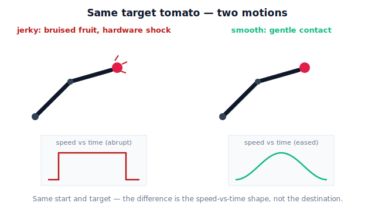

!!! abstract "You are here"
    **Module 7 — Trajectory Generation and Motion Planning**  ·  **Unit 1 — Motion, Paths, and Trajectories**  ·  **Lesson 1.1 — Why Smooth, Safe, Efficient Motion Matters**

# Lesson 1.1 — Why Smooth, Safe, Efficient Motion Matters

> Module 5 found *which joint angles* reach a tomato. Module 6 found *how to move right now*. Module 7 starts a new question for the greenhouse harvester: **of all the ways to get there, which motion should we actually command** — and why does the choice matter?

---

## 1. Why This Matters
By the end of Module 6 the harvesting arm could already do something impressive: given a desired tool velocity, the **velocity layer** returned the joint rates that produce it, even near singularities. So a tempting thought is: *we're basically done with motion — just point the tool at the fruit and go.*

That thought is wrong, and the greenhouse shows why. Suppose the arm snaps from its rest pose toward a ripe tomato as fast as the motors allow. It arrives — but on the way the gripper whipped through the canopy, the wrist slammed to a stop at the fruit, the whole frame shuddered, and the tomato got bruised on contact. The arm reached the right **pose**; the **motion** was a failure.

The same destination can be reached by a motion that is gentle, predictable, and easy on the hardware, or by one that is violent, jarring, and damaging. **Module 7 is about designing the good motion on purpose.** Without it, the harvester is a machine that knows where to go but not how to go there — and in a greenhouse full of soft fruit and slender stems, *how* is what keeps it from breaking things.

## 2. Physical Intuition
You already have this intuition from driving and from carrying things.

Picture carrying a full mug of coffee across a room. You *could* lurch forward at top speed and stop dead at the table — and wear the coffee. Instead you ease into motion, glide at a steady pace, and ease to a stop. Same start, same end, same path across the floor. The difference is entirely in the **timing of the speed**: how quickly you sped up and slowed down. Gentle changes in speed keep the coffee in the mug.

A robot arm carrying a tomato is the same story. The fruit, the gripper, and every gear in the arm "feel" not the position but the *changes* in motion — the accelerations, and the *rate of change* of acceleration. Lurch, and those changes spike; everything downstream gets a jolt. Ease in and out, and the jolts vanish. **Smoothness is about the timing of speed, not the route taken.** Module 7 is where we learn to control that timing deliberately.

## 3. Mathematical Foundations
We will be precise later; here we only name the three goals so the rest of the unit has a target.

- **Smooth** — the motion's speed and acceleration change *gradually*, never instantly. Informally, if position is $q(t)$, then velocity $\dot q$, acceleration $\ddot q$, and **jerk** $\dddot q$ stay bounded and continuous. The jolt you feel is jerk.
- **Safe** — the motion never collides with the canopy, a stem, or the structure, and never demands more than the joints can deliver. It stays inside the *reachable* and *collision-free* part of the workspace, and away from configurations where the arm loses control authority (the **singularities** of Module 6).
- **Efficient** — the motion does its job without wasted time, wasted distance, or wasted strain — a short, quick, clean reach rather than a long, dawdling, or thrashing one.

These three pull against each other: the fastest motion is rarely the smoothest, and the smoothest is rarely the quickest. **Module 7 is the engineering of that trade-off.** No equations are needed yet — only the recognition that "reach the pose" and "move well" are different requirements.

## 4. Visual Explanation

<figure markdown>
  { width="680" }
</figure>

## 5. Engineering Example
A commercial fruit-picking arm runs thousands of reaches per shift. Two facts make motion quality a business problem, not a nicety:

1. **Soft payload.** A ripe tomato bruises under a surprisingly small impact. Bruising happens at *contact and stopping*, exactly where abrupt deceleration lives. A motion that decelerates smoothly into the grasp loses far fewer fruit than one that stops on a dime.
2. **Duty cycle.** Every abrupt acceleration sends a shock through the gearboxes and belts. Over a season of millions of cycles, jerky motion is what cracks a harmonic drive or stretches a belt. Smoother motion *is* longer mean-time-between-failures.

The lesson the field teaches repeatedly: the arm that reaches the fruit "correctly" but moves badly costs more in damaged produce and maintenance than a slightly slower arm that moves well.

## 6. Worked Example
No arithmetic yet — instead, a structured judgement that previews the whole unit. The harvester must move its tool from a rest pose to a tomato 0.5 m away. Two candidate commands:

- **Command A — "go now":** apply maximum joint speed immediately, hold it, then cut to zero on arrival.
- **Command B — "ease":** speed up gradually, cruise, then slow down gradually into the grasp.

Walk the three goals:

| Goal | Command A (snap) | Command B (ease) |
|---|---|---|
| Smooth | ✗ instant speed-up and stop = huge jerk | ✓ gradual changes = low jerk |
| Safe | ✗ overshoot risk, shock loads | ✓ controlled approach |
| Efficient (time) | ✓ fastest raw time | ✗ slightly slower |
| Efficient (wear/produce) | ✗ high strain, bruising | ✓ low strain, gentle |

**Conclusion:** B wins on every axis that matters except raw clock time — and in a greenhouse, the bruised-fruit and broken-gearbox costs dwarf a fraction of a second. The rest of Module 7 makes "ease" precise and computable.

## 7. Interactive Demonstration
*(Conceptual — the runnable version is the companion notebook; the unit's flagship interactive arrives at Lesson 2.3, the Polynomial Profile Shaper.)*

**Predict, then check.** Imagine the tool's *speed* plotted against time for one reach.

1. Sketch the speed-vs-time curve for "snap": it jumps to a high value, stays flat, then drops to zero.
2. Sketch it for "ease": it starts at zero, rises smoothly to a peak, then falls smoothly to zero.
3. Predict: at which instants is the *acceleration* (the slope of the speed curve) largest in each case? Where would a carried tomato feel the biggest jolt?

You should find the "snap" curve has near-vertical edges — infinite slope, i.e. an acceleration spike — at the start and the stop, which is exactly where fruit bruises. The "ease" curve has gentle slopes everywhere. The companion notebook plots both and overlays the acceleration so you can see the spikes.

## 8. Coding Exercise

!!! tip "Run the hands-on notebook"
    `modules/module07/notebooks/lesson01_why_motion_quality_matters.ipynb` — open in JupyterLab and run **Kernel → Restart & Run All**.

*(Thought exercise / light snippet — full implementation deferred to the notebook track.)*

In the companion notebook you will (no new math, just observation):

1. Build a crude "snap" speed profile (jump to a constant, then to zero) and a crude "ease" speed profile (a smooth hump), sampled over the same total time.
2. Numerically differentiate each to get acceleration, and again to get jerk.
3. Plot speed, acceleration, and jerk for both, and read off where the snap profile produces huge acceleration/jerk values and the ease profile does not.

This teaches *what we are measuring* when we say "smooth," and sets up the precise definitions in Unit 2. It deliberately does **not** yet show how to *generate* a principled smooth profile — that is Lessons 2.1–2.4.

## 9. Knowledge Check

Formative — unlimited attempts, immediate feedback; does not affect your grade.

<iframe src="../../quizzes/module07/lesson01_quiz.html" title="Why Smooth, Safe, Efficient Motion Matters knowledge check" style="width:100%;height:720px;border:1px solid #e2e8f0;border-radius:12px"></iframe>

[Open this quiz in a new tab ↗](../quizzes/module07/lesson01_quiz.html)

1. True or false: if two motions reach the same final pose, they are equally good. Explain.
2. Name the three motion-quality goals and, for each, one greenhouse failure it prevents.
3. Which carried-coffee mistake corresponds to a robot bruising a tomato — lurching into motion, or stopping abruptly? Could be either; explain why.
4. In your own words, what does "smoothness is about the timing of speed, not the route" mean?

## 10. Challenge Problem
A grower complains that the harvester "reaches every tomato perfectly but bruises one in ten and keeps snapping drive belts." You are not allowed to change the targets, the gripper, or the arm — only the *motion commands*. List three changes you would investigate, and for each, state which of the three goals (smooth / safe / efficient) it addresses and what greenhouse symptom it should reduce. *(There is no single right answer; the reasoning is the point.)*

## 11. Common Mistakes
- **Equating "reached the pose" with "moved well."** A correct endpoint says nothing about the journey; Module 7 exists precisely because the journey is a separate design problem.
- **Thinking smoothness means slowness.** A motion can be both quick and smooth; smoothness constrains *how* speed changes, not how fast it gets.
- **Confusing the path with the timing.** Two motions can trace the identical route through space yet differ entirely in quality because of *when* they are fast and slow. (We make path-vs-trajectory precise next lesson.)
- **Assuming the velocity layer already handles this.** The M6 velocity layer faithfully executes whatever twist you command — including a violent one. It will not smooth a bad command for you; that is Module 7's job.

## 12. Key Takeaways
- The **same target pose** can be reached by motions that are gentle or violent; motion quality is designed, not free.
- The three goals are **smooth** (gradual changes in speed/acceleration — bounded jerk), **safe** (collision-free, within limits, away from singularities), and **efficient** (no wasted time, distance, or strain).
- In the greenhouse these are concrete: jerky motion **bruises fruit** and **wears the mechanism**; smooth motion protects both.
- **Module 7 designs the motion** that the M6 velocity layer executes and that Module 8 will later track — it is the layer between "where to go" and "make it happen accurately."

---

### AI Learning Companion

Copy any prompt below into your AI tutor.

- **Tutor (re-explain):** "Re-explain why a robot reaching the correct final pose can still have moved badly. Use the carried-coffee analogy and the idea that smoothness is about the timing of speed. Then ask me two quick conceptual questions."
- **Practice (generate exercises):** "Give me three scenarios where a robot reaches the right pose but the motion is a failure (fruit-picking, surgery, welding). For each, ask me which of smooth/safe/efficient was violated. Withhold answers until I respond."
- **Explore (connect to the real world):** "Show me real systems where *how* a machine moves matters as much as where it ends up — elevators, camera gimbals, pick-and-place lines — and what fails when the motion is jerky."

### Global Learning Support

Per-language explanation prompts — use whichever you think best in.

- **English (authoritative):** "Explain why smooth, safe, and efficient robot motion matters even when the final pose is correct, at the level of an introductory robotics course, using a fruit-harvesting example."
- **Español:** "Explica por qué el movimiento robótico suave, seguro y eficiente importa aunque la pose final sea correcta, a nivel de un curso introductorio de robótica, usando un ejemplo de cosecha de fruta."
- **中文（简体）：** "用机器人入门课程的水平，并以采摘水果为例，解释为什么即使最终位姿正确，机器人运动的平滑、安全与高效仍然重要。"
- **Türkçe:** "Son poz doğru olsa bile robot hareketinin neden pürüzsüz, güvenli ve verimli olması gerektiğini, bir meyve hasadı örneğiyle ve giriş seviyesi bir robotik dersi düzeyinde açıkla."

---

*Next lesson: 1.2 — Path vs Trajectory: Geometry versus Timing (we separate *where* the tool goes from *when* it is there).*
