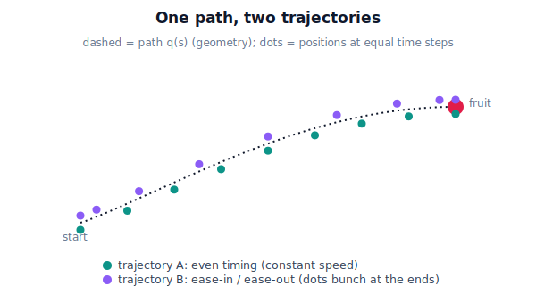

!!! abstract "You are here"
    **Module 7 — Trajectory Generation and Motion Planning**  ·  **Unit 1 — Motion, Paths, and Trajectories**  ·  **Lesson 1.2 — Path vs Trajectory: Geometry versus Timing**

# Lesson 1.2 — Path vs Trajectory: Geometry versus Timing

> Last lesson said *how* the harvester moves matters. To control "how," we first split motion into two separable parts: the **route** through space, and the **clock** that says when. Getting this distinction crisp is the backbone of the whole module.

---

## 1. Why This Matters
When you tell the harvester to "reach that tomato," you have actually asked for two different things that engineers handle in two different stages:

1. **Which points in space does the tool pass through, and in what order?** — the geometry.
2. **When is the tool at each of those points — how fast, speeding up or slowing down?** — the timing.

Module 7's central trick is to **solve these one at a time.** First find a good geometric route (the *path*) that avoids the canopy and reaches the fruit. Then, on that fixed route, choose the timing (the *trajectory*) that is smooth and feasible. Mix the two up and every problem gets harder; separate them and each becomes tractable. This lesson installs the vocabulary — *path* vs *trajectory* — that the rest of the module relies on, and it explains why "the same path" can give you a gentle motion or a violent one.

## 2. Physical Intuition
Think of a hiking trail drawn on a map. The **trail** is the route: this ridge, that switchback, the saddle, the summit. The map says nothing about *when* you are anywhere — it is pure geometry. That is a **path**.

Now actually hike it. Your **schedule** — sprint the flats, crawl the steep bits, rest at the saddle, finish slowly — is the timing layered onto the trail. The *same trail* hiked by a sprinter and by a careful walker are two completely different *journeys* even though every footstep lands on the identical route. That schedule-on-a-route is a **trajectory**.

For the harvester: the path is the curve the gripper traces from rest to tomato. The trajectory is that curve *plus* the decision to ease in, cruise, and ease out. **One path, many possible trajectories** — and Lesson 1.1's "good vs bad motion" lives entirely in which trajectory you pick on a given path.

## 3. Mathematical Foundations
**Path — geometry, parameterized by progress.** A path is a curve of configurations indexed by a unitless **path parameter** $s \in [0,1]$:

$$q(s),\qquad s\in[0,1],\qquad q(0)=q_{\text{start}},\ \ q(1)=q_{\text{goal}}.$$

Here $s$ is *not* time — it is "fraction of the way along." $s=0$ is the start, $s=1$ the goal, $s=0.5$ halfway *in geometry*. A Cartesian path is written the same way in task space, $X(s)$. A path has a shape but no schedule; asking "what is $\dot q$?" is meaningless because there is no clock.

**Trajectory — geometry plus a clock.** A trajectory introduces a **time scaling** $s(t)$ that says how progress unfolds in time, with $s(0)=0$ and $s(T)=1$ over a duration $T$. Composing it with the path gives a function of time:

$$q(t) = q\big(s(t)\big).$$

Now derivatives exist and *carry units*:

$$\dot q(t) = \frac{dq}{ds}\,\dot s(t), \qquad \ddot q(t) = \frac{dq}{ds}\,\ddot s(t) + \frac{d^2q}{ds^2}\,\dot s(t)^2 .$$

(We derive these carefully in Lesson 2.1 — for now just read the *structure*.) The key reading: **velocity and acceleration depend on the timing $s(t)$, not just on the geometry $q(s)$.** A different $s(t)$ on the *same* path $q(s)$ yields different velocities and accelerations — a different trajectory. That is the formal statement of "one path, many trajectories."

> **Convention lock (D-061).** Throughout Module 7: $s\in[0,1]$ is the unitless *path parameter*; $t\in[0,T]$ is *time*; $T$ is the trajectory *duration*. "Path" = $q(s)$ or $X(s)$; "trajectory" = $q(t)$. We never overload $s$ to mean time.

## 4. Visual Explanation

<figure markdown>
  { width="680" }
</figure>

## 5. Engineering Example
A pick-and-place cell stacks trays. The **path** — lift straight up, traverse across, lower straight down — is fixed by the cell geometry and almost never changes; it is collision-free by construction. What the engineers tune every day is the **trajectory**: how aggressively to accelerate on the traverse, how gently to lower onto the stack so nothing topples.

This is the industrial reason the split pays off. The hard, safety-critical geometric question ("does the route hit anything?") is answered once. Then throughput and gentleness are tuned purely in the timing layer, on a path already known to be safe. The greenhouse harvester works the same way: plan a canopy-avoiding route to the fruit once, then shape the timing on that route for smooth, gentle picking.

## 6. Worked Example
Take a one-joint move for clarity: joint angle from $q_{\text{start}}=20^\circ$ to $q_{\text{goal}}=80^\circ$.

**The path** is the set of angles between them, indexed by $s$:

$$q(s) = 20^\circ + s\,(80^\circ-20^\circ) = 20^\circ + 60^\circ s,\qquad s\in[0,1].$$

At $s=0$: $20^\circ$. At $s=0.5$: $50^\circ$ (geometric halfway). At $s=1$: $80^\circ$. No time, no speed — just geometry.

**Two trajectories on this one path**, each a choice of $s(t)$ over $T=2$ s:

- **Constant-rate:** $s(t)=t/2$. Then $q(t)=20^\circ+30^\circ t$, a steady $30^\circ/\text{s}$ — but it *starts and stops instantly* (velocity jumps from 0 to 30 and back).
- **Ease-in/ease-out:** $s(t)=3(t/2)^2-2(t/2)^3$ (a smooth S, which we meet properly in 2.3). Same endpoints, same path, but now $\dot q(0)=\dot q(2)=0$ — it eases away from rest and eases to a stop.

Both visit $50^\circ$ at the geometric midpoint $s=0.5$. But the constant-rate one reaches it at $t=1$ s moving at $30^\circ/\text{s}$, while the eased one reaches it at $t=1$ s moving *fastest* and started from rest. **Identical path, different trajectories, different motion quality** — exactly the Lesson 1.1 distinction, now made concrete.

## 7. Interactive Demonstration

<iframe src="../../demos/module07/lesson02_path_vs_trajectory.html" title="Path vs Trajectory: Geometry versus Timing interactive demo" style="width:100%;height:520px;border:1px solid #e2e8f0;border-radius:12px"></iframe>

[Open this demo in a new tab ↗](../demos/module07/lesson02_path_vs_trajectory.html)

*(Conceptual — runnable in the companion notebook.)*

**Same path, two clocks.** Using the one-joint move above:

1. Fix the path $q(s)=20^\circ+60^\circ s$.
2. Apply $s(t)=t/T$ (constant-rate) and then $s(t)=3(t/T)^2-2(t/T)^3$ (eased), both with $T=2$.
3. Plot $q$ vs $t$ for both on one axis (they share endpoints, differ in the middle), then plot $\dot q$ vs $t$ (constant-rate is a flat bar with vertical edges; eased is a smooth hump touching zero at both ends).

The takeaway you should *see*: the position curves look similar, but the **velocity** curves reveal the trajectory difference — and the velocity is what the hardware and the tomato feel.

## 8. Coding Exercise

!!! tip "Run the hands-on notebook"
    `modules/module07/notebooks/lesson02_path_vs_trajectory.ipynb` — open in JupyterLab and run **Kernel → Restart & Run All**.

*(Snippet / notebook task.)*

In the companion notebook:

1. Write `path(s)` returning the linear interpolation between two joint angles — pure geometry, no time.
2. Write two time scalings, `s_linear(t, T)` and `s_smooth(t, T)`.
3. Sample each trajectory `q(t) = path(s(t))` on the same time grid, and confirm: (a) both hit the same start and goal; (b) both pass through the same `path(0.5)`; (c) their velocity profiles differ — assert the smooth one has near-zero velocity at both ends while the linear one does not.

It teaches that *composing* a path with a time scaling is the literal mechanism of "making a trajectory." It does **not** yet judge which timing is best — that is Unit 2.

## 9. Knowledge Check

Formative — unlimited attempts, immediate feedback; does not affect your grade.

<iframe src="../../quizzes/module07/lesson02_quiz.html" title="Path vs Trajectory: Geometry versus Timing knowledge check" style="width:100%;height:720px;border:1px solid #e2e8f0;border-radius:12px"></iframe>

[Open this quiz in a new tab ↗](../quizzes/module07/lesson02_quiz.html)

1. Define *path* and *trajectory* in one sentence each, and state which one has units of time.
2. The path parameter $s$ runs from ___ to ___; what does $s=0.5$ mean, and does it mean "halfway in time"?
3. True or false: two trajectories that share a path must have the same velocity profile. Explain.
4. Which Module 7 stage produces the path, and which produces the trajectory?

## 10. Challenge Problem
A Cartesian path takes the gripper in a straight line from above a tomato down to it. You are given the path $X(s)$ and asked to produce a trajectory that (i) starts and ends at rest and (ii) moves *slowly through the last 20% of the path* (the delicate approach) but briskly through the first 80%. Without writing formulas, describe the *shape* of the time scaling $s(t)$ that achieves this — where is $\dot s$ large, where is it small, and what must $\dot s$ be at $t=0$ and $t=T$? Sketch $s$ vs $t$ qualitatively.

## 11. Common Mistakes
- **Calling a path a trajectory (or vice versa).** A path has no clock; the moment you ask "how fast," you are talking about a trajectory.
- **Treating $s$ as time.** $s\in[0,1]$ is geometric progress; $s=0.5$ is the spatial midpoint, generally *not* the time midpoint.
- **Believing the path fixes the velocities.** It does not — the same path admits gentle and violent timings. Velocities come from $s(t)$.
- **Planning geometry and timing together.** Tractable robotics almost always separates them: plan the route, then time-parameterize it. Conflating them is how Unit 6's planning and Unit 2's timing get tangled.

## 12. Key Takeaways
- A **path** is geometry: $q(s)$ (or $X(s)$) with unitless $s\in[0,1]$ from start ($0$) to goal ($1$). No time, no velocity.
- A **trajectory** is a path plus a **time scaling** $s(t)$: $q(t)=q(s(t))$, which finally gives velocity and acceleration.
- **One path supports many trajectories** — same route, different clocks, different motion quality.
- Module 7 **plans the path first, then time-parameterizes it** into a trajectory; keeping $s$ (progress) and $t$ (time) distinct is the convention the module is built on.

---

### AI Learning Companion

Copy any prompt below into your AI tutor.

- **Tutor (re-explain):** "Re-explain the difference between a path and a trajectory using the hiking-trail-vs-schedule analogy, and explain why one path can give many trajectories. Then quiz me on which is which for three examples."
- **Practice (generate exercises):** "Give me four short scenarios and ask me to label each as describing a *path* or a *trajectory*. Include tricky ones (e.g. 'the tool passes through these five points' vs 'the tool reaches each point on this schedule'). Reveal answers after I respond."
- **Explore (connect to the real world):** "Where else is route separated from schedule — GPS navigation, train timetables, animation keyframes, CNC machining? Explain how each separates geometry from timing."

### Global Learning Support

Per-language explanation prompts — use whichever you think best in.

- **English (authoritative):** "Explain the difference between a path (geometry, q(s), s in [0,1]) and a trajectory (timing added, q(t)) in robot motion, and why one path supports many trajectories, at an introductory robotics level."
- **Español:** "Explica la diferencia entre una trayectoria geométrica (path: q(s), s en [0,1]) y una trayectoria temporizada (trajectory: q(t)) en el movimiento de un robot, y por qué un mismo recorrido admite muchas temporizaciones, a nivel introductorio."
- **中文（简体）：** "用机器人入门水平，解释路径（path：几何 q(s)，s∈[0,1]）与轨迹（trajectory：加上时间 q(t)）的区别，以及为什么同一条路径可以对应多条轨迹。"
- **Türkçe:** "Robot hareketinde yol (path: geometri q(s), s∈[0,1]) ile yörünge (trajectory: zaman eklenmiş q(t)) arasındaki farkı ve neden tek bir yolun birçok yörüngeye izin verdiğini, giriş seviyesinde açıkla."

---

*Next lesson: 1.3 — What Makes a Trajectory "Good": Smoothness, Continuity, Feasibility, Safety (the qualities we will spend the module enforcing).*
