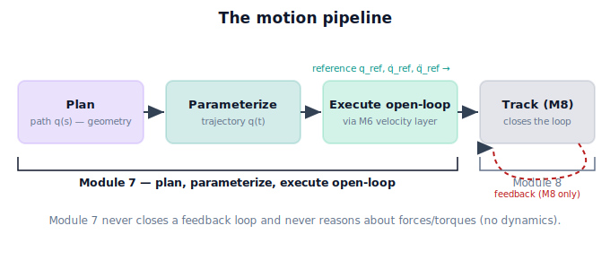

!!! abstract "You are here"
    **Module 7 — Trajectory Generation and Motion Planning**  ·  **Unit 1 — Motion, Paths, and Trajectories**  ·  **Lesson 1.4 — The Motion Pipeline**

# Lesson 1.4 — The Motion Pipeline

> Three lessons gave us the vocabulary and the rubric. This one assembles the **pipeline** that turns a goal into commanded motion, and draws the fences that define where Module 7 starts and stops — the boundaries the whole module is built to respect.

---

## 1. Why This Matters
The harvester's motion is not produced in one step. It flows through a **pipeline** of stages, each owned by a specific module. Knowing the pipeline tells you two things that matter for the rest of the course: *what Module 7 builds*, and — just as important — *what Module 7 deliberately leaves to Module 8.*

This boundary is the spine of the curriculum's last stretch. Module 6 gave us a **velocity layer** (twist in → joint rates out, open-loop). Module 7 will build the **reference-trajectory layer** on top of it. Module 8 will close the loop with feedback control. If we blur these — if Module 7 starts "correcting errors" or reasoning about forces — the modules collapse into mush and the student never sees the clean separation that makes real robot software maintainable. So this lesson is partly a map and partly a set of fences.

## 2. Physical Intuition
Think of an orchestra getting from a score to a performance:

1. **The composer** writes the notes and their order — *what* should happen. (planning the path)
2. **The conductor** sets the tempo — *when* each note sounds. (time parameterization)
3. **A music box** could play the score mechanically, exactly as written, with no listening or adjustment — proof the piece is playable. (open-loop execution through the velocity layer)
4. **The live orchestra** listens and corrects — a player who drifts sharp pulls back in tune. (feedback tracking, Module 8)

Module 7 is the composer-plus-conductor: it produces the score *with* a tempo — a complete, playable reference. It can even run the music box to confirm the piece is playable on this instrument. But Module 7 never *listens and corrects*; that is the orchestra's job, in Module 8. Composing a playable piece and performing it responsively are different skills, handled in different modules.

## 3. Mathematical Foundations
The pipeline, written as data flowing left to right:

$$
\underbrace{\text{goal}}_{\text{(fruit pose, M3/M5)}}
\xrightarrow[\text{Unit 6}]{\text{plan}}
\underbrace{q(s)\ \text{or}\ X(s)}_{\text{path}}
\xrightarrow[\text{Units 2–5}]{\text{parameterize}}
\underbrace{q_{\text{ref}}(t),\,\dot q_{\text{ref}}(t),\,\ddot q_{\text{ref}}(t)}_{\text{trajectory (reference)}}
\xrightarrow[\text{M6}]{\text{execute open-loop}}
\ \cdots\ \xrightarrow[\text{M8}]{\text{track}}\ \text{accurate motion}
$$

**Stage by stage, with owners:**

- **Plan** (Module 7, Unit 6): goal → a collision-free geometric **path** $q(s)$. Geometry only.
- **Parameterize** (Module 7, Units 2–5): path → a smooth, feasible **trajectory** $q_{\text{ref}}(t)$ with its derivatives, validated against the Lesson 1.3 criteria.
- **Execute open-loop** (Module 7 *uses* Module 6): feed the trajectory's commanded twist $\xi_d(t)$ into the **velocity layer** to show the planned motion is feasible and smooth on this arm. **Open-loop** = no measurement of actual state, no correction.
- **Track** (Module 8, not here): measure the actual state, compare to $q_{\text{ref}}(t)$, and apply feedback to drive the error to zero under real dynamics and disturbance.

**The two fences, stated plainly:**

1. **M7 / M8 fence (no feedback).** Module 7 produces the *reference* and may run it open-loop to prove feasibility. It does **not** measure error or correct it. Closing the loop is Module 8.
2. **No dynamics.** Module 7 reasons about geometry, timing, velocities, and accelerations — never forces, torques, masses, or inertia. "Efficiency" is a *geometric/temporal proxy* (time, path length, jerk, clearance), not energy. Dynamics is Module 8 and beyond.

## 4. Visual Explanation

<figure markdown>
  { width="680" }
</figure>

## 5. Engineering Example
Real robot stacks are layered exactly this way — and the layering is why they are debuggable. In a typical ROS-style system (which Module 8 will build), a **motion planner** produces a path, a **trajectory generator** time-parameterizes it, and a **controller** tracks it. When something goes wrong you can ask *which layer*: a collision means the planner failed; a jerky motion means the parameterizer failed; steady drift under load means the controller (tracker) failed.

The harvester benefits the same way. By the end of Module 7 we will have the planner and the parameterizer producing a validated reference — and we will have *proven* it is executable by running it open-loop through M6. What we will *not* have is a controller that holds the reference under a gust of wind or a heavy fruit; that arrives in Module 8. Keeping the layers separate is what lets a future engineer fix the tracker without touching the planner.

## 6. Worked Example
Trace one reach through the pipeline, naming the owner and the data at each arrow:

1. **Goal:** vision (M3) reports a tomato; IK (M5) gives a goal configuration $q_{\text{goal}}$. *(input to M7)*
2. **Plan** (M7/U6): produce $q(s)$, $s\in[0,1]$, from $q_{\text{start}}$ to $q_{\text{goal}}$, routed around a leaf. *Output: a path.*
3. **Parameterize** (M7/U2–U5): choose $s(t)$ over $T$ so the motion is $C^2$, within limits, and singularity-aware. *Output: $q_{\text{ref}}(t),\dot q_{\text{ref}}(t),\ddot q_{\text{ref}}(t)$.*
4. **Execute open-loop** (M7 uses M6): differentiate the Cartesian reference into $\xi_d(t)$, feed the velocity layer, integrate; confirm joint rates stayed bounded and the arm stayed clear and well-conditioned. *Output: a feasibility certificate, not a correction.*
5. **Hand off** (to M8): package $(q_{\text{ref}},\dot q_{\text{ref}},\ddot q_{\text{ref}})$ plus M6 conditioning `info` as the **reference** for the tracker. *M7 stops here.*

Notice step 4 *runs the motion* but never compares "where the arm actually is" to "where it should be" — there is no error signal. That comparison is step 6, and it lives in Module 8.

## 7. Interactive Demonstration
*(Conceptual — runnable in the companion notebook.)*

**Walk the pipeline.** The notebook provides a stub for each stage and lets you run them in order on the harvester: a trivial straight-line `plan`, a smooth `parameterize` (cubic time scaling from 2.3), and `execute` through the imported M6 `velocity_layer`. It prints, at each stage, *what kind of object* came out (path vs trajectory vs executed log) and asserts that **no stage reads back the arm's measured state to correct itself** — making the open-loop boundary literal.

## 8. Coding Exercise

!!! tip "Run the hands-on notebook"
    `modules/module07/notebooks/lesson04_the_motion_pipeline.ipynb` — open in JupyterLab and run **Kernel → Restart & Run All**.

*(Snippet / notebook task.)*

In the companion notebook:

1. Implement three functions with explicit signatures: `plan(q_start, q_goal) -> path`, `parameterize(path, T) -> traj`, `execute_open_loop(traj) -> log` (the last one calls the imported M6 `velocity_layer`).
2. Chain them and assert the output of `execute_open_loop` contains *commanded* joint rates only — no measured/feedback term.
3. Add a commented `# track(traj, measured_state)  ->  MODULE 8 — not implemented here` stub to mark the fence in code.

This makes the pipeline and its boundary executable. It deliberately implements **no controller**: the `track` stage is a labelled placeholder for Module 8.

## 9. Knowledge Check

Formative — unlimited attempts, immediate feedback; does not affect your grade.

<iframe src="../../quizzes/module07/lesson04_quiz.html" title="The Motion Pipeline knowledge check" style="width:100%;height:720px;border:1px solid #e2e8f0;border-radius:12px"></iframe>

[Open this quiz in a new tab ↗](../quizzes/module07/lesson04_quiz.html)

1. Name the four pipeline stages in order and the module that owns each.
2. What does "execute open-loop through the velocity layer" accomplish for Module 7, and what does it deliberately *not* do?
3. State the two fences Module 7 respects (one about feedback, one about dynamics).
4. What exactly does Module 7 hand to Module 8?

## 10. Challenge Problem
A teammate proposes adding "just a little" error correction inside Module 7: after executing open-loop, nudge the trajectory whenever the arm drifts. Explain why this breaks the curriculum's fence and what problems it imports (hint: it requires measuring actual state, and once you correct error you are reasoning about closed-loop stability — and soon, dynamics). Then describe the *clean* alternative: what should Module 7 hand to Module 8 so that Module 8 can do the correcting properly?

## 11. Common Mistakes
- **Thinking open-loop execution is the same as control.** Running the reference forward to check feasibility is not feedback; there is no error signal.
- **Letting "efficiency" sneak in energy/forces.** In Module 7, efficiency is a geometric/temporal proxy. Forces, torques, and inertia are Module 8.
- **Merging plan and parameterize.** They are distinct stages with distinct outputs (path vs trajectory); collapsing them loses the separation Unit 2 and Unit 6 rely on.
- **Handing Module 8 a bare path.** Module 8 needs a *time-parameterized, validated reference* (with derivatives), not just geometry — otherwise the tracker has nothing to track in time.

## 12. Key Takeaways
- Robot motion flows through a pipeline: **plan** → **parameterize** → **execute open-loop (M6)** → **track (M8)**.
- **Module 7 owns** planning (Unit 6) and time parameterization (Units 2–5), and *uses* the M6 velocity layer to execute open-loop **only to demonstrate feasibility**.
- **Two fences:** Module 7 implements **no feedback** (tracking is M8) and **no dynamics** (forces/torques are M8); its "efficiency" is a geometric/temporal proxy.
- Module 7's deliverable to Module 8 is a **validated reference trajectory** $q_{\text{ref}}(t),\dot q_{\text{ref}}(t),\ddot q_{\text{ref}}(t)$ plus conditioning `info` — the score-with-tempo the tracker will perform.

---

### AI Learning Companion

Copy any prompt below into your AI tutor.

- **Tutor (re-explain):** "Re-explain the motion pipeline plan → parameterize → execute open-loop → track, using the orchestra analogy (composer, conductor, music box, live orchestra). Stress what Module 7 does and does not do, then quiz me on the boundaries."
- **Practice (generate exercises):** "Give me six robot-software responsibilities and ask me to assign each to plan, parameterize, execute-open-loop, or track. Include trap items like 'correct drift under load' (tracking) and 'route around an obstacle' (plan). Reveal answers after I respond."
- **Explore (connect to the real world):** "Show me how real robot stacks (ROS MoveIt, industrial controllers) separate planning, trajectory generation, and control, and what kind of bug shows up in each layer."

### Global Learning Support

Per-language explanation prompts — use whichever you think best in.

- **English (authoritative):** "Explain the robot motion pipeline (plan → time-parameterize → execute open-loop → track with feedback), which stages a trajectory-generation module owns, and why it must not implement feedback control or dynamics, at an introductory robotics level."
- **Español:** "Explica la tubería de movimiento robótico (planificar → parametrizar en el tiempo → ejecutar en lazo abierto → seguir con realimentación), qué etapas posee un módulo de generación de trayectorias y por qué no debe implementar control en lazo cerrado ni dinámica, a nivel introductorio."
- **中文（简体）：** "用机器人入门水平，解释机器人运动流水线（规划 → 时间参数化 → 开环执行 → 反馈跟踪），轨迹生成模块负责哪些阶段，以及为什么它不应实现反馈控制或动力学。"
- **Türkçe:** "Robot hareket hattını (planla → zaman parametrele → açık çevrim çalıştır → geri beslemeyle izle), bir yörünge-üretim modülünün hangi aşamalara sahip olduğunu ve neden geri besleme kontrolü veya dinamik uygulamaması gerektiğini giriş seviyesinde açıkla."

---

*Next lesson: 2.1 — Position, Velocity, Acceleration, Jerk along a Path: s(t) and its Derivatives (Unit 2 begins; we make the timing layer mathematical).*
