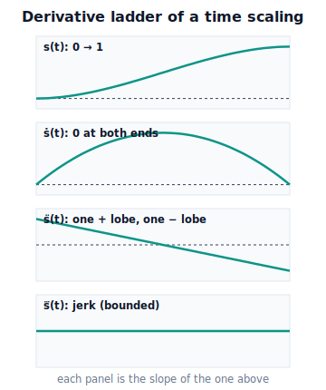

!!! abstract "You are here"
    **Module 7 — Trajectory Generation and Motion Planning**  ·  **Unit 2 — Time Parameterization and Smoothness**  ·  **Lesson 2.1 — Position, Velocity, Acceleration, Jerk**

# Lesson 2.1 — Position, Velocity, Acceleration, Jerk

> Unit 1 said a trajectory is "a path plus a clock." Unit 2 makes the clock mathematical. Here we differentiate $q(t)=q(s(t))$ and discover that **all of motion quality lives in the time scaling $s(t)$** — and that jerk is the deepest knob we will turn.

---

## 1. Why This Matters
We claimed in Lesson 1.2 that the *same path* gives gentle or violent motion depending on the timing $s(t)$. That was a picture; now we prove it and make it computable. When we differentiate the trajectory, every derivative splits cleanly into a **geometry** part (fixed by the path) and a **timing** part (chosen by us). That split is the engineering lever: to make a motion smooth on a fixed route, we shape $s(t)$.

It also tells us *what to shape for*. Comfort and hardware life are governed not by position, nor even by acceleration alone, but by **jerk** — the rate at which acceleration changes. The lurch you feel in a badly driven car is a jerk spike. By the end of this lesson you will know precisely which derivative of $s(t)$ you must keep tame to keep the harvester gentle.

## 2. Physical Intuition
Drive a car along a fixed road (the path). Your speed over time (the timing) determines everything you feel:

- **Position** — where you are on the road. Always continuous; you can't teleport.
- **Velocity** — your speed. Jumps in velocity would mean an instant change of speed — impossible smoothly.
- **Acceleration** — how hard the seat pushes you. You feel this as a steady press in a turn or under the gas.
- **Jerk** — how *suddenly* that press changes. Ease onto the brake and the press grows gently (low jerk); stamp it and the press slams on (high jerk) — that's the lurch, the head-snap, the spilled coffee.

Two drivers on the *identical road* can give utterly different rides purely by how they manage speed over time. The road is the path; the ride is the trajectory; the lurch is jerk. For the harvester carrying a tomato, low jerk is exactly "no lurch, no bruise."

## 3. Mathematical Foundations
A trajectory is the **composition** of a path $q(s)$ with a **time scaling** $s(t)$, where $s:[0,T]\to[0,1]$ with $s(0)=0,\ s(T)=1$:

$$q(t) = q\big(s(t)\big).$$

Differentiate with the **chain rule**. Write $q' = \tfrac{dq}{ds}$, $q'' = \tfrac{d^2q}{ds^2}$, $q''' = \tfrac{d^3q}{ds^3}$ for *geometry* derivatives, and $\dot s,\ddot s,\dddot s$ for *timing* derivatives.

**Velocity:**

$$\boxed{\ \dot q(t) = q'(s)\,\dot s\ }$$

— the geometric direction $q'(s)$ scaled by how fast we move along the path, $\dot s$.

**Acceleration** (product rule on the above):

$$\boxed{\ \ddot q(t) = q'(s)\,\ddot s + q''(s)\,\dot s^2\ }$$

— a *tangential* term ($q'\ddot s$, from changing speed) plus a *curvature* term ($q''\dot s^2$, from the path bending while moving). Even at constant speed ($\ddot s=0$), a curved path produces acceleration.

**Jerk** (differentiate once more):

$$\boxed{\ \dddot q(t) = q'(s)\,\dddot s + 3\,q''(s)\,\dot s\,\ddot s + q'''(s)\,\dot s^3\ }$$

Read the structure, not the clutter: **each derivative of motion mixes geometry ($q',q'',q'''$) with timing ($\dot s,\ddot s,\dddot s$).** On a fixed path the geometry factors are given, so *we control the motion's derivatives entirely through the derivatives of $s(t)$.* That is why "design the timing" means "design $s(t)$ and its derivatives," and why the next lessons build time scalings whose $\dot s,\ddot s,\dddot s$ behave at the endpoints.

A clean special case used constantly: a **straight path in the variable** ($q(s)=q_0+(q_f-q_0)s$, so $q'=q_f-q_0$ constant, $q''=q'''=0$). Then

$$\dot q = (q_f-q_0)\,\dot s,\quad \ddot q=(q_f-q_0)\,\ddot s,\quad \dddot q=(q_f-q_0)\,\dddot s.$$

For such a path, **the motion's velocity/acceleration/jerk are literally $s$'s derivatives, scaled by the displacement.** Smoothness of the move *is* smoothness of $s(t)$.

## 4. Visual Explanation

<figure markdown>
  { width="680" }
</figure>

## 5. Engineering Example
Elevator ride quality is this lesson in a building. The shaft is the path; the elevator's $s(t)$ is the speed schedule. Manufacturers specify **maximum acceleration** (so you don't feel heavy/light) *and* **maximum jerk** (so the onset of that feeling is gentle). A jerk-limited elevator eases into motion — you barely notice departure — because its $s(t)$ has small $\dddot s$. A cheap one with high jerk gives that stomach-drop at start and stop.

The harvester inherits the same spec. We will demand the gripper's $s(t)$ keep acceleration within motor limits (feasibility) *and* keep jerk bounded (smoothness), so a carried tomato never feels a lurch. The math above is exactly how a controller engineer turns "comfortable ride" into a constraint on $s(t)$.

## 6. Worked Example
Take a single joint moving from $q_0=0$ to $q_f=1$ rad along the straight-in-variable path $q(s)=s$, with the smooth cubic time scaling

$$s(t) = 3\tau^2 - 2\tau^3,\qquad \tau = t/T,\quad T=2\ \text{s}.$$

Its derivatives (chain rule, $d\tau/dt=1/T$):

$$\dot s = \frac{6}{T}(\tau-\tau^2),\quad \ddot s = \frac{6}{T^2}(1-2\tau),\quad \dddot s = -\frac{12}{T^3}.$$

Because $q'=1,\ q''=q'''=0$, the motion equals the timing: $\dot q=\dot s,\ \ddot q=\ddot s,\ \dddot q=\dddot s$. Evaluate:

- **At $t=0$ ($\tau=0$):** $\dot q=0$ (starts at rest ✓), $\ddot q = \tfrac{6}{4}= 1.5\ \text{rad/s}^2$ (a **nonzero** acceleration at the very start), $\dddot q=-\tfrac{12}{8}=-1.5\ \text{rad/s}^3$.
- **At $t=1$ ($\tau=0.5$):** $\dot q = \tfrac{6}{2}(0.25)=0.75\ \text{rad/s}$ (peak speed, midpoint), $\ddot q=0$.
- **At $t=2$ ($\tau=1$):** $\dot q=0$ (stops at rest ✓), $\ddot q=-1.5\ \text{rad/s}^2$.

Note the catch we will fix next lesson: the cubic starts and ends **at rest** (good) but with a **nonzero acceleration** at the endpoints — the acceleration *jumps* from $1.5$ at $t=0^+$ down from whatever held the arm at rest before. That jump is a residual jolt. The quintic of Lesson 2.3 zeroes the endpoint acceleration too, removing it.

## 7. Interactive Demonstration

<iframe src="../../demos/module07/lesson05_derivative_ladder.html" title="Position, Velocity, Acceleration, Jerk interactive demo" style="width:100%;height:520px;border:1px solid #e2e8f0;border-radius:12px"></iframe>

[Open this demo in a new tab ↗](../demos/module07/lesson05_derivative_ladder.html)

*(Conceptual — runnable in the companion notebook; the full interactive Profile Shaper is Lesson 2.3.)*

**Build the derivative ladder.** In the notebook you take the cubic $s(t)$ above and:

1. Plot $s,\dot s,\ddot s,\dddot s$ stacked on one time axis (reproducing §4).
2. Confirm visually that $\dot s$ is the slope of $s$, $\ddot s$ the slope of $\dot s$, and so on.
3. Read off the endpoint values and find the nonzero $\ddot s$ at $t=0,T$ that motivates the quintic.

## 8. Coding Exercise

!!! tip "Run the hands-on notebook"
    `modules/module07/notebooks/lesson05_st_and_derivatives.ipynb` — open in JupyterLab and run **Kernel → Restart & Run All**.

*(Snippet / notebook task — uses the engine's `poly_eval`.)*

In the companion notebook:

1. Represent the cubic $s(t)$ by its coefficients and use `poly_eval` to get $s,\dot s,\ddot s,\dddot s$ on a time grid.
2. For a straight-in-variable joint path, form $q(t)=q_0+(q_f-q_0)s(t)$ and its derivatives, and verify numerically (finite differences) that the analytic $\dot q,\ddot q$ match.
3. Print the endpoint accelerations and assert $\dot q(0)=\dot q(T)=0$ while $\ddot q(0)\ne 0$ — the exact gap the quintic will close.

This teaches the chain-rule split in code. It does **not** yet design $s(t)$ to control jerk — that is the quintic and the profiles ahead.

## 9. Knowledge Check

Formative — unlimited attempts, immediate feedback; does not affect your grade.

<iframe src="../../quizzes/module07/lesson05_quiz.html" title="Position, Velocity, Acceleration, Jerk knowledge check" style="width:100%;height:720px;border:1px solid #e2e8f0;border-radius:12px"></iframe>

[Open this quiz in a new tab ↗](../quizzes/module07/lesson05_quiz.html)

1. Write $q(t)$ as a composition and give the chain-rule expressions for $\dot q$ and $\ddot q$.
2. In $\ddot q = q'\ddot s + q''\dot s^2$, which term is present even at constant path speed, and why?
3. Define jerk and explain why it, not acceleration, is the quantity most tied to "feeling a lurch."
4. For a straight-in-variable path, how do $\dot q,\ddot q,\dddot q$ relate to $\dot s,\ddot s,\dddot s$?

## 10. Challenge Problem
A Cartesian path is a circular arc (constant curvature), traversed at **constant path speed** $\dot s=\text{const}$, so $\ddot s=0$. Using $\ddot q = q'\ddot s + q''\dot s^2$, explain why the tool still experiences nonzero acceleration, and in which direction it points. Then argue what happens to that acceleration if you double the path speed, and connect this to why feasibility limits couple the *path's curvature* to the *allowable speed* — a preview of Unit 5's time-scaling.

## 11. Common Mistakes
- **Forgetting the curvature term.** $\ddot q$ is not just $q'\ddot s$; the $q''\dot s^2$ term means a curved path accelerates the tool even at constant speed.
- **Treating jerk as a footnote.** Jerk is the smoothness knob; bounded jerk is what removes the residual jolt that bounded acceleration alone leaves.
- **Confusing $\dot s$ with $\dot q$.** $\dot s$ is the rate of *progress along the path* (unitless/time); $\dot q$ is the actual joint/tool velocity. They coincide only up to the geometry factor.
- **Assuming "at rest" means "no acceleration."** A cubic starts at rest ($\dot q=0$) yet with nonzero $\ddot q$ — velocity zero, acceleration not. These are independent conditions.

## 12. Key Takeaways
- A trajectory is $q(t)=q(s(t))$: a **path** composed with a **time scaling**.
- Chain rule: $\dot q=q'\dot s$; $\ddot q=q'\ddot s+q''\dot s^2$; $\dddot q=q'\dddot s+3q''\dot s\ddot s+q'''\dot s^3$ — every derivative mixes **geometry** ($q',q'',q'''$) with **timing** ($\dot s,\ddot s,\dddot s$).
- On a fixed path the geometry is given, so **motion quality is controlled entirely through $s(t)$** and its derivatives.
- **Jerk** $\dddot q$ is the deepest smoothness knob; a cubic $s(t)$ starts/ends at rest but leaves nonzero endpoint acceleration — the gap the quintic closes next.

---

### AI Learning Companion

Copy any prompt below into your AI tutor.

- **Tutor (re-explain):** "Re-derive $\dot q=q'\dot s$ and $\ddot q=q'\ddot s+q''\dot s^2$ for me from $q(t)=q(s(t))$, explaining the geometry-vs-timing split and where the curvature term comes from. Then give me one short derivative to do."
- **Practice (generate exercises):** "Give me three problems: differentiate a given path-plus-time-scaling to get velocity, acceleration, and jerk, with the time scaling specified. Include one constant-speed curved path. Withhold solutions until I answer."
- **Explore (connect to the real world):** "Explain where jerk limits are specified in real engineering — elevators, trains, camera gimbals, 3D printers — and what goes wrong without them."

### Global Learning Support

Per-language explanation prompts — use whichever you think best in.

- **English (authoritative):** "Explain how a robot trajectory q(t)=q(s(t)) is differentiated by the chain rule into velocity, acceleration, and jerk, splitting geometry (dq/ds) from timing (ṡ, s̈, s⃛), and why jerk matters, at a robotics-course level."
- **Español:** "Explica cómo se deriva una trayectoria robótica q(t)=q(s(t)) por la regla de la cadena para obtener velocidad, aceleración y jerk, separando geometría (dq/ds) de temporización (ṡ, s̈, s⃛), y por qué importa el jerk, a nivel de curso de robótica."
- **中文（简体）：** "用机器人课程的水平，解释如何用链式法则对机器人轨迹 q(t)=q(s(t)) 求导得到速度、加速度和加加速度（jerk），将几何（dq/ds）与时间（ṡ, s̈, s⃛）分离，以及为什么 jerk 很重要。"
- **Türkçe:** "Bir robot yörüngesi q(t)=q(s(t))'nin zincir kuralıyla hız, ivme ve jerk'e nasıl türevlendiğini, geometriyi (dq/ds) zamanlamadan (ṡ, s̈, s⃛) ayırarak ve jerk'in neden önemli olduğunu robotik dersi düzeyinde açıkla."

---

*Next lesson: 2.2 — Continuity Classes C⁰/C¹/C² and Why Jerk Matters (we formalize the smoothness ladder we keep gesturing at).*
