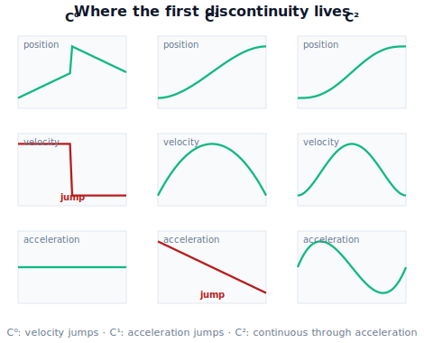

!!! abstract "You are here"
    **Module 7 — Trajectory Generation and Motion Planning**  ·  **Unit 2 — Time Parameterization and Smoothness**  ·  **Lesson 2.2 — Continuity Classes C⁰/C¹/C² and Why Jerk Matters**

# Lesson 2.2 — Continuity Classes C⁰/C¹/C² and Why Jerk Matters

> Lesson 2.1 gave us velocity, acceleration, and jerk. This lesson grades a motion by **how many of those are continuous**, turns the loose word "smooth" into the ladder $C^0\!<\!C^1\!<\!C^2$, and explains why $C^2$ plus bounded jerk is the harvester's target.

---

## 1. Why This Matters
We keep saying "smooth," but engineers need a *measurable* smoothness so they can specify it, generate it, and check it. The right measure is **continuity class**: how many time-derivatives of the motion are continuous (no jumps). It directly predicts what the hardware feels.

The punchline you will earn: a discontinuity in **acceleration** is a discontinuity in **force** (because force is mass times acceleration), and a force that switches on instantly is a *shock* — it hammers gear teeth, excites vibration, and bruises a carried tomato. Demanding $C^2$ continuity (continuous acceleration) eliminates those shocks; bounding **jerk** on top removes the residual "onset" jolt. This is the precise reason every trajectory method to come — cubics, quintics, S-curves — is judged by the continuity class it delivers.

## 2. Physical Intuition
Ride three trains on the same track between two stations:

- **Train A** stops by slamming from full speed to zero instantly. Impossible physically, but it's what a $C^0$-only "position-continuous" plan implies: position never teleports, yet velocity could change in zero time. You'd be thrown into the seat in front.
- **Train B** decelerates at a *constant* rate, then the brakes release the instant it stops. Velocity is now continuous ($C^1$) — no infinite throw — but the braking force switches off in an instant, so you feel a distinct *clunk* at the moment of stopping: acceleration jumped.
- **Train C** eases the braking force on and off gradually. Acceleration is continuous ($C^2$) and its onset is gentle (bounded jerk). You barely notice arriving.

You have ridden all three. The difference you *feel* is exactly continuity class: $C^0$ = violent, $C^1$ = clunky at the corners, $C^2$ + bounded jerk = smooth. The harvester carrying fruit wants Train C.

## 3. Mathematical Foundations
A motion $q(t)$ is of **continuity class $C^k$** on an interval if $q$ and its first $k$ time-derivatives all exist and are **continuous** there (no jumps). The ladder we care about:

- **$C^0$** — $q(t)$ continuous. Position never jumps. But $\dot q$ may be discontinuous: the velocity can change instantaneously (a "corner" in the position curve). *Implication:* infinite acceleration at corners — physically a violent impulse.
- **$C^1$** — $q,\dot q$ continuous. No velocity jumps. But $\ddot q$ may jump: acceleration (hence force) can switch instantly. *Implication:* finite but **discontinuous** force — a shock load at each jump.
- **$C^2$** — $q,\dot q,\ddot q$ continuous. **Acceleration is continuous**, so **force is continuous** — no shock loads. This is the standard target for trajectories that carry delicate payloads or protect drivetrains.

**Why $C^2$ is the line in the sand.** With a (locally) rigid payload of effective mass $m$, the force is $F=m\,\ddot q$ (a Newtonian statement of proportionality — we are *not* doing dynamics, just using $F\propto\ddot q$). If $\ddot q$ jumps by $\Delta a$ at some instant, $F$ jumps by $m\,\Delta a$ instantly — a step in force, i.e. a shock. $C^2$ forbids exactly that step.

**Beyond $C^2$: bounded jerk.** Even a $C^2$ motion can ramp acceleration up *quickly* — large but finite jerk $\dddot q$. Jerk is the *rate of change of force*. A large jerk is a fast onset of force: the residual "snap" you feel even when nothing is technically discontinuous. So good trajectory specs say two things:

$$\text{(i) } q\in C^2 \quad\text{(no force jumps)}\qquad\text{and}\qquad \text{(ii) } |\dddot q|\le \dddot q^{\max}\quad\text{(gentle force onset).}$$

These are different requirements: $C^2$ is *qualitative* (continuity); the jerk bound is *quantitative* (magnitude). A motion can be $C^2$ yet have huge jerk; bounding jerk is the finishing constraint.

> **Where the classes come from in practice.** A *cubic* time scaling makes a point-to-point move $C^1$ at the join to rest (zero endpoint velocity) but leaves an acceleration jump → not $C^2$. A *quintic* zeros endpoint acceleration too → $C^2$. A *trapezoidal* velocity profile is $C^1$ (corners in acceleration); an *S-curve* bounds jerk → effectively $C^2$. Lessons 2.3–2.4 build exactly these.

## 4. Visual Explanation

<figure markdown>
  { width="680" }
</figure>

## 5. Engineering Example
A CNC machine cutting a part follows a toolpath; its motion planner is rated by continuity class for a concrete reason. A $C^1$ (trapezoidal) plan leaves acceleration steps at every segment join. At speed, those steps excite the machine's structural resonances — you *see* the result as faint ripples (chatter marks) on the cut surface and *hear* it as a buzz. Upgrading to a jerk-limited ($C^2$ + bounded jerk) planner smooths the acceleration onset, the resonances stay un-excited, and the surface finish improves with no change to the cutter or the geometry — purely a continuity-class upgrade in the *timing*.

The harvester's analog: a $C^1$ plan would let the wrist's acceleration step each time a segment changes, shaking loosely-held fruit and fatiguing the wrist gears. A $C^2$, jerk-bounded plan keeps the produce still and the gears happy.

## 6. Worked Example
Classify three point-to-point joint moves from $0$ to $1$ rad over $T=2$ s by inspecting endpoint derivatives.

1. **Linear-in-time** $q(t)=t/2$: $\dot q=0.5$ for $0<t<2$, but $\dot q=0$ before and after the move. So $\dot q$ **jumps** at the ends → only $C^0$. (Infinite acceleration at start/stop.)
2. **Cubic** $q(t)=3\tau^2-2\tau^3,\ \tau=t/2$: endpoints have $\dot q=0$ (continuous with rest) but $\ddot q(0)=1.5,\ \ddot q(2)=-1.5\ne 0$ → acceleration **jumps** from $0$ (at rest) to $\pm1.5$ → $C^1$ but not $C^2$.
3. **Quintic** $q(t)=10\tau^3-15\tau^4+6\tau^5$: endpoints have $\dot q=0$ *and* $\ddot q=0$ → acceleration continuous with rest → $C^2$.

So the ladder is literally: linear $\to C^0$, cubic $\to C^1$, quintic $\to C^2$. Each added boundary condition (zero velocity, then zero acceleration) buys one more rung of continuity. This is the design rule the next lesson turns into a tool.

## 7. Interactive Demonstration
*(Conceptual — runnable in the companion notebook; full interactive in 2.3.)*

**Read the class off the plots.** The notebook draws position/velocity/acceleration for the linear, cubic, and quintic moves above and asks you, before revealing labels, to locate the *first* discontinuity in each. You should find: velocity-jump for linear ($C^0$), acceleration-jump for cubic ($C^1$), and no jump through acceleration for quintic ($C^2$). It then overlays jerk to show the quintic's jerk is bounded while the cubic's has a step.

## 8. Coding Exercise

!!! tip "Run the hands-on notebook"
    `modules/module07/notebooks/lesson06_continuity_classes_and_jerk.ipynb` — open in JupyterLab and run **Kernel → Restart & Run All**.

*(Snippet / notebook task — uses the engine's `poly_eval`.)*

In the companion notebook:

1. Build the linear, cubic ($3\tau^2-2\tau^3$), and quintic ($10\tau^3-15\tau^4+6\tau^5$) moves over $[0,T]$.
2. Sample velocity and acceleration *just inside both endpoints* and compare to the rest value (0). Programmatically classify: $C^0$ if velocity differs from 0 at the ends, $C^1$ if velocity matches but acceleration doesn't, $C^2$ if both match.
3. Assert the classifier returns $C^0$, $C^1$, $C^2$ respectively — turning "continuity class" into a runnable check (a seed for Unit 7 validation).

## 9. Knowledge Check

Formative — unlimited attempts, immediate feedback; does not affect your grade.

<iframe src="../../quizzes/module07/lesson06_quiz.html" title="Continuity Classes C⁰/C¹/C² and Why Jerk Matters knowledge check" style="width:100%;height:720px;border:1px solid #e2e8f0;border-radius:12px"></iframe>

[Open this quiz in a new tab ↗](../quizzes/module07/lesson06_quiz.html)

1. Define $C^0$, $C^1$, $C^2$ in terms of which derivatives are continuous.
2. Why does $C^2$ continuity mean *no shock loads*? Use the relationship between force and acceleration.
3. Give a motion that is $C^2$ but still feels abrupt, and say which quantity is to blame.
4. A point-to-point move starts and ends at rest but its acceleration jumps at the endpoints. What is its continuity class?

## 10. Challenge Problem
Two segments are joined at a via-point: segment 1 ends with velocity $v^-$ and acceleration $a^-$; segment 2 begins with $v^+$ and $a^+$. State the conditions on $(v^-,a^-)$ vs $(v^+,a^+)$ for the joined motion to be $C^1$ and for it to be $C^2$ at the join. Then explain why a naive "stop at every via-point" plan is automatically $C^1$ there but wasteful, and what you'd match instead to keep $C^2$ continuity *without* stopping. *(This is exactly the via-point blending problem of Unit 3 — reason it out qualitatively now.)*

## 11. Common Mistakes
- **Equating "continuous" with "smooth."** $C^0$ is continuous yet can be violent (velocity jumps). Smoothness is about *how many* derivatives are continuous.
- **Stopping at $C^2$ and ignoring jerk.** $C^2$ removes force *jumps* but not fast force *onset*; bounded jerk is the separate, finishing requirement.
- **Thinking zero endpoint velocity implies $C^2$.** It gives $C^1$ at the join to rest; you also need zero endpoint acceleration for $C^2$ (the cubic vs quintic distinction).
- **Checking continuity only at via-points.** Discontinuities can appear anywhere a segment or profile changes; sample throughout.

## 12. Key Takeaways
- **Continuity class** counts how many derivatives are continuous: $C^0$ (position) $< C^1$ (velocity) $< C^2$ (acceleration).
- **$C^2$ ⇒ continuous force ⇒ no shock loads**, because force tracks acceleration; this is the standard target for delicate payloads and drivetrain health.
- **Bounded jerk** is a *separate, quantitative* requirement on top of $C^2$: it gentles the *onset* of force (no residual snap).
- The trajectory ladder maps to the continuity ladder: **linear → $C^0$, cubic → $C^1$, quintic → $C^2$**, and S-curves add a jerk bound — the tools of Lessons 2.3–2.4.

---

### AI Learning Companion

Copy any prompt below into your AI tutor.

- **Tutor (re-explain):** "Re-explain continuity classes C0/C1/C2 with the three-trains analogy, and why C2 means no force jumps. Then show me three position curves and ask me to name each class."
- **Practice (generate exercises):** "Give me five short motions (formulas or descriptions) and ask me to classify each as C0, C1, or C2, plus whether jerk is bounded. Reveal answers after I respond."
- **Explore (connect to the real world):** "Where is continuity class or jerk-limiting specified in real products — elevators, trains, CNC machines, 3D printers, camera gimbals — and what defect appears when it's too low?"

### Global Learning Support

Per-language explanation prompts — use whichever you think best in.

- **English (authoritative):** "Explain continuity classes C0, C1, C2 for robot motion, why C2 continuity means no force jumps (shock loads), and how bounded jerk differs from C2, at a robotics-course level."
- **Español:** "Explica las clases de continuidad C0, C1, C2 del movimiento robótico, por qué la continuidad C2 implica que no hay saltos de fuerza (cargas de choque), y en qué se diferencia el jerk acotado de C2, a nivel de curso de robótica."
- **中文（简体）：** "用机器人课程的水平，解释机器人运动的连续性等级 C0、C1、C2，为什么 C2 连续意味着没有力的跳变（冲击载荷），以及有界 jerk 与 C2 的区别。"
- **Türkçe:** "Robot hareketi için C0, C1, C2 süreklilik sınıflarını, C2 sürekliliğinin neden kuvvet sıçraması (şok yük) olmaması anlamına geldiğini ve sınırlı jerk'in C2'den farkını robotik dersi düzeyinde açıkla."

---

*Next lesson: 2.3 — Polynomial Time Scaling: Cubic vs Quintic Profile Shaper (a flagship interactive demo where you watch the quintic erase the acceleration jump).*
