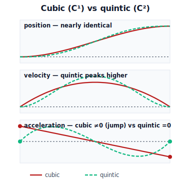

!!! abstract "You are here"
    **Module 7 — Trajectory Generation and Motion Planning**  ·  **Unit 2 — Time Parameterization and Smoothness**  ·  **Lesson 2.3 — Polynomial Time Scaling: Cubic vs Quintic**

# Lesson 2.3 — Polynomial Time Scaling: Cubic vs Quintic

> Lessons 2.1–2.2 told us *what* smoothness means. This lesson builds the first real *tool* to produce it: a polynomial time scaling. We derive the cubic and the quintic, and the lesson's flagship interactive lets you watch the quintic erase the acceleration jump the cubic leaves behind.

---

## 1. Why This Matters
The most common motion a robot makes is point-to-point: from rest at a start configuration to rest at a goal, once, smoothly. We need a recipe that takes "start, goal, duration" and returns a time scaling $s(t)$ with the smoothness we specified. **Polynomials are that recipe**, and the reason is elegant: a polynomial of the right degree has exactly enough free coefficients to satisfy exactly the boundary conditions we care about — start/end position, velocity, acceleration.

This lesson is where the abstract continuity ladder becomes a button you can press. A **cubic** buys $C^1$ (smooth start/stop from rest); a **quintic** buys $C^2$ (no acceleration jump). The interactive Profile Shaper makes the difference visible: toggle cubic↔quintic and watch the acceleration curve's endpoint jump appear and vanish. After this, "use a quintic for a gentle point-to-point move" is something you'll *feel*, not just recite.

## 2. Physical Intuition
You set boundary conditions on a move without thinking. Telling someone "start from a standstill, end at a standstill" fixes the *velocity* at both ends to zero. Adding "and don't jerk into it or out of it" fixes the *acceleration* at both ends to zero too. Each extra wish pins down one more thing about the motion's endpoints.

A polynomial honors wishes in exactly this way: each boundary condition consumes one coefficient. A line (2 coefficients) can only match start and end *position*. A cubic (4 coefficients) can also match start and end *velocity* — enough to start and stop from rest. A quintic (6 coefficients) can additionally match start and end *acceleration* — enough to start and stop with zero acceleration, i.e. no jolt at the ends. **Higher degree = more endpoint wishes granted = higher continuity.** That's the whole idea; the algebra just bookkeeps it.

## 3. Mathematical Foundations
We design $s(t)$ on $[0,T]$ with $s(0)=0,\ s(T)=1$ (we scale the path with it; for a straight-in-variable joint move the joint's own polynomial is identical up to the displacement factor).

**Cubic — match position and velocity at both ends (4 conditions, 4 coefficients).**

$$s(t)=a_0+a_1 t+a_2 t^2+a_3 t^3.$$

Impose $s(0)=0,\ \dot s(0)=0,\ s(T)=1,\ \dot s(T)=0$. Solving:

$$a_0=0,\quad a_1=0,\quad a_2=\frac{3}{T^2},\quad a_3=-\frac{2}{T^3}\ \Rightarrow\ s(t)=3\Big(\tfrac{t}{T}\Big)^2-2\Big(\tfrac{t}{T}\Big)^3.$$

This starts and ends **at rest** ($\dot s=0$): $C^1$. But its acceleration at the ends is

$$\ddot s(0)=\frac{6}{T^2}\ne 0,\qquad \ddot s(T)=-\frac{6}{T^2}\ne 0,$$

so acceleration **jumps** from the resting $0$ to $\pm 6/T^2$ at the endpoints — **not** $C^2$.

**Quintic — also match acceleration at both ends (6 conditions, 6 coefficients).**

$$s(t)=\sum_{k=0}^{5} c_k t^k,$$

imposing $s,\dot s,\ddot s$ at $t=0$ ($=0,0,0$) and at $t=T$ ($=1,0,0$). Solving (the normalized form):

$$s(t)=10\Big(\tfrac{t}{T}\Big)^3-15\Big(\tfrac{t}{T}\Big)^4+6\Big(\tfrac{t}{T}\Big)^5.$$

Now $\ddot s(0)=\ddot s(T)=0$: acceleration is **continuous** with the resting state → $C^2$. The price is a slightly higher *peak* velocity and acceleration in the middle (a quintic must "make up" for its gentle ends), but the endpoint jolt is gone.

**General endpoint conditions.** For arbitrary boundary velocities/accelerations (needed for via-points in Unit 3), the coefficients come from solving the same linear system. The engine exposes this as `cubic_coeffs(q0,qf,v0,vf,T)` and `quintic_coeffs(q0,qf,v0,vf,a0,af,T)`; here both endpoints rest, so $v_0=v_f=0$ (and $a_0=a_f=0$ for the quintic).

**The design rule, crisply:** *one more matched derivative at each end = one higher continuity class = degree up by two.* Cubic → $C^1$; quintic → $C^2$; (septic → $C^3$, bounding endpoint jerk, rarely needed).

## 4. Visual Explanation

<figure markdown>
  { width="680" }
</figure>

## 5. Engineering Example
Robot teach-pendant "move to point" commands almost universally use a quintic (or an equivalent jerk-limited profile) under the hood, precisely for the $C^2$ guarantee. When an operator jogs the harvester to a taught position, the controller fits a quintic from the current resting pose to the target over a chosen time, so the arm departs and arrives with zero acceleration — no clunk at either end, nothing shaken loose. The cubic is still useful when *velocity continuity* suffices and the slightly lower peak speeds matter, but for carrying fruit the quintic's endpoint smoothness is worth its modestly higher mid-move acceleration.

## 6. Worked Example
Move one joint from $q_0=0$ to $q_f=1.2$ rad, at rest at both ends, over $T=1.5$ s. Compare cubic and quintic at the endpoints.

**Cubic** ($s(t)=3\tau^2-2\tau^3,\ \tau=t/T$, then $q=q_0+(q_f-q_0)s$, displacement $\Delta=1.2$):

- $\dot q(0)=\dot q(T)=0$ (rest ✓).
- $\ddot q(0)=\Delta\cdot\dfrac{6}{T^2}=1.2\cdot\dfrac{6}{2.25}=3.2\ \text{rad/s}^2$ — a jump from rest. $\ddot q(T)=-3.2$.

**Quintic** ($s(t)=10\tau^3-15\tau^4+6\tau^5$):

- $\dot q(0)=\dot q(T)=0$ and $\ddot q(0)=\ddot q(T)=0$ (rest *and* no acceleration ✓ — $C^2$).
- Peak speed (at $\tau=0.5$): $\dot q_{\max}=\Delta\cdot\dfrac{15}{8T}=1.2\cdot\dfrac{15}{12}=1.5\ \text{rad/s}$ — slightly higher than the cubic's $\Delta\cdot\dfrac{3}{2T}=1.2$ rad/s, the price of gentler ends.

So for the *same move in the same time*, the quintic trades a ~25% higher peak speed for the removal of a $3.2\ \text{rad/s}^2$ acceleration jump at each end. For delicate fruit, that trade is worth it.

## 7. Interactive Demonstration

<iframe src="../../demos/module07/lesson07_polynomial_profile_shaper.html" title="Polynomial Time Scaling: Cubic vs Quintic interactive demo" style="width:100%;height:520px;border:1px solid #e2e8f0;border-radius:12px"></iframe>

[Open this demo in a new tab ↗](../demos/module07/lesson07_polynomial_profile_shaper.html)

**Use the Profile Shaper (this lesson's demo).** Steps:

1. Start on **cubic**. Look at the acceleration panel: note the nonzero values at $t=0$ and $t=T$ (the jump) and the jerk panel's step.
2. Toggle to **quintic**. Watch the acceleration endpoints drop to zero and the jerk become a smooth pulse — $C^1\to C^2$ in one click.
3. Drag $T$ larger: every curve's peak shrinks (more time = gentler motion). Drag $T$ smaller: peaks grow — the seed of feasibility limits (Unit 5).
4. Keyboard: the toggle and the duration slider are focusable; arrow keys adjust $T$, and the readouts announce the peak acceleration and jerk for screen readers.

The thing to internalize: *the quintic does not change where you go or how long it takes — only the endpoint smoothness.*

## 8. Coding Exercise

!!! tip "Run the hands-on notebook"
    `modules/module07/notebooks/lesson07_cubic_vs_quintic.ipynb` — open in JupyterLab and run **Kernel → Restart & Run All**.

*(Snippet / notebook task — uses `cubic_coeffs`, `quintic_coeffs`, `poly_eval`.)*

In the companion notebook:

1. For a rest-to-rest joint move, compute cubic and quintic coefficients with the engine and evaluate $q,\dot q,\ddot q,\dddot q$ on a time grid.
2. Assert: both give $\dot q(0)=\dot q(T)=0$; the cubic has $\ddot q(0)\ne 0$ while the quintic has $\ddot q(0)=0$ (to tolerance) — a runnable proof of the continuity-class difference.
3. Reproduce the §4 overlay (position/velocity/acceleration, cubic vs quintic) and print the cubic's endpoint acceleration jump and the quintic's higher peak speed.

It deliberately stops at rest-to-rest single moves; chaining through *via-points* with matched derivatives is Unit 3.

## 9. Knowledge Check

Formative — unlimited attempts, immediate feedback; does not affect your grade.

<iframe src="../../quizzes/module07/lesson07_quiz.html" title="Polynomial Time Scaling: Cubic vs Quintic knowledge check" style="width:100%;height:720px;border:1px solid #e2e8f0;border-radius:12px"></iframe>

[Open this quiz in a new tab ↗](../quizzes/module07/lesson07_quiz.html)

1. How many boundary conditions does a cubic satisfy, and which ones? A quintic?
2. Why does the cubic leave an acceleration jump while the quintic does not?
3. What does the quintic "pay" for its $C^2$ endpoints, compared to the cubic over the same move and time?
4. If you needed continuous *jerk* at the endpoints too, what polynomial degree would you reach for, and why?

## 10. Challenge Problem
You must move a joint from rest at $0$ to a *moving handoff*: at $t=T$ the joint should be at $q_f$ **with velocity $v_f\ne 0$ and acceleration $0$** (handing the motion to a following segment that's already cruising). Which polynomial degree do you need, and what are the six boundary conditions? Set up (don't fully solve) the linear system for the coefficients, and explain why "stop at the handoff" would be wrong here. *(This is the via-point matching that makes multi-segment trajectories $C^2$ — Unit 3.)*

## 11. Common Mistakes
- **Using a cubic where $C^2$ is needed.** The cubic's endpoint acceleration jump shock-loads delicate payloads; reach for the quintic when smoothness at the ends matters.
- **Forgetting the quintic's higher peaks.** $C^2$ at the ends raises mid-move velocity/acceleration; check those against limits (Unit 5).
- **Mismatching units of $T$.** The coefficients scale with powers of $T$; a wrong $T$ silently rescales every derivative.
- **Thinking more degree is always better.** Beyond the continuity you need, higher-degree polynomials add wiggle and larger peaks for no benefit. Match the degree to the required continuity.

## 12. Key Takeaways
- A **polynomial time scaling** matches boundary conditions: each matched endpoint derivative consumes one coefficient and buys one rung of continuity.
- **Cubic** (4 conditions) ⇒ matched endpoint *position+velocity* ⇒ $C^1$ (rest-to-rest), but leaves a nonzero endpoint **acceleration jump**.
- **Quintic** (6 conditions) ⇒ also matched endpoint *acceleration* ⇒ $C^2$ (no jump), at the cost of slightly higher mid-move peaks.
- The Profile Shaper makes it visible: toggling cubic→quintic zeros the acceleration endpoints — the same move, same time, gentler ends.

---

### AI Learning Companion

Copy any prompt below into your AI tutor.

- **Tutor (re-explain):** "Re-derive the cubic and quintic time scalings by matching boundary conditions, and explain why the quintic is C2 while the cubic is only C1. Then give me one cubic-coefficient problem to solve."
- **Practice (generate exercises):** "Give me three point-to-point timing problems (start, goal, duration, endpoint conditions). For each, ask whether a cubic or quintic is needed and have me compute the coefficients. Withhold answers until I respond."
- **Explore (connect to the real world):** "Where are quintic/jerk-limited point-to-point moves used — robot teach pendants, pick-and-place, 3D printer travel moves — and what would a cubic's acceleration jump cause in each?"

### Global Learning Support

Per-language explanation prompts — use whichever you think best in.

- **English (authoritative):** "Explain cubic and quintic polynomial time scalings for point-to-point robot motion, how boundary conditions determine the coefficients, and why a quintic gives C2 (no acceleration jump) while a cubic gives only C1, at a robotics-course level."
- **Español:** "Explica las parametrizaciones temporales polinómicas cúbica y quíntica para el movimiento punto a punto de un robot, cómo las condiciones de frontera determinan los coeficientes, y por qué la quíntica da C2 (sin salto de aceleración) mientras la cúbica solo da C1, a nivel de curso de robótica."
- **中文（简体）：** "用机器人课程的水平，解释点到点运动的三次和五次多项式时间参数化，边界条件如何决定系数，以及为什么五次多项式给出 C2（无加速度跳变）而三次只给出 C1。"
- **Türkçe:** "Noktadan noktaya robot hareketi için kübik ve beşinci dereceden polinom zaman parametrelemelerini, sınır koşullarının katsayıları nasıl belirlediğini ve neden beşinci derecenin C2 (ivme sıçraması yok), kübiğin yalnızca C1 verdiğini robotik dersi düzeyinde açıkla."

---

*Next lesson: 2.4 — Trapezoidal vs S-Curve Velocity Profiles (the time-optimal workhorse vs the jerk-limited smooth one), and the Unit 2 recap.*
