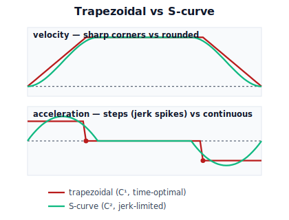

!!! abstract "You are here"
    **Module 7 — Trajectory Generation and Motion Planning**  ·  **Unit 2 — Time Parameterization and Smoothness**  ·  **Lesson 2.4 — Trapezoidal vs S-Curve Velocity Profiles**

# Lesson 2.4 — Trapezoidal vs S-Curve Velocity Profiles

> Polynomials shape a move by its endpoints. Profiles shape it by its **limits**: go as fast and as hard as allowed, no faster. This lesson builds the trapezoidal profile (the industrial workhorse) and the S-curve (its jerk-limited, gentler cousin), then closes Unit 2.

---

## 1. Why This Matters
A quintic is lovely for a single gentle move, but it does not let you say "use *exactly* my motor's top speed and top acceleration, and finish as fast as that allows." Production machines care about throughput, so they want the *fastest* motion that still respects the limits. That motion is the **trapezoidal velocity profile**: slam to top acceleration, coast at top speed, slam to a stop. It is provably time-optimal under velocity and acceleration limits — and it is everywhere in industry.

But "slam" is the word to watch. The trapezoid's acceleration is *piecewise constant*, so it **steps** at the corners — a jerk spike each time. For the harvester carrying fruit, those spikes are the residual jolt Unit 2 has been hunting. The **S-curve** fixes it by rounding the corners: it limits jerk, trading a little time for $C^2$ smoothness. This lesson gives you both tools and the judgement to pick between them — and then recaps the whole timing toolkit.

## 2. Physical Intuition
Drive between two stop signs as quickly as the law allows. The time-optimal plan is brutal but simple: **floor the accelerator** to the speed limit, **hold** the limit, then **stand on the brake** to stop. That is a trapezoid in speed-vs-time: a ramp up, a flat top, a ramp down. Nothing is faster without breaking a limit.

It is also uncomfortable: at the instant you hit and release the pedals, the push on you switches on and off abruptly — a lurch at each corner. A considerate driver instead *squeezes* the pedals: eases onto the gas, eases off, eases onto the brake. The speed graph's sharp corners become rounded **S** shapes. You arrive a hair later, but nobody is thrown around. The harsh version is the **trapezoidal** profile; the squeezed version is the **S-curve**. Same limits, same route — one is time-optimal-but-jerky, the other slightly-slower-but-smooth.

## 3. Mathematical Foundations
**Trapezoidal velocity profile.** Move a distance $D$ under limits $v_{\max}$ (speed) and $a_{\max}$ (acceleration). Three phases:

1. **Accelerate** at $+a_{\max}$ until reaching $v_{\max}$, taking $t_a=v_{\max}/a_{\max}$ and covering $d_a=\tfrac12 a_{\max}t_a^2=\tfrac{v_{\max}^2}{2a_{\max}}$.
2. **Coast** at $v_{\max}$ for the remaining distance $D-2d_a$, taking $t_c=(D-2d_a)/v_{\max}$.
3. **Decelerate** at $-a_{\max}$ symmetrically, taking $t_a$ again.

Total time $T=2t_a+t_c$. If $D<2d_a$ the profile never reaches $v_{\max}$ — it becomes **triangular** (accelerate to a peak $v_{\text{pk}}=\sqrt{a_{\max}D}$, then decelerate), with $T=2\sqrt{D/a_{\max}}$.

The velocity graph is a trapezoid (or triangle); the **acceleration** is the piecewise-constant sequence $+a_{\max},\,0,\,-a_{\max}$. That sequence **jumps** at the phase boundaries: $\ddot q$ is discontinuous, so the motion is $C^1$ but **not** $C^2$, and the jerk is a train of impulses (spikes) at the corners. Among all profiles obeying the two limits, the trapezoid is **time-optimal** — you cannot finish sooner without exceeding $v_{\max}$ or $a_{\max}$.

**S-curve (jerk-limited) profile.** Introduce a third limit, $j_{\max}$ (jerk). Now acceleration is not allowed to step; it must *ramp* at rate $\le j_{\max}$. The result has up to **seven** phases — jerk takes the values $+j_{\max},0,-j_{\max}$ on the way up to cruise and mirror-image on the way down — so acceleration rises and falls in trapezoids of its own and is **continuous**. The velocity curve's sharp corners become smooth S-shapes (hence the name). This is $C^2$ with bounded jerk: no force jumps, gentle onset. The cost is time: the jerk-limited ramps take longer than instantaneous steps, so $T_{\text{S-curve}}>T_{\text{trapezoid}}$ for the same $v_{\max},a_{\max}$ — usually by a small margin set by $j_{\max}$.

**How the three tools compare.**

| Method | Continuity | Optimizes | Best for |
|---|---|---|---|
| Cubic | $C^1$ | endpoint match | simple rest-to-rest, velocity continuity |
| Quintic | $C^2$ | endpoint match | gentle rest-to-rest, no endpoint jolt |
| Trapezoidal | $C^1$ | **time** (given $v,a$ limits) | throughput; tolerant payloads |
| S-curve | $C^2$ (bounded jerk) | time **subject to** jerk limit | fast *and* gentle; delicate payloads |

The engine exposes `trapezoidal_profile(dist, v_max, a_max)` and `s_curve_profile(dist, v_max, a_max, j_max)`, returning sampled $t,s,v,a$ (and jerk for the S-curve).

## 4. Visual Explanation

<figure markdown>
  { width="680" }
</figure>

## 5. Engineering Example
Open the motion-config page of almost any industrial servo drive or 3D printer firmware and you will find exactly these knobs: **max velocity**, **max acceleration**, and **jerk** (sometimes called "jerk limit" or, in some printer firmware, the older "jerk"/"junction deviation" setting). Set jerk very high and the drive runs an effectively trapezoidal profile — maximum throughput, but you'll hear and feel the steps as clicks and see ringing artifacts. Lower the jerk and the same move becomes an S-curve — visibly and audibly smoother, marginally slower.

The harvester's controller exposes the same three numbers. For tough produce on a fast line, lean trapezoidal (throughput wins). For ripe, bruise-prone fruit, dial in a jerk limit and run S-curves (gentleness wins). The math above is what those three sliders actually do.

## 6. Worked Example
Move the gripper $D=0.5$ m with $v_{\max}=0.4$ m/s and $a_{\max}=1.0$ m/s².

**Trapezoidal:**

- $t_a=v_{\max}/a_{\max}=0.4/1.0=0.4$ s; $d_a=\tfrac{v_{\max}^2}{2a_{\max}}=\tfrac{0.16}{2}=0.08$ m.
- $2d_a=0.16$ m $<0.5$ m, so it *does* reach cruise. Coast distance $=0.5-0.16=0.34$ m; $t_c=0.34/0.4=0.85$ s.
- **Total $T=2(0.4)+0.85=1.65$ s.** Acceleration is $+1.0$ for 0.4 s, $0$ for 0.85 s, $-1.0$ for 0.4 s — two jumps of $1.0$ m/s² (jerk spikes).

**S-curve** with $j_{\max}=4$ m/s²/s on the same move: the acceleration must ramp to $1.0$ over $t_j=a_{\max}/j_{\max}=0.25$ s instead of instantly, adding roughly $t_j$ of "rounding" at each corner. The total time rises modestly (to ≈$1.8$–$1.9$ s depending on whether $v_{\max}$ is still reached), the velocity corners round off, and the acceleration is now continuous — no jumps, peak jerk capped at $4$. (The notebook computes the exact $T$ via `s_curve_profile` and confirms $\max|\dddot q|\le j_{\max}$.)

**Reading:** the S-curve cost here is on the order of 10–15% more time to erase two acceleration jumps — usually a bargain for delicate fruit.

## 7. Interactive Demonstration

<iframe src="../../demos/module07/lesson08_trapezoidal_vs_scurve.html" title="Trapezoidal vs S-Curve Velocity Profiles interactive demo" style="width:100%;height:520px;border:1px solid #e2e8f0;border-radius:12px"></iframe>

[Open this demo in a new tab ↗](../demos/module07/lesson08_trapezoidal_vs_scurve.html)

*(Conceptual — runnable in the companion notebook. The interactive Profile Shaper from 2.3 covers polynomials; here the notebook adds the two profiles.)*

**Round the corners.** In the notebook you:

1. Generate the trapezoidal and S-curve profiles for the worked-example move with `trapezoidal_profile` and `s_curve_profile`.
2. Overlay their velocity and acceleration; see the trapezoid's stepped acceleration vs the S-curve's continuous one.
3. Compute peak jerk for each (the trapezoid's is a numerical spike; the S-curve's is bounded by $j_{\max}$) and compare total times.

## 8. Coding Exercise

!!! tip "Run the hands-on notebook"
    `modules/module07/notebooks/lesson08_trapezoidal_vs_scurve.ipynb` — open in JupyterLab and run **Kernel → Restart & Run All**.

*(Snippet / notebook task — uses `trapezoidal_profile`, `s_curve_profile`.)*

In the companion notebook:

1. Call both profile functions for $D=0.5,\ v_{\max}=0.4,\ a_{\max}=1.0$ (and $j_{\max}=4$ for the S-curve).
2. Assert each profile's position reaches $D$ (within tolerance) and respects $|\dot s|\le v_{\max}$, $|\ddot s|\le a_{\max}$.
3. Assert the S-curve's $\max|\dddot q|\le j_{\max}$ while the trapezoid's numerically-estimated jerk is far larger at the corners; and that $T_{\text{S-curve}}\ge T_{\text{trap}}$.

This makes "time-optimal but jerky" vs "slightly slower but smooth" a runnable comparison. It does **not** yet handle *multi-segment* or *multi-joint* timing — that is Unit 3.

## 9. Knowledge Check

Formative — unlimited attempts, immediate feedback; does not affect your grade.

<iframe src="../../quizzes/module07/lesson08_quiz.html" title="Trapezoidal vs S-Curve Velocity Profiles knowledge check" style="width:100%;height:720px;border:1px solid #e2e8f0;border-radius:12px"></iframe>

[Open this quiz in a new tab ↗](../quizzes/module07/lesson08_quiz.html)

1. Name the three phases of a trapezoidal profile and the limit each phase respects.
2. Why is the trapezoidal profile only $C^1$, and where do its jerk spikes occur?
3. What extra limit defines an S-curve, and what continuity does it buy?
4. When the move distance is short, the trapezoid becomes what shape, and why?

## 10. Challenge Problem
A move of distance $D$ must finish in a *fixed* time $T$ (a conveyor hand-off), and you may choose $v_{\max}$ and $a_{\max}$ freely but must keep jerk below $j_{\max}$. Describe how you would pick the profile: would you use a trapezoid or an S-curve, and how would you set the limits so the move lands exactly at $T$ while staying smooth? Discuss the failure mode if the required average speed $D/T$ is so high that even a trapezoid at your $v_{\max}$ can't make it — what must give? *(This previews Unit 5's time-scaling, where we slow a trajectory to *gain* feasibility — here you're going the other way.)*

## 11. Common Mistakes
- **Believing a trapezoid is smooth.** It is time-*optimal*, not smooth; its stepped acceleration spikes jerk. Reach for the S-curve when smoothness matters.
- **Forgetting the triangular case.** For short moves, $v_{\max}$ is never reached; using the trapezoidal formula blindly overestimates the cruise phase.
- **Ignoring the S-curve's time cost.** Bounding jerk lengthens the move; budget for it rather than being surprised.
- **Mixing up the methods' jobs.** Polynomials match *endpoints*; profiles obey *limits*. Use polynomials for gentle point-to-point with specified endpoint derivatives; use profiles when throughput under hardware limits is the goal.

## 12. Key Takeaways
- The **trapezoidal** velocity profile (accelerate at $a_{\max}$, coast at $v_{\max}$, decelerate at $a_{\max}$) is **time-optimal** under speed/acceleration limits but only **$C^1$** — its stepped acceleration spikes jerk at the corners.
- For short moves the trapezoid degenerates to a **triangle** (never reaches $v_{\max}$).
- The **S-curve** adds a **jerk limit**, rounding the corners into a **$C^2$**, bounded-jerk motion for a small time penalty.
- **Unit 2 recap:** a trajectory is $q(t)=q(s(t))$ (2.1); smoothness is graded by continuity class and jerk (2.2); **polynomials** match endpoint conditions — cubic ($C^1$) vs quintic ($C^2$) (2.3); **profiles** obey limits — trapezoidal (time-optimal, $C^1$) vs S-curve ($C^2$, jerk-limited) (2.4). These are the timing tools Unit 3 applies joint-by-joint.

---

### AI Learning Companion

Copy any prompt below into your AI tutor.

- **Tutor (re-explain):** "Re-explain trapezoidal vs S-curve velocity profiles using the two-stop-signs driving analogy. Stress why the trapezoid is time-optimal but jerky and the S-curve is smooth. Then ask me to compute a trapezoid's total time."
- **Practice (generate exercises):** "Give me three trapezoidal-profile problems (distance, v_max, a_max) — include one triangular (short-distance) case — and ask for the phase times and total time. Then ask qualitatively how an S-curve would change each. Withhold answers until I respond."
- **Explore (connect to the real world):** "Show me where max-velocity / max-acceleration / jerk limits appear in real machine configs — servo drives, 3D printers, CNC, elevators — and what symptom each limit controls."

### Global Learning Support

Per-language explanation prompts — use whichever you think best in.

- **English (authoritative):** "Explain trapezoidal and S-curve velocity profiles for robot motion: how the trapezoid is built from v_max and a_max and is time-optimal but only C1, and how an S-curve adds a jerk limit for C2 smoothness, at a robotics-course level."
- **Español:** "Explica los perfiles de velocidad trapezoidal y en S para el movimiento robótico: cómo se construye el trapezoidal a partir de v_max y a_max y es óptimo en tiempo pero solo C1, y cómo el perfil en S añade un límite de jerk para lograr suavidad C2, a nivel de curso de robótica."
- **中文（简体）：** "用机器人课程的水平，解释机器人运动的梯形和 S 曲线速度曲线：梯形如何由 v_max 和 a_max 构成、为何时间最优但只有 C1，以及 S 曲线如何加入 jerk 限制以获得 C2 平滑性。"
- **Türkçe:** "Robot hareketi için yamuk ve S-eğrisi hız profillerini açıkla: yamuğun v_max ve a_max'tan nasıl kurulduğunu ve zaman-optimal ama yalnızca C1 olduğunu, S-eğrisinin C2 pürüzsüzlük için nasıl jerk sınırı eklediğini robotik dersi düzeyinde açıkla."

---

*Next lesson: 3.1 — Point-to-Point Joint Moves: Per-Joint Cubic Polynomials (Unit 3 begins — applying the timing toolkit joint by joint). Installment B.*
