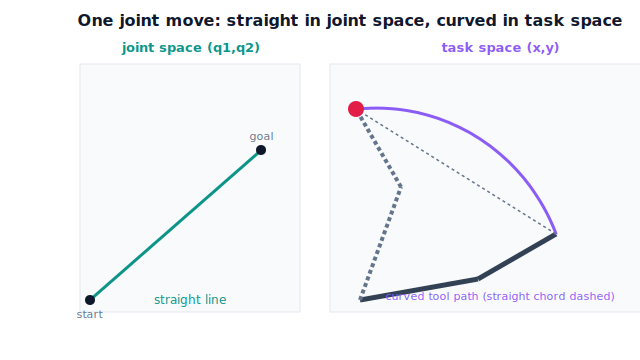

!!! abstract "You are here"
    **Module 7 — Trajectory Generation and Motion Planning**  ·  **Unit 3 — Joint-Space Trajectories**  ·  **Lesson 3.1 — Point-to-Point Joint Moves: Per-Joint Polynomials**

# Lesson 3.1 — Point-to-Point Joint Moves: Per-Joint Polynomials

> Unit 2 gave us a time scaling for **one** number. A robot has several joints. This lesson does the obvious, powerful thing: give **each joint its own** time scaling, all sharing one clock. We start by *watching the motion* — what the arm and the tool actually do — before any new formula.

---

## 1. Why This Matters
The harvester's most common command is "go from this configuration to that one": stow → approach, approach → grasp, grasp → drop. Each is a **point-to-point joint move**. In Module 5 we learned to *find* a goal configuration (IK); in Unit 2 we learned to *time* a single value smoothly. Now we combine them: move every joint from its current angle to its goal angle, smoothly, finishing together.

The joint-space approach is the simplest possible trajectory and it has one big guarantee: because each joint independently runs a smooth, bounded polynomial between two of its own angles, the motion is automatically **feasible in joint space** — no joint is asked to do anything wild. The catch, which we will *see* first, is that the **tool** does not travel in a straight line; it sweeps a curve. That trade — simplicity and joint-feasibility versus tool-path control — is the whole reason Unit 4 (Cartesian motion) exists.

## 2. Physical Intuition
Watch the arm, not the equations. Two joints, each told "start at your angle, end at your goal, take 1.5 s, ease in and out." Press play: both joints rotate smoothly and stop together. Nothing about either joint's motion is surprising — each is a gentle Unit-2 move.

Now watch the **gripper tip** instead of the joints. It does *not* slide straight from start to goal. It bows out along a curve, because the tip's position is a nonlinear (sine/cosine) function of the joint angles. Two smooth joint motions compose into a curved tool path. This is the key picture of the whole unit: **joint-space motion is smooth in the joints and curved in space.** For "get from here to there without hitting anything specific," that curve is fine — and the method is dead simple. When the curve matters (slide along a stem, keep clear of a wire), we will switch to Cartesian planning in Unit 4.

## 3. Mathematical Foundations
Let the arm have $n$ joints with start configuration $\mathbf q_0$ and goal $\mathbf q_f$. A **joint-space point-to-point trajectory** gives each joint $i$ its own time scaling on a **common** duration $[0,T]$:

$$q_i(t) = q_{0,i} + (q_{f,i}-q_{0,i})\,s(t),\qquad s(0)=0,\ s(T)=1,$$

where $s(t)$ is a Unit-2 scaling — a **cubic** ($C^1$, zero endpoint velocity) or a **quintic** ($C^2$, zero endpoint velocity *and* acceleration). Every joint shares the same $s(t)$ shape, so they start together, finish together, and (with a quintic) all begin and end with zero velocity and acceleration.

Equivalently, in vector form,

$$\mathbf q(t) = \mathbf q_0 + (\mathbf q_f - \mathbf q_0)\,s(t).$$

The tool path is then $\mathbf p(t) = f\big(\mathbf q(t)\big)$, where $f$ is the forward kinematics. Because $f$ is nonlinear, even though $\mathbf q(t)$ is a straight line in *joint* space, $\mathbf p(t)$ is a **curve** in *task* space. That single fact — straight in joints, curved in space — is what to remember.

**Feasibility, for free (almost).** Each joint's velocity and acceleration are the scalar profile's, scaled by that joint's displacement $\Delta q_i = q_{f,i}-q_{0,i}$. So peak joint speed is $\dot q_{i,\max}=|\Delta q_i|\cdot \dot s_{\max}$ and peak joint acceleration is $|\Delta q_i|\cdot \ddot s_{\max}$. The joint with the largest displacement has the largest peaks — which matters the moment we add limits (Unit 5) and synchronize joints (next lesson).

The engine builds these with `joint_traj(q0, qf, T, kind)` and samples them with `sample_joint_traj(coeffs, T)`.

## 4. Visual Explanation

<figure markdown>
  { width="680" }
</figure>

## 5. Engineering Example
Almost every industrial robot's default "MoveJ" (joint move) command is exactly this: each joint runs a synchronized polynomial/jerk-limited profile from current to target angle. Operators reach for MoveJ because it is fast, robust, and never fails for kinematic reasons — there is no IK to solve mid-motion, no risk of the tool path leaving the workspace, and the joints simply cannot be commanded past their own smooth interpolation. The harvester uses joint moves for its big repositioning swings (stow ↔ a new plant), where the tool's exact path through the air is irrelevant and speed and reliability win. It switches to Cartesian moves (Unit 4) only for the final approach, where the tool path must be controlled.

## 6. Worked Example
Move a 2-joint arm from $\mathbf q_0=(10^\circ, 20^\circ)$ to $\mathbf q_f=(70^\circ, 50^\circ)$ over $T=1.5$ s with a **quintic** each.

- Displacements: $\Delta q_1 = 60^\circ = 1.047$ rad, $\Delta q_2 = 30^\circ = 0.524$ rad.
- Each joint: $q_i(t)=q_{0,i}+\Delta q_i\,(10\tau^3-15\tau^4+6\tau^5)$, $\tau=t/T$. Both start and end at rest with zero endpoint acceleration ($C^2$).
- Peak speeds (at $\tau=0.5$, where $\dot s_{\max}=15/(8T)=1.25\ \text{s}^{-1}$): joint 1 reaches $1.047\times1.25=1.31$ rad/s; joint 2 reaches $0.524\times1.25=0.65$ rad/s. **Joint 1 moves twice as fast** because it travels twice as far in the same time — a fact we will need next lesson when limits enter.
- The tool path from $f(\mathbf q(t))$ (with $L_1=0.4,L_2=0.3$) bows outward; the notebook plots it and confirms it is **not** straight.

## 7. Interactive Demonstration
*(Conceptual — runnable in the companion notebook.)*

**Straight in joints, curved in space.** In the notebook you:

1. Build the per-joint quintic with `joint_traj` and sample it.
2. Plot the joint path in the $(q_1,q_2)$ plane (a straight line) and the tool path in $(x,y)$ (a curve) side by side.
3. Confirm both joints start/end at rest with zero acceleration, and measure how far the curved tool path deviates from the straight line between start and goal tool positions.

## 8. Coding Exercise

!!! tip "Run the hands-on notebook"
    `modules/module07/notebooks/lesson09_point_to_point_joint_moves.ipynb` — open in JupyterLab and run **Kernel → Restart & Run All**.

*(Snippet / notebook task — uses `joint_traj`, `sample_joint_traj`, `fk_xy`.)*

In the companion notebook:

1. Build a per-joint quintic move for the worked example.
2. Assert each joint starts and ends at rest with zero endpoint acceleration, and that the configuration reaches $\mathbf q_f$ at $t=T$.
3. Compute the tool path with `fk_xy` and assert its maximum perpendicular deviation from the straight start→goal tool segment is **nonzero** (the path is genuinely curved). This makes "curved in space" a runnable fact and motivates Unit 4.

## 9. Knowledge Check

Formative — unlimited attempts, immediate feedback; does not affect your grade.

<iframe src="../../quizzes/module07/lesson09_quiz.html" title="Point-to-Point Joint Moves: Per-Joint Polynomials knowledge check" style="width:100%;height:720px;border:1px solid #e2e8f0;border-radius:12px"></iframe>

[Open this quiz in a new tab ↗](../quizzes/module07/lesson09_quiz.html)

1. In a joint-space point-to-point move, what plays the role of $s(t)$, and what does each joint do?
2. Why is the tool path curved even though the joint path is straight?
3. Two joints share a quintic over the same $T$. Which has the higher peak speed, and why?
4. Give one situation where a joint move is the right choice and one where it is not.

## 10. Challenge Problem
A two-joint move has $\Delta q_1 = 90^\circ$ and $\Delta q_2 = 10^\circ$ over $T=1$ s. The joints' velocity limits are equal at $\dot q_{\max}=2$ rad/s. Without synchronizing yet, which joint (if any) violates its limit under a quintic, and by how much? Then state qualitatively what you would change so the move is feasible — and notice that slowing only the offending joint would break the "finish together" property. *(This is the synchronization problem of Lesson 3.2.)*

## 11. Common Mistakes
- **Expecting a straight tool path from a joint move.** Joint moves are straight in *joint* space; the tool sweeps a curve. Use Cartesian planning (Unit 4) when the tool path matters.
- **Letting joints finish at different times.** Use a *common* $T$ and a shared $s(t)$ so the arm arrives as one coordinated motion (next lesson formalizes this).
- **Ignoring the largest-displacement joint.** It sets the peak speeds and accelerations; it is the one that will hit a limit first.
- **Reusing a cubic when $C^2$ ends are needed.** Per-joint, the same cubic-vs-quintic choice from Unit 2 applies to each joint.

## 12. Key Takeaways
- A **joint-space point-to-point** trajectory gives **each joint its own** time scaling on a **shared** duration: $\mathbf q(t)=\mathbf q_0+(\mathbf q_f-\mathbf q_0)\,s(t)$.
- It is the **simplest** trajectory and is automatically **feasible in the joints** (each joint runs a smooth bounded polynomial).
- The **tool path is curved** in task space, because forward kinematics is nonlinear — straight in joints, curved in space.
- The joint with the **largest displacement** has the largest peak speed/acceleration, which drives synchronization (3.2) and feasibility (Unit 5).

---

### AI Learning Companion

Copy any prompt below into your AI tutor.

- **Tutor (re-explain):** "Re-explain joint-space point-to-point moves: each joint gets its own cubic/quintic over a shared duration. Stress why the tool path is curved even though the joint path is straight. Then give me a two-joint move to set up."
- **Practice (generate exercises):** "Give me three joint-space move problems (start config, goal config, duration). Ask me to find each joint's peak speed and identify the fastest joint. Withhold answers until I respond."
- **Explore (connect to the real world):** "Explain when industrial robots use a joint move (MoveJ) vs a linear/Cartesian move (MoveL), and what goes wrong if you pick the wrong one near an obstacle."

### Global Learning Support

Per-language explanation prompts — use whichever you think best in.

- **English (authoritative):** "Explain joint-space point-to-point trajectories for a multi-joint robot: each joint runs its own cubic/quintic over a common duration, why the motion is joint-feasible but traces a curved tool path, at a robotics-course level."
- **Español:** "Explica las trayectorias punto a punto en el espacio de articulaciones para un robot de varias articulaciones: cada articulación ejecuta su propia cúbica/quíntica en una duración común, por qué el movimiento es factible en las articulaciones pero traza una trayectoria curva de la herramienta, a nivel de curso de robótica."
- **中文（简体）：** "用机器人课程的水平，解释多关节机器人的关节空间点到点轨迹：每个关节在共同时长内运行各自的三次/五次多项式，为何运动在关节层面可行但工具末端走的是曲线路径。"
- **Türkçe:** "Çok eklemli bir robot için eklem-uzayı noktadan noktaya yörüngeleri açıkla: her eklem ortak bir sürede kendi kübik/beşinci derece profilini çalıştırır; hareketin neden eklemde uygulanabilir ama aracın eğri bir yol izlediğini robotik dersi düzeyinde anlat."

---

*Next lesson: 3.2 — Synchronizing Multiple Joints (one clock, the slowest joint sets the pace).*
