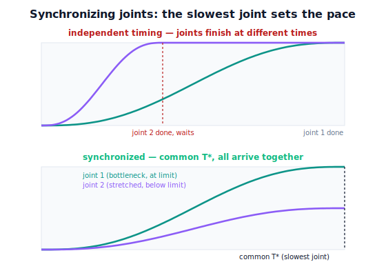

!!! abstract "You are here"
    **Module 7 — Trajectory Generation and Motion Planning**  ·  **Unit 3 — Joint-Space Trajectories**  ·  **Lesson 3.2 — Synchronizing Multiple Joints**

# Lesson 3.2 — Synchronizing Multiple Joints

> Lesson 3.1 gave each joint its own polynomial but quietly shared one duration $T$. This lesson asks: *which* $T$? The answer is a simple, important rule — **the slowest-limited joint sets the pace** — and again we lead by watching what coordinated vs uncoordinated motion looks like.

---

## 1. Why This Matters
If the harvester's joints each finished "as fast as they individually could," they would arrive at different times: the small-displacement joint stops early and waits while the big one is still moving. The tool would lurch along a changing, unpredictable path, and the arm would look — and behave — uncoordinated. Worse, if you simply pick a $T$ that's too short, the largest-displacement joint will be commanded past its velocity or acceleration limit and the move becomes infeasible.

Synchronization fixes both problems with one idea: **give every joint the same clock**, and choose that clock so the *most demanding* joint stays within its limits. Then all joints move in fixed proportion, start together, and arrive together — a single, predictable, coordinated motion. This is the rule every multi-joint point-to-point move follows.

## 2. Physical Intuition
Picture two people walking side by side to a door, wanting to arrive together. One is twice as far away. If each walks "as fast as comfortable," the near one arrives first and stands waiting — uncoordinated. To arrive together, they agree on a single arrival time set by the *farther, slower-limited* person; the near one then strolls slowly to match. Nobody exceeds their comfortable pace, and they reach the door as a pair.

Robot joints do exactly this. Each joint has a top comfortable speed (its limit). Give each the minimum time *it* would need to make its move within that limit; the joint needing the **most** time is the bottleneck. Set the common duration to that maximum, and every faster joint is simply slowed to match. The result: synchronized arrival, all joints within limits, a coordinated sweep instead of a ragged one.

## 3. Mathematical Foundations
For each joint $i$ with displacement $\Delta q_i = q_{f,i}-q_{0,i}$ and a velocity limit $\dot q_{\max}$, the minimum time to make the move under a chosen profile follows from the profile's peak-speed formula. For a **quintic** (peak speed $\dot q_{\max}^{\text{prof}} = \tfrac{15}{8T}|\Delta q_i|$), requiring that peak to stay under the limit gives the per-joint minimum time

$$T_i^{\min} = \frac{15\,|\Delta q_i|}{8\,\dot q_{\max}}.$$

(For a trapezoidal profile you would instead use its distance/limit formula from Lesson 2.4; the principle is identical.) The **synchronizing duration** is the maximum over joints:

$$T^\star = \max_i T_i^{\min}.$$

Then every joint runs its polynomial over the *same* $[0,T^\star]$:

$$q_i(t) = q_{0,i} + \Delta q_i\, s(t),\qquad s:[0,T^\star]\to[0,1].$$

Because all joints share $s(t)$, the configuration moves along the straight joint-space segment $\mathbf q_0\to\mathbf q_f$ at a single normalized rate: $\mathbf q(t)=\mathbf q_0+(\mathbf q_f-\mathbf q_0)s(t)$. The joints are now **coordinated** — their ratios are fixed for all $t$. The bottleneck joint runs exactly at its limit; every other joint runs comfortably below it.

The engine computes the synchronizing duration with `sync_duration(q0, qf, vmax)` and then `joint_traj(q0, qf, T_star, kind)`.

**Independent vs coordinated.** If instead each joint used its *own* $T_i^{\min}$, the joints would finish at different times and $\mathbf q(t)$ would *not* stay on the straight joint-space line — the path through configuration space would bend, and the tool path would change. Synchronization is what keeps the move a single clean segment.

## 4. Visual Explanation

<figure markdown>
  { width="680" }
</figure>

## 5. Engineering Example
On a real controller, this is the difference between "MoveJ" looking smooth and looking broken. A correctly synchronized joint move sweeps the arm as one rigid-looking motion; an unsynchronized one (a bug, or hand-rolled per-joint timing) makes the arm appear to "settle" joint by joint, with the wrist snapping into place after the shoulder has stopped. For the harvester repositioning between plants, synchronization keeps the whole arm moving as a unit, which is both visually reassuring to an operator and mechanically gentler (no joint starts or stops alone, exciting the others). The controller computes $T^\star$ from the joint with the largest limit-normalized displacement and stretches the rest to match.

## 6. Worked Example
Move three joints with displacements $\Delta q = (90^\circ, 30^\circ, 45^\circ) = (1.571, 0.524, 0.785)$ rad, each with $\dot q_{\max}=2$ rad/s, using quintics.

- Per-joint minimum times: $T_i^{\min}=\tfrac{15|\Delta q_i|}{8\cdot 2}=0.9375\,|\Delta q_i|$ → $T_1^{\min}=1.47$ s, $T_2^{\min}=0.49$ s, $T_3^{\min}=0.74$ s.
- **Synchronizing duration:** $T^\star=\max=1.47$ s (joint 1 is the bottleneck).
- Run all three over $[0,1.47]$. Joint 1 peaks exactly at $2$ rad/s; joint 2 peaks at $\tfrac{15\cdot0.524}{8\cdot1.47}=0.67$ rad/s; joint 3 at $1.0$ rad/s — both comfortably below the limit.
- All three start and end at rest with zero acceleration ($C^2$) and arrive together at $t=1.47$ s. The notebook verifies $\max_i \dot q_i \le \dot q_{\max}$ and synchronized arrival.

## 7. Interactive Demonstration
*(Conceptual — runnable in the companion notebook.)*

**Find the bottleneck, stretch the rest.** In the notebook you:

1. Compute each joint's $T_i^{\min}$ and identify the bottleneck.
2. Build the synchronized trajectory over $T^\star$ with `sync_duration` + `joint_traj`.
3. Overlay all joints' speed profiles, mark the $\dot q_{\max}$ line, and confirm only the bottleneck touches it while all arrive together.

## 8. Coding Exercise

!!! tip "Run the hands-on notebook"
    `modules/module07/notebooks/lesson10_synchronizing_multiple_joints.ipynb` — open in JupyterLab and run **Kernel → Restart & Run All**.

*(Snippet / notebook task — uses `sync_duration`, `joint_traj`, `sample_joint_traj`.)*

In the companion notebook:

1. For the worked example, compute $T^\star$ with `sync_duration` and build the synchronized trajectory.
2. Assert every joint's peak speed is $\le \dot q_{\max}$ (within tolerance) and that the bottleneck joint's peak essentially equals $\dot q_{\max}$.
3. Assert all joints reach their goals at the same final time $T^\star$ (synchronized arrival). Then rebuild with each joint on its own $T_i^{\min}$ and show the finish times differ — making "coordinated vs independent" a runnable contrast.

## 9. Knowledge Check

Formative — unlimited attempts, immediate feedback; does not affect your grade.

<iframe src="../../quizzes/module07/lesson10_quiz.html" title="Synchronizing Multiple Joints knowledge check" style="width:100%;height:720px;border:1px solid #e2e8f0;border-radius:12px"></iframe>

[Open this quiz in a new tab ↗](../quizzes/module07/lesson10_quiz.html)

1. Why do multi-joint point-to-point moves use a single common time scaling?
2. How is the synchronizing duration $T^\star$ computed from the individual joints?
3. Which joint runs exactly at its limit after synchronization, and which run below?
4. What property of the motion is lost if each joint instead uses its own minimum time?

## 10. Challenge Problem
A move has $\Delta q = (120^\circ, 20^\circ)$ with **different** per-joint limits: $\dot q_{1,\max}=3$ rad/s, $\dot q_{2,\max}=0.5$ rad/s. Compute each $T_i^{\min}$ and the synchronizing $T^\star$, and identify the bottleneck — note it may *not* be the largest-displacement joint when limits differ. Then add an acceleration limit $\ddot q_{\max}$ and explain how it could change which joint is the bottleneck. *(Acceleration-limited synchronization previews Unit 5 feasibility.)*

## 11. Common Mistakes
- **Picking $T$ arbitrarily.** Too short violates the bottleneck joint's limits; synchronize to $T^\star$ instead.
- **Assuming the largest-displacement joint is always the bottleneck.** With unequal limits, a small-displacement, low-limit joint can dominate.
- **Letting joints run independently.** Independent timing breaks coordinated arrival and bends the configuration-space path.
- **Checking only velocity.** Acceleration (and later jerk) limits can also set the bottleneck; check all active limits.

## 12. Key Takeaways
- Multi-joint moves share **one clock**: all joints run the same $s(t)$ over a common $T^\star$, so the configuration sweeps the straight joint-space segment.
- $T^\star = \max_i T_i^{\min}$ — the **slowest-limited joint sets the pace**; faster joints are stretched to match.
- The bottleneck joint runs at its limit; the others run below it; all **arrive together** (coordinated motion).
- With unequal limits, the bottleneck may not be the largest-displacement joint — compute each $T_i^{\min}$ and take the max.

---

### AI Learning Companion

Copy any prompt below into your AI tutor.

- **Tutor (re-explain):** "Re-explain multi-joint synchronization with the 'walking to a door together' analogy. Stress that the slowest-limited joint sets the common duration. Then give me a three-joint problem to find the bottleneck."
- **Practice (generate exercises):** "Give me three synchronization problems (displacements and per-joint limits). Ask me to compute each joint's minimum time, the synchronizing duration, and the bottleneck. Withhold answers until I respond."
- **Explore (connect to the real world):** "Explain how an industrial robot controller synchronizes joints in a MoveJ command and what an unsynchronized move looks like to an operator."

### Global Learning Support

Per-language explanation prompts — use whichever you think best in.

- **English (authoritative):** "Explain how a multi-joint robot synchronizes a point-to-point move: each joint shares one time scaling over a common duration set by the slowest-limited joint, at a robotics-course level."
- **Español:** "Explica cómo un robot de varias articulaciones sincroniza un movimiento punto a punto: cada articulación comparte una parametrización temporal común cuya duración la fija la articulación más limitada (la más lenta), a nivel de curso de robótica."
- **中文（简体）：** "用机器人课程的水平，解释多关节机器人如何同步一次点到点运动：所有关节共享同一时间参数，公共时长由受限最严（最慢）的关节决定。"
- **Türkçe:** "Çok eklemli bir robotun noktadan noktaya bir hareketi nasıl senkronize ettiğini açıkla: tüm eklemler ortak bir süre üzerinde tek bir zaman ölçeklemesini paylaşır ve bu süreyi en yavaş (en kısıtlı) eklem belirler — robotik dersi düzeyinde."

---

*Next lesson: 3.3 — Via-Points and Multi-Segment Joint Trajectories (passing through intermediate configurations).*
