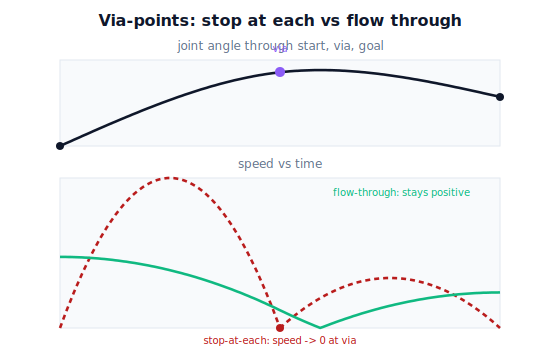

!!! abstract "You are here"
    **Module 7 — Trajectory Generation and Motion Planning**  ·  **Unit 3 — Joint-Space Trajectories**  ·  **Lesson 3.3 — Via-Points and Multi-Segment Joint Trajectories**

# Lesson 3.3 — Via-Points and Multi-Segment Joint Trajectories

> A single point-to-point move goes straight (in joint space) from start to goal. But sometimes you must pass *through* an intermediate configuration — to clear a leaf, to line up an approach. This lesson introduces **via-points** and the multi-segment trajectories that thread them, and — leading with the motion — shows the difference between **stopping at** and **flowing through** each one.

---

## 1. Why This Matters
The harvester often can't go straight from stow to a fruit: a straight joint-space sweep might drag the gripper through the canopy or approach the fruit from the wrong side. The fix is to route the motion **through one or more intermediate configurations** — via-points — chosen so the in-between path stays clear and lines up the final approach. (Where those via-points *come from* — a planner that finds a collision-free route — is Unit 6; here we learn how to *time* a path that already has them.)

The naive way to thread via-points is to chain ordinary point-to-point moves: start → via₁ → via₂ → goal, stopping (coming to rest) at each. It works and it's simple, but the robot pauses at every via-point — slow, and jerky at the seams. The better way flows *through* the via-points without stopping. Seeing that difference — the stuttering stop-and-go versus the continuous glide — is the point of this lesson, and it sets up the blending math of 3.4.

## 2. Physical Intuition
Drive a route with three waypoints. The timid way: drive to waypoint 1, come to a **complete stop**, then drive to waypoint 2, stop, then to the destination. You hit every waypoint exactly, but the trip is slow and every stop is a little lurch. The confident way: **slow down through** each waypoint and carry on without stopping — you still pass through (or very near) each one, but the drive is one continuous, smooth motion.

Robot via-points are waypoints in configuration space. Stop-at-each is the timid drive: a sequence of rest-to-rest moves, exact but stuttering. Flow-through is the confident drive: a single continuous trajectory that passes through the via-points carrying nonzero velocity. This lesson builds the stuttering version (easy, and a useful baseline) and motivates the smooth version; Lesson 3.4 makes flow-through $C^2$.

## 3. Mathematical Foundations
A **via-point** is a configuration $\mathbf q^{(k)}$ the trajectory must pass through at some time $t_k$. Given a sequence $\mathbf q^{(0)},\mathbf q^{(1)},\dots,\mathbf q^{(M)}$ (start, vias, goal) with assigned times $t_0<t_1<\dots<t_M$, a **multi-segment joint trajectory** is a piecewise function $\mathbf q(t)$ that equals each $\mathbf q^{(k)}$ at $t_k$.

**Stop-at-each (rest-to-rest segments).** On each interval $[t_k,t_{k+1}]$ run an independent synchronized point-to-point move from $\mathbf q^{(k)}$ to $\mathbf q^{(k+1)}$ with **zero endpoint velocity** (and, with quintics, zero endpoint acceleration). The full trajectory is then trivially continuous and even $C^2$ *within* each segment — but at each via-point the velocity is forced to **zero** on both sides. Continuity holds (velocity is $0=0$), yet the motion *stops*. That's the waste: every via-point is a full halt and restart.

**Flow-through (nonzero via velocities).** Instead, assign each interior via-point a **nonzero passing velocity** $\dot{\mathbf q}^{(k)}$ (and acceleration) and use polynomials that match those values on both sides of the via-point. The motion then passes through $\mathbf q^{(k)}$ *without stopping*. The open question — *what* velocities to pick so the whole thing is smooth ($C^2$) and not just continuous — is exactly what Lesson 3.4 answers with a spline.

**Timing.** Segment durations can be set by the synchronization rule of 3.2 (each segment's bottleneck joint), or assigned to control speed through the route. The total time is the sum of the segment times; stop-at-each is slower because each segment must accelerate from and decelerate to rest.

The engine builds stop-at-each segments by chaining `joint_traj` calls; the $C^2$ flow-through spline (`cubic_spline_natural`) arrives in 3.4.

## 4. Visual Explanation

<figure markdown>
  { width="680" }
</figure>

## 5. Engineering Example
Pick-and-place cells live and die by via-points. A robot moving a part from bin to box rarely goes straight — it lifts up to a **safe via-point** (clear of the bin walls), traverses across, then descends to the place point. Programmed naively, the robot stops at the lift point and again above the box: tactationally safe but slow, and every stop costs cycle time. Production cells therefore use **blended** via-points (a "blend radius" or "zone" setting on the controller) so the robot rounds the corner at the via-point *without stopping*, trading a small, bounded deviation from the exact via-point for a big speed gain. The harvester does the same: a safe via-point above the canopy that it flows through, not halts at.

## 6. Worked Example
Route one joint through a via: start $q^{(0)}=0^\circ$, via $q^{(1)}=60^\circ$, goal $q^{(2)}=40^\circ$, with $t=(0,1,2)$ s.

**Stop-at-each (two rest-to-rest quintics):**

- Segment 1: $0^\circ\to60^\circ$ over $[0,1]$, rest→rest. Peak speed $\tfrac{15}{8\cdot1}\cdot\tfrac{\pi}{3}=1.96$ rad/s; **stops** at $t=1$.
- Segment 2: $60^\circ\to40^\circ$ over $[1,2]$, rest→rest. The joint **reverses** after halting.
- Total: the joint accelerates, stops at $60^\circ$, then backs to $40^\circ$ — two full moves, a hard pause at the via.

**Flow-through (preview):** if instead the joint passes $60^\circ$ with a chosen nonzero velocity, it eases from rising to falling *through* the via without stopping — one continuous motion. The cost of stop-at-each here is stark: the joint actually overshoots toward $60^\circ$ and comes back, wasting motion and time that flow-through avoids. The notebook plots both.

## 7. Interactive Demonstration
*(Conceptual — runnable in the companion notebook.)*

**Stutter vs glide.** In the notebook you:

1. Build the stop-at-each route by chaining two synchronized quintic segments through the via-point.
2. Plot position and speed; mark where the speed hits zero at the via (the stop).
3. Sketch (or, with the 3.4 spline, build) a flow-through version and compare total time and peak speed.

## 8. Coding Exercise

!!! tip "Run the hands-on notebook"
    `modules/module07/notebooks/lesson11_via_points_multisegment.ipynb` — open in JupyterLab and run **Kernel → Restart & Run All**.

*(Snippet / notebook task — uses `joint_traj`, `sample_joint_traj`.)*

In the companion notebook:

1. Build a two-segment stop-at-each joint trajectory through one via-point and concatenate the samples.
2. Assert the trajectory passes through the via configuration at $t_1$ and that the joint speed is (essentially) **zero** at the via — the signature of stopping.
3. Measure the total time and peak speed, to compare against the flow-through spline you'll build in 3.4. This makes the "cost of stopping" a runnable number.

## 9. Knowledge Check

Formative — unlimited attempts, immediate feedback; does not affect your grade.

<iframe src="../../quizzes/module07/lesson11_quiz.html" title="Via-Points and Multi-Segment Joint Trajectories knowledge check" style="width:100%;height:720px;border:1px solid #e2e8f0;border-radius:12px"></iframe>

[Open this quiz in a new tab ↗](../quizzes/module07/lesson11_quiz.html)

1. What is a via-point, and why are multi-segment trajectories needed?
2. In a stop-at-each trajectory, what is the joint velocity at each interior via-point?
3. Why is stopping at every via-point wasteful?
4. What must change at the via-points to flow through them instead of stopping?

## 10. Challenge Problem
A route has three via-points between start and goal. Compare the **total time** of stop-at-each versus flow-through qualitatively: explain why stopping adds time at *every* interior via-point (not just one), and why the savings from flowing through grow with the number of via-points. Then describe a case where you would *deliberately* stop at a via-point even though flow-through is available. *(Hint: think about an action that must happen at the via-point, like a sensor reading or a regrasp.)*

## 11. Common Mistakes
- **Stopping at every via-point by default.** It's the easy baseline but slow and jerky; flow through when you can (3.4).
- **Forgetting via-points are configurations, not just tool positions.** A joint-space via-point is a full set of joint angles; a tool-space waypoint is different (Unit 4).
- **Assuming the path between vias is straight in space.** Each segment is a joint move, so the tool path between vias is still curved (3.1).
- **Over-constraining timing.** Forcing tight via-times can demand infeasible speeds; let the synchronization rule or a feasibility check set them (Unit 5).

## 12. Key Takeaways
- A **via-point** is an intermediate configuration the trajectory must pass through; **multi-segment** trajectories thread a sequence of them.
- **Stop-at-each** chains rest-to-rest segments — simple and continuous, but the robot **halts** at every via-point (slow, stuttering).
- **Flow-through** assigns nonzero passing velocities so the motion glides through the via-points without stopping.
- The unanswered question — *which* passing velocities make the whole trajectory $C^2$ — is solved next lesson with a spline.

---

### AI Learning Companion

Copy any prompt below into your AI tutor.

- **Tutor (re-explain):** "Re-explain via-points and multi-segment joint trajectories using the 'driving through waypoints' analogy. Contrast stopping at each via-point with flowing through. Then give me a one-joint via-point routing problem."
- **Practice (generate exercises):** "Give me three via-point routing problems (start, vias, goal, times). Ask me to describe the stop-at-each motion and where it halts, then how flow-through would differ. Withhold answers until I respond."
- **Explore (connect to the real world):** "Explain blend radius / zone settings on industrial robots: how they let a robot flow through via-points, and the speed-vs-accuracy trade they control."

### Global Learning Support

Per-language explanation prompts — use whichever you think best in.

- **English (authoritative):** "Explain via-points and multi-segment joint trajectories for a robot: stop-at-each vs flow-through, and why stopping at every via-point is wasteful, at a robotics-course level."
- **Español:** "Explica los puntos de paso (via-points) y las trayectorias articulares de varios segmentos para un robot: parar en cada uno vs fluir a través de ellos, y por qué detenerse en cada punto de paso es ineficiente, a nivel de curso de robótica."
- **中文（简体）：** "用机器人课程的水平，解释机器人的途经点（via-points）与多段关节轨迹：在每个途经点停下 vs 不停顿地穿过，以及为何在每个途经点都停下是浪费。"
- **Türkçe:** "Bir robot için ara noktaları (via-points) ve çok parçalı eklem yörüngelerini açıkla: her ara noktada durmak ile akıp geçmek, ve her ara noktada durmanın neden israf olduğunu robotik dersi düzeyinde anlat."

---

*Next lesson: 3.4 — Blending for C² Continuity at Via-Points (cubic splines that flow through without stopping).*
