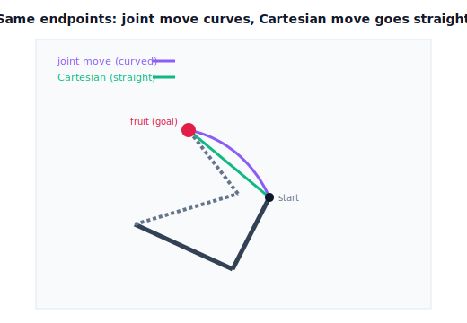

!!! abstract "You are here"
    **Module 7 — Trajectory Generation and Motion Planning**  ·  **Unit 4 — Cartesian-Space Trajectories**  ·  **Lesson 4.1 — Why Cartesian Space? Straight-Line Tool Motion**

# Lesson 4.1 — Why Cartesian Space? Straight-Line Tool Motion

> Unit 3 controlled the **joints** and let the tool path fall where it may — a curve. Many real tasks care about the **tool's path through space**: slide straight along a stem, descend vertically onto a fruit, keep clear of a wire. This lesson motivates planning in **Cartesian space**, and — leading with the picture — shows the straight tool path a Cartesian move produces where a joint move would bow.

---

## 1. Why This Matters
A joint-space move is the right tool when only the endpoints matter. But the harvester's *final approach* is different: to grasp a tomato cleanly it should come **straight in** along the approach direction, not swing in on an arc that might brush a neighboring fruit or hit the stem from the side. "Straight in" is a statement about the **tool's path in space**, and a joint move can't promise it — joint moves are straight in joint space and curved in task space (Lesson 3.1).

Cartesian-space planning flips the priority: we design the **tool's path** first (a straight line, a vertical descent, an arc), then find the joint motion that produces it via inverse kinematics. This buys path control — exactly what approaches, insertions, and obstacle-skirting need — at the cost of more computation and new failure modes (the path can leave the workspace, or cross a singularity). Seeing *why* the tool path differs between the two approaches is the foundation for the rest of Unit 4.

## 2. Physical Intuition
Reach your hand straight out to touch a point on the wall, keeping your fingertip moving in a straight line. Notice your shoulder, elbow, and wrist angles all change in a complicated, *coordinated* way to keep the fingertip straight — the joints do something curved so the fingertip can go straight. Now instead just rotate your shoulder and elbow by fixed comfortable amounts: your fingertip sweeps an **arc**, not a line.

That's the whole distinction. **Joint-first** (rotate the joints simply) → curved fingertip path. **Tool-first** (demand a straight fingertip path) → complicated joint motion. When the task is "touch exactly there along this line" — threading a needle, sliding a drawer, approaching a fruit — you must plan tool-first. The joints become whatever they need to be, computed by IK at each instant. Cartesian-space trajectories are tool-first planning.

## 3. Mathematical Foundations
A **Cartesian-space trajectory** specifies the tool's pose as a function of time, $\mathbf p(t)$ (position, and in general orientation), and derives the joint motion from it. The simplest and most common case is a **straight line** between tool positions $\mathbf p_0$ and $\mathbf p_1$:

$$\mathbf p(t) = \mathbf p_0 + \big(\mathbf p_1 - \mathbf p_0\big)\,s(t),\qquad s(0)=0,\ s(T)=1,$$

where $s(t)$ is a Unit-2 time scaling (quintic for $C^2$). This is *geometrically straight* in task space by construction. The joint trajectory is then obtained by **inverse kinematics at each sampled time**:

$$\mathbf q(t) = \text{IK}\big(\mathbf p(t)\big).$$

Contrast with a joint move, where $\mathbf q(t)$ is the straight line and $\mathbf p(t)=f(\mathbf q(t))$ is curved. Cartesian planning makes $\mathbf p(t)$ straight and lets $\mathbf q(t)=\text{IK}(\mathbf p(t))$ be whatever curve in joint space is required.

**The cost, stated up front.** (i) IK must be solved many times along the path — more computation (next lesson). (ii) Every point on the tool path must be **reachable**; a straight line can pass outside the workspace even when both endpoints are inside (it can cut across the "hole" of an annular workspace, or exceed the reach). (iii) The path can pass near a **singularity**, where the joint rates needed to keep the tool on the line blow up (recognized via the M6 conditioning measures). Unit 5 turns these into explicit feasibility checks; this lesson just flags that Cartesian control isn't free.

For the planar arm, the engine offers `ik_2link(x, y, elbow)` (closed-form 2R IK) and `cartesian_line(p0, p1, s)`; the full straight-line-with-IK loop is `cartesian_traj_ik(...)` in the next lesson.

## 4. Visual Explanation

<figure markdown>
  { width="680" }
</figure>

## 5. Engineering Example
Every industrial controller exposes both: **MoveJ** (joint move, curved tool path, fast and robust) and **MoveL** (linear move, straight tool path). Welding, gluing, laser cutting, and machine tending all use MoveL because the *path* is the product — a weld seam must be straight, a glue bead must follow the joint. Insertion tasks (pegs, connectors) use MoveL for the final straight approach. The harvester mirrors this: MoveJ for gross repositioning, then **MoveL for the final straight approach to the fruit** so it arrives along the intended direction and retracts the same way. The price MoveL pays — IK along the path, reachability and singularity risk — is exactly what the rest of Unit 4 and Unit 5 manage.

## 6. Worked Example
Compare the tool paths for moving from tool position $\mathbf p_0=(0.5, 0.1)$ to $\mathbf p_1=(0.2, 0.35)$ (within the $L_1{=}0.4,L_2{=}0.3$ workspace).

- **Joint move:** solve IK at the endpoints to get $\mathbf q_0,\mathbf q_f$, run a quintic in joint space, and compute $f(\mathbf q(t))$. The tool path **bows** away from the straight $\mathbf p_0\to\mathbf p_1$ segment — the notebook measures a clear perpendicular deviation.
- **Cartesian move:** set $\mathbf p(t)=\mathbf p_0+(\mathbf p_1-\mathbf p_0)s(t)$ and solve IK at each sample. The tool path **is** the straight segment (zero perpendicular deviation, by construction), while the joint path $\mathbf q(t)$ is now a curve.
- Same endpoints, opposite "which is straight": joint-space straightens the joints, Cartesian straightens the tool. The notebook overlays both and prints each path's deviation from the straight tool segment.

## 7. Interactive Demonstration

<iframe src="../../demos/module07/lesson13_cartesian_straight_line.html" title="Why Cartesian Space? Straight-Line Tool Motion interactive demo" style="width:100%;height:520px;border:1px solid #e2e8f0;border-radius:12px"></iframe>

[Open this demo in a new tab ↗](../demos/module07/lesson13_cartesian_straight_line.html)

*(Conceptual — runnable in the companion notebook.)*

**Curve vs line, same endpoints.** In the notebook you:

1. Pick start/goal tool positions and build both a joint-space move and a Cartesian straight-line move between them.
2. Plot both tool paths in $(x,y)$; measure each one's deviation from the straight segment (joint move: nonzero; Cartesian: ≈0).
3. Plot the corresponding joint paths to see the roles swap (joint move straight in joints; Cartesian curved in joints).

## 8. Coding Exercise

!!! tip "Run the hands-on notebook"
    `modules/module07/notebooks/lesson13_why_cartesian_space.ipynb` — open in JupyterLab and run **Kernel → Restart & Run All**.

*(Snippet / notebook task — uses `ik_2link`, `cartesian_line`, `fk_xy`, `joint_traj`.)*

In the companion notebook:

1. Build a joint-space move and a Cartesian straight-line move between the same tool endpoints.
2. Assert the **Cartesian** tool path's max perpendicular deviation from the straight segment is ≈0, while the **joint** move's is nonzero — the runnable statement of "Cartesian goes straight, joints curve."
3. Confirm every Cartesian sample is reachable (`ik_2link` returns a solution); note (for next lesson) that some straight lines would fail this.

## 9. Knowledge Check

Formative — unlimited attempts, immediate feedback; does not affect your grade.

<iframe src="../../quizzes/module07/lesson13_quiz.html" title="Why Cartesian Space? Straight-Line Tool Motion knowledge check" style="width:100%;height:720px;border:1px solid #e2e8f0;border-radius:12px"></iframe>

[Open this quiz in a new tab ↗](../quizzes/module07/lesson13_quiz.html)

1. Why can't a joint-space move guarantee a straight tool path?
2. State the basic recipe for a Cartesian straight-line trajectory.
3. What does Cartesian planning gain, and what three costs does it introduce?
4. For the same endpoints, which path is straight in a joint move, and which in a Cartesian move?

## 10. Challenge Problem
Two tool positions are both inside the planar arm's annular workspace ($L_1{-}L_2 \le r \le L_1{+}L_2$), but the straight line between them passes through the inner hole ($r < L_1{-}L_2$). Explain why a Cartesian straight-line move fails even though both endpoints are reachable, and why a joint move between the same endpoints does not. Then propose two fixes that keep some tool-path control. *(This reachability-along-the-path issue is formalized in Unit 5.)*

## 11. Common Mistakes
- **Using a joint move where the tool path matters.** Approaches, insertions, and seam-following need Cartesian (MoveL).
- **Assuming reachable endpoints imply a reachable line.** The straight path between two reachable points can leave the workspace.
- **Ignoring singularities on the path.** A line through a near-singular region demands huge joint rates (Unit 5/M6).
- **Forgetting orientation.** A full Cartesian move interpolates orientation too (Lessons 4.3–4.4), not just position.

## 12. Key Takeaways
- **Joint-space** moves are simple and joint-feasible but make the **tool path curved**; **Cartesian-space** moves plan the **tool path directly** (often a straight line).
- The Cartesian recipe: **interpolate the tool path** $\mathbf p(t)=\mathbf p_0+(\mathbf p_1-\mathbf p_0)s(t)$, then **solve IK at each sample** to get $\mathbf q(t)$.
- Cartesian control is needed for approaches, insertions, and seam-following — anywhere the tool's path is the task.
- It costs more computation and adds failure modes (unreachable path points, singularities) — addressed in 4.2 and Unit 5.

---

### AI Learning Companion

Copy any prompt below into your AI tutor.

- **Tutor (re-explain):** "Re-explain why some tasks need Cartesian-space planning, using the 'move your fingertip in a straight line' analogy. Contrast the curved tool path of a joint move with the straight tool path of a Cartesian move. Then ask me when to pick each."
- **Practice (generate exercises):** "Give me five robot tasks and ask me whether each needs a joint move or a Cartesian (linear) move, and why. Withhold answers until I respond."
- **Explore (connect to the real world):** "Explain MoveJ vs MoveL on industrial robots: which tasks demand a straight tool path and what failure modes MoveL introduces."

### Global Learning Support

Per-language explanation prompts — use whichever you think best in.

- **English (authoritative):** "Explain why robots sometimes plan trajectories in Cartesian (task) space instead of joint space: straight-line tool motion via interpolate-then-IK, and its costs, at a robotics-course level."
- **Español:** "Explica por qué los robots a veces planifican trayectorias en el espacio cartesiano (de la tarea) en lugar del espacio de articulaciones: movimiento rectilíneo de la herramienta mediante interpolar-y-luego-IK, y sus costos, a nivel de curso de robótica."
- **中文（简体）：** "用机器人课程的水平，解释为何机器人有时在笛卡尔（任务）空间而非关节空间规划轨迹：通过先插值后求逆运动学实现直线工具运动，以及它的代价。"
- **Türkçe:** "Robotların neden bazen eklem uzayı yerine Kartezyen (görev) uzayında yörünge planladığını açıkla: önce-interpolasyon-sonra-IK ile düz çizgi araç hareketi ve bunun maliyetleri — robotik dersi düzeyinde."

---

*Next lesson: 4.2 — Position Interpolation and the IK-per-Sample Loop (making the straight line real).*
