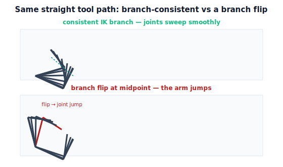

!!! abstract "You are here"
    **Module 7 — Trajectory Generation and Motion Planning**  ·  **Unit 4 — Cartesian-Space Trajectories**  ·  **Lesson 4.2 — Position Interpolation and the IK-per-Sample Loop**

# Lesson 4.2 — Position Interpolation and the IK-per-Sample Loop

> Lesson 4.1 said *interpolate the tool path, then solve IK along it.* This lesson makes that real: sample the straight line in time, solve IK at each sample, and — the part that bites — keep the IK on a **consistent branch** so the arm doesn't suddenly flip its elbow halfway down the line.

---

## 1. Why This Matters
The interpolate-then-IK recipe sounds trivial until you run it and the arm snaps. The straight tool path is fine; the danger is in the **IK**. A planar 2R arm has two solutions for most reachable points — elbow-up and elbow-down. If the per-sample IK silently switches branches partway along the path, the joints **jump** from one configuration to the other in one time step: a discontinuity in $\mathbf q(t)$, a violent motion, possibly a collision — even though the *tool* path was perfectly smooth.

So a correct Cartesian position trajectory is two disciplines at once: a smooth tool path (easy) **and** a consistent IK branch along it (the real work). Add the requirement that **every** sampled point be reachable, and you have the complete feasibility picture for a straight-line move. Get these right and the harvester slides straight onto the fruit; get the branch wrong and the wrist flips into the canopy.

## 2. Physical Intuition
Trace a straight line on a table with your fingertip, elbow pointing **up and to the right**. Easy, smooth. Now trace the *same* line but let your elbow drift under and flip to point **down and to the left** halfway through. Your fingertip might still follow the line, but your arm convulses at the flip — a sudden, awkward reconfiguration. Same tool path, wildly different arm motion, because you changed *which way the elbow bends* mid-stroke.

That flip is an **IK branch change**. For each fingertip position there are (usually) two comfortable elbow configurations; a smooth motion must commit to one and stay with it. The per-sample IK loop must therefore not just solve "where are the joints for this tool point" but "where are the joints *consistent with the previous step*." Choosing and holding the branch is the heart of making interpolate-then-IK actually smooth.

## 3. Mathematical Foundations
Discretize $[0,T]$ into samples $t_0,\dots,t_N$ with the time scaling $s(t)$, giving tool positions

$$\mathbf p_k = \mathbf p_0 + (\mathbf p_1-\mathbf p_0)\,s(t_k).$$

At each sample solve inverse kinematics, $\mathbf q_k = \text{IK}(\mathbf p_k)$. Two issues govern correctness:

**(1) Reachability.** $\text{IK}(\mathbf p_k)$ must exist for **every** $k$. For the planar 2R arm, $\mathbf p_k$ must lie in the annulus $L_1-L_2 \le \lVert\mathbf p_k\rVert \le L_1+L_2$. If any sample falls outside, the straight-line move is **infeasible** — even with reachable endpoints (Lesson 4.1's challenge). The loop must detect this and fail cleanly rather than return garbage.

**(2) Branch consistency.** Where two solutions exist (elbow-up / elbow-down for 2R), pick the branch matching the *previous* sample, e.g. choose the $\text{IK}$ solution minimizing $\lVert \mathbf q_k - \mathbf q_{k-1}\rVert$, or fix the elbow sign for the whole path. A consistent branch keeps $\mathbf q(t)$ continuous; an inconsistent choice yields a **jump** of size up to the full configuration distance between branches — a discontinuity the velocity layer would have to execute as an impossible instantaneous move.

The resulting $\mathbf q(t)$ is a curve in joint space; its smoothness follows from the smoothness of $\mathbf p(t)$ **and** branch consistency — *provided the path avoids singularities*, where $\mathbf q(t)$ can stay continuous but its **rates** spike (the conditioning blows up; Unit 5/M6). The engine's `cartesian_traj_ik(p0, p1, T, n, elbow)` fixes the elbow branch for the whole path and raises an error if any sample is unreachable.

**Relation to the velocity layer.** Once $\mathbf q(t)$ is sampled, it can be executed open-loop through the M6 velocity layer (differentiate to joint rates, or command waypoints), exactly as Unit 1's pipeline described — Cartesian planning produces the reference; M6 executes it; M8 will later track it.

## 4. Visual Explanation

<figure markdown>
  { width="680" }
</figure>

## 5. Engineering Example
This is why MoveL on a real robot can throw a "configuration change" or "singularity" error and refuse the move. The controller is running exactly this loop — interpolate the Cartesian path, IK each sample — and it guards both failure modes: it aborts if a path point is unreachable and warns or stops if the IK branch would flip or the wrist passes through a singularity. Operators learn to add a via-point or reorient the approach to keep the whole line on one branch and inside the workspace. The harvester's controller does the same: its straight final approach is pre-checked so the elbow stays on one side and every point along the line is reachable before the move is allowed to run.

## 6. Worked Example
Move the tool straight from $\mathbf p_0=(0.5,0.1)$ to $\mathbf p_1=(0.2,0.35)$ over $T=1$ s, $n=80$ samples, **elbow-up**, with $L_1{=}0.4,L_2{=}0.3$.

- Each $\mathbf p_k = \mathbf p_0+(\mathbf p_1-\mathbf p_0)s(t_k)$ lies in the annulus (check $\lVert\mathbf p_k\rVert\in[0.1,0.7]$): reachable throughout.
- Solve `ik_2link` elbow-up at each sample → $\mathbf q_k$. The joint path $\mathbf q(t)$ is smooth and continuous; the tool path is exactly straight (perpendicular deviation ≈ $10^{-16}$, verified).
- Now switch one sample to elbow-down: $\mathbf q$ **jumps** by the full inter-branch distance there — the notebook shows the spike and flags it as the branch-flip failure to avoid.
- FK check: $f(\mathbf q_k)=\mathbf p_k$ at every sample (the IK is exact), confirming the joint motion truly realizes the straight tool path.

## 7. Interactive Demonstration

<iframe src="../../demos/module07/lesson14_ik_per_sample.html" title="Position Interpolation and the IK-per-Sample Loop interactive demo" style="width:100%;height:520px;border:1px solid #e2e8f0;border-radius:12px"></iframe>

[Open this demo in a new tab ↗](../demos/module07/lesson14_ik_per_sample.html)

*(Conceptual — runnable in the companion notebook.)*

**Hold the branch.** In the notebook you:

1. Build the straight-line position trajectory with `cartesian_traj_ik` (fixed elbow).
2. Plot the tool path (straight) and the joint path (smooth curve); FK-verify every sample.
3. Deliberately break branch consistency at one sample and watch the joint jump appear — then restore consistency and watch it vanish.

## 8. Coding Exercise

!!! tip "Run the hands-on notebook"
    `modules/module07/notebooks/lesson14_position_interpolation_ik_loop.ipynb` — open in JupyterLab and run **Kernel → Restart & Run All**.

*(Snippet / notebook task — uses `cartesian_traj_ik`, `ik_2link`, `fk_xy`.)*

In the companion notebook:

1. Build a straight-line Cartesian position trajectory with a fixed elbow branch.
2. Assert every sample FK-matches its intended tool point and the tool path is straight (perpendicular deviation ≈ 0).
3. Assert the joint path has **no large jumps** between consecutive samples (branch-consistent); then construct a branch-flipped version and assert it *does* have a jump — a runnable demonstration of why branch consistency matters. Also assert a known out-of-workspace line raises the unreachable error.

## 9. Knowledge Check

Formative — unlimited attempts, immediate feedback; does not affect your grade.

<iframe src="../../quizzes/module07/lesson14_quiz.html" title="Position Interpolation and the IK-per-Sample Loop knowledge check" style="width:100%;height:720px;border:1px solid #e2e8f0;border-radius:12px"></iframe>

[Open this quiz in a new tab ↗](../quizzes/module07/lesson14_quiz.html)

1. What two conditions must hold for a Cartesian straight-line position trajectory to be feasible and smooth?
2. What is an IK branch, and what happens to $\mathbf q(t)$ if the branch flips mid-path?
3. How can the per-sample IK keep a consistent branch?
4. Why does a smooth tool path not guarantee a smooth joint path?

## 10. Challenge Problem
A straight-line tool path stays reachable everywhere and uses a single, consistent IK branch — yet at one point along the line the required joint *speed* spikes enormously even though the tool moves at a steady pace. What's happening, and how would you detect it ahead of time using a quantity from Module 6? Then suggest two ways to keep the same tool path while taming the spike. *(This is a singularity on the path — the conditioning measure flags it; Unit 5 acts on it.)*

## 11. Common Mistakes
- **Letting IK pick any solution per sample.** Without branch consistency the arm flips; choose the branch nearest the previous configuration (or fix the elbow sign).
- **Checking only the endpoints for reachability.** Every sample must be reachable; sample densely and verify along the path.
- **Equating smooth tool path with smooth joints.** Branch flips and singularities break joint smoothness even on a smooth line.
- **Sampling too coarsely.** Sparse samples can skip an unreachable point or hide a branch flip; sample fine enough to catch them.

## 12. Key Takeaways
- A Cartesian position trajectory is the **interpolate-then-IK loop**: sample the straight tool path in time, solve IK at each sample.
- **Branch consistency** is essential — flipping the IK solution mid-path makes $\mathbf q(t)$ **jump**; pick the branch nearest the previous sample (or fix the elbow).
- **Every sample must be reachable**; a straight line can leave the workspace even with reachable endpoints — fail cleanly when it does.
- A smooth tool path gives a smooth joint path **only** with a consistent branch and away from singularities (Unit 5/M6).

---

### AI Learning Companion

Copy any prompt below into your AI tutor.

- **Tutor (re-explain):** "Re-explain the interpolate-then-IK loop for a straight-line Cartesian move, using the 'trace a line, don't flip your elbow' analogy. Stress branch consistency and reachability. Then give me a small loop to reason through."
- **Practice (generate exercises):** "Give me three straight-line Cartesian moves (endpoints) for a 2-link arm with L1=0.4, L2=0.3. Ask me whether each is fully reachable and whether a branch flip is a risk. Withhold answers until I respond."
- **Explore (connect to the real world):** "Explain why a robot's MoveL command can throw 'configuration change' or 'singularity' errors, and how operators fix them with via-points or reorientation."

### Global Learning Support

Per-language explanation prompts — use whichever you think best in.

- **English (authoritative):** "Explain realizing a straight-line Cartesian tool motion by sampling the path and solving IK at each sample, why IK branch consistency and per-sample reachability matter, at a robotics-course level."
- **Español:** "Explica cómo realizar un movimiento rectilíneo de la herramienta en el espacio cartesiano muestreando la trayectoria y resolviendo IK en cada muestra, y por qué importan la consistencia de la rama de IK y la alcanzabilidad de cada muestra, a nivel de curso de robótica."
- **中文（简体）：** "用机器人课程的水平，解释如何通过对路径采样并在每个采样点求逆运动学来实现笛卡尔直线工具运动，以及为何 IK 分支一致性和逐采样点可达性很重要。"
- **Türkçe:** "Yolu örnekleyip her örnekte IK çözerek düz çizgi Kartezyen araç hareketinin nasıl gerçekleştirildiğini, IK dal tutarlılığının ve örnek-başına erişilebilirliğin neden önemli olduğunu robotik dersi düzeyinde açıkla."

---

*Next lesson: 4.3 — Orientation Interpolation: SLERP (interpolating the tool's rotation, not just its position).*
