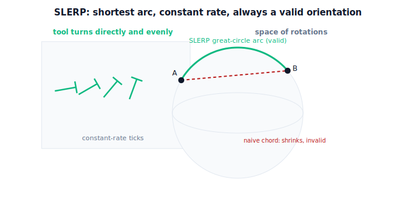

!!! abstract "You are here"
    **Module 7 — Trajectory Generation and Motion Planning**  ·  **Unit 4 — Cartesian-Space Trajectories**  ·  **Lesson 4.3 — Orientation Interpolation: SLERP**

# Lesson 4.3 — Orientation Interpolation: SLERP

> Position interpolation (4.2) was a straight line. Orientation is harder: you can't just average two rotations entry by entry — the result isn't even a rotation. **SLERP** is the right tool: it turns smoothly between two orientations along the shortest arc at a steady angular rate. We lead with the *motion of the tool turning*, then give just enough quaternion to make it precise.

---

## 1. Why This Matters
The harvester's gripper doesn't only need to be *at* the fruit — it needs to be *oriented* correctly: approaching along the fruit's stem axis, wrist rolled so the fingers straddle the fruit. During a move, the tool's orientation must change smoothly from its current pose to the grasp pose, in lockstep with its position. So a full Cartesian trajectory interpolates **both** position and orientation.

Position interpolation was easy because positions live in flat space — straight lines and averages just work. Orientations do **not** live in flat space; averaging two rotation matrices gives a non-rotation (it skews and scales), and interpolating Euler angles can swing the tool through wild intermediate orientations or stall at gimbal lock. **SLERP** solves this cleanly: it rotates directly from one orientation to the other along the *shortest* path at a *constant* angular speed. Every robot that moves its tool's orientation smoothly is doing SLERP (or an equivalent) under the hood.

## 2. Physical Intuition
Point your forearm one way, then rotate it to point another way. The natural motion turns **directly** toward the target orientation, at a steady twist rate, taking the shortest turn — you don't spin the long way around, and you don't speed up and slow down erratically. That direct, constant-rate turn is SLERP.

Now imagine interpolating by averaging: halfway between "pointing up" and "pointing right," naive matrix averaging gives an orientation that's *shrunken* — not a valid orientation at all, like a dial that's gone slack. And interpolating Euler angles can make the wrist take a bizarre detour or freeze when two axes line up (gimbal lock). SLERP avoids all of it by treating orientation as a point on a sphere of rotations and sliding along the great-circle arc between the two points — the rotational equivalent of a straight line. Shortest way, steady rate, always a valid orientation.

## 3. Mathematical Foundations
Represent an orientation by a **unit quaternion** $\mathbf q=(w,x,y,z)$, $\lVert\mathbf q\rVert=1$. (We use quaternions only as the vehicle for SLERP; we are *not* doing deep quaternion algebra — just the interpolation.) Two facts: each rotation corresponds to a unit quaternion (up to sign, since $\mathbf q$ and $-\mathbf q$ are the same rotation), and the angle between two unit quaternions on the unit sphere is half the rotation angle between the orientations.

**SLERP** between $\mathbf q_0$ and $\mathbf q_1$ at parameter $s\in[0,1]$:

$$\text{slerp}(\mathbf q_0,\mathbf q_1,s) = \frac{\sin\big((1-s)\Omega\big)}{\sin\Omega}\,\mathbf q_0 + \frac{\sin\big(s\,\Omega\big)}{\sin\Omega}\,\mathbf q_1,\qquad \cos\Omega = \mathbf q_0\!\cdot\!\mathbf q_1.$$

Properties that make it the right tool: (i) the result is a **unit quaternion** for all $s$ — always a valid rotation; (ii) it traces the **great-circle (shortest) arc** between the two orientations; (iii) it has **constant angular speed** ($\Omega$ per unit $s$). Two practical details: pick the **shortest arc** by flipping the sign of $\mathbf q_1$ if $\mathbf q_0\!\cdot\!\mathbf q_1<0$ (so the tool turns the short way), and fall back to linear interpolation when $\mathbf q_0\approx\mathbf q_1$ (to avoid dividing by $\sin\Omega\approx0$).

Compose with a time scaling $s(t)$ for smooth start/stop: a quintic $s(t)$ makes the orientation ease in and out (zero angular velocity and acceleration at the ends), just like position.

**Planar special case.** For the planar arm, orientation is a single angle $\phi$. SLERP reduces to **shortest-arc angle interpolation**: $\phi(s)=\phi_0 + s\cdot\text{wrap}(\phi_1-\phi_0)$, where $\text{wrap}$ brings the difference into $(-\pi,\pi]$ so the tool turns the short way (e.g., $170^\circ\to-170^\circ$ turns $+20^\circ$ through $180^\circ$, not $-340^\circ$). The engine provides `slerp(q0,q1,s)` for the general case and `slerp_angle(a0,a1,s)` for the planar one.

## 4. Visual Explanation

<figure markdown>
  { width="680" }
</figure>

## 5. Engineering Example
Camera gimbals, animation rigs, spacecraft attitude controllers, and robot wrists all use SLERP to retarget orientation smoothly. A drone camera commanded to look from one subject to another SLERPs its orientation so the footage pans directly and evenly — no wobble, no overshoot, no gimbal-lock freeze that Euler-angle interpolation would risk. The harvester's wrist SLERPs from its travel orientation to the grasp orientation during the final approach, so the fingers rotate into place along the shortest, steadiest turn while the position simultaneously interpolates straight in. Position-SLERP-together is the standard full-pose Cartesian move.

## 6. Worked Example
Roll the planar tool from $\phi_0=170^\circ$ to $\phi_1=-170^\circ$ over $s\in[0,1]$.

- **Naive (linear in raw angle):** $170\to-170$ as written sweeps $-340^\circ$ — the long way around, an absurd full-circle-minus wrist spin.
- **SLERP / shortest-arc:** $\text{wrap}(-170-170)=\text{wrap}(-340^\circ)=+20^\circ$, so $\phi(s)=170^\circ+s\cdot20^\circ$. At $s=0.5$, $\phi=180^\circ$ (i.e. $-180^\circ$); the tool turns just $20^\circ$ through the back, the short way.
- General-quaternion check: build $\mathbf q_0,\mathbf q_1$ about $\hat z$ for these angles; `slerp` at $s=0.5$ returns a **unit** quaternion corresponding to $\pm180^\circ$, confirming shortest-arc and validity. The notebook verifies unit norm at every $s$ and the $20^\circ$ total turn.

## 7. Interactive Demonstration

<iframe src="../../demos/module07/lesson15_slerp.html" title="Orientation Interpolation: SLERP interactive demo" style="width:100%;height:520px;border:1px solid #e2e8f0;border-radius:12px"></iframe>

[Open this demo in a new tab ↗](../demos/module07/lesson15_slerp.html)

*(Conceptual — runnable in the companion notebook.)*

**Turn the short way, evenly.** In the notebook you:

1. SLERP between two orientations (quaternion form) and verify the result is unit-norm at every $s$.
2. Plot the interpolated orientation angle vs $s$ — a straight, constant-rate line along the shortest arc.
3. Compare against naive linear-angle interpolation that takes the long way, and against an Euler-angle path that detours, to see why SLERP is the right default.

## 8. Coding Exercise

!!! tip "Run the hands-on notebook"
    `modules/module07/notebooks/lesson15_orientation_slerp.ipynb` — open in JupyterLab and run **Kernel → Restart & Run All**.

*(Snippet / notebook task — uses `slerp`, `slerp_angle`, `quat_axis_angle`.)*

In the companion notebook:

1. SLERP between two given orientations and assert: the result is **unit-norm** for all $s$ (valid rotation), endpoints reproduce $\mathbf q_0$ and $\mathbf q_1$ (up to sign), and the total turn equals the **shortest** angle.
2. For the planar arm, assert `slerp_angle` takes the shortest arc on a wrap-around case (e.g. $170^\circ\to-170^\circ$ gives a $20^\circ$ turn).
3. Compose SLERP with a quintic $s(t)$ and assert the angular velocity is zero at both ends (eased orientation start/stop).

## 9. Knowledge Check

Formative — unlimited attempts, immediate feedback; does not affect your grade.

<iframe src="../../quizzes/module07/lesson15_quiz.html" title="Orientation Interpolation: SLERP knowledge check" style="width:100%;height:720px;border:1px solid #e2e8f0;border-radius:12px"></iframe>

[Open this quiz in a new tab ↗](../quizzes/module07/lesson15_quiz.html)

1. Why can't you interpolate orientation by averaging rotation-matrix entries?
2. What three properties make SLERP the right orientation interpolant?
3. What does "take the shortest arc" mean, and how is it enforced in quaternion SLERP?
4. What does SLERP reduce to for a planar (single-angle) orientation?

## 10. Challenge Problem
You must interpolate the tool from orientation A to orientation B, but the task forbids passing through a particular "keep-out" orientation C that happens to lie on the shortest SLERP arc. SLERP always takes the shortest arc — so how would you route around C while keeping the motion smooth? Propose a solution using an **orientation via-point**, and explain how you'd chain two SLERPs (or a SLERP spline) to pass through it $C^1$. *(This mirrors position via-points from Unit 3, now in orientation space.)*

## 11. Common Mistakes
- **Averaging rotation matrices or quaternions naively.** The result isn't a rotation (it shrinks/skews); use SLERP.
- **Forgetting the shortest-arc sign flip.** Without flipping $\mathbf q_1$ when $\mathbf q_0\!\cdot\!\mathbf q_1<0$, SLERP turns the long way.
- **Interpolating Euler angles.** Risks gimbal lock and weird detours; interpolate the rotation itself (SLERP).
- **Interpolating orientation independently of position timing.** Use a shared time scaling so position and orientation arrive together.

## 12. Key Takeaways
- Orientation lives on a curved space; **you cannot interpolate it by averaging** — the result isn't a valid rotation.
- **SLERP** interpolates between two orientations along the **shortest arc** at **constant angular rate**, always returning a **valid** orientation.
- Enforce the **shortest arc** (sign-flip the far quaternion) and fall back to linear when the orientations are nearly equal.
- For the **planar** arm, SLERP is shortest-arc **angle** interpolation; compose with a quintic $s(t)$ to ease orientation in and out alongside position.

---

### AI Learning Companion

Copy any prompt below into your AI tutor.

- **Tutor (re-explain):** "Re-explain SLERP using the 'turn your forearm directly and evenly' analogy and why averaging rotations fails. Keep quaternions light. Then give me a shortest-arc angle problem."
- **Practice (generate exercises):** "Give me three orientation-interpolation problems (start and end angles, including a wrap-around case). Ask me for the shortest-arc turn and the midpoint orientation. Withhold answers until I respond."
- **Explore (connect to the real world):** "Explain where SLERP is used — camera gimbals, animation, spacecraft attitude, robot wrists — and what goes wrong with Euler-angle interpolation (gimbal lock)."

### Global Learning Support

Per-language explanation prompts — use whichever you think best in.

- **English (authoritative):** "Explain SLERP (spherical linear interpolation) for a robot tool's orientation: why averaging rotations fails, and how SLERP gives a shortest-arc constant-rate valid orientation path, at a robotics-course level (keep quaternion algebra light)."
- **Español:** "Explica SLERP (interpolación lineal esférica) para la orientación de la herramienta de un robot: por qué promediar rotaciones falla, y cómo SLERP da una trayectoria de orientación válida por el arco más corto a velocidad constante, a nivel de curso de robótica (sin profundizar en álgebra de cuaterniones)."
- **中文（简体）：** "用机器人课程的水平，解释机器人工具姿态的 SLERP（球面线性插值）：为何直接平均旋转会失败，以及 SLERP 如何沿最短弧、以恒定角速度给出始终有效的姿态路径（四元数代数从简）。"
- **Türkçe:** "Bir robot aracının yönelimi için SLERP'i (küresel doğrusal interpolasyon) açıkla: rotasyonları ortalamanın neden başarısız olduğunu ve SLERP'in nasıl en kısa yay boyunca sabit hızda geçerli bir yönelim yolu verdiğini robotik dersi düzeyinde anlat (kuaterniyon cebrini hafif tut)."

---

*Next lesson: 4.4 — Screw Motion: Unified Position + Orientation Interpolation (one motion for both), and the Unit 4 recap.*
