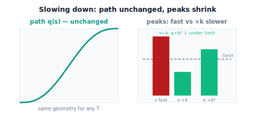

!!! abstract "You are here"
    **Module 7 — Trajectory Generation and Motion Planning**  ·  **Unit 5 — Feasibility: Velocity, Acceleration, and Limits**  ·  **Lesson 5.2 — Slowing Down to Restore Feasibility: Uniform Time Scaling**

# Lesson 5.2 — Slowing Down to Restore Feasibility: Uniform Time Scaling

> Lesson 5.1 showed *why* a trajectory can be impossible: its peaks exceed the limits. This lesson gives the simplest, most reliable fix — **slow down.** Stretching the duration shrinks every speed and acceleration while leaving the path untouched. We lead with the picture: same route, gentler timing, peaks sliding back under the limit lines.

---

## 1. Why This Matters
When a trajectory is infeasible because it demands too much speed or acceleration, you have a remarkably simple escape hatch: **give it more time.** Because Module 7 cleanly separates *path* (geometry) from *trajectory* (timing), you can keep the exact same path — the same configurations in the same order — and just rescale the clock. Stretch the duration and every velocity drops, every acceleration drops faster, and a motion that was impossible becomes comfortably executable.

This is the workhorse fix in practice. It always works for velocity/acceleration infeasibility (these limits are beaten purely by going slower), it changes nothing about where the robot goes, and it's a single multiply on the time axis. The harvester that couldn't snap to a fruit in 0.2 s simply takes 0.6 s instead — same approach, now within the wrist motor's limits. Understanding *that slowing down is both sufficient and free of geometric side-effects* is the key idea.

## 2. Physical Intuition
Replay a video of a motion at half speed. The object follows the **exact same path** — every position it passed through, it still passes through, in the same order. But everything *moves slower*: velocities halve. And the changes in velocity stretch out too, so accelerations drop even more. Nothing about the route changed; only the clock did.

Uniform time scaling is precisely "play the trajectory in slow motion." Take a trajectory $q(t)$ and define a slowed version $q(t/k)$ that takes $k$ times as long. The path is identical (same $q$ values, same order); the speeds shrink by $1/k$ and the accelerations by $1/k^2$. So if a move is too fast for the motors, pick $k$ large enough that the slowed peaks fit under the limits — and you're done, with the geometry untouched. Slow motion is the fix.

## 3. Mathematical Foundations
Let a trajectory have duration $T_0$ with peak speed $v_0$ and peak acceleration $a_0$ (from Lesson 5.1). **Uniform time scaling** to a new duration $T_1 = k\,T_0$ (stretch factor $k>1$) replaces the time scaling $s(t)$ with one that runs over $[0,T_1]$ on the *same* path. Because differentiating a slower clock brings down factors of $1/T$:

$$v_1 = \frac{T_0}{T_1}\,v_0 = \frac{v_0}{k},\qquad a_1 = \left(\frac{T_0}{T_1}\right)^2 a_0 = \frac{a_0}{k^2}.$$

Velocity scales by $1/k$; acceleration by $1/k^2$. The **path is unchanged** — $q$ as a function of the normalized parameter $s\in[0,1]$ is identical; only the mapping $s(t)$ from time to $s$ is stretched.

**Finding the stretch factor.** To satisfy both limits, you need $v_1\le \dot q_{\lim}$ and $a_1\le \ddot q_{\lim}$, i.e.

$$k \ge \frac{v_0}{\dot q_{\lim}} \quad\text{(velocity)}\qquad\text{and}\qquad k \ge \sqrt{\frac{a_0}{\ddot q_{\lim}}}\quad\text{(acceleration)}.$$

Take the **larger** of the two — the binding constraint — and that $k$ (or any larger) makes the trajectory feasible. Equivalently, the minimum feasible duration is $T_{\min}=k_{\min}T_0$. (For a synchronized multi-joint move, apply this per joint and take the max, exactly as in Lesson 3.2's synchronization — feasibility and synchronization are the same "slowest binding constraint" logic.)

**Why it always works for these limits.** As $k\to\infty$, $v_1\to0$ and $a_1\to0$: any positive limits can be met by going slow enough. This is special to *velocity and acceleration* limits; it does **not** beat a *geometric* infeasibility like an unreachable path point (Lesson 5.4) — slowing down can't make an out-of-workspace point reachable.

The engine gives `uniform_time_scale_factors(T0, T1)` (the $1/k$, $1/k^2$ factors) and `feasible_duration(q0, qf, vlim, alim)` (the minimum feasible duration directly).

## 4. Visual Explanation

<figure markdown>
  { width="680" }
</figure>

## 5. Engineering Example
This is the global "feed rate" or "speed override" knob on essentially every motion controller. Set it to 50% and the machine runs the identical toolpath at half speed — accelerations drop to a quarter — turning a chattering, limit-saturating program into a clean one without touching the geometry. Robot teach pendants expose the same control; commissioning a cell often means finding the override that keeps every joint feasible through the worst segment. For the harvester, a single duration stretch on a too-aggressive approach makes it executable while preserving the exact straight-in path the grasp needs. It's the first thing to try, because it's the safest: the robot goes exactly where it was going, just gentler.

## 6. Worked Example
The infeasible move from Lesson 5.1: $\Delta q=1.2$ rad at $T_0=1.5$ s gave $v_0=1.5$ rad/s, $a_0=3.08$ rad/s²; limits $\dot q_{\lim}=1.0$, $\ddot q_{\lim}=2.0$.

- Velocity needs $k\ge v_0/\dot q_{\lim}=1.5/1.0=1.5$.
- Acceleration needs $k\ge\sqrt{a_0/\ddot q_{\lim}}=\sqrt{3.08/2.0}=\sqrt{1.54}=1.24$.
- Binding constraint: **velocity**, $k_{\min}=1.5$. So $T_{\min}=1.5\times1.5=2.25$ s.
- Check at $T=2.25$ s: $v_1=1.5/1.5=1.0$ rad/s (exactly the limit ✓), $a_1=3.08/1.5^2=1.37$ rad/s² (under $2.0$ ✓). Feasible, with velocity at its limit.
- The path is identical to the original — only the clock stretched. The notebook confirms `feasible_duration` returns $2.25$ s and that the slowed peaks match $v_0/k$, $a_0/k^2$.

## 7. Interactive Demonstration
*(Conceptual — runnable in the companion notebook; reuses the 5.1 Limit Explorer idea.)*

**Stretch until it fits.** In the notebook you:

1. Start from an infeasible move and compute its peaks.
2. Increase the duration and watch both peaks fall (speed as $1/k$, accel as $1/k^2$); find the smallest $k$ that brings both under the limits.
3. Plot the path before and after to confirm it is **identical** — only the time axis rescaled.

## 8. Coding Exercise

!!! tip "Run the hands-on notebook"
    `modules/module07/notebooks/lesson18_time_scaling_feasibility.ipynb` — open in JupyterLab and run **Kernel → Restart & Run All**.

*(Snippet / notebook task — uses `quintic_peaks`, `feasible_duration`, `uniform_time_scale_factors`.)*

In the companion notebook:

1. For an infeasible move, compute the minimum feasible duration with `feasible_duration` and verify `is_feasible` flips from False to True at it.
2. Assert the peaks at the stretched duration match $v_0/k$ and $a_0/k^2$ (uniform-scaling law), and identify the binding limit.
3. Confirm the **path** (the sequence of configurations vs the normalized parameter $s$) is unchanged by the time scaling — only $s(t)$ differs.

## 9. Knowledge Check

Formative — unlimited attempts, immediate feedback; does not affect your grade.

<iframe src="../../quizzes/module07/lesson18_quiz.html" title="Slowing Down to Restore Feasibility: Uniform Time Scaling knowledge check" style="width:100%;height:720px;border:1px solid #e2e8f0;border-radius:12px"></iframe>

[Open this quiz in a new tab ↗](../quizzes/module07/lesson18_quiz.html)

1. When you stretch a trajectory's duration by a factor $k$, how do peak speed and peak acceleration change?
2. Why does the path stay the same under uniform time scaling?
3. How do you find the minimum stretch factor that makes a move feasible?
4. Why does slowing down always beat velocity/acceleration limits but not a reachability problem?

## 10. Challenge Problem
A synchronized three-joint move is infeasible: joint A is limited by velocity (needs $k=1.8$), joint B by acceleration (needs $k=1.3$), joint C is already feasible ($k=1.0$). What single stretch factor makes the whole move feasible, and which joint is the binding one? Then explain why applying *different* stretch factors per joint would break synchronization, and connect this to the bottleneck logic of Lesson 3.2. *(Feasibility and synchronization are the same "max binding constraint" idea.)*

## 11. Common Mistakes
- **Forgetting acceleration shrinks faster than velocity.** It scales as $1/k^2$; the binding constraint can be either — compute both and take the larger $k$.
- **Thinking slowing down changes the path.** Uniform time scaling leaves the geometry identical; only the clock changes.
- **Using slowing down to fix a reachability problem.** It can't make an unreachable point reachable (Lesson 5.4); it only beats speed/accel limits.
- **Scaling joints independently.** That desynchronizes the move; use one common stretch factor (the max binding one).

## 12. Key Takeaways
- **Uniform time scaling** (slowing down) shrinks every velocity by $1/k$ and every acceleration by $1/k^2$ while leaving the **path unchanged**.
- It is the **universal fix** for velocity/acceleration infeasibility: a large enough $k$ always brings the peaks under the limits.
- The minimum stretch factor is the **larger** of $v_0/\dot q_{\lim}$ and $\sqrt{a_0/\ddot q_{\lim}}$ — the binding constraint; for multi-joint moves take the max over joints.
- Slowing down beats speed/accel limits but **not** geometric infeasibility (unreachable path points) — that's a different problem (5.4).

---

### AI Learning Companion

Copy any prompt below into your AI tutor.

- **Tutor (re-explain):** "Re-explain uniform time scaling using the 'play the video in slow motion' analogy. Stress that the path is unchanged while velocity shrinks by 1/k and acceleration by 1/k². Then give me a stretch-factor problem."
- **Practice (generate exercises):** "Give me three infeasible moves (peaks and limits). Ask me to find the minimum stretch factor and the binding limit. Withhold answers until I respond."
- **Explore (connect to the real world):** "Explain the global feed-rate / speed-override control on motion controllers: why running a program at 50% speed quarters the accelerations and fixes feasibility without changing the path."

### Global Learning Support

Per-language explanation prompts — use whichever you think best in.

- **English (authoritative):** "Explain uniform time scaling (slowing down) to restore robot trajectory feasibility: how it shrinks velocity by 1/k and acceleration by 1/k² without changing the path, and how to find the minimum stretch factor, at a robotics-course level."
- **Español:** "Explica el escalado temporal uniforme (ralentizar) para restaurar la factibilidad de una trayectoria de robot: cómo reduce la velocidad en 1/k y la aceleración en 1/k² sin cambiar la trayectoria, y cómo hallar el factor de estiramiento mínimo, a nivel de curso de robótica."
- **中文（简体）：** "用机器人课程的水平，解释均匀时间缩放（放慢）以恢复机器人轨迹可行性：它如何在不改变路径的前提下将速度缩小 1/k、加速度缩小 1/k²，以及如何求最小拉伸因子。"
- **Türkçe:** "Robot yörünge uygulanabilirliğini geri kazandırmak için tekdüze zaman ölçeklemesini (yavaşlatma) açıkla: yolu değiştirmeden hızı 1/k, ivmeyi 1/k² nasıl küçülttüğünü ve minimum esnetme faktörünün nasıl bulunduğunu robotik dersi düzeyinde anlat."

---

*Next lesson: 5.3 — The Fastest Feasible Timing: Respecting Velocity and Acceleration Limits (going as fast as the hardware allows, no faster).*
