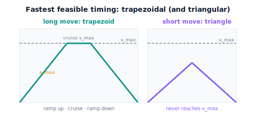

!!! abstract "You are here"
    **Module 7 — Trajectory Generation and Motion Planning**  ·  **Unit 5 — Feasibility: Velocity, Acceleration, and Limits**  ·  **Lesson 5.3 — The Fastest Feasible Timing: Respecting Velocity and Acceleration Limits**

# Lesson 5.3 — The Fastest Feasible Timing: Respecting Velocity and Acceleration Limits

> Lesson 5.2 slowed a move *until* it was feasible. The natural next question: how fast can it go and *still* be feasible? The answer is to run right up against the binding limit — no faster. The **trapezoidal** profile is exactly this: accelerate at the limit, cruise at the speed limit, decelerate at the limit. We lead with the motion's shape, then the timing.

---

## 1. Why This Matters
Slowing down (5.2) fixes infeasibility, but you don't want to slow down *more than necessary* — the harvester has fruit to pick, and wasted seconds add up across thousands of moves. So the practical goal is the **fastest feasible** timing: as quick as possible while every joint stays within its velocity and acceleration limits, and not a hair faster.

The shape that achieves this is the **trapezoidal velocity profile** from Lesson 2.4, now seen in its true role: it is the timing that *saturates* the limits. It accelerates as hard as allowed, cruises at the top allowed speed, and decelerates as hard as allowed — squeezing the move into the least time the hardware permits. This is "efficient" in the sense Module 7 cares about (a geometric/temporal proxy, never dynamics or energy). One important caveat we'll be careful about: "fastest feasible under these simple limits" is **not** the heavy machinery of time-optimal trajectory *optimization* — that's deliberately out of scope. We want the practical, intuitive fastest-the-limits-allow timing.

## 2. Physical Intuition
A sprinter covering a fixed distance in minimum time does three things: accelerate flat-out, run at top speed, then (if needed) decelerate to stop. Plotting their speed over time gives a **trapezoid** — a ramp up, a flat top at maximum speed, a ramp down. They never coast below their limits when they could be pushing them; that's what makes it the fastest. For a *short* dash, they may never reach top speed — they accelerate, then immediately decelerate — giving a **triangle** instead of a trapezoid.

A robot joint moving as fast as its limits allow does exactly this. Accelerate at $\ddot q_{\lim}$ until it hits the speed limit $\dot q_{\lim}$, cruise there, then decelerate at $\ddot q_{\lim}$ to stop — a trapezoid in the speed plot. For a short move it reaches the speed limit's "ceiling" only as a point (triangle). Either way, the limits are pinned, and that's why it's the fastest feasible timing. (It pays with jerk spikes at the corners; the S-curve trades a little time for bounded jerk — the smooth-vs-fast choice from 2.4.)

## 3. Mathematical Foundations
For a single joint moving distance $D=|\Delta q|$ with limits $v_{\max}=\dot q_{\lim}$ and $a_{\max}=\ddot q_{\lim}$, the **time-minimizing trapezoidal** timing has two cases.

**Trapezoidal (long move).** Accelerate at $a_{\max}$ for $t_a=v_{\max}/a_{\max}$ (covering $\tfrac12 v_{\max}t_a$), cruise at $v_{\max}$, decelerate symmetrically. This applies when the move is long enough to reach $v_{\max}$, i.e. $D \ge v_{\max}^2/a_{\max}$. The minimum time is

$$T_{\min} = \frac{D}{v_{\max}} + \frac{v_{\max}}{a_{\max}}\qquad(\text{cruise time} + \text{ramp time}).$$

**Triangular (short move).** If $D < v_{\max}^2/a_{\max}$, the joint never reaches $v_{\max}$: accelerate to a peak $v_p=\sqrt{a_{\max}D}<v_{\max}$, then decelerate. The minimum time is

$$T_{\min} = 2\sqrt{\frac{D}{a_{\max}}}.$$

In both cases the timing **saturates a limit at every instant** — acceleration during the ramps, velocity during the cruise — which is why it's the fastest feasible. For a **synchronized multi-joint** move, compute each joint's minimum time and take the **max** (the bottleneck joint sets the duration, Lesson 3.2); then time-scale the faster joints to that common $T$ so they stay coordinated (and feasible, since slowing only relaxes limits).

**Quintic vs trapezoidal.** A quintic ($C^2$, smooth ends) is *not* the fastest — it spends time easing in/out rather than saturating limits. The trapezoidal is faster but only $C^1$ (jerk spikes); the S-curve sits between (jerk-limited, slightly slower). Choosing among them is the **fast-vs-smooth** trade from Unit 2 — feasibility (this unit) tells you the *fastest each can go*; smoothness (Unit 2) tells you the *cost of gentleness*.

**Scope note.** This is "fastest under per-joint velocity/acceleration limits," computed in closed form. Genuine **time-optimal trajectory optimization** (e.g. optimizing along an arbitrary path subject to coupled constraints, or kinodynamic planning) is a different, heavier subject and is **out of Module 7's scope** by design. The engine provides `trapezoidal_profile(dist, v_max, a_max)` (from Unit 2) and `feasible_duration(...)` for the synchronized quintic minimum.

## 4. Visual Explanation

<figure markdown>
  { width="680" }
</figure>

## 5. Engineering Example
Trapezoidal (and jerk-limited S-curve) timing is the default in motion controllers precisely because it delivers the fastest feasible move for given limits — minimizing cycle time, which is money in production. A pick-and-place robot's point-to-point moves are timed this way: ramp up at the acceleration limit, cruise at the velocity limit, ramp down, with the bottleneck joint setting the duration and the rest synchronized to it. The harvester uses fastest-feasible timing for its repositioning swings (where speed matters and the path is unconstrained), and reserves the smoother quintic/S-curve for delicate fruit handling, accepting a little extra time to protect the produce. The choice is always fast-vs-smooth against the same hardware limits.

## 6. Worked Example
A joint moves $D=1.2$ rad with $v_{\max}=2$ rad/s, $a_{\max}=3$ rad/s². Find the fastest feasible time.

- Check the case: $v_{\max}^2/a_{\max}=4/3=1.33$ rad. Since $D=1.2 < 1.33$, this is the **triangular** (short-move) case — the joint never reaches $v_{\max}$.
- $T_{\min}=2\sqrt{D/a_{\max}}=2\sqrt{1.2/3}=2\sqrt{0.4}=2(0.632)=1.26$ s, with peak speed $v_p=\sqrt{a_{\max}D}=\sqrt{3.6}=1.90$ rad/s ($<2$, confirming triangular).
- If instead $D=2.0$ rad ($>1.33$), it's **trapezoidal**: $T_{\min}=D/v_{\max}+v_{\max}/a_{\max}=2/2+2/3=1.667$ s, reaching the full $2$ rad/s cruise.
- Compare a quintic over the same $D=1.2$: its minimum feasible duration (Lesson 5.2 logic) is longer than $1.26$ s because it eases the ends instead of saturating the ramps — the price of $C^2$ smoothness. The notebook computes both and shows the trapezoid is faster but jerkier.

## 7. Interactive Demonstration

<iframe src="../../demos/module07/lesson19_fastest_feasible_timing.html" title="The Fastest Feasible Timing: Respecting Velocity and Acceleration Limits interactive demo" style="width:100%;height:520px;border:1px solid #e2e8f0;border-radius:12px"></iframe>

[Open this demo in a new tab ↗](../demos/module07/lesson19_fastest_feasible_timing.html)

*(Conceptual — runnable in the companion notebook.)*

**Saturate the limits.** In the notebook you:

1. Build the trapezoidal profile for a move and confirm it saturates acceleration on the ramps and velocity on the cruise.
2. Detect the triangular case (short move) and verify the peak speed stays below $v_{\max}$.
3. Compare the trapezoid's minimum time against the quintic's for the same move and limits — quantifying the fast-vs-smooth trade.

## 8. Coding Exercise

!!! tip "Run the hands-on notebook"
    `modules/module07/notebooks/lesson19_fastest_feasible_timing.ipynb` — open in JupyterLab and run **Kernel → Restart & Run All**.

*(Snippet / notebook task — uses `trapezoidal_profile`, `feasible_duration`, `quintic_peaks`.)*

In the companion notebook:

1. For a given move and limits, build the trapezoidal profile and assert it reaches the velocity limit (long move) or correctly stays below it (short/triangular move), and that its acceleration equals $a_{\max}$ on the ramps.
2. Compute the trapezoidal minimum time and the quintic's minimum feasible duration; assert the trapezoid is **faster** (smaller $T$) — the fast-vs-smooth trade.
3. For a synchronized two-joint move, compute each joint's minimum time, take the max as the common duration, and verify both joints are feasible at it.

## 9. Knowledge Check

Formative — unlimited attempts, immediate feedback; does not affect your grade.

<iframe src="../../quizzes/module07/lesson19_quiz.html" title="The Fastest Feasible Timing: Respecting Velocity and Acceleration Limits knowledge check" style="width:100%;height:720px;border:1px solid #e2e8f0;border-radius:12px"></iframe>

[Open this quiz in a new tab ↗](../quizzes/module07/lesson19_quiz.html)

1. Describe the three phases of a trapezoidal velocity profile and which limit each saturates.
2. When does a move become triangular instead of trapezoidal, and what is its peak speed then?
3. Why is the trapezoidal timing faster than a quintic for the same move and limits?
4. How is the duration of a synchronized multi-joint move determined?

## 10. Challenge Problem
Two joints move with the same limits ($v_{\max}=2$, $a_{\max}=4$) but displacements $D_1=0.8$ and $D_2=3.0$ rad. Determine for each whether it's triangular or trapezoidal, compute each joint's minimum time, and give the synchronizing duration. Then explain what happens to the faster joint when it's time-scaled to the common duration — does it still saturate a limit, and is it still feasible? *(This ties fastest-feasible timing back to synchronization and time scaling.)*

## 11. Common Mistakes
- **Assuming every move reaches the velocity limit.** Short moves are triangular and peak below $v_{\max}$; check $D$ vs $v_{\max}^2/a_{\max}$.
- **Calling the quintic 'fastest.'** The quintic is smoother but slower; the trapezoid (or S-curve) is the fastest feasible.
- **Conflating fastest-feasible with time-optimal optimization.** This is the simple per-joint limit-saturating timing, not trajectory optimization (out of scope).
- **Forgetting to synchronize.** After timing each joint, the slowest sets the common duration; faster joints are scaled to it.

## 12. Key Takeaways
- The **fastest feasible** timing runs right up against the **binding limit** — accelerate at $a_{\max}$, cruise at $v_{\max}$, decelerate at $a_{\max}$: the **trapezoidal** profile.
- **Long moves** are trapezoidal ($T_{\min}=D/v_{\max}+v_{\max}/a_{\max}$); **short moves** are triangular ($T_{\min}=2\sqrt{D/a_{\max}}$, peak below $v_{\max}$).
- A **quintic is smoother but slower**; the trapezoid is faster but only $C^1$ — the fast-vs-smooth trade against the same limits.
- This is the **practical** fastest-the-limits-allow timing — **not** formal time-optimal optimization or kinodynamic planning (out of Module 7's scope).

---

### AI Learning Companion

Copy any prompt below into your AI tutor.

- **Tutor (re-explain):** "Re-explain the fastest-feasible timing using the sprinter analogy (ramp up, cruise, ramp down = trapezoid; short dash = triangle). Stress that it saturates the limits. Then give me a minimum-time problem to solve."
- **Practice (generate exercises):** "Give me three moves (displacement, velocity limit, acceleration limit). Ask me whether each is triangular or trapezoidal and to compute the minimum time. Withhold answers until I respond."
- **Explore (connect to the real world):** "Explain why motion controllers use trapezoidal/S-curve timing to minimize cycle time, and the fast-vs-smooth trade-off versus a quintic."

### Global Learning Support

Per-language explanation prompts — use whichever you think best in.

- **English (authoritative):** "Explain the fastest feasible timing of a robot move under velocity and acceleration limits: the trapezoidal profile (ramp up, cruise, ramp down), the triangular short-move case, and why it's faster than a quintic, at a robotics-course level (not formal time-optimal optimization)."
- **Español:** "Explica la temporización factible más rápida de un movimiento de robot bajo límites de velocidad y aceleración: el perfil trapezoidal (acelerar, crucero, desacelerar), el caso triangular de movimiento corto, y por qué es más rápido que una quíntica, a nivel de curso de robótica (no optimización tiempo-óptima formal)."
- **中文（简体）：** "用机器人课程的水平，解释在速度与加速度限制下机器人运动的最快可行时序：梯形速度曲线（加速、匀速、减速）、短距离的三角形情形，以及为何它比五次多项式更快（不是正式的时间最优优化）。"
- **Türkçe:** "Hız ve ivme limitleri altında bir robot hareketinin en hızlı uygulanabilir zamanlamasını açıkla: trapez profil (hızlan, seyret, yavaşla), kısa-hareket üçgen durumu ve neden beşinci derece profilden daha hızlı olduğunu robotik dersi düzeyinde anlat (biçimsel zaman-optimal optimizasyon değil)."

---

*Next lesson: 5.4 — Feasibility Across the Whole Trajectory: Reachability, Limits, and the Workspace (checking the entire motion, and the Unit 5 recap).*
