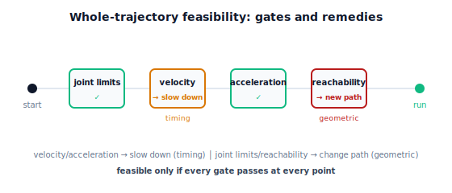

!!! abstract "You are here"
    **Module 7 — Trajectory Generation and Motion Planning**  ·  **Unit 5 — Feasibility: Velocity, Acceleration, and Limits**  ·  **Lesson 5.4 — Feasibility Across the Whole Trajectory: Reachability, Limits, and the Workspace**

# Lesson 5.4 — Feasibility Across the Whole Trajectory: Reachability, Limits, and the Workspace

> Lessons 5.1–5.3 handled speed and acceleration. But a trajectory has more ways to be impossible: a joint can run past its angle limit, or a Cartesian path can leave the workspace. This lesson assembles the **complete feasibility check** — every constraint, every point — and sorts violations into the two that matter: **timing-fixable** vs **geometric**. Then we recap Unit 5.

---

## 1. Why This Matters
Feasibility is not a single number checked once; it's a set of constraints that must hold at **every point** along the trajectory. A move can be fine on average and fail at one instant — a joint grazes its angle limit mid-swing, an acceleration spikes at a via-point, or a Cartesian straight line clips the edge of the workspace. Miss any one and the robot can't execute the plan.

Just as important is knowing *which kind* of violation you've hit, because the remedies differ. A **velocity or acceleration** violation is a **timing** problem — slow down (5.2) and it's gone. A **reachability** or **joint-angle-limit** violation is a **geometric** problem — slowing down does nothing; you need a different *path*. Confusing the two wastes time (slowing a trajectory that will never become reachable) or risks a crash (assuming a reachable-looking move is fine when a joint silently pegs its limit). This lesson gives the full checklist and the decision rule, completing the feasibility picture before planning (Unit 6) takes over.

## 2. Physical Intuition
Think of feasibility as a series of gates the trajectory must pass through, end to end. Gate 1: does every configuration keep each joint within its physical angle range (no joint asked to bend past its stop)? Gate 2: does every commanded speed and acceleration stay under the motor limits? Gate 3 (for tool-path moves): is every point on the path actually reachable — inside the workspace, not in a hole or beyond the arm's reach? The trajectory is feasible only if it clears **all** gates at **all** points.

Now the key intuition about fixes. Gate 2 (speed/accel) is a "you're going too fast" gate — back off the throttle (slow down) and you're through. But Gates 1 and 3 are "you literally can't be there" gates — no amount of slowing helps; the body simply can't reach that pose or that point. For those you must **change the route**: pick a different configuration branch, add a via-point, or plan around the obstacle (Unit 6). Recognizing which gate you failed tells you whether to reach for the clock or for a new path.

## 3. Mathematical Foundations
A trajectory $\mathbf q(t)$, $t\in[0,T]$ (or its Cartesian counterpart $\mathbf p(t)$ with $\mathbf q(t)=\text{IK}(\mathbf p(t))$), is **feasible** iff, sampled densely, it passes all of:

1. **Joint limits (geometric):** $q_{i,\min}\le q_i(t)\le q_{i,\max}$ for all joints $i$ and all $t$ — no joint exceeds its angular range.
2. **Velocity limits (timing):** $|\dot q_i(t)|\le \dot q_{\lim}$ for all $i,t$.
3. **Acceleration limits (timing):** $|\ddot q_i(t)|\le \ddot q_{\lim}$ for all $i,t$.
4. **Reachability (geometric, Cartesian moves):** every $\mathbf p(t)$ lies in the workspace so $\text{IK}(\mathbf p(t))$ exists — for the planar 2R arm, $L_1-L_2\le\lVert\mathbf p(t)\rVert\le L_1+L_2$ (the annulus), and the chosen IK branch stays consistent (Lesson 4.2).

**The decision rule.** Sort any violation into one of two buckets:

- **Timing-fixable** (checks 2–3): the path/geometry is fine; the motion is just too fast. **Slow down** — uniform time scaling (5.2) to the minimum feasible duration (5.3). Always works.
- **Geometric** (checks 1, 4): the trajectory wants a pose or tool point that *cannot exist*. Slowing down is useless. **Change the path** — pick a different IK branch, insert a via-point, or plan a route that avoids the violation (Unit 6).

Checking is done by **dense sampling**: evaluate the trajectory at enough points to catch a momentary violation (a coarse sample can skip the one instant a joint grazes its limit). For a synchronized quintic, checks 2–3 reduce to the peak formulas of 5.1; for splines and Cartesian moves, sample and test each point. The engine's `is_feasible(q0,qf,T,vlim,alim)` covers the synchronized-quintic speed/accel checks; joint-limit and reachability checks are simple per-sample tests (`ik_2link` returns `None` when unreachable).

## 4. Visual Explanation

<figure markdown>
  { width="680" }
</figure>

## 5. Engineering Example
A robot controller's pre-execution check does exactly this triage. Submit a program and it verifies joint limits, speed/accel limits, and (for linear moves) workspace reachability along the path — and the *error it returns tells you the remedy*. "Speed limit exceeded" → lower the feed rate (timing). "Joint limit / out of range" or "point not reachable / singularity" → the geometry is wrong; reorient the part, change the approach, or add a waypoint. For the harvester, a planned approach that's merely too fast gets a time stretch and runs; one that would drive a joint past its stop or send the tool outside the reachable annulus is rejected as geometrically infeasible and handed to the planner (Unit 6) to find a different route. Same check, two very different fixes.

## 6. Worked Example
Audit a Cartesian straight-line move of the tool from $\mathbf p_0=(0.6,0.1)$ to $\mathbf p_1=(0.1,0.1)$ over $T=0.7$ s ($L_1=0.4,L_2=0.3$, $\dot q_{\lim}=2$, $\ddot q_{\lim}=4$).

- **Reachability (geometric):** the line passes through $x=0.25,y=0.1$, radius $\lVert\cdot\rVert\approx0.27$. The inner workspace radius is $L_1-L_2=0.1$; points with radius $<0.1$ would fail. Here the minimum radius along the line is $\approx0.1$ (at $x=0,y=0.1$ — but the line stops at $x=0.1$, radius $\approx0.14$), so it stays just inside — *reachable*, but a slightly longer line through the origin would fail and **no slowdown could fix it**.
- **Velocity/acceleration (timing):** with $T=0.7$ s the IK-per-sample joint speeds may exceed $2$ rad/s near the inner radius (where small tool moves need large joint moves). If so, **slow down**: stretch $T$ until the peaks fit — a timing fix.
- **Decision:** the reachability check passes (geometric OK), so any remaining violation is timing — stretch $T$. Had the line dipped into the hole, slowing would be futile and the path would need rerouting. The notebook runs all four checks per sample and reports the violated gate and its remedy.

## 7. Interactive Demonstration
*(Conceptual — runnable in the companion notebook.)*

**Run the gauntlet.** In the notebook you:

1. Build a trajectory and check all four constraints by dense sampling.
2. Introduce a velocity violation (too-short $T$) and confirm slowing down clears it (timing-fixable).
3. Introduce a reachability violation (a line through the inner hole) and confirm slowing down does **not** clear it (geometric) — only a different path would.

## 8. Coding Exercise

!!! tip "Run the hands-on notebook"
    `modules/module07/notebooks/lesson20_whole_trajectory_feasibility.ipynb` — open in JupyterLab and run **Kernel → Restart & Run All**.

*(Snippet / notebook task — uses `is_feasible`, `feasible_duration`, `ik_2link`.)*

In the companion notebook:

1. Write a whole-trajectory feasibility checker that samples densely and tests joint limits, velocity, acceleration, and (for Cartesian moves) reachability, returning the first violated check.
2. Assert a too-fast move is flagged as a **timing** violation and that `feasible_duration` + time scaling clears it.
3. Assert an out-of-workspace straight line is flagged as a **geometric** (reachability) violation that time scaling does **not** fix — distinguishing the two remedies in code.

## 9. Knowledge Check

Formative — unlimited attempts, immediate feedback; does not affect your grade.

<iframe src="../../quizzes/module07/lesson20_quiz.html" title="Feasibility Across the Whole Trajectory: Reachability, Limits, and the Workspace knowledge check" style="width:100%;height:720px;border:1px solid #e2e8f0;border-radius:12px"></iframe>

[Open this quiz in a new tab ↗](../quizzes/module07/lesson20_quiz.html)

1. List the four feasibility checks a trajectory must pass along its whole length.
2. Which violations are fixed by slowing down, and which are not?
3. Why must feasibility be checked by dense sampling rather than at the endpoints only?
4. What remedy does a reachability violation call for, and why won't slowing down help?

## 10. Challenge Problem
A synchronized joint trajectory passes the velocity and acceleration checks but a single joint momentarily exceeds its **angle limit** at one interior point. Is this timing-fixable or geometric, and what's the correct remedy? Then describe how you would modify the trajectory minimally to satisfy the joint limit while keeping the endpoints — and explain why this is really a *via-point* problem, connecting Unit 3 (via-points) to feasibility. *(Geometric violations route you back to path design.)*

## 11. Common Mistakes
- **Checking only the endpoints.** A violation can occur at one interior instant; sample densely.
- **Slowing down to fix a geometric problem.** Reachability and joint-limit violations need a new path, not more time.
- **Forgetting joint-angle limits.** Velocity/acceleration aren't the only limits; a joint can peg its range.
- **Ignoring IK branch consistency in the audit.** A Cartesian move can be "reachable" yet still flip branches (Lesson 4.2) — check that too.

## 12. Key Takeaways
- A trajectory is feasible only if it passes **every** check — joint limits, velocity, acceleration, reachability — at **every** point (dense sampling).
- Violations split into **timing-fixable** (velocity/acceleration → **slow down**) and **geometric** (joint limits, reachability → **change the path**).
- Slowing down always beats speed/accel limits but **never** makes an unreachable point reachable or an over-range joint legal.
- **Unit 5 recap:** why a trajectory can be infeasible (5.1) → slowing down via uniform time scaling (5.2) → the fastest feasible timing under limits (5.3) → the whole-trajectory check and timing-vs-geometric triage (5.4). Geometric infeasibility hands off to **motion planning** — Unit 6.

---

### AI Learning Companion

Copy any prompt below into your AI tutor.

- **Tutor (re-explain):** "Re-explain whole-trajectory feasibility as a set of gates (joint limits, velocity, acceleration, reachability) checked at every point. Stress the timing-fixable vs geometric distinction and the right remedy for each. Then give me a trajectory to audit."
- **Practice (generate exercises):** "Give me three trajectory feasibility scenarios with one violated check each. Ask me to name the violated check and whether to slow down or change the path. Withhold answers until I respond."
- **Explore (connect to the real world):** "Explain how a robot controller's pre-execution check triages errors — speed-limit (slow down) vs joint-limit/unreachable (change geometry) — and what an operator does for each."

### Global Learning Support

Per-language explanation prompts — use whichever you think best in.

- **English (authoritative):** "Explain whole-trajectory feasibility for a robot: the checks (joint limits, velocity, acceleration, reachability) at every point, and the distinction between timing-fixable (slow down) and geometric (change the path) violations, at a robotics-course level."
- **Español:** "Explica la factibilidad de toda la trayectoria para un robot: las comprobaciones (límites articulares, velocidad, aceleración, alcanzabilidad) en cada punto, y la distinción entre violaciones corregibles con el tiempo (ralentizar) y geométricas (cambiar la trayectoria), a nivel de curso de robótica."
- **中文（简体）：** "用机器人课程的水平，解释整条轨迹的可行性：在每个点上的检查（关节限位、速度、加速度、可达性），以及可通过时序修复（放慢）与几何性（更换路径）违规之间的区别。"
- **Türkçe:** "Bir robot için tüm-yörünge uygulanabilirliğini açıkla: her noktadaki kontroller (eklem limitleri, hız, ivme, erişilebilirlik) ve zamanlama ile düzeltilebilir (yavaşla) ile geometrik (yolu değiştir) ihlaller arasındaki ayrımı robotik dersi düzeyinde anlat."

---

*Next lesson: 6.1 — Obstacles and Forbidden Regions: Configuration Space (Unit 6 begins — when an obstacle blocks the way).*
