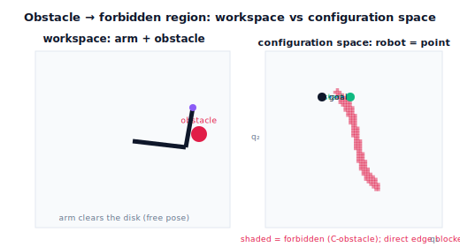

!!! abstract "You are here"
    **Module 7 — Trajectory Generation and Motion Planning**  ·  **Unit 6 — Motion Planning and Collision Awareness**  ·  **Lesson 6.1 — Obstacles and Forbidden Regions: Configuration Space**

# Lesson 6.1 — Obstacles and Forbidden Regions: Configuration Space

> Unit 5 ended with *geometric* infeasibility: a path that wants an impossible pose or hits something. When the "something" is an **obstacle**, we need to plan around it. The key idea that makes planning tractable is **configuration space** — and we introduce it not as abstract math but as the most useful *picture* in robotics: the robot becomes a single point, and the obstacle becomes a region that point must avoid. We lead by *seeing* it.

---

## 1. Why This Matters
The harvester works inside a cluttered canopy: stems, wires, other fruit, the frame. A straight joint or tool move can drive a *link* — not just the gripper — into one of these. So the planner must reason about the **whole arm's** collisions, for every configuration along a motion. Doing that directly in the workspace is awkward: the arm is an extended, jointed body, and "does any part of it touch the obstacle?" depends on all the joint angles at once.

**Configuration space** (C-space) is the idea that tames this. Instead of tracking an extended arm dodging an obstacle in the workspace, we track a single **point** — the configuration $(q_1,q_2)$ — moving in the space of all joint angles. The obstacle, however simple in the workspace, casts a **forbidden region** in C-space: every configuration that puts *any* part of the arm in collision. Planning then becomes a clean question — *move the point from start to goal through the free region, around the forbidden one.* This lesson builds that picture concretely, with a visualizer that shows the forbidden region appear as you place an obstacle. It's the conceptual foundation for everything in Unit 6.

## 2. Physical Intuition
Hold your arm out and imagine a pole standing in front of you. Which *arm poses* make you bump the pole? Not a single one — a whole family of them: any combination of shoulder and elbow angles that swings your forearm or upper arm into the pole. If you drew a chart with shoulder angle across and elbow angle up, you could shade in every (shoulder, elbow) pair that collides. That shaded blob is the pole's **forbidden region** — and a pole (a simple object) can make a surprisingly large, oddly-shaped blob, because *many* arm poses hit it.

Now the trick: forget the arm. You are a **dot** on that chart, at your current (shoulder, elbow). To move your hand somewhere without hitting the pole, you just need to slide the dot from where it is to where you want it **without entering the shaded blob.** The extended, awkward arm-dodging-a-pole problem became "move a dot around a blob." That re-framing — robot as a point, obstacle as a region — is configuration space, and it's why planning becomes doable.

## 3. Mathematical Foundations
The **configuration space** $\mathcal C$ is the set of all configurations $\mathbf q=(q_1,\dots,q_n)$. For the planar 2R arm, $\mathcal C$ is the $(q_1,q_2)$ plane (each angle in $[-\pi,\pi]$). A single point in $\mathcal C$ *is* a complete arm pose.

Given a static workspace obstacle $\mathcal O$, the **configuration-space obstacle** (C-obstacle) is

$$\mathcal C_{\text{obs}} = \{\,\mathbf q \in \mathcal C : \text{the arm at } \mathbf q \text{ intersects } \mathcal O\,\}.$$

Its complement is the **free space** $\mathcal C_{\text{free}} = \mathcal C \setminus \mathcal C_{\text{obs}}$ — the configurations where the whole arm is clear. A **motion** is a curve in $\mathcal C$; it is collision-free iff it stays entirely in $\mathcal C_{\text{free}}$. So:

$$\textbf{planning} = \text{find a curve in } \mathcal C_{\text{free}} \text{ from } \mathbf q_{\text{start}} \text{ to } \mathbf q_{\text{goal}}.$$

Two features worth noting (as *observations*, not heavy theory). First, a simple convex workspace obstacle generally produces a **complicated, non-convex** C-obstacle — because the map from joint angles to the arm's shape is nonlinear (the same nonlinearity that curves tool paths in 3.1). Second, the C-obstacle depends on the *whole* arm geometry (both links), not just the tool — which is exactly why C-space is the right place to reason about collisions. We compute it here by **sampling**: grid the $(q_1,q_2)$ plane and mark each cell collision or free (the next lesson does the per-configuration collision test). The engine builds this grid with `cspace_grid(center, radius)` for a disk obstacle, returning the boolean $\mathcal C_{\text{obs}}$ over a $(q_1,q_2)$ grid.

(Scope: we treat $\mathcal C$ as the plane and ignore angle wrap-around topology — a deliberate simplification; the practical picture is what matters. Obstacles are **static**.)

## 4. Visual Explanation

<figure markdown>
  { width="680" }
</figure>

## 5. Engineering Example
Configuration space is the bedrock of practical motion planning across robotics — from industrial arms routing around fixtures to mobile robots navigating rooms (where C-space adds the robot's orientation). Planning software represents the world this way because collision-checking a point against a precomputed or sampled free space is far cheaper and cleaner than reasoning about an extended manipulator in the workspace at every step. For the harvester, the canopy's stems and frame define a C-obstacle in the arm's joint space; the planner's whole job is to keep the configuration point inside $\mathcal C_{\text{free}}$ from the current pose to the pre-grasp pose. Seeing the obstacle as a forbidden region — not as a thing the gripper alone must miss — is what lets the planner protect the *entire* arm.

## 6. Worked Example
Place a small disk obstacle near the workspace at center $(0.5,0.05)$, radius $0.06$, with the 2R arm ($L_1=0.4,L_2=0.3$).

- **Sample the C-space:** grid $(q_1,q_2)$ and, for each, test whether either link intersects the disk. The collision cells form the C-obstacle — a curved band, not a disk, because many arm poses reach toward that workspace region.
- **Pick two free configurations:** a start with the tool at $(0.45,0.25)$ and a goal at $(0.45,-0.25)$ (both elbow-up). Both are in $\mathcal C_{\text{free}}$ (the arm clears the disk).
- **Observe the obstruction:** the straight C-space segment from start to goal **crosses** the C-obstacle band — a direct joint move would drive a link through the disk. So a path must **detour** around the band, even though both endpoints are free.
- The notebook builds the grid (about 10% of cells blocked here), confirms start/goal are free, and shows the direct segment is blocked — motivating the planner of Lesson 6.3. (The same scenario runs through 6.2–6.4.)

## 7. Interactive Demonstration

<iframe src="../../demos/module07/lesson21_cspace_visualizer.html" title="Obstacles and Forbidden Regions: Configuration Space interactive demo" style="width:100%;height:520px;border:1px solid #e2e8f0;border-radius:12px"></iframe>

[Open this demo in a new tab ↗](../demos/module07/lesson21_cspace_visualizer.html)

*(Conceptual — runnable in the companion notebook.)*

**See the forbidden region.** In the notebook you:

1. Build the C-space occupancy grid for a disk obstacle with `cspace_grid` and display it (free vs forbidden).
2. Drop the start and goal configurations onto the grid and confirm both are free.
3. Draw the straight C-space segment between them and see it cross the C-obstacle — the obstruction a planner must route around.

## 8. Coding Exercise

!!! tip "Run the hands-on notebook"
    `modules/module07/notebooks/lesson21_configuration_space.ipynb` — open in JupyterLab and run **Kernel → Restart & Run All**.

*(Snippet / notebook task — uses `cspace_grid`, `arm_hits_disk`, `ik_2link`.)*

In the companion notebook:

1. Build the C-obstacle grid for a disk obstacle and assert it contains both free and forbidden cells (a nontrivial obstacle).
2. Assert two chosen start/goal configurations are collision-free (`arm_hits_disk` is False), and that the straight C-space segment between them **does** pass through a collision (a direct move is blocked).
3. Visualize the workspace (arm + obstacle) alongside the C-space grid with the configuration point marked — making "robot as a point, obstacle as a region" concrete.

## 9. Knowledge Check

Formative — unlimited attempts, immediate feedback; does not affect your grade.

<iframe src="../../quizzes/module07/lesson21_quiz.html" title="Obstacles and Forbidden Regions: Configuration Space knowledge check" style="width:100%;height:720px;border:1px solid #e2e8f0;border-radius:12px"></iframe>

[Open this quiz in a new tab ↗](../quizzes/module07/lesson21_quiz.html)

1. What is a configuration-space obstacle (C-obstacle), in terms of arm collisions?
2. In configuration space, what does the robot become, and what does a motion become?
3. Why can a simple round workspace obstacle produce a complicated, non-convex C-obstacle?
4. Why is C-space the right place to reason about *whole-arm* collisions?

## 10. Challenge Problem
A disk obstacle sits directly between the base and a target so that *every* arm pose reaching the target passes a link through it. Describe what the C-obstacle looks like relative to the goal configuration (is the goal even in $\mathcal C_{\text{free}}$?), and what that implies about whether a collision-free path can exist at all. Then explain how moving the obstacle slightly, or allowing the *other* elbow branch, could open a free path — connecting C-space topology to IK branches (Lesson 4.2). *(Whether a path exists is a question about the connectivity of $\mathcal C_{\text{free}}$.)*

## 11. Common Mistakes
- **Thinking only about the gripper.** A C-obstacle includes every pose where *any* link collides — plan for the whole arm.
- **Expecting the C-obstacle to look like the workspace obstacle.** The nonlinear arm map distorts a round obstacle into a curved C-space band.
- **Assuming reachable endpoints imply a free path.** Both endpoints can be free while the direct C-space segment is blocked (and a path may need to detour, or may not exist).
- **Treating C-space as abstract math.** It's a practical picture: robot = point, obstacle = forbidden region, motion = curve through free space.

## 12. Key Takeaways
- A workspace **obstacle** becomes a **forbidden region** ($\mathcal C_{\text{obs}}$) in configuration space — every configuration where any part of the arm collides.
- In C-space the **robot is a single point** and a **motion is a curve**; a collision-free motion stays in the **free space** $\mathcal C_{\text{free}}$.
- **Planning = find a curve in $\mathcal C_{\text{free}}$** from start to goal — the obstacle-avoidance problem made tractable.
- A simple round obstacle can cast a **complicated, non-convex** C-obstacle (the nonlinear arm map), and the direct segment between two free configurations can still be blocked.

---

### AI Learning Companion

Copy any prompt below into your AI tutor.

- **Tutor (re-explain):** "Re-explain configuration space using the 'arm avoiding a pole becomes a dot avoiding a blob' analogy. Stress that the robot is a point and the obstacle is a forbidden region. Then ask me what a collision-free motion looks like in C-space."
- **Practice (generate exercises):** "Give me three planar-arm + obstacle situations and ask me to describe, qualitatively, what the C-obstacle looks like and whether a straight C-space path between two free configurations would be blocked. Withhold answers until I respond."
- **Explore (connect to the real world):** "Explain why motion planners represent the world in configuration space, and how C-space extends to mobile robots (adding orientation) and higher-DOF arms."

### Global Learning Support

Per-language explanation prompts — use whichever you think best in.

- **English (authoritative):** "Explain configuration space for a robot arm: how a workspace obstacle becomes a forbidden region, the robot as a point moving through free space, and why planning is finding a curve in free space, at a robotics-course level (practical, not abstract)."
- **Español:** "Explica el espacio de configuración para un brazo robótico: cómo un obstáculo del espacio de trabajo se convierte en una región prohibida, el robot como un punto que se mueve por el espacio libre, y por qué planificar es hallar una curva en el espacio libre, a nivel de curso de robótica (práctico, no abstracto)."
- **中文（简体）：** "用机器人课程的水平（要实用、不抽象），解释机械臂的位形空间：工作空间中的障碍如何变成禁止区域，机器人作为一个点在自由空间中移动，以及为何规划就是在自由空间中找一条曲线。"
- **Türkçe:** "Bir robot kolu için konfigürasyon uzayını açıkla: çalışma uzayındaki bir engelin nasıl yasak bir bölgeye dönüştüğünü, robotun serbest uzayda hareket eden bir nokta olduğunu ve planlamanın neden serbest uzayda bir eğri bulmak olduğunu robotik dersi düzeyinde anlat (soyut değil, pratik)."

---

*Next lesson: 6.2 — Collision Checking: Is This Configuration Safe? (the test that builds the free space).*
