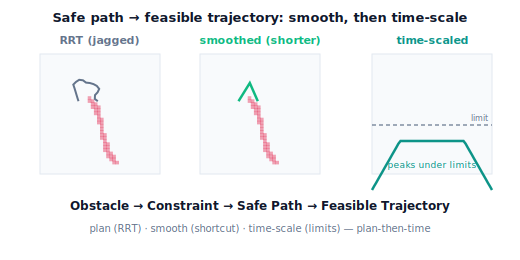

!!! abstract "You are here"
    **Module 7 — Trajectory Generation and Motion Planning**  ·  **Unit 6 — Motion Planning and Collision Awareness**  ·  **Lesson 6.4 — From Safe Path to Feasible Trajectory: Smoothing and Time Scaling**

# Lesson 6.4 — From Safe Path to Feasible Trajectory: Smoothing and Time Scaling

> The RRT (6.3) gave a collision-free path, but it's jagged and has no timing — it's a *route*, not yet a *trajectory*. This lesson adds the two finishing steps: **smooth** the route (remove the random zig-zags, stay collision-free) and **time-scale** it (respect the limits from Unit 5). That completes the whole-unit chain — Obstacle → Constraint → Safe Path → Feasible Trajectory — and closes Module 7's first six units.

---

## 1. Why This Matters
A raw RRT path is collision-free, which is the hard part — but it's not something you'd run as-is. It **zig-zags** (built from random steps), so the robot would lurch needlessly, wasting time and stressing the mechanism. And it's **untimed** — just a sequence of configurations, with no velocities, no duration, no guarantee the motors can track it. To actually move the harvester, we need a *trajectory*: smooth in space and feasible in time.

Two finishing steps get us there, reusing everything we've built. First, **smooth** the path — shortcut away the random detours while keeping it collision-free — so the route is short and direct. Second, **time-scale** it — apply the timing tools of Unit 5 so every joint stays within its velocity and acceleration limits. The result is a smooth, collision-free, feasible trajectory the M6 velocity layer can execute open-loop. This lesson assembles the complete pipeline the architect framed as the goal — **Obstacle → Constraint → Safe Path → Feasible Trajectory** — tying Units 5 and 6 together, and it's the natural close of the module's core.

## 2. Physical Intuition
A path found by random exploration is like the route a lost hiker takes finding a way through woods: it gets there without hitting trees, but it wanders. Once you can *see* the whole route, you straighten it: "I went left then right then left — but I could have just cut straight across **here**, and that line is also clear." Each such shortcut, if it doesn't hit a tree, replaces a wandering detour with a straight segment. Repeat a few times and the wandering route becomes a short, sensible one — still avoiding every tree.

Then you decide *how fast* to walk it. A child can run; carrying a full tray you go slowly and smoothly. Same route, timed to what's safe to carry. For the robot, "straighten the wandering route" is **shortcut smoothing** (test a direct connection between two path points; if collision-free, replace the in-between), and "decide how fast" is **time scaling** to the velocity/acceleration limits (Unit 5). Smooth in space, gentle in time — now it's a trajectory you can actually run.

## 3. Mathematical Foundations
Start with the RRT path $\mathbf q^{(0)},\dots,\mathbf q^{(M)}$ — collision-free but jagged and untimed.

**Step 1 — Shortcut smoothing.** Repeatedly pick two path points $\mathbf q^{(i)},\mathbf q^{(j)}$ ($i<j$) and test whether the **straight C-space segment** between them is collision-free (Lesson 6.2). If it is, **replace** the sub-path $\mathbf q^{(i)}\dots\mathbf q^{(j)}$ with the direct segment, removing the intermediate zig-zags. Each accepted shortcut shortens the path (and never adds collisions, because the replacement edge is checked). After enough iterations the path is much shorter and more direct, still entirely in $\mathcal C_{\text{free}}$. (Optionally, fit a $C^2$ spline through the shortened waypoints — Lesson 3.4 — for a smooth curve; the spline must then be re-checked for collisions.) The engine does the shortcutting with `shortcut_smooth(path, center, radius, rng)`, and `path_length` measures the improvement.

**Step 2 — Time scaling.** The smoothed path is still just geometry. Turn it into a trajectory by assigning a time scaling (Units 2–3): treat the waypoints as via-points and build a synchronized, blended trajectory (3.2/3.4), then **time-scale it to respect limits** (5.2/5.3) — stretch the duration until every joint's velocity and acceleration peak fits under $\dot q_{\lim}$, $\ddot q_{\lim}$, optionally using the fastest-feasible (trapezoidal) timing. The output $\mathbf q(t)$ is smooth, collision-free, and feasible.

**The full pipeline (the unit's objective).**

$$\underbrace{\text{Obstacle}}_{\text{workspace}} \;\to\; \underbrace{\text{C-obstacle (Constraint)}}_{\text{6.1, free space}} \;\to\; \underbrace{\text{Safe Path}}_{\text{6.2 check, 6.3 RRT, 6.4 smooth}} \;\to\; \underbrace{\text{Feasible Trajectory}}_{\text{6.4 time-scale, Unit 5}}.$$

Note the deliberate **decoupling**: we plan a geometric *path* first, then time it — we do **not** plan path and timing together (that's kinodynamic planning, out of scope). This keeps each step simple and reuses the whole module. The trajectory is, as always, an open-loop **reference** the M6 velocity layer executes; tracking it under disturbance is Module 8.

## 4. Visual Explanation

<figure markdown>
  { width="680" }
</figure>

## 5. Engineering Example
This post-processing is standard in motion-planning stacks: a sampling-based planner produces a raw path, a **shortcutting/smoothing** stage cleans it, and a **time-parameterization** stage (often the time-optimal-under-limits timing of Lesson 5.3) turns it into an executable trajectory — then a final collision + limit check validates it before it runs. The decoupled "plan path, then time it" structure is exactly how most industrial and research systems organize manipulation motion, because it's modular and reuses well-understood pieces. For the harvester, the canopy obstacle yields a C-obstacle, the RRT finds a route around it, shortcutting straightens the route, and time-scaling makes it gentle enough for the wrist motor and the fruit — a smooth, safe, feasible reach delivered to the velocity layer.

## 6. Worked Example
Finish the canonical scenario: disk $\mathbf c=(0.5,0.05)$, $r=0.06$; RRT path from start to goal (Lesson 6.3).

- **Smooth.** The raw RRT path (say ~10–18 nodes, C-space length ~3.3) goes through `shortcut_smooth`. Random shortcuts that stay collision-free collapse the zig-zags; the result is ~3–4 waypoints with a noticeably shorter length (e.g. 3.3 → ~2.2), still fully collision-free (`path_collision_free` True).
- **Time-scale.** Treat the smoothed waypoints as via-points; build a synchronized blended trajectory and stretch its duration until each joint's peak speed and acceleration sit under the limits (Unit 5). The result has a concrete duration $T$ and stays within $\dot q_{\lim}$, $\ddot q_{\lim}$.
- **Verify.** Run the whole-trajectory feasibility audit (Lesson 5.4): collision-free along the path, all joints within angle/velocity/acceleration limits, reachable throughout. It passes — a deliverable trajectory.
- The notebook runs RRT → smooth → time-scale → verify end to end, printing the length reduction and confirming the final trajectory is collision-free and within limits.

## 7. Interactive Demonstration

<iframe src="../../demos/module07/lesson24_smoothing_time_scaling.html" title="From Safe Path to Feasible Trajectory: Smoothing and Time Scaling interactive demo" style="width:100%;height:520px;border:1px solid #e2e8f0;border-radius:12px"></iframe>

[Open this demo in a new tab ↗](../demos/module07/lesson24_smoothing_time_scaling.html)

*(Conceptual — runnable in the companion notebook.)*

**Route → smooth → time → verify.** In the notebook you:

1. Take the RRT path, shortcut-smooth it, and confirm it's shorter yet still collision-free.
2. Time-scale the smoothed path to the velocity/acceleration limits and read off the duration.
3. Run the full feasibility audit (collision + limits + reachability) and confirm the finished trajectory passes — the complete Obstacle → Feasible Trajectory pipeline.

## 8. Coding Exercise

!!! tip "Run the hands-on notebook"
    `modules/module07/notebooks/lesson24_path_to_trajectory.ipynb` — open in JupyterLab and run **Kernel → Restart & Run All**.

*(Snippet / notebook task — uses `rrt`, `shortcut_smooth`, `path_length`, `path_collision_free`, `feasible_duration`.)*

In the companion notebook:

1. Plan with `rrt`, then `shortcut_smooth`; assert the smoothed path is **shorter** (`path_length` decreases) and **still collision-free** (`path_collision_free` True).
2. Time-scale the smoothed waypoints to the limits and assert the resulting trajectory's peak velocity/acceleration are within $\dot q_{\lim}$, $\ddot q_{\lim}$.
3. Run a final combined check (collision-free along the path **and** within limits) and assert it passes — the end-to-end pipeline producing a deliverable trajectory.

## 9. Knowledge Check

Formative — unlimited attempts, immediate feedback; does not affect your grade.

<iframe src="../../quizzes/module07/lesson24_quiz.html" title="From Safe Path to Feasible Trajectory: Smoothing and Time Scaling knowledge check" style="width:100%;height:720px;border:1px solid #e2e8f0;border-radius:12px"></iframe>

[Open this quiz in a new tab ↗](../quizzes/module07/lesson24_quiz.html)

1. Why is a raw RRT path not yet an executable trajectory?
2. How does shortcut smoothing shorten a path while keeping it collision-free?
3. What does time scaling add, and which limits must the final trajectory respect?
4. State the four stages of the Obstacle → Feasible Trajectory pipeline and where each was built.

## 10. Challenge Problem
After shortcutting, you fit a $C^2$ spline through the remaining waypoints for smoothness — but the spline **bulges** slightly and now clips the obstacle, even though the shortcut segments were clear. Explain why smoothing can *introduce* a collision, and describe a practical fix (e.g. re-check the spline and re-insert a waypoint, or limit the spline's deviation). Then explain why time scaling, by contrast, can **never** introduce a collision. *(Smoothing changes geometry — recheck it; timing changes only the clock.)*

## 11. Common Mistakes
- **Running the raw RRT path.** It's jagged and untimed; always smooth and time-scale before execution.
- **Forgetting to re-check after spline smoothing.** A smoothing curve can bulge into an obstacle; re-collision-check changed geometry.
- **Time-scaling before smoothing.** Time a clean path, not the zig-zags — otherwise you carefully time a route you're about to change.
- **Assuming the timed path is automatically reachable/limit-safe.** Run the full Lesson 5.4 audit on the final trajectory.

## 12. Key Takeaways
- A raw RRT path is collision-free but **jagged and untimed** — a route, not a trajectory.
- **Shortcut smoothing** replaces random zig-zags with direct, collision-checked segments, shortening the path while keeping it collision-free.
- **Time scaling** then turns the smoothed path into a trajectory that respects velocity and acceleration limits (Unit 5).
- This completes **Obstacle → Constraint → Safe Path → Feasible Trajectory**, the deliberate *plan-then-time* (non-kinodynamic) pipeline — and **Unit 6 recap:** configuration space (6.1) → collision checking (6.2) → RRT (6.3) → smoothing + time scaling (6.4). The trajectory remains an open-loop reference the M6 velocity layer executes; tracking is Module 8.

---

### AI Learning Companion

Copy any prompt below into your AI tutor.

- **Tutor (re-explain):** "Re-explain turning an RRT path into a trajectory using the 'straighten the lost-hiker's route, then decide how fast to walk it' analogy. Stress shortcut smoothing (stay collision-free) then time scaling (respect limits). Then walk me through the Obstacle → Feasible Trajectory pipeline."
- **Practice (generate exercises):** "Quiz me on the plan-smooth-time pipeline: give me a stage and ask what it produces, what it preserves, and what could go wrong. Withhold answers until I respond."
- **Explore (connect to the real world):** "Explain the standard motion-planning stack — sampling-based planner, shortcutting/smoothing, time-parameterization, final validation — and why the plan-then-time decoupling is used (vs kinodynamic planning)."

### Global Learning Support

Per-language explanation prompts — use whichever you think best in.

- **English (authoritative):** "Explain turning a collision-free RRT path into an executable trajectory: shortcut smoothing (preserving collision-freedom) then time scaling to velocity/acceleration limits, and the Obstacle → Constraint → Safe Path → Feasible Trajectory pipeline, at a robotics-course level (plan-then-time, no kinodynamics)."
- **Español:** "Explica cómo convertir una trayectoria RRT libre de colisiones en una trayectoria ejecutable: suavizado por atajos (preservando la ausencia de colisiones) y luego escalado temporal a los límites de velocidad/aceleración, y la cadena Obstáculo → Restricción → Camino Seguro → Trayectoria Factible, a nivel de curso de robótica (planificar-luego-temporizar, sin kinodinámica)."
- **中文（简体）：** "用机器人课程的水平，解释如何把无碰撞的 RRT 路径变成可执行轨迹：捷径平滑（保持无碰撞）再做时间缩放以满足速度/加速度限制，以及'障碍 → 约束 → 安全路径 → 可行轨迹'的流程（先规划后定时，不涉及运动动力学规划）。"
- **Türkçe:** "Çarpışmasız bir RRT yolunu uygulanabilir bir yörüngeye dönüştürmeyi açıkla: kısayol yumuşatma (çarpışmasızlığı koruyarak) ve ardından hız/ivme limitlerine zaman ölçekleme, ve Engel → Kısıt → Güvenli Yol → Uygulanabilir Yörünge zincirini robotik dersi düzeyinde anlat (önce-planla-sonra-zamanla, kinodinamik yok)."

---

*Next: Installment D — Unit 7 (Trajectory Quality, Validation, and Tracking Prerequisites) and Unit 8 (Capstone: Plan → Parameterize → Validate → Execute), completing Module 7.*
