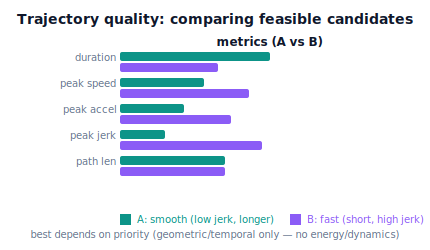

!!! abstract "You are here"
    **Module 7 — Trajectory Generation and Motion Planning**  ·  **Unit 7 — Trajectory Quality, Validation, and Tracking Prerequisites**  ·  **Lesson 7.1 — What Makes a Trajectory Good? Quality Metrics**

# Lesson 7.1 — What Makes a Trajectory Good? Quality Metrics

> Units 1–6 produced trajectories that are smooth, reach the goal, are feasible, and avoid obstacles. But for any task there are *many* such trajectories — so which is **best**? This unit is about judging quality. We start by naming the concrete metrics that separate a good motion from a merely-acceptable one, and we *see* two valid trajectories compared side by side.

---

## 1. Why This Matters
Feasibility (Unit 5) is a pass/fail gate; quality is a *ranking*. Once you have several trajectories that all clear the gates — collision-free, within limits, reaching the goal — you still have to pick one, and that choice has real consequences. A jerky trajectory shakes the mechanism and may bruise the fruit; an unnecessarily slow one wastes cycle time; a wandering tool path travels farther than it needs to. "Good motion" isn't a vibe — it's measurable, and the harvester's throughput and gentleness depend on measuring it.

This lesson names the handful of metrics that capture trajectory quality: **duration** (how long), **peak speed** and **peak acceleration** (how hard it pushes the limits), **peak jerk** (how smooth — the rate of change of acceleration), and **Cartesian path length** (how far the tool travels). These let you compare candidates objectively and make the smooth-vs-fast trade (Unit 2) with numbers instead of intuition. Crucially, they are all **geometric and temporal** — they never touch energy, torque, or dynamics (those are Module 8 and beyond). Quality here means "well-shaped, well-timed motion," and that's exactly what we can compute from the trajectory itself.

## 2. Physical Intuition
Think of two drivers covering the same route. One accelerates and brakes hard, swerves, and arrives a few seconds sooner; the other drives smoothly, holds steady speeds, and arrives slightly later with coffee unspilled. Both "succeeded" — same start, same destination, no crash. But you'd rank them differently depending on what you care about: raw time, or smoothness and comfort. The difference is captured by simple numbers — how long it took, how hard the peak accelerations were, how abrupt the jerks, how much extra distance the swerving added.

Robot trajectories are judged the same way. Two feasible motions to the same goal can differ in duration, in how close they ride to the speed/acceleration limits, in how abruptly acceleration changes (jerk), and in how far the tool actually travels. A "good" harvest motion is usually the one that is smooth (low jerk — gentle on fruit and mechanism), reasonably quick (short duration), and efficient in path (short tool travel) — and the metrics make those qualities concrete so you can compare candidates instead of guessing.

## 3. Mathematical Foundations
Given a reference trajectory $\mathbf q(t)$, $t\in[0,T]$, the quality metrics are:

- **Duration:** $T$ — total time. Shorter is faster (but pushes limits harder).
- **Peak speed:** $\max_{t,i}|\dot q_i(t)|$ — the largest joint speed reached. Near the velocity limit means the timing is aggressive.
- **Peak acceleration:** $\max_{t,i}|\ddot q_i(t)|$ — the largest acceleration. Near the acceleration limit likewise.
- **Peak jerk:** $\max_{t,i}|\dddot q_i(t)|$ — the largest rate of change of acceleration. **Smoothness** is low jerk; high jerk means abrupt changes that shake the mechanism (Lesson 2.4). For a quintic, jerk is finite and bounded; for a trapezoidal profile, jerk spikes at the corners.
- **Cartesian path length:** $\int_0^T \lVert \dot{\mathbf p}(t)\rVert\,dt$, where $\mathbf p(t)=\text{FK}(\mathbf q(t))$ — how far the *tool* travels in space. A wandering path is longer than necessary; smoothing (Lesson 6.4) shortens it.

These trade off against each other. Shrinking $T$ raises peak speed, acceleration, and jerk (Lesson 5.1's $1/T$, $1/T^2$ scaling); a smoother profile (quintic, S-curve) lowers jerk but costs time versus a trapezoid. So "best" depends on a **weighting** of the metrics for the task — gentle fruit handling weights jerk low; fast repositioning weights duration low. There is no single universal best; there is a best *for a stated priority*.

**What these are not.** They are geometric/temporal only. They are **not** energy, **not** torque, **not** actuator effort — computing those requires the robot's dynamics (mass, inertia), which is **Module 8 and beyond**, outside Module 7's scope. We measure the *shape and timing* of motion, not its physical cost.

The engine summarizes a reference with `trajectory_metrics(ref_fn, T)`, returning duration, peak speed, peak acceleration, peak jerk, and Cartesian path length.

## 4. Visual Explanation

<figure markdown>
  { width="680" }
</figure>

## 5. Engineering Example
Trajectory quality metrics are exactly what motion-planning and CAM software report and optimize against: cycle time (duration), commanded speed/acceleration margins, jerk limits (jerk-limited "S-curve" planning exists precisely to bound this metric), and path length. A pick-and-place line is tuned by trading these — push duration down until jerk or acceleration margins get uncomfortable, then back off. Surface-finish on a CNC depends on jerk; ride comfort in an elevator or train is literally a jerk specification. For the harvester, the grasp-and-place motion is chosen to keep jerk low (protecting fruit and the slender wrist) while keeping duration acceptable for throughput — a weighted choice among feasible candidates, made with these numbers. None of it requires dynamics: it's all read off the trajectory's shape and timing.

## 6. Worked Example
Compare two feasible motions for the same harvest reposition (a 1.2 rad joint move).

- **A — quintic, $T=2.0$ s:** peak speed $=15\cdot1.2/(8\cdot2.0)=1.13$ rad/s; peak accel $=(10/\sqrt3)\cdot1.2/2.0^2=1.73$ rad/s²; jerk is smooth and bounded; tool path is the natural arc.
- **B — trapezoidal, $T=1.4$ s (faster):** reaches its speed/accel limits and finishes sooner, but jerk **spikes** at the ramp corners (only $C^1$); duration is shorter.
- **Verdict:** B wins on **duration** (1.4 vs 2.0 s); A wins on **jerk/smoothness** (no corner spikes). If the task is delicate fruit handling, pick A (low jerk matters more than 0.6 s); if it's a fast empty-gripper reposition, pick B. Same start, same goal, both feasible — the metrics make the trade explicit. The notebook computes `trajectory_metrics` for both and tabulates the comparison.

## 7. Interactive Demonstration

<iframe src="../../demos/module07/lesson25_quality_metrics.html" title="What Makes a Trajectory Good? Quality Metrics interactive demo" style="width:100%;height:520px;border:1px solid #e2e8f0;border-radius:12px"></iframe>

[Open this demo in a new tab ↗](../demos/module07/lesson25_quality_metrics.html)

*(Conceptual — runnable in the companion notebook.)*

**Rank the candidates.** In the notebook you:

1. Build two feasible trajectories to the same goal (a smooth quintic and a faster trapezoid) and compute their metrics.
2. Tabulate duration, peak speed/acceleration, peak jerk, and path length side by side.
3. Apply two different priority weightings (gentle vs fast) and see which trajectory each prefers — quality is relative to the stated goal.

## 8. Coding Exercise

!!! tip "Run the hands-on notebook"
    `modules/module07/notebooks/lesson25_trajectory_quality_metrics.ipynb` — open in JupyterLab and run **Kernel → Restart & Run All**.

*(Snippet / notebook task — uses `trajectory_metrics`, `piecewise_quintic`, `trapezoidal_profile`.)*

In the companion notebook:

1. Compute `trajectory_metrics` for two feasible trajectories to the same goal and assert the smoother one has **lower peak jerk** while the faster one has **shorter duration**.
2. Verify peak speed and acceleration scale with duration as expected (the $1/T$, $1/T^2$ law) across a few durations.
3. Define a simple weighted score (e.g. $w_T\,T + w_J\,\text{jerk}$) and show the ranking **flips** as the weights shift from fast-priority to gentle-priority.

## 9. Knowledge Check

Formative — unlimited attempts, immediate feedback; does not affect your grade.

<iframe src="../../quizzes/module07/lesson25_quiz.html" title="What Makes a Trajectory Good? Quality Metrics knowledge check" style="width:100%;height:720px;border:1px solid #e2e8f0;border-radius:12px"></iframe>

[Open this quiz in a new tab ↗](../quizzes/module07/lesson25_quiz.html)

1. Name the quality metrics that distinguish good trajectories.
2. What does peak jerk measure, and why does low jerk matter?
3. Why is there no single "best" trajectory independent of the task?
4. Why are these metrics geometric/temporal rather than energy or dynamics measures?

## 10. Challenge Problem
You must pick between three feasible trajectories: A (duration 1.8 s, peak jerk 40), B (2.4 s, jerk 12), C (2.0 s, jerk 22). For a delicate fruit-grasp, propose a weighting of duration vs jerk and compute which trajectory wins; then for a fast empty-gripper reposition, change the weighting and show the winner changes. Finally, explain why adding a *path-length* metric could change the ranking again, and why none of this needs the robot's mass or torque. *(Quality is a weighted, task-dependent ranking over geometric-temporal metrics.)*

## 11. Common Mistakes
- **Treating quality as pass/fail.** Feasibility is pass/fail; quality is a ranking among feasible options.
- **Assuming faster is always better.** Shorter duration raises jerk and acceleration; the right choice depends on the task.
- **Ignoring jerk.** Two trajectories within speed/accel limits can differ sharply in smoothness; jerk is the metric that captures it.
- **Confusing quality metrics with energy/effort.** These are geometric/temporal; energy and torque need dynamics (Module 8).

## 12. Key Takeaways
- Among feasible trajectories, **quality is a measurable ranking**, not a vibe.
- The metrics are **duration**, **peak speed**, **peak acceleration**, **peak jerk** (smoothness), and **Cartesian path length**.
- They **trade off** (shorter time raises jerk/acceleration; smoother profiles cost time), so "best" depends on a **task-specific weighting** — there is no universal best.
- They are **geometric/temporal proxies** for good motion — never energy, torque, or dynamics (Module 8).

---

### AI Learning Companion

Copy any prompt below into your AI tutor.

- **Tutor (re-explain):** "Re-explain trajectory quality metrics using the 'two drivers, same route' analogy. Stress duration, peak speed/acceleration, jerk (smoothness), and path length, and that 'best' depends on priorities. Then give me two trajectories to compare."
- **Practice (generate exercises):** "Give me three feasible trajectories with metric values and two task priorities (gentle vs fast). Ask me to pick the winner for each and justify with the metrics. Withhold answers until I respond."
- **Explore (connect to the real world):** "Explain where trajectory quality metrics appear in real systems — cycle time, jerk-limited planning, CNC surface finish, elevator/train ride comfort — all without dynamics."

### Global Learning Support

Per-language explanation prompts — use whichever you think best in.

- **English (authoritative):** "Explain trajectory quality metrics for a robot: duration, peak speed, peak acceleration, peak jerk (smoothness), and Cartesian path length, their trade-offs, and that 'best' depends on task priorities, at a robotics-course level (geometric/temporal only, no dynamics)."
- **Español:** "Explica las métricas de calidad de una trayectoria de robot: duración, velocidad pico, aceleración pico, jerk pico (suavidad) y longitud de la trayectoria cartesiana, sus compromisos, y que el 'mejor' depende de las prioridades de la tarea, a nivel de curso de robótica (solo geométrico/temporal, sin dinámica)."
- **中文（简体）：** "用机器人课程的水平（仅几何/时间，不涉及动力学），解释机器人轨迹的质量指标：时长、峰值速度、峰值加速度、峰值加加速度（平滑度）和笛卡尔路径长度，它们的权衡，以及'最优'取决于任务优先级。"
- **Türkçe:** "Bir robot yörüngesinin kalite metriklerini açıkla: süre, tepe hız, tepe ivme, tepe jerk (pürüzsüzlük) ve Kartezyen yol uzunluğu, bunların ödünleşimleri ve 'en iyi'nin göreve göre değiştiği — robotik dersi düzeyinde (yalnızca geometrik/zamansal, dinamik yok)."

---

*Next lesson: 7.2 — Validating a Trajectory: The Complete Check (the full gate every reference must pass before it runs).*
