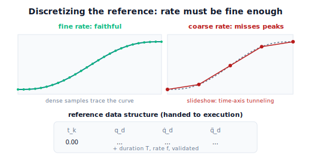

!!! abstract "You are here"
    **Module 7 — Trajectory Generation and Motion Planning**  ·  **Unit 7 — Trajectory Quality, Validation, and Tracking Prerequisites**  ·  **Lesson 7.4 — Sampling and Representing the Reference: Discretization for Execution**

# Lesson 7.4 — Sampling and Representing the Reference: Discretization for Execution

> Lesson 7.3 said the reference must provide $\mathbf q_d,\dot{\mathbf q}_d,\ddot{\mathbf q}_d$ continuously. But a digital controller doesn't run continuously — it updates at a fixed rate, tick by tick. So the continuous reference must be **discretized**: sampled at the control rate into a steppable series, or wrapped as a function the controller evaluates each tick. We lead with the picture of a smooth curve becoming a sequence of sample points, then close Unit 7.

---

## 1. Why This Matters
The reference we've built is a continuous function of time, but the machine that will follow it is digital: it wakes up at a fixed **control rate** (say 100 or 1000 times a second), reads the desired state for that instant, acts, and sleeps until the next tick. So the smooth reference must be turned into something tick-friendly — either a **time-indexed series** of samples at the control rate, or a **function** the controller can evaluate at any tick. This discretization is the final shaping that makes the reference *executable* by real (digital) hardware.

And the **rate matters**. Sample too coarsely and the discrete reference loses the motion's detail — the controller jumps between widely-spaced points and the followed motion is crude or wrong, the same failure mode as coarse collision sampling (tunneling, Lesson 6.2). Sample finely enough and the discrete series faithfully represents the continuous curve. This lesson shows how to discretize, how to pick a rate, and what the resulting **reference data structure** looks like — the exact object handed to execution (Unit 8). Then it recaps Unit 7: quality, validation, prerequisites, and now representation — everything that turns a planned motion into a deliverable reference.

## 2. Physical Intuition
A film is continuous motion captured as a sequence of still frames. At 24 frames a second it looks smooth; at 3 frames a second it's a jerky slideshow that misses what happened in between. The motion didn't change — the *sampling rate* did. Enough frames per second and the discrete sequence faithfully reconstructs the continuous motion; too few and you lose it.

A digital controller "films" the reference: at each control tick it grabs one frame — the desired position, velocity, and acceleration at that instant. Run the ticks fast enough (a high control rate) and the sequence of frames faithfully represents the smooth reference; run them too slowly and the controller is working from a jerky slideshow, missing the motion between samples. Discretizing the reference is choosing the frame rate for the robot's motion, and the rule is the familiar one: sample fine enough relative to how fast things change.

## 3. Mathematical Foundations
A **discretized reference** at control rate $f$ (Hz), with time step $\Delta t = 1/f$, is the series

$$\big(t_k,\ \mathbf q_d(t_k),\ \dot{\mathbf q}_d(t_k),\ \ddot{\mathbf q}_d(t_k)\big),\quad t_k = k\,\Delta t,\ k=0,\dots,N,\ N=\lceil T f\rceil,$$

obtained by evaluating the continuous reference at each tick. This is a table the controller steps through one row per tick. Equivalently, the reference can be kept as a **callable** $\mathbf q_d(\cdot)$ the controller evaluates at any $t$ — useful when the control rate isn't known in advance or differs from the build rate.

**Choosing the rate.** The rate must resolve the fastest variation in the motion. A practical guide: $\Delta t$ small enough that the configuration moves only a little per tick (so successive samples are close), and fine enough to capture the peaks of velocity and acceleration without aliasing. Too coarse and the discrete series misrepresents the curve — between two coarse samples the true motion could swing significantly, exactly the **tunneling** failure from collision sampling (Lesson 6.2) transplanted to the time axis. Real controllers run at fixed high rates (e.g. hundreds to thousands of Hz) precisely to keep the discrete reference faithful.

**The reference data structure (handed to execution).** The deliverable is the discretized series (or the callable) together with metadata: the **duration** $T$, the **rate** $f$, and the validated flag (Lesson 7.2). This is the object Unit 8 packages as the reference trajectory *layer* and hands to Module 8 — position/velocity/acceleration feed-forward, timestamped, validated, steppable. The engine produces the series with `sample_reference(ref_fn, T, rate)` → $(t, Q, \dot Q, \ddot Q)$, and the callable form is the layer's `reference(t)` (Lesson 8.3).

**Still no control.** Discretizing only *represents* the reference for a digital consumer; it performs no control. Stepping the table and driving motors with error correction is Module 8. (We note: any *execution* of this reference in Module 7 is open-loop playback of the desired motion — e.g. feeding $\dot{\mathbf q}_d$ to the imported Module 6 velocity layer — never closed-loop tracking.)

## 4. Visual Explanation

<figure markdown>
  { width="680" }
</figure>

## 5. Engineering Example
This is the trajectory-interpolation layer of every real robot controller. A motion is generated as a reference and then **interpolated/sampled to the servo rate** — the controller's fixed tick (commonly 1 kHz on industrial arms) — producing a stream of timestamped setpoints (position, often velocity and acceleration) that the servo loop consumes. Standard frameworks carry exactly this structure: a trajectory of points with time-from-start and per-point velocities/accelerations, fed to a controller that interpolates between them at the control rate. The rate is chosen high enough that the discrete stream faithfully represents the planned motion. For the harvester, the validated reach-and-grasp reference is sampled to the controller's rate and handed off as this timestamped series — the concrete artifact that crosses into execution.

## 6. Worked Example
Discretize a validated reference of duration $T=2.35$ s at two rates.

- **At $f=100$ Hz** ($\Delta t=0.01$ s): $N\approx236$ samples. Successive configurations differ by a small step; the discrete series traces the smooth curve faithfully; peaks of velocity/acceleration are well captured. Good.
- **At $f=5$ Hz** ($\Delta t=0.2$ s): only $\sim12$ samples. Between samples the motion swings noticeably; the discrete series is a coarse slideshow that can miss a velocity/acceleration peak — a too-coarse representation (time-axis "tunneling").
- **Verdict:** use the fine rate. The reference data structure at 100 Hz — $(t, Q, \dot Q, \ddot Q)$ plus duration, rate, validated — is the deliverable handed to execution. The notebook builds both, shows the coarse series misrepresents the curve (large jumps between samples), and confirms the fine series is faithful.

## 7. Interactive Demonstration

<iframe src="../../demos/module07/lesson28_sampling_discretization.html" title="Sampling and Representing the Reference: Discretization for Execution interactive demo" style="width:100%;height:520px;border:1px solid #e2e8f0;border-radius:12px"></iframe>

[Open this demo in a new tab ↗](../demos/module07/lesson28_sampling_discretization.html)

*(Conceptual — runnable in the companion notebook.)*

**Pick the frame rate.** In the notebook you:

1. Sample a validated reference at a fine rate and a coarse rate with `sample_reference`.
2. Overlay both on the continuous curve and confirm the fine series is faithful while the coarse one skips detail (time-axis tunneling).
3. Inspect the reference data structure — the timestamped $(\,\mathbf q_d,\dot{\mathbf q}_d,\ddot{\mathbf q}_d)$ series plus metadata — that Unit 8 will hand to execution.

## 8. Coding Exercise

!!! tip "Run the hands-on notebook"
    `modules/module07/notebooks/lesson28_reference_sampling.ipynb` — open in JupyterLab and run **Kernel → Restart & Run All**.

*(Snippet / notebook task — uses `sample_reference`, the layer's reference.)*

In the companion notebook:

1. Discretize a validated reference at a fine and a coarse rate; assert the fine series has the expected number of samples and small step-to-step changes, while the coarse series has large jumps (misrepresentation).
2. Assert the discrete series carries all three feed-forward fields ($\mathbf q_d,\dot{\mathbf q}_d,\ddot{\mathbf q}_d$) and correct timestamps at the chosen rate.
3. Confirm the continuous callable and the fine discrete series agree at the sample times — the two representations are consistent.

## 9. Knowledge Check

Formative — unlimited attempts, immediate feedback; does not affect your grade.

<iframe src="../../quizzes/module07/lesson28_quiz.html" title="Sampling and Representing the Reference: Discretization for Execution knowledge check" style="width:100%;height:720px;border:1px solid #e2e8f0;border-radius:12px"></iframe>

[Open this quiz in a new tab ↗](../quizzes/module07/lesson28_quiz.html)

1. Why must a continuous reference be discretized before a digital controller can use it?
2. What goes wrong if the sampling rate is too coarse, and what earlier failure mode is it analogous to?
3. What does the reference data structure contain (signals + metadata)?
4. Does discretization perform any control? Explain.

## 10. Challenge Problem
A controller runs at a fixed 1 kHz, but your reference was built and sampled at 50 Hz. Explain why simply replaying the 50 Hz samples at 1 kHz (holding each for 20 ticks) would produce a stair-stepped, jerky motion, and what the controller does instead (interpolation between reference points). Then explain why keeping the reference as a *callable* function — evaluated at the controller's own rate — sidesteps the rate-mismatch problem entirely. *(Representation choice affects fidelity at the execution rate.)*

## 11. Common Mistakes
- **Sampling too coarsely.** A coarse series misrepresents the motion (time-axis tunneling); match the rate to how fast things change.
- **Dropping the feed-forward in the series.** The discrete reference must carry $\dot{\mathbf q}_d,\ddot{\mathbf q}_d$, not just position.
- **Forgetting the metadata.** Duration, rate, and the validated flag travel with the reference to execution.
- **Thinking discretization is control.** It only represents the reference; stepping it with error correction is Module 8.

## 12. Key Takeaways
- A continuous reference is **discretized** to the **control rate** into a timestamped series $(t_k,\mathbf q_d,\dot{\mathbf q}_d,\ddot{\mathbf q}_d)$ — or kept as a callable the controller evaluates each tick.
- The **rate must be fine enough** to represent the motion faithfully; too coarse and the series misrepresents the curve (time-axis tunneling).
- The **reference data structure** — feed-forward series plus duration, rate, and validated flag — is the object handed to execution (Unit 8).
- **Unit 7 recap:** quality metrics rank good trajectories (7.1) → validation certifies a reference is safe to run (7.2) → tracking prerequisites define what the reference must provide and the M7/M8 boundary (7.3) → discretization represents the reference for a digital consumer (7.4). Together these turn a planned motion into a **deliverable reference** — exactly what the Unit 8 capstone packages and hands off.

---

### AI Learning Companion

Copy any prompt below into your AI tutor.

- **Tutor (re-explain):** "Re-explain discretizing a reference using the 'film frame rate' analogy. Stress sampling the continuous reference at the control rate into a (q_d, q̇_d, q̈_d) series, and that too coarse a rate is time-axis tunneling. Then ask me what the reference data structure contains."
- **Practice (generate exercises):** "Give me a few references with durations and proposed sampling rates. Ask me whether each rate is fine enough and how many samples result. Withhold answers until I respond."
- **Explore (connect to the real world):** "Explain the trajectory-interpolation layer of a real robot controller: sampling a reference to the servo rate (e.g. 1 kHz), the timestamped setpoint stream, and interpolation between reference points."

### Global Learning Support

Per-language explanation prompts — use whichever you think best in.

- **English (authoritative):** "Explain discretizing a robot reference trajectory for execution: sampling the continuous reference (q_d, q̇_d, q̈_d) at the control rate into a timestamped series, choosing a fine-enough rate (too coarse = time-axis tunneling), and the reference data structure handed to execution, at a robotics-course level (no control performed)."
- **Español:** "Explica la discretización de una trayectoria de referencia de robot para su ejecución: muestrear la referencia continua (q_d, q̇_d, q̈_d) a la frecuencia de control en una serie con marcas de tiempo, elegir una frecuencia suficientemente fina (demasiado gruesa = 'tunneling' en el eje temporal) y la estructura de datos de referencia entregada a la ejecución, a nivel de curso de robótica (sin realizar control)."
- **中文（简体）：** "用机器人课程的水平（不执行控制），解释为执行而离散化机器人参考轨迹：以控制频率对连续参考 (q_d, q̇_d, q̈_d) 采样为带时间戳的序列，选择足够细的频率（过粗 = 时间轴上的'穿隧'），以及交给执行的参考数据结构。"
- **Türkçe:** "Bir robot referans yörüngesini yürütme için ayrıklaştırmayı açıkla: sürekli referansı (q_d, q̇_d, q̈_d) kontrol hızında zaman damgalı bir diziye örnekleme, yeterince ince bir hız seçme (çok kaba = zaman ekseninde tünelleme) ve yürütmeye verilen referans veri yapısı — robotik dersi düzeyinde (kontrol yapılmaz)."

---

*Next lesson: 8.1 — The Complete Workflow: Plan → Parameterize → Validate → Execute (Unit 8 begins — the capstone, with the Trajectory Studio demo).*
