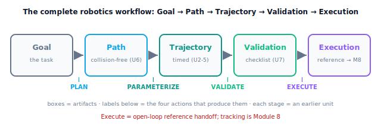

!!! abstract "You are here"
    **Module 7 — Trajectory Generation and Motion Planning**  ·  **Unit 8 — Capstone: Plan → Parameterize → Validate → Execute**  ·  **Lesson 8.1 — The Complete Workflow: Plan → Parameterize → Validate → Execute**

# Lesson 8.1 — The Complete Workflow: Plan → Parameterize → Validate → Execute

> This is the capstone. Every unit of Module 7 — paths, timing, feasibility, planning, validation, the reference — was a piece of one larger machine. Seen as the artifacts it produces, the complete robotics workflow is **Goal → Path → Trajectory → Validation → Execution**; seen as the actions that produce them, it is **Plan → Parameterize → Validate → Execute**. We lead with the whole pipeline running end to end in the Trajectory Studio, then trace how each earlier unit is exactly one stage.

---

## 1. Why This Matters
Up to now you've learned the pieces in isolation: how to make a path, how to time it, how to check feasibility, how to plan around obstacles, how to validate and represent a reference. The capstone's job is to show that these aren't separate topics — they are the **four stages of a single workflow** that turns a task ("move the gripper from here to the fruit, around the canopy") into an executable reference. Mastering the workflow, not just the pieces, is what lets you actually drive a robot.

The workflow is **Plan → Parameterize → Validate → Execute**: plan a collision-free *path* (Unit 6), parameterize it into a *timed trajectory* within the limits (Units 2–5), validate that trajectory against every requirement (Unit 7), and execute it as an open-loop *reference* handed to the controller (Unit 7 boundary; Module 8 tracks it). Read as the *artifacts* that flow through it, the same pipeline is the complete robotics workflow **Goal → Path → Trajectory → Validation → Execution**: the **goal** (the task) becomes a **path**, the path becomes a **trajectory**, the trajectory passes **validation**, and the validated reference reaches **execution**. The two readings are one pipeline — actions on the left, artifacts on the right — and each stage consumes the previous stage's output, so the whole thing composes cleanly and repeatably. This lesson is the integrating view — the flagship **Trajectory Studio** lets you run all four stages on the greenhouse arm and watch each one's output appear. The next three lessons go deeper into the stages; this one is the map.

## 2. Physical Intuition
Think of how a delivery gets from "I want this package across town" to "it arrives at the door." First you **plan a route** that avoids closed roads (the path). Then you **schedule** it — decide when to leave and how fast to drive each segment so you don't speed and don't dawdle (the timing). Then you **check** the plan against the rules — legal speeds, the vehicle can make the turns, the route is actually open (validation). Only then do you **drive** it (execution). Skip a stage and you get a route you can't legally drive, or a schedule that breaks the speed limit, or a plan that hits a closed road.

A robot motion follows the same four stages. Plan a collision-free route through the workspace's obstacles. Parameterize it — assign the timing so every joint stays within its speed and acceleration limits. Validate — confirm it's collision-free, feasible, continuous, and reaches the goal. Execute — hand the finished reference to the part of the system that drives the motors. Each stage has a clear job and a clear output, and they chain in order. The Trajectory Studio lets you watch the package go from "route" to "schedule" to "checked" to "driving."

## 3. Mathematical Foundations
The workflow is a pipeline of four stages, each a function of the previous output. Reading the boxes gives the **artifact chain Goal → Path → Trajectory → Validation → Execution**; reading the arrows gives the **actions Plan → Parameterize → Validate → Execute**:

$$\underbrace{\textbf{Goal}}_{\text{task}} \xrightarrow{\text{PLAN}} \underbrace{\text{Path}}_{\text{collision-free}} \xrightarrow{\text{PARAMETERIZE}} \underbrace{\text{Trajectory}}_{\text{timed}} \xrightarrow{\text{VALIDATE}} \underbrace{\text{Validation}}_{\text{validated reference}} \xrightarrow{\text{EXECUTE}} \underbrace{\text{Execution}}_{\text{motion}}.$$

- **PLAN (Unit 6).** Input: start and goal (and obstacles). Output: a **collision-free path** in configuration space — RRT finds it (6.3), smoothing shortens it (6.4). Geometry only, no timing yet.
- **PARAMETERIZE (Units 2–5).** Input: the path. Output: a **timed trajectory** — assign a time scaling so the motion respects velocity and acceleration limits (time scaling 5.2/5.3), using polynomial/spline timing (Units 2–3). Now $\mathbf q$ is a function of time with feed-forward $\dot{\mathbf q},\ddot{\mathbf q}$.
- **VALIDATE (Unit 7).** Input: the timed trajectory. Output: a **validated reference** (or a rejection) — run the complete suite (7.2): endpoints, continuity, limits, collision-free, reachable. Pass → certified; fail → back to an earlier stage.
- **EXECUTE (Unit 7 boundary → Module 8).** Input: the validated reference. Output: **motion** — the reference is discretized (7.4) and handed off; in Module 7 this means open-loop playback of the desired motion (e.g. feeding $\dot{\mathbf q}_d$ to the imported Module 6 velocity layer) and delivering the reference to Module 8, which does the closed-loop tracking.

The composition is the engine's `reference_trajectory_layer(...)`: it runs PLAN (`rrt`) → PARAMETERIZE (`shortcut_smooth` + `feasible_duration` + `piecewise_quintic`) → VALIDATE (`validate_trajectory`) and emits a validated reference (`reference(t)`), or reports failure. Each stage is exactly the machinery of an earlier unit; the capstone is the wiring.

**Boundary (held throughout).** "Execute" in Module 7 is **open-loop**: emit and play the reference, hand it off. It does **not** mean feedback control, dynamics, or actuator commands — those are Module 8. The pipeline's product is a *reference*, not a control law.

## 4. Visual Explanation

<figure markdown>
  { width="680" }
</figure>

## 5. Engineering Example
This four-stage pipeline is the backbone of real manipulation software. A task request enters a **planner** (sampling-based, Unit 6) that returns a collision-free path; a **time-parameterization** stage (Units 2–5) retimes it to the robot's velocity/acceleration limits; a **validation/checking** stage (Unit 7) confirms limits and collision before anything moves; and an **execution** layer streams the resulting reference to the controller. Frameworks organize exactly this way — plan, time-parameterize, validate, execute — because each stage is independently testable and reusable, and the interfaces between them (path, trajectory, reference) are clean. For the harvester, a single "reach this pre-grasp pose" request flows through all four stages to produce the validated reference the arm will follow — the entire module, working together.

## 6. Worked Example
Run the workflow for a greenhouse reach (disk obstacle at $(0.5,0.05)$, $r=0.06$; start tool $(0.45,0.25)$ → goal $(0.45,-0.25)$; limits $\dot q_{\lim}=2$, $\ddot q_{\lim}=4$).

- **PLAN:** RRT finds a collision-free path around the disk (the direct route is blocked); smoothing reduces it to a few waypoints.
- **PARAMETERIZE:** each segment is timed to its minimum feasible duration; the trajectory now has $\mathbf q(t),\dot{\mathbf q}(t),\ddot{\mathbf q}(t)$ with peaks at/under the limits; total duration $\approx2.35$ s.
- **VALIDATE:** the complete suite passes — endpoints match, rest-to-rest, within velocity and acceleration, continuous, collision-free, reachable → **VALID**.
- **EXECUTE:** the validated reference is discretized to the control rate and emitted; in Module 7 it's played open-loop (and handed to Module 8). The reference exposes $\mathbf q_d,\dot{\mathbf q}_d,\ddot{\mathbf q}_d$ at any $t$.
- The notebook calls `reference_trajectory_layer(...)`, confirms `validated` is True, and inspects each stage's output (path, waypoints, timed reference, validation dict, reference signal) — the whole pipeline in one call.

## 7. Interactive Demonstration

<iframe src="../../demos/module07/lesson29_trajectory_studio.html" title="The Complete Workflow: Plan → Parameterize → Validate → Execute interactive demo" style="width:100%;height:520px;border:1px solid #e2e8f0;border-radius:12px"></iframe>

[Open this demo in a new tab ↗](../demos/module07/lesson29_trajectory_studio.html)

**Use the Trajectory Studio (this lesson's demo).** Steps:

1. Place the obstacle and set start/goal; press **Plan** and watch the RRT route appear around the obstacle.
2. Press **Parameterize** and see the timing assigned (velocity profile vs the limit lines).
3. Press **Validate** and read the checklist — every gate green for a good setup; nudge the obstacle to block the goal and watch Plan fail, or tighten limits to make Validate flag a stage.
4. Press **Execute** and watch the arm sweep the validated reference; inspect the reference signal panel — the $\mathbf q_d,\dot{\mathbf q}_d,\ddot{\mathbf q}_d$ that would hand off to Module 8.

The takeaway: one task, four stages, one validated reference — the whole module in motion.

## 8. Coding Exercise

!!! tip "Run the hands-on notebook"
    `modules/module07/notebooks/lesson29_complete_workflow.ipynb` — open in JupyterLab and run **Kernel → Restart & Run All**.

*(Snippet / notebook task — uses `reference_trajectory_layer` and its stage outputs.)*

In the companion notebook:

1. Run `reference_trajectory_layer(...)` on the canonical scenario and assert it returns a **validated** layer (`validated` True) with a non-empty path/waypoints (PLAN+PARAMETERIZE succeeded).
2. Assert the `validation` dict has every check True (VALIDATE) and the `metrics` are within limits.
3. Query `reference(t)` at several times (EXECUTE handoff) and assert it returns the feed-forward triple; confirm the pipeline is a single composition of the earlier units' functions.

## 9. Knowledge Check

Formative — unlimited attempts, immediate feedback; does not affect your grade.

<iframe src="../../quizzes/module07/lesson29_quiz.html" title="The Complete Workflow: Plan → Parameterize → Validate → Execute knowledge check" style="width:100%;height:720px;border:1px solid #e2e8f0;border-radius:12px"></iframe>

[Open this quiz in a new tab ↗](../quizzes/module07/lesson29_quiz.html)

1. Name the four stages of the workflow and what each produces.
2. Which unit implements each stage?
3. What does "Execute" mean within Module 7, and what part of execution belongs to Module 8?
4. Why does the pipeline compose cleanly (how do the stages connect)?

## 10. Challenge Problem
Trace a single greenhouse task — "move the gripper to a pre-grasp pose behind a cluster of fruit" — through all four stages, naming the concrete output of each stage and the specific earlier-unit tool that produces it. Then identify, for each of two failures (the goal is enclosed by the obstacle; the requested duration is too short), which stage fails and what the remedy is. Finally, state precisely where Module 7 ends and Module 8 begins in this trace. *(The capstone is the workflow, not any single stage.)*

## 11. Common Mistakes
- **Skipping a stage.** A planned path isn't executable until parameterized and validated; never run an unplanned-or-unvalidated motion.
- **Reordering stages.** Validate after parameterizing (you validate the *timed* trajectory); execute only after validation passes.
- **Thinking "Execute" means control.** In Module 7 it's open-loop playback + handoff; feedback tracking is Module 8.
- **Treating the units as separate topics.** They are stages of one pipeline; the capstone is the integration.

## 12. Key Takeaways
- The complete robotics workflow is the artifact chain **Goal → Path → Trajectory → Validation → Execution**, produced by the four actions **Plan → Parameterize → Validate → Execute** — turning a goal into executable motion.
- Each stage **is an earlier unit**: PLAN = Unit 6, PARAMETERIZE = Units 2–5, VALIDATE = Unit 7, EXECUTE = discretize + hand off (Unit 7 boundary → Module 8).
- The stages **compose cleanly** — each consumes the previous output (path → trajectory → validated reference → motion) — and the engine's `reference_trajectory_layer` is the wiring.
- **"Execute" in Module 7 is open-loop** (emit/play the reference, hand it off); feedback control, dynamics, and actuator commands are **Module 8**.

---

### AI Learning Companion

Copy any prompt below into your AI tutor.

- **Tutor (re-explain):** "Re-explain the Plan → Parameterize → Validate → Execute workflow using the 'delivery: route, schedule, check, drive' analogy. Map each stage to the Module 7 unit that implements it. Then ask me what each stage produces."
- **Practice (generate exercises):** "Give me three motion tasks. For each, ask me to trace the four stages, name each stage's output, and identify where Module 7 ends and Module 8 begins. Withhold answers until I respond."
- **Explore (connect to the real world):** "Explain how real manipulation software pipelines a task: planner → time-parameterization → validation → execution, and why the clean interfaces (path, trajectory, reference) make each stage testable."

### Global Learning Support

Per-language explanation prompts — use whichever you think best in.

- **English (authoritative):** "Explain the complete motion-planning workflow Plan → Parameterize → Validate → Execute for a robot: what each stage produces, which earlier unit implements it, and that Execute in Module 7 is open-loop reference handoff (tracking is Module 8), at a robotics-course level."
- **Español:** "Explica el flujo completo de planificación de movimiento Planificar → Parametrizar → Validar → Ejecutar para un robot: qué produce cada etapa, qué unidad anterior la implementa, y que Ejecutar en el Módulo 7 es la entrega de la referencia en lazo abierto (el seguimiento es el Módulo 8), a nivel de curso de robótica."
- **中文（简体）：** "用机器人课程的水平，解释机器人完整的运动规划工作流：规划 → 参数化 → 验证 → 执行——每个阶段产生什么、由哪个先前单元实现，以及模块7中的'执行'是开环参考的交接（跟踪属于模块8）。"
- **Türkçe:** "Bir robot için tam hareket planlama iş akışını açıkla: Planla → Parametrele → Doğrula → Yürüt — her aşamanın ne ürettiği, hangi önceki ünitenin uyguladığı ve Modül 7'deki Yürüt'ün açık-çevrim referans devri olduğu (izleme Modül 8'dir) — robotik dersi düzeyinde."

---

*Next lesson: 8.2 — Plan and Parameterize: From Task to Timed Trajectory (the first half of the workflow, in depth).*
