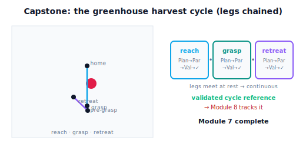

!!! abstract "You are here"
    **Module 7 — Trajectory Generation and Motion Planning**  ·  **Unit 8 — Capstone: Plan → Parameterize → Validate → Execute**  ·  **Lesson 8.4 — Capstone Integration: The Greenhouse Harvest Cycle**

# Lesson 8.4 — Capstone Integration: The Greenhouse Harvest Cycle

> Here the whole module does a real job. A harvest cycle isn't one motion — it's a sequence: reach to a pre-grasp pose, move to the grasp, retreat with the fruit. Each leg runs the full **Plan → Parameterize → Validate → Execute** workflow and produces a validated reference layer; chaining them gives the complete cycle. We lead with the cycle as motion, then recap Module 7 and name the bridge to Module 8.

---

## 1. Why This Matters
Real tasks are sequences of motions, not single moves. The harvester's job — pick one fruit — is already a small choreography: approach the canopy to a pre-grasp pose clear of obstacles, move in to the grasp, then retreat with the fruit to a drop-off-ready pose. Each leg is a complete motion-planning problem, and stitching them into a smooth, validated cycle is what "doing the task" means. This capstone integration shows the module operating as a whole on exactly this kind of multi-motion task.

The method is to run the four-stage workflow (8.1) **for each leg** and chain the results: plan each leg's path around the current obstacles, parameterize it to the limits, validate it, and produce its reference layer (8.3); then sequence the validated layers into one cycle, each handing off to the next. The output is a complete, validated **motion sequence** — the reference Module 8 will track to actually harvest. This lesson is the proof that the pieces compose into a working system, and it closes Module 7 with a recap and a clean bridge to Module 8. Everything stays within bounds: we produce and validate references; we never track, never touch dynamics, never command actuators.

## 2. Physical Intuition
Picking one apple by hand is a little sequence you don't think about: reach toward it avoiding the branches, close your hand around it, pull back without snagging. Three motions, each with its own route and pace, flowing into one smooth action. You plan each reach as you go — the route to the apple is different from the route back with the apple in hand — and you check each move is safe before committing to it.

The harvester does the same, made explicit. Leg 1 (reach): plan a clear route to a pre-grasp pose, time it gently, validate, run. Leg 2 (grasp): a short, careful move into the grasp pose. Leg 3 (retreat): plan a route back out, now accounting for holding the fruit, time it, validate, run. Each leg is the full workflow; the cycle is the legs in sequence, each producing a validated reference handed off in turn. The whole module — paths, timing, feasibility, planning, validation, the reference layer — is what turns "pick that fruit" into a sequence of motions a controller can execute.

## 3. Mathematical Foundations
A **task** is a sequence of waypoint poses $\mathcal P_0 \to \mathcal P_1 \to \dots \to \mathcal P_K$ (e.g. home → pre-grasp → grasp → retreat). The **harvest cycle** is produced by running the workflow per leg and chaining:

For each leg $\mathcal P_{k}\to\mathcal P_{k+1}$:
1. **PLAN:** IK the poses to $\mathbf q_k,\mathbf q_{k+1}$ (consistent branch, 4.2); RRT + smooth a collision-free path in $\mathcal C_{\text{free}}$ (Unit 6).
2. **PARAMETERIZE:** time it to the limits (Units 2–5) → a timed trajectory $\mathbf q_k(t)$.
3. **VALIDATE:** run the complete suite (7.2); pass → proceed, fail → re-time/re-plan.
4. **PACKAGE:** emit the leg's reference layer $\texttt{reference}_k(t)\to(\mathbf q_d,\dot{\mathbf q}_d,\ddot{\mathbf q}_d)$ (8.3).

**Chaining.** The legs connect at shared poses with both endpoints at rest ($\dot{\mathbf q}=\ddot{\mathbf q}=0$), so the **sequence is continuous** across leg boundaries (each leg starts where the last ended, both at rest). The cycle's reference is the concatenation $\texttt{reference}_0,\dots,\texttt{reference}_{K-1}$ with cumulative timing — a single validated reference for the whole task. (Obstacles can differ per leg — e.g. the fruit becomes part of the held payload on retreat — so each leg plans against its own world; this stays within static-obstacle scope per leg.)

**Execute (open-loop, in bounds).** The cycle reference is discretized (7.4) and either played open-loop within Module 7 (feeding $\dot{\mathbf q}_d$ to the imported Module 6 velocity layer) or handed to Module 8 for tracking. Module 7 produces and validates the cycle's reference; **it does not track it**.

The engine builds each leg with `reference_trajectory_layer(...)` and the cycle is the ordered list of validated layers (the notebook chains three legs and confirms each is validated and the joins are at rest → continuous).

**Module 7 recap (the eight units).** Path vs trajectory and smoothness (U1) → polynomial time scaling and the smooth-vs-fast trade (U2) → joint-space trajectories (U3) → Cartesian-space trajectories: straight-line, orientation, screw (U4) → feasibility: limits, time scaling, fastest-feasible, whole-trajectory checks (U5) → motion planning: configuration space, collision checking, RRT, smoothing (U6) → trajectory quality, validation, tracking prerequisites, reference representation (U7) → the capstone workflow and the reference trajectory layer (U8). The eight units assemble into the **complete robotics workflow Goal → Path → Trajectory → Validation → Execution** (produced by the actions Plan → Parameterize → Validate → Execute): the **goal** becomes a **path** (U6), the path a **trajectory** (U2–5), the trajectory passes **validation** (U7), and the validated reference reaches **execution** as the open-loop handoff to Module 8 (U8). The module's arc: **from "what is a trajectory?" to "here is a validated reference layer for a complete task."**

## 4. Visual Explanation

<figure markdown>
  { width="680" }
</figure>

## 5. Engineering Example
A real harvesting or pick-and-place robot runs exactly this loop: for each item, plan-time-validate the approach, the grasp, and the retreat (replanning per item because the scene and payload change), producing a validated reference sequence that the controller tracks. Task-level sequencing (which fruit, in what order) sits above motion planning; each chosen motion flows through the same four-stage pipeline. The modularity is what makes it robust: a new obstacle only changes PLAN for the affected leg; a gentler payload only changes PARAMETERIZE; the validation gate and the reference interface stay fixed. For the greenhouse harvester, the capstone is precisely this cycle — and Module 7's deliverable is the validated reference sequence that Module 8 will turn into actual, tracked motion on the real arm.

## 6. Worked Example
Produce a three-leg harvest cycle (limits $\dot q_{\lim}=2$, $\ddot q_{\lim}=4$).

- **Leg 1 — reach:** home → pre-grasp pose near the cluster, planning around the canopy disk obstacle. PLAN (RRT+smooth) → PARAMETERIZE (gentle timing) → VALIDATE (pass) → reference layer 1.
- **Leg 2 — grasp:** pre-grasp → grasp pose, a short careful move (small displacement, low jerk). Full workflow → reference layer 2.
- **Leg 3 — retreat:** grasp → retreat-clear pose, planning a route back out (the fruit now a held payload). Full workflow → reference layer 3.
- **Chain:** each leg starts at rest where the previous ended at rest → the cycle is continuous; concatenate with cumulative timing → one validated cycle reference.
- **Hand off:** discretize and deliver to Module 8 (or play open-loop in Module 7 via the M6 velocity layer). Each leg's `validated` is True; the cycle is the ordered validated layers. The notebook builds all three legs, asserts each validated, checks the rest-joins, and assembles the cycle reference.

## 7. Interactive Demonstration

<iframe src="../../demos/module07/lesson32_greenhouse_harvest_cycle.html" title="Capstone Integration: The Greenhouse Harvest Cycle interactive demo" style="width:100%;height:520px;border:1px solid #e2e8f0;border-radius:12px"></iframe>

[Open this demo in a new tab ↗](../demos/module07/lesson32_greenhouse_harvest_cycle.html)

*(Conceptual — runnable in the companion notebook; the Trajectory Studio runs a single leg interactively.)*

**Run the cycle.** In the notebook you:

1. Build three legs (reach, grasp, retreat) each via `reference_trajectory_layer`, asserting each is validated.
2. Confirm the legs chain at rest-poses (continuous sequence) and assemble the cycle reference with cumulative timing.
3. Query the cycle reference across the whole task and confirm it returns the feed-forward triple throughout — the complete, validated deliverable for Module 8.

## 8. Coding Exercise

!!! tip "Run the hands-on notebook"
    `modules/module07/notebooks/lesson32_capstone_harvest_cycle.ipynb` — open in JupyterLab and run **Kernel → Restart & Run All**.

*(Snippet / notebook task — uses `reference_trajectory_layer` per leg.)*

In the companion notebook:

1. Produce three validated reference layers (reach, grasp, retreat) and assert each `validated` is True.
2. Assert consecutive legs meet at rest (velocity/acceleration zero at the joins), so the chained sequence is continuous.
3. Assemble the cycle (ordered layers + cumulative durations), query the combined reference at several task times, and assert it returns $(\mathbf q_d,\dot{\mathbf q}_d,\ddot{\mathbf q}_d)$ throughout — Module 7's final artifact for the whole task.

## 9. Knowledge Check

Formative — unlimited attempts, immediate feedback; does not affect your grade.

<iframe src="../../quizzes/module07/lesson32_quiz.html" title="Capstone Integration: The Greenhouse Harvest Cycle knowledge check" style="width:100%;height:720px;border:1px solid #e2e8f0;border-radius:12px"></iframe>

[Open this quiz in a new tab ↗](../quizzes/module07/lesson32_quiz.html)

1. Why is a harvest cycle a sequence of motions, and how is each leg produced?
2. How do the legs chain into a continuous cycle?
3. What is Module 7's final deliverable for the task, and who consumes it?
4. In one sentence each, recap the eight units of Module 7.

## 10. Challenge Problem
Design the pose sequence and per-leg considerations for a complete harvest cycle that also returns the gripper to a home pose after dropping the fruit (home → pre-grasp → grasp → retreat → drop → home). For each leg, state what changes in PLAN (obstacles/payload) and PARAMETERIZE (gentle vs fast), where VALIDATE might reject a leg, and how the legs chain. Then state precisely what Module 7 delivers for this whole cycle and what Module 8 must do that Module 7 does not. *(The capstone is the module producing a validated reference for a real, multi-motion task.)*

## 11. Common Mistakes
- **Treating the task as one motion.** A cycle is legs; run the workflow per leg and chain.
- **Ignoring per-leg world changes.** The retreat plans against a different scene/payload than the reach; replan per leg.
- **Chaining without rest joins.** Legs must meet at rest (or be blended) for a continuous sequence; validate the joins.
- **Thinking the capstone tracks the motion.** Module 7 delivers the validated reference cycle; Module 8 tracks it.

## 12. Key Takeaways
- A real task (the **harvest cycle**: reach → grasp → retreat) is produced by running **Plan → Parameterize → Validate → Execute per leg** and **chaining** the validated reference layers.
- Legs meet at **rest poses**, so the chained cycle is **continuous**; the result is one validated reference for the whole task.
- This is **Module 7's capstone deliverable** — the motion-planning workflow producing the **reference trajectory layer(s)** Module 8 will track.
- **Bridge to Module 8:** Module 7 hands off a validated, feasible, continuous **reference**; Module 8 builds the **tracker** that follows it on the real robot — adding **feedback control, dynamics, and actuator control**, none of which are in Module 7. *(Module 7 complete.)*

---

### AI Learning Companion

Copy any prompt below into your AI tutor.

- **Tutor (re-explain):** "Re-explain the harvest cycle using the 'picking one apple: reach, grasp, pull back' analogy. Stress that each leg runs the full Plan → Parameterize → Validate → Execute workflow and the legs chain at rest poses. Then ask me what Module 7 delivers and what Module 8 does next."
- **Practice (generate exercises):** "Give me a multi-leg task (e.g. reach, grasp, retreat, drop). Ask me to outline the four-stage workflow per leg, the chaining, and the M7/M8 boundary. Withhold answers until I respond."
- **Explore (connect to the real world):** "Explain how a real harvesting/pick-and-place robot sequences per-item motions through plan-time-validate-execute, replanning per item, and where task-level sequencing sits above motion planning."

### Global Learning Support

Per-language explanation prompts — use whichever you think best in.

- **English (authoritative):** "Explain a robot harvest cycle (reach → grasp → retreat) as a chain of Plan → Parameterize → Validate → Execute workflows producing validated reference layers, recap the eight units of a trajectory-generation module, and state the bridge to a feedback-control module, at a robotics-course level (Module 7 produces the reference; tracking/dynamics/actuators are Module 8)."
- **Español:** "Explica un ciclo de cosecha de robot (acercarse → agarrar → retirarse) como una cadena de flujos Planificar → Parametrizar → Validar → Ejecutar que producen capas de referencia validadas, resume las ocho unidades de un módulo de generación de trayectorias, y enuncia el puente hacia un módulo de control por realimentación, a nivel de curso de robótica (el Módulo 7 produce la referencia; seguimiento/dinámica/actuadores son el Módulo 8)."
- **中文（简体）：** "用机器人课程的水平，把机器人采摘循环（接近 → 抓取 → 退回）解释为'规划 → 参数化 → 验证 → 执行'工作流的链条，产生已验证的参考层；回顾轨迹生成模块的八个单元，并说明通往反馈控制模块的桥梁（模块7产生参考；跟踪/动力学/执行器属于模块8）。"
- **Türkçe:** "Bir robot hasat döngüsünü (uzan → kavra → geri çekil), doğrulanmış referans katmanları üreten Planla → Parametrele → Doğrula → Yürüt iş akışlarının zinciri olarak açıkla; bir yörünge üretim modülünün sekiz ünitesini özetle ve bir geri besleme kontrol modülüne köprüyü belirt — robotik dersi düzeyinde (Modül 7 referansı üretir; izleme/dinamik/eyleyiciler Modül 8'dir)."

---

*Module 7 complete. Next: Module 8 — Feedback Control, which builds the tracker that follows the reference trajectory layer produced here, adding closed-loop control, dynamics, and actuator commands.*
