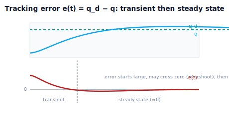

!!! abstract "You are here"
    **Module 8 — Feedback Control and Real-Time Execution (ROS 2)**  ·  **Unit 1 — The Tracking Problem and the Feedback Loop**  ·  **Lesson 1.2 — Tracking Error: The Quantity Control Fights**

# Lesson 1.2 — Tracking Error: The Quantity Control Fights

> Lesson 1.1 showed the gap between reference and reality. This lesson names it, measures it, and makes it the protagonist: **tracking error**, $e = q_d - q$. Every feedback controller — proportional, integral, derivative, all of it — is a recipe for one thing: drive this number to zero and keep it there. We lead by watching the error signal itself, the thing the controller actually "sees."

---

## 1. Why This Matters
A controller does not act on where the robot *is*; it acts on how *wrong* the robot is. That wrongness is the **tracking error** — the difference between the desired position and the measured one. It is a single, signed number per joint, computed fresh every control cycle, and it is the only thing the feedback controller needs to do its job. Get the error, and you know which way to push and how hard.

Making error the central quantity is the conceptual pivot of the whole module. Position alone doesn't tell a controller what to do — "the joint is at 0.7 rad" is not actionable without knowing where it *should* be. But "the joint is 0.3 rad short of target" is immediately actionable: push it forward, harder while the gap is large, easing off as it closes. That is the seed of proportional control (next unit). This lesson establishes error as the controller's input, gives it a sign convention, and distinguishes the error *during* motion (transient) from the error *left over* at the end (steady-state) — the distinction that will separate the jobs of the P, I, and D terms. Continuing the module's arc, this is **error** made precise, the quantity **correction** will fight.

## 2. Physical Intuition
Think of pouring water to a line marked on a glass. You don't think about the absolute water level in centimeters; you watch the **gap** between the current level and the line. Big gap → pour fast. Small gap → slow to a trickle. At the line → stop. You're not controlling on the level; you're controlling on the *error* between level and target, and your pouring rate is proportional to it. If you overshoot above the line, the error flips sign — now you'd want to remove water — and you've learned the sign tells you direction.

A robot joint controller works identically. It watches the gap between the desired angle and the actual angle — the tracking error — and commands effort based on it: large error, large push; small error, gentle push; zero error, no push needed. The sign of the error says which way to go. The controller never needs the "absolute level" to be meaningful on its own; it only ever needs the gap. Reducing that gap to zero, and keeping it there as the target moves, *is* the act of control.

## 3. Mathematical Foundations
For a single joint, the **tracking error** is

$$e(t) = q_d(t) - q(t),$$

the desired angle minus the measured angle. Its properties:

- **Sign = direction.** $e > 0$: the joint is *behind* the target (needs to move forward). $e < 0$: *ahead* (needs to move back). The controller uses this to choose direction.
- **Magnitude = how wrong.** $|e|$ large near the start of a move (the joint hasn't caught up) and ideally $\to 0$ as it converges.
- **It's computed every cycle.** Each control tick: read $q_d$ from the reference, measure $q$ from the encoder, subtract. This subtraction — *compare* — is the heart of the loop (Lesson 1.3).

Two kinds of error matter, and they have different cures:

- **Transient error** — the error *during* the motion, while the joint is catching up or settling. Shaped by how aggressively and how smoothly the controller responds (the P and D terms, Unit 2).
- **Steady-state error** $e_{ss} = \lim_{t\to\infty} e(t)$ — the error *left over* once everything settles. Under a constant load, a purely proportional controller leaves a nonzero $e_{ss}$ (Lesson 2.1); the integral term exists to erase it (Lesson 2.2).

The controller's mission, stated precisely: **drive $e(t) \to 0$ and keep it there**, for a fixed target *and* while the target moves (tracking a reference). For a vector of joints, $\mathbf e = \mathbf q_d - \mathbf q$ is computed per joint; Unit 4 handles the whole arm. The engine exposes the error in every simulation result (`result["error"]`), and `step_response_metrics` reports the steady-state error of a run.

## 4. Visual Explanation

<figure markdown>
  { width="680" }
</figure>

## 5. Engineering Example
Error is the signal on every control wire in robotics. A servo motor's driver continuously computes position error (commanded vs encoder) and converts it to current. A CNC machine reports "following error" — the live tracking error of each axis — and faults if it grows too large, because a large following error means the tool is not where the program thinks it is. Cruise control acts on speed error (set speed minus actual). A thermostat acts on temperature error. In every case the controller's input is the *difference*, not the raw measurement, and the entire design problem is choosing how to turn that difference into a corrective command. For the greenhouse arm, each joint's controller watches its own tracking error against the Module 7 reference; if a joint's error spikes (a snagged branch), that error is both the thing to correct and the signal that something is wrong.

## 6. Worked Example
Read the error of a real tracking run.

- **Setup:** track a $0 \to 1.0$ rad step on the simulated joint with a proportional controller ($K_p = 10$), plant with load $\ell = 2.0$.
- **Transient:** at $t=0$ the error is $e = 1.0 - 0 = 1.0$ rad (large, positive — far behind). As the joint moves, $e$ shrinks; if it overshoots past 1.0, $e$ goes briefly negative (now ahead), then recovers.
- **Steady-state:** the joint settles *short* of the target — it ends around 0.8 rad, leaving $e_{ss} \approx 0.2$ rad. The proportional controller can't close this last gap under the constant load (why: Lesson 2.1).
- **Reading it:** the error signal tells the whole story — big and positive early (push hard), shrinking (ease off), then stuck at a small positive value (the offset P can't fix). The notebook plots $e(t)$, marks the transient and steady-state regions, and reports $e_{ss}$ from `step_response_metrics`.

## 7. Interactive Demonstration
*(Conceptual — runnable in the companion notebook.)*

**Watch the error.** In the notebook you:

1. Run a tracking simulation and plot the error signal $e(t)$ beneath the position plot.
2. Identify the transient region (error large, changing) and the steady-state region (error settled).
3. Read off the steady-state error and connect its sign to "the joint settled short of / past the target."

## 8. Coding Exercise

!!! tip "Run the hands-on notebook"
    `modules/module08/notebooks/lesson02_tracking_error.ipynb` — open in JupyterLab and run **Kernel → Restart & Run All**.

*(Snippet / notebook task — uses `simulate_closed_loop`, `step_response_metrics`, `result["error"]`.)*

In the companion notebook:

1. Run a proportional tracking simulation and assert the **initial** error equals the full step size (the joint starts maximally behind).
2. Assert the error **decreases in magnitude** over the transient (the controller is closing the gap).
3. Read the steady-state error from `step_response_metrics` and assert it is nonzero and positive for proportional-under-load (sets up Lesson 2.1).

## 9. Knowledge Check

Formative — unlimited attempts, immediate feedback; does not affect your grade.

<iframe src="../../quizzes/module08/lesson02_quiz.html" title="Tracking Error: The Quantity Control Fights knowledge check" style="width:100%;height:720px;border:1px solid #e2e8f0;border-radius:12px"></iframe>

[Open this quiz in a new tab ↗](../quizzes/module08/lesson02_quiz.html)

1. Define tracking error and explain what its sign and magnitude tell the controller.
2. Why does a controller act on error rather than on raw position?
3. Distinguish transient error from steady-state error.
4. State the controller's mission in terms of error.

## 10. Challenge Problem
A joint is tracking a *moving* reference (not a fixed setpoint). Explain why, even with a good controller, the error during motion is generally not exactly zero (the joint is always slightly chasing a moving target), and why this "lag" error is different from steady-state error to a fixed target. Then argue why feeding the controller the reference's *velocity* (the feed-forward $\dot q_d$ from Module 7) could reduce this lag — previewing the feed-forward+feedback theme of Unit 4. *(Error against a moving target motivates feed-forward.)*

## 11. Common Mistakes
- **Controlling on position instead of error.** The controller's input is the *gap* $q_d - q$, not $q$ alone.
- **Getting the sign backwards.** $e = q_d - q$: positive means behind (push forward). Flipping it makes the controller drive the wrong way (and go unstable).
- **Conflating transient and steady-state error.** They have different causes and different cures (P/D shape the transient; I erases steady-state offset).
- **Expecting zero error instantly.** Error starts large and is *driven* down over time; the controller's quality is how fast and how cleanly.

## 12. Key Takeaways
- **Tracking error** $e = q_d - q$ is the single signed number that captures the reference-vs-reality gap, computed every control cycle.
- Its **sign gives direction** (behind/ahead) and its **magnitude gives how wrong** — it is exactly what a controller needs.
- **Transient error** (during motion) and **steady-state error** (left over) have different causes and cures.
- Every feedback controller is a strategy to **drive $e \to 0$ and keep it there**. Next: the loop that does the measuring and correcting.

---

### AI Learning Companion

Copy any prompt below into your AI tutor.

- **Tutor (re-explain):** "Re-explain tracking error using the 'pouring water to a line' analogy. Stress that the controller acts on the gap e = q_d − q (sign = direction, magnitude = how wrong), not on raw position, and distinguish transient from steady-state error. Then quiz me on the sign."
- **Practice (generate exercises):** "Give me several (q_d, q) pairs and ask me to compute the error, state its sign meaning (behind/ahead), and say which way the controller should push. Withhold answers until I respond."
- **Explore (connect to the real world):** "Explain 'following error' in CNC machines and position error in servo drives — how real systems compute and act on tracking error, and why they fault on large error."

### Global Learning Support

Per-language explanation prompts — use whichever you think best in.

- **English (authoritative):** "Explain tracking error e = q_d − q for a robot joint: its sign (direction) and magnitude (how wrong), why a controller acts on error not position, and the difference between transient and steady-state error, at a robotics-course level."
- **Español:** "Explica el error de seguimiento e = q_d − q para una articulación de robot: su signo (dirección) y magnitud (cuán equivocado), por qué un controlador actúa sobre el error y no sobre la posición, y la diferencia entre error transitorio y error en régimen permanente, a nivel de curso de robótica."
- **中文（简体）：** "用机器人课程的水平，解释机器人关节的跟踪误差 e = q_d − q：它的符号（方向）和大小（偏离程度），为什么控制器作用于误差而非位置，以及瞬态误差与稳态误差的区别。"
- **Türkçe:** "Bir robot eklemi için izleme hatasını e = q_d − q açıkla: işareti (yön) ve büyüklüğü (ne kadar yanlış), bir denetleyicinin neden konuma değil hataya göre hareket ettiği ve geçici hata ile kalıcı-durum hatası arasındaki fark — robotik dersi düzeyinde."

---

*Next lesson: 1.3 — The Feedback Loop: Sense → Compare → Correct → Actuate.*
