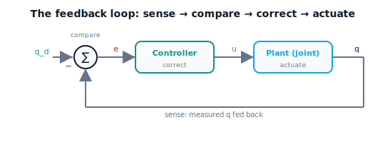

!!! abstract "You are here"
    **Module 8 — Feedback Control and Real-Time Execution (ROS 2)**  ·  **Unit 1 — The Tracking Problem and the Feedback Loop**  ·  **Lesson 1.3 — The Feedback Loop: Sense → Compare → Correct → Actuate**

# Lesson 1.3 — The Feedback Loop: Sense → Compare → Correct → Actuate

> Lesson 1.1 showed open-loop drifting; Lesson 1.2 named the error. This lesson builds the machine that fixes it: the **feedback loop** — sense, compare, correct, actuate, forever. Closing the loop is the single structural change that turns blind execution into robust tracking. We lead by watching the same disturbed joint, now with the loop closed, hold its reference.

---

## 1. Why This Matters
Open-loop failed because it never looked at the result. The fix is to *close the loop*: continuously measure the actual position, compare it to the reference, compute a correction, and apply it — then do it again, thousands of times a second. This four-stage cycle — **sense → compare → correct → actuate** — is the fundamental structure of all feedback control, and it is the difference between a robot that drifts and one that holds its path under load and disturbance.

The power of the loop is that it doesn't need to *predict* disturbances; it *reacts* to their effect. It doesn't matter whether the joint sagged because of gravity, friction, an unknown payload, or a branch pushing on it — the loop sees the resulting error and corrects, whatever the cause. This is why feedback is robust where open-loop is brittle: open-loop must anticipate everything perfectly; feedback only has to notice and respond. This lesson assembles the loop and shows it rejecting the very disturbances that wrecked open-loop in Lesson 1.1. In the module's arc this is the leap from **error** to **correction** — the loop is the mechanism that turns the measured error into action.

## 2. Physical Intuition
Go back to driving — but now with your eyes open. You glance at the lane (**sense**), notice you've drifted a little right of center (**compare** to where you want to be), turn the wheel slightly left (**correct**), and the car responds (**actuate**). A moment later you glance again, and again, continuously. You never computed the crosswind or the road crown; you just kept noticing the gap and nudging it closed. A gust hits — you see the drift and correct it before it grows. That continuous *notice-and-nudge* is feedback, and it's why you can hold a lane for hours on an imperfect road.

A robot's feedback loop is the same cycle, running far faster than you can blink. Every control tick it senses the joint angle from the encoder, compares it to the reference to get the error, computes how hard and which way to push, and commands the motor. A disturbance — a branch, a payload, gravity at a new configuration — shows up as a sudden error, and the loop nudges it back before it grows. The robot doesn't need to know *why* the joint moved off course; it just keeps closing the gap, tick after tick.

## 3. Mathematical Foundations
The **feedback loop** is four stages executed every control cycle (period $\Delta t$, the control rate is $1/\Delta t$):

1. **Sense.** Measure the actual joint state $q$ (and often $\dot q$) from sensors (encoders). This is the step open-loop skips.
2. **Compare.** Read the reference $q_d$ (from Module 7) and form the error $e = q_d - q$ (Lesson 1.2).
3. **Correct.** Compute a command $u$ from the error via a control law $u = C(e)$ — the controller. (Unit 2 builds $C$ as P, I, D.)
4. **Actuate.** Send $u$ to the actuator, which moves the joint; the world (plant) responds, producing a new $q$ — and the loop repeats.

The structure is a *closed loop*: the output $q$ feeds back to influence the next command, hence "closed-loop" (vs open-loop, where $q$ never returns). Symbolically, each tick:

$$q \xrightarrow{\text{sense}} q \xrightarrow{\text{compare}} e = q_d - q \xrightarrow{\text{correct}} u = C(e) \xrightarrow{\text{actuate}} \text{plant} \to q' \to \cdots$$

**Why it rejects disturbances open-loop can't:** a disturbance changes $q$; the loop *measures* the changed $q$, so the error reflects the disturbance's *effect*, and the correction opposes it — regardless of the disturbance's cause or whether it was modeled. Open-loop's command never depended on $q$, so a disturbance produced no corrective response. The loop's only requirements: a sensor (to close the loop) and a fast enough rate (so corrections happen before errors grow — Unit 6/7 quantify this). The engine's `simulate_closed_loop` runs exactly this four-stage cycle.

## 4. Visual Explanation

<figure markdown>
  { width="680" }
</figure>

## 5. Engineering Example
The sense-compare-correct-actuate loop is the universal structure of automatic control. A thermostat senses room temperature, compares to the set point, and switches the heater (correct/actuate) — closing the loop on temperature. A drone senses its attitude with an IMU, compares to the desired attitude, and adjusts motor speeds hundreds of times a second to hold steady in wind. A car's cruise control senses speed, compares to the set speed, and modulates the throttle. Every robot joint runs this loop on position (and often velocity and current as nested loops, Unit 5) at hundreds to thousands of hertz. The loop is what lets all of these reject disturbances they never modeled — gusts, hills, loads — by reacting to their effect. For the greenhouse arm, each joint's loop holds the Module 7 reference against gravity, payload, and canopy contact, correcting every cycle without ever needing to predict them.

## 6. Worked Example
Close the loop on the joint that drifted in Lesson 1.1.

- **Setup:** the same realistic joint ($m=0.5$, $b=0.8$, load $\ell=2.0$) and the same $0 \to 1.0$ rad target — but now with a proportional controller ($K_p=10$) in a closed loop.
- **The cycle each tick:** sense $q$ → compare to get $e = 1.0 - q$ → correct $u = 10\,e$ → actuate (the joint moves) → repeat.
- **Result:** instead of sagging to a wildly wrong value (open-loop), the joint climbs toward 1.0 and *holds* near it. The RMS tracking error collapses from large (open-loop) to small (closed-loop). The loop is rejecting the load it never modeled.
- **Disturbance test:** mid-run, inject a sudden push (a branch). Open-loop would absorb it permanently; the closed loop sees the error spike and pushes back, recovering toward the reference. The notebook runs open-loop and closed-loop side by side, then adds a disturbance, showing the loop's rejection.

## 7. Interactive Demonstration

<iframe src="../../demos/module08/lesson03_feedback_loop.html" title="The Feedback Loop: Sense → Compare → Correct → Actuate interactive demo" style="width:100%;height:520px;border:1px solid #e2e8f0;border-radius:12px"></iframe>

[Open this demo in a new tab ↗](../demos/module08/lesson03_feedback_loop.html)

*(Conceptual — runnable in the companion notebook.)*

**Close the loop.** In the notebook you:

1. Re-run the Lesson 1.1 open-loop drift, then run the **same** joint and target with the loop closed (a proportional controller) and compare tracking.
2. Inject a mid-run disturbance and watch the closed loop detect the error spike and recover, while open-loop does not.
3. Trace one cycle of sense → compare → correct → actuate in the simulation to see the loop's four stages.

## 8. Coding Exercise

!!! tip "Run the hands-on notebook"
    `modules/module08/notebooks/lesson03_feedback_loop.ipynb` — open in JupyterLab and run **Kernel → Restart & Run All**.

*(Snippet / notebook task — uses `simulate_open_loop`, `simulate_closed_loop`, `extra_disturbance`, `tracking_rms`.)*

In the companion notebook:

1. Run open-loop and closed-loop on the same disturbed joint/target and assert the closed-loop RMS tracking error is far smaller (the loop rejects what open-loop can't).
2. Add a mid-run `extra_disturbance` pulse to both; assert the closed loop's post-disturbance error returns toward zero while open-loop's does not.
3. In a comment, label where each of the four stages (sense/compare/correct/actuate) occurs in the simulation step.

## 9. Knowledge Check

Formative — unlimited attempts, immediate feedback; does not affect your grade.

<iframe src="../../quizzes/module08/lesson03_quiz.html" title="The Feedback Loop: Sense → Compare → Correct → Actuate knowledge check" style="width:100%;height:720px;border:1px solid #e2e8f0;border-radius:12px"></iframe>

[Open this quiz in a new tab ↗](../quizzes/module08/lesson03_quiz.html)

1. Name the four stages of the feedback loop in order.
2. What makes a loop "closed" rather than "open"?
3. Why can a feedback loop reject a disturbance it never modeled?
4. Why must the loop run continuously at a fast rate?

## 10. Challenge Problem
The loop has two requirements: a sensor (to sense) and a fast enough rate (so corrections happen before errors grow). Explain qualitatively what goes wrong if (a) the sensor is removed (you're back to open-loop), and (b) the loop runs too slowly (corrections lag the disturbances, error grows between ticks, and the loop can even become unstable). Connect (b) forward to the latency and real-time topics of Units 6–7. *(The loop's power depends on actually closing it, fast.)*

## 11. Common Mistakes
- **Leaving the loop open.** Without the sense/feedback path, there is no correction — it's just open-loop again.
- **Thinking feedback predicts disturbances.** It *reacts* to their effect via the measured error; it needs no model of the disturbance.
- **Running the loop too slowly.** Corrections must outpace the errors they fight; a slow loop lags and can destabilize.
- **Getting the feedback sign wrong.** The error must *oppose* the deviation (negative feedback); positive feedback amplifies errors and diverges.

## 12. Key Takeaways
- The **feedback loop** runs four stages every cycle: **sense** the state, **compare** to the reference to get the error, **correct** via the controller, **actuate**.
- Closing the loop — feeding the measured $q$ back — is the structural fix open-loop lacked.
- The loop **rejects disturbances it never modeled** because it reacts to their *effect* (the measured error), whatever the cause.
- It must run **continuously and fast**. Next we name the standard parts of this loop — reference, plant, controller, feedback — and then build the controller itself.

---

### AI Learning Companion

Copy any prompt below into your AI tutor.

- **Tutor (re-explain):** "Re-explain the feedback loop using the 'driving with your eyes open: glance, notice the drift, nudge the wheel' analogy. Name the four stages sense → compare → correct → actuate and stress that the loop reacts to a disturbance's effect, not its cause. Then ask me to trace one cycle."
- **Practice (generate exercises):** "Give me several control systems (thermostat, drone attitude, cruise control, robot joint). Ask me to identify the sense, compare, correct, and actuate stages in each. Withhold answers until I respond."
- **Explore (connect to the real world):** "Explain how a drone holds attitude in wind by running a fast feedback loop on its IMU, and why the loop rate matters for rejecting gusts."

### Global Learning Support

Per-language explanation prompts — use whichever you think best in.

- **English (authoritative):** "Explain the feedback loop for a robot joint: sense → compare → correct → actuate, why closing the loop rejects disturbances open-loop cannot, and why it must run continuously and fast, at a robotics-course level (no formal control theory)."
- **Español:** "Explica el lazo de realimentación para una articulación de robot: sensar → comparar → corregir → actuar, por qué cerrar el lazo rechaza perturbaciones que el lazo abierto no puede, y por qué debe ejecutarse de forma continua y rápida, a nivel de curso de robótica (sin teoría de control formal)."
- **中文（简体）：** "用机器人课程的水平（不涉及形式控制理论），解释机器人关节的反馈回路：感知 → 比较 → 校正 → 执行，为什么闭环能抑制开环无法抑制的扰动，以及为什么它必须连续且快速地运行。"
- **Türkçe:** "Bir robot eklemi için geri besleme döngüsünü açıkla: algıla → karşılaştır → düzelt → eyletle, döngüyü kapatmanın açık-çevrimin yapamadığı bozucu etkileri neden reddettiği ve neden sürekli ve hızlı çalışması gerektiği — robotik dersi düzeyinde (biçimsel kontrol teorisi yok)."

---

*Next lesson: 1.4 — Anatomy of a Control System: Reference, Plant, Controller, Feedback (and the Unit 1 recap).*
