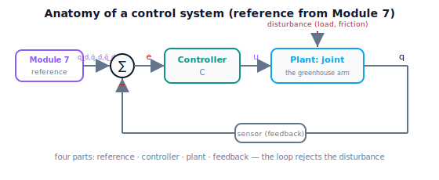

!!! abstract "You are here"
    **Module 8 — Feedback Control and Real-Time Execution (ROS 2)**  ·  **Unit 1 — The Tracking Problem and the Feedback Loop**  ·  **Lesson 1.4 — Anatomy of a Control System: Reference, Plant, Controller, Feedback**

# Lesson 1.4 — Anatomy of a Control System: Reference, Plant, Controller, Feedback

> Lesson 1.3 built the loop; this lesson names its parts and draws the diagram every control engineer reasons with. Four components — **reference, plant, controller, feedback** — and a shared block-diagram vocabulary. We lead with the diagram, label every wire, and close Unit 1: you now know *why* feedback is needed and *what* a control system is made of.

---

## 1. Why This Matters
To design, discuss, or debug a controller, you need a shared vocabulary for its parts and a standard picture of how they connect. Every feedback control system — from a thermostat to a Mars rover — is built from the same four named components, wired into the same loop. Learn the anatomy once and you can read any control diagram and locate any problem ("the error is large — is it the controller, the plant, or the sensor?").

The four parts are: the **reference** (the desired behavior — for us, Module 7's $q_d, \dot q_d, \ddot q_d$), the **plant** (the physical thing being controlled — the joint, its inertia, friction, and load), the **controller** (the law that converts error into command — what Unit 2 builds), and the **feedback path** (the sensor that measures the actual state and closes the loop). This lesson defines each, draws the canonical block diagram, and maps every part onto the greenhouse arm — making concrete where Module 7 ends (it *is* the reference block) and where Module 8 lives (the controller and the closed loop). It then recaps Unit 1, completing the **error → correction** foundation before Unit 2 builds the controller itself.

## 2. Physical Intuition
Think of a home heating system as four roles. There's what you *want* — the temperature you dialed in (the **reference**). There's the *thing being controlled* — the house, with its drafts and thermal mass that resist and delay heating (the **plant**). There's the *decision-maker* — the thermostat logic that decides when to call for heat based on how far off you are (the **controller**). And there's the *sensor* — the thermometer reporting the actual temperature back to the thermostat (the **feedback**). Remove any one and it breaks: no reference, nothing to aim for; no sensor, you're heating blind (open-loop); no controller, no decision; no plant, nothing to heat.

A robot joint's control system has the same four roles. The reference is Module 7's desired trajectory. The plant is the joint — a mass with friction and load that responds sluggishly and imperfectly to commands. The controller is the feedback law (PID, coming up) that turns the tracking error into a motor command. The feedback is the encoder reporting the actual angle. The block diagram is just these four roles wired into the sense-compare-correct-actuate loop. Once you can name the parts, you can reason about any control system the same way.

## 3. Mathematical Foundations
The standard feedback control system has four components, wired into the loop of Lesson 1.3:

- **Reference $q_d$ (setpoint / desired trajectory).** What we want the output to be. For Module 8, this is the **Module 7 reference layer**: $q_d(t)$ and its feed-forward derivatives $\dot q_d(t), \ddot q_d(t)$. It is the *input* to the control system — the reference block produces it; the controller does not compute it.
- **Plant (the controlled system).** The physical thing whose output we steer — here the joint, modeled (Lesson 1.1) as an integrator with friction, load, and saturation: it takes a command $u$ and produces a motion $q$, imperfectly. We do not control the plant's physics; we work *around* them.
- **Controller $C$.** The law $u = C(e)$ that converts the error $e = q_d - q$ into a command $u$. This is the **design freedom** — the part we choose and tune (P, I, D, PID — Unit 2). Everything else is given.
- **Feedback path (sensor).** Measures the plant's actual output $q$ and routes it back to the comparison ($e = q_d - q$). Its presence is what makes the loop *closed*. The sensor's quality (resolution, noise, delay) directly limits control quality (later units).

The **block diagram** wires them: $q_d \to \bigoplus \to e \to C \to u \to \text{plant} \to q$, with the feedback path carrying $q$ back to the summing junction $\bigoplus$ (subtracting, for negative feedback). A **disturbance** enters at the plant. This single diagram underlies all of control; the rest of Module 8 fills in and realizes each block (controller in Unit 2, actuator/plant detail in Unit 5, the feedback/communication path in Unit 6, the real-time execution in Unit 7).

**Unit 1 recap.** Open-loop following fails because it never measures (1.1) → the gap is the tracking error $e = q_d - q$ (1.2) → the feedback loop senses, compares, corrects, actuates to drive $e \to 0$ (1.3) → the loop is built from reference, plant, controller, and feedback (1.4). You now know *why* feedback is necessary and *what* a control system is. Unit 2 builds the controller block.

## 4. Visual Explanation

<figure markdown>
  { width="680" }
</figure>

## 5. Engineering Example
The four-part anatomy is the lingua franca of control engineering — every datasheet, textbook, and design review uses it. A motor servo drive's manual draws exactly this diagram: setpoint in, error to the PID block, command to the power stage (plant = motor + load), encoder feedback closing the loop. Process control (a chemical plant holding a tank temperature) uses the same blocks with different physics in the plant. Aerospace flight control, automotive ABS, hard-drive head positioning — all the same anatomy. The value is diagnostic: when a real system misbehaves, engineers locate the fault by block — "is the reference wrong, the plant changed, the controller mistuned, or the sensor noisy/delayed?" For the greenhouse arm, naming the blocks tells the team exactly where Module 7's responsibility ends (it is the reference block) and Module 8's begins (the controller and the loop), and gives a shared map for every later topic — actuators sharpen the plant block, communication realizes the feedback path, ROS 2 wires the whole diagram.

## 6. Worked Example
Map the four parts onto a greenhouse-arm joint tracking a Module 7 reference.

- **Reference:** Module 7's validated reach reference for this joint — $q_d(t)$ rising from 0 to the grasp angle, with $\dot q_d, \ddot q_d$ available as feed-forward.
- **Plant:** the joint — effective inertia $m$, friction $b$, gravity load $\ell$ that changes when the gripper grabs a fruit, actuator saturation $u_{\max}$.
- **Controller:** (to be built) a PID law $u = K_p e + K_i \int e + K_d \dot e$ turning the tracking error into a torque command — the only part we get to choose.
- **Feedback:** the joint encoder reporting $q$ each cycle, routed back to form $e = q_d - q$.
- **Wiring:** these connect into the sense-compare-correct-actuate loop; a disturbance (payload change on grasp) enters the plant and the loop rejects it. The notebook instantiates all four (reference, `Joint` plant, `PIDController`, the measured-$q$ feedback inside `simulate_closed_loop`) and labels each in code.

## 7. Interactive Demonstration
*(Conceptual — runnable in the companion notebook.)*

**Name the blocks.** In the notebook you:

1. Identify, in a closed-loop simulation, the four parts: the reference function, the `Joint` plant, the controller object, and the feedback (the measured $q$ fed to the error).
2. Change one block at a time (stiffer reference, heavier load on the plant, different controller gains) and observe which behavior each block governs.
3. Sketch (or annotate) the block diagram with the greenhouse-arm meaning of each part.

## 8. Coding Exercise

!!! tip "Run the hands-on notebook"
    `modules/module08/notebooks/lesson04_anatomy_control_system.ipynb` — open in JupyterLab and run **Kernel → Restart & Run All**.

*(Snippet / notebook task — uses `quintic_reference`, `Joint`, `PIDController`, `simulate_closed_loop`.)*

In the companion notebook:

1. Construct each of the four parts explicitly (a reference, a `Joint` plant, a controller, and the loop that supplies feedback) and run a tracking simulation.
2. Modify **only the plant** (increase the load) and assert tracking degrades — the plant changed, not the controller.
3. Modify **only the controller** (raise the gain) and assert tracking changes again — isolating each block's role.

## 9. Knowledge Check

Formative — unlimited attempts, immediate feedback; does not affect your grade.

<iframe src="../../quizzes/module08/lesson04_quiz.html" title="Anatomy of a Control System: Reference, Plant, Controller, Feedback knowledge check" style="width:100%;height:720px;border:1px solid #e2e8f0;border-radius:12px"></iframe>

[Open this quiz in a new tab ↗](../quizzes/module08/lesson04_quiz.html)

1. Name the four parts of a feedback control system and what each does.
2. Which part is the "design freedom," and which is given?
3. In Module 8's setup, which part is Module 7's output?
4. What makes the loop closed, and where does a disturbance enter?

## 10. Challenge Problem
Given the block diagram, argue precisely where Module 7 ends and Module 8 begins (Module 7 *is* the reference block; Module 8 is the controller plus the closed loop), and where a future Module 9 (system integration) would sit relative to this diagram (it wires many such loops, plus perception and planning, into a whole system). Then, for a misbehaving real arm with large tracking error, list one diagnostic question per block that would localize the fault. *(The anatomy is a map for both design and debugging.)*

## 11. Common Mistakes
- **Confusing the controller with the reference.** The reference says *what* we want (Module 7); the controller decides *how* to chase it (Module 8). They're different blocks.
- **Forgetting the plant is fixed.** You design the controller around the plant's physics; you don't get to change the joint's inertia or friction.
- **Ignoring the feedback path's quality.** A noisy or delayed sensor limits the whole loop, however good the controller (later units).
- **Drawing positive feedback.** The summing junction must *subtract* the measurement (negative feedback); otherwise errors grow.

## 12. Key Takeaways
- Every feedback control system has four parts: **reference** (desired — Module 7), **plant** (the controlled joint and its physics), **controller** (the error→command law — the design freedom), and **feedback path** (the sensor closing the loop).
- The **block diagram** wires them into the sense-compare-correct-actuate loop, with a disturbance entering the plant.
- In Module 8, **Module 7 is the reference block**; Module 8 builds the **controller** and closes the loop.
- **Unit 1 recap:** open-loop fails (1.1) → error $e = q_d - q$ is the gap (1.2) → the feedback loop corrects it (1.3) → built from reference/plant/controller/feedback (1.4). Next, Unit 2 builds the controller — starting with proportional control.

---

### AI Learning Companion

Copy any prompt below into your AI tutor.

- **Tutor (re-explain):** "Re-explain the anatomy of a control system using the home-heating analogy (reference = dialed temperature, plant = house, controller = thermostat logic, feedback = thermometer). Map each part to a robot joint and draw the block diagram. Then ask me to label the wires."
- **Practice (generate exercises):** "Give me several control systems and ask me to identify the reference, plant, controller, and feedback in each, and which part is the design freedom. Withhold answers until I respond."
- **Explore (connect to the real world):** "Explain how a servo drive datasheet's block diagram maps to the four parts, and how engineers use the anatomy to localize faults in a misbehaving system."

### Global Learning Support

Per-language explanation prompts — use whichever you think best in.

- **English (authoritative):** "Explain the four parts of a feedback control system — reference, plant, controller, feedback — for a robot joint, the standard block diagram, and which part is the design freedom, at a robotics-course level (the reference is Module 7's output; no formal control theory)."
- **Español:** "Explica las cuatro partes de un sistema de control por realimentación —referencia, planta, controlador, realimentación— para una articulación de robot, el diagrama de bloques estándar, y qué parte es la libertad de diseño, a nivel de curso de robótica (la referencia es la salida del Módulo 7; sin teoría de control formal)."
- **中文（简体）：** "用机器人课程的水平（参考来自模块7的输出，不涉及形式控制理论），解释反馈控制系统的四个部分——参考、被控对象、控制器、反馈——针对机器人关节，标准框图，以及哪一部分是设计自由度。"
- **Türkçe:** "Bir robot eklemi için geri besleme kontrol sisteminin dört parçasını açıkla — referans, sistem (plant), denetleyici, geri besleme — standart blok diyagramı ve hangi parçanın tasarım serbestliği olduğu, robotik dersi düzeyinde (referans Modül 7'nin çıktısıdır; biçimsel kontrol teorisi yok)."

---

*Next lesson: 2.1 — Proportional Control: Correction Proportional to Error (Unit 2 begins — building the controller).*
