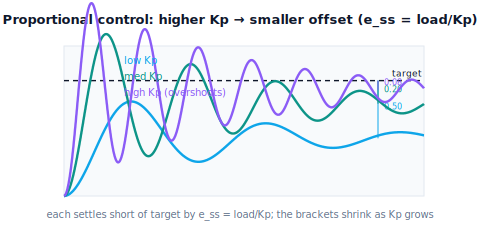

!!! abstract "You are here"
    **Module 8 — Feedback Control and Real-Time Execution (ROS 2)**  ·  **Unit 2 — Proportional, Integral, and Derivative Control**  ·  **Lesson 2.1 — Proportional Control: Correction Proportional to Error**

# Lesson 2.1 — Proportional Control: Correction Proportional to Error

> Unit 1 built the loop and named its parts; the controller block was left empty. Unit 2 fills it. We start with the most natural idea: **command effort proportional to the error** — far from target, push hard; close, push gently; on target, stop. This is **proportional control**, and it works well — until a constant load reveals its one flaw, a residual offset that sets up the integral term. We lead by watching $K_p$ trade tracking tightness against overshoot.

---

## 1. Why This Matters
The controller is the one block we design. The simplest possible design is also the most intuitive: make the corrective effort *proportional* to how wrong you are. A large error gets a large push; a small error a small one; zero error, no push. This is **proportional (P) control**, $u = K_p\, e$, and it is the foundation of nearly every real controller — the P in PID, the first term anyone reaches for.

Proportional control is worth understanding deeply because it exposes the two central tensions of all feedback. First, the gain $K_p$ trades **responsiveness against stability**: raise it and the joint tracks tighter and faster, but past a point it overshoots and oscillates. Second — and this is the lesson's punchline — under a *constant load* (gravity, a payload), pure proportional control settles **short of the target**, leaving a **steady-state offset** that a bigger gain can shrink but never eliminate. Understanding *why* that offset is structural (not a tuning mistake) is what motivates the integral term in the next lesson. In the module's arc, this is the first real **correction** law — and the first place we see its limits.

## 2. Physical Intuition
Imagine pushing a heavy box toward a line on the floor, with effort proportional to the remaining distance. Far away, you shove hard; as you near the line, you ease off; at the line, you stop pushing. This feels right and mostly works. But suppose the floor slopes up toward the line (a constant load fighting you). Now, as you ease off near the line, your gentle push eventually exactly balances gravity — and the box stops *short* of the line, held in equilibrium by a small push that can't quite close the last bit. To get closer you'd have to push harder even at tiny distances (a higher gain), but there's always *some* small gap where your proportional push equals the slope's pull. You can shrink the gap but never zero it — because at the line itself, your push would be zero, and gravity would slide the box back.

A robot joint under gravity behaves exactly so. Proportional control pushes in proportion to the angle error. As the joint nears its target, the push shrinks; eventually the shrinking push just balances the gravity load, and the joint settles a little short — the **steady-state offset**. A higher gain settles closer, but at the target the push would be zero and gravity would win, so a residual gap always remains. That residual is the signature of proportional control, and erasing it needs a different idea (integral, next lesson).

## 3. Mathematical Foundations
**Proportional control** sets the command proportional to the tracking error:

$$u(t) = K_p\, e(t) = K_p\,\big(q_d(t) - q(t)\big),$$

with $K_p > 0$ the **proportional gain**. Behavior:

- **Direction and magnitude.** The sign of $e$ sets the push direction; the magnitude scales with how far off the joint is — exactly the intuitive "harder when farther" rule.
- **Higher $K_p$ → tighter, faster, but less stable.** A larger gain produces a larger corrective push for the same error, so the joint catches up faster and tracks tighter. But too large a gain overshoots the target and, with little damping, oscillates (and on a double-integrator plant with no friction, pure P gives *sustained* oscillation — marginal stability). This is the responsiveness-vs-stability trade.
- **Steady-state offset under constant load.** At steady state the joint is at rest ($\ddot q = \dot q = 0$), so the plant balance $m\ddot q = u - b\dot q - \ell$ gives $u_{ss} = \ell$ — the command must exactly hold the load. But $u = K_p e$, so the *required* command implies a *required* error:

$$e_{ss} = \frac{u_{ss}}{K_p} = \frac{\ell}{K_p} \neq 0.$$

The joint *must* sit at a nonzero error to generate the holding force — that's structural, not a bug. Raising $K_p$ shrinks $e_{ss} = \ell/K_p$ but never makes it zero (and raising it too far destabilizes). **No proportional gain eliminates steady-state error under constant load.** This is precisely the gap integral control will close (Lesson 2.2). The engine's `p_command` (or `PIDController(Kp=...)`) and `step_response_metrics` reproduce $e_{ss} \approx \ell/K_p$ exactly.

## 4. Visual Explanation

<figure markdown>
  { width="680" }
</figure>

## 5. Engineering Example
Proportional control is everywhere, and so is its offset. A simple proportional thermostat holds a room a degree or two below set point on a cold day — the colder it is (bigger constant load), the bigger the offset — which is exactly $e_{ss} = \ell/K_p$. Early speed governors and many basic position servos are proportional and exhibit "droop": the output sags under load by an amount proportional to the load and inversely to the gain. Engineers historically cranked the gain to reduce droop and ran straight into oscillation — the same trade we just saw — which is *why* the integral term was invented. For a robot joint holding an arm out against gravity, a proportional controller settles slightly below the commanded angle, and the sag grows with the payload; for precise grasping, that residual error matters, and the fix is integral action, not just more gain.

## 6. Worked Example
Track a step with proportional control and measure the offset.

- **Setup:** $0 \to 1.0$ rad step, joint with load $\ell = 2.0$, $K_p = 10$.
- **Response:** the joint rises toward 1.0 and settles at about **0.8 rad** — a steady-state error $e_{ss} \approx \ell/K_p = 2.0/10 = 0.2$ rad. It physically *can't* reach 1.0: at 1.0 the proportional push would be zero, and gravity would pull it back.
- **Raise the gain:** $K_p = 40$ → $e_{ss} \approx 2.0/40 = 0.05$ rad (settles at ~0.95) — closer, but still short, and now with more overshoot.
- **Push too far:** $K_p = 200$ on a low-friction joint → overshoot and oscillation (approaching marginal stability) — the responsiveness-vs-stability wall.
- **Verdict:** proportional control tracks well and tightens with gain, but always leaves $\ell/K_p$ of offset under load, and gain alone can't safely erase it. The notebook sweeps $K_p$, plots the responses, and confirms $e_{ss} \approx \ell/K_p$ at each gain.

## 7. Interactive Demonstration
*(Conceptual — runnable in the companion notebook; the L07 PID Playground makes it interactive.)*

**Sweep the gain.** In the notebook you:

1. Run proportional step responses at several $K_p$ values and overlay them with the target line.
2. Measure each steady-state error and confirm it matches $\ell/K_p$ — the offset shrinks as $K_p$ grows.
3. Push $K_p$ high enough (on a low-friction joint) to see overshoot and oscillation emerge — the stability limit of pure proportional control.

## 8. Coding Exercise

!!! tip "Run the hands-on notebook"
    `modules/module08/notebooks/lesson05_proportional_control.ipynb` — open in JupyterLab and run **Kernel → Restart & Run All**.

*(Snippet / notebook task — uses `PIDController(Kp=...)`, `simulate_closed_loop`, `step_response_metrics`.)*

In the companion notebook:

1. Run a proportional step response and assert the steady-state error is approximately $\ell/K_p$ (the structural offset).
2. Increase $K_p$ and assert the steady-state error **shrinks** but stays nonzero (gain reduces but can't erase the offset).
3. Increase $K_p$ further on a low-friction joint and assert the response develops overshoot or oscillation (`classify_stability` returns "marginal"/worse) — the responsiveness-vs-stability trade.

## 9. Knowledge Check

Formative — unlimited attempts, immediate feedback; does not affect your grade.

<iframe src="../../quizzes/module08/lesson05_quiz.html" title="Proportional Control: Correction Proportional to Error knowledge check" style="width:100%;height:720px;border:1px solid #e2e8f0;border-radius:12px"></iframe>

[Open this quiz in a new tab ↗](../quizzes/module08/lesson05_quiz.html)

1. State the proportional control law and describe its behavior in words.
2. What does raising $K_p$ improve, and what does it risk?
3. Why does proportional control leave a steady-state offset under constant load?
4. Can a larger $K_p$ ever fully erase that offset? Why or why not?

## 10. Challenge Problem
Derive the steady-state offset $e_{ss} = \ell/K_p$ from the plant's force balance at rest, then explain two distinct reasons you cannot simply set $K_p$ enormous to make the offset negligible: (a) the stability limit (overshoot/oscillation, and noise amplification), and (b) actuator saturation ($u = K_p e$ hits $u_{\max}$ for large $K_p e$, so the effective gain collapses). Conclude why a *different* mechanism — accumulating the error over time — is the right fix. *(The offset is structural; the cure is integral, not brute gain.)*

## 11. Common Mistakes
- **Cranking gain to kill the offset.** It shrinks the offset but invites overshoot, oscillation, noise amplification, and saturation — and never reaches zero.
- **Calling the steady-state offset a bug.** It's structural: a nonzero error is *required* to generate the holding force under load.
- **Forgetting the sign/direction.** $u = K_p e$ with $K_p>0$ is negative feedback; a wrong sign drives the joint away and diverges.
- **Ignoring saturation.** For large $K_p e$ the command clips at $u_{\max}$, so the controller is no longer truly proportional (Unit 5).

## 12. Key Takeaways
- **Proportional control** commands effort proportional to error: $u = K_p e$ — harder when far, gentle when close, zero at target.
- Higher $K_p$ gives **tighter, faster tracking** but risks **overshoot and oscillation** — the responsiveness-vs-stability trade.
- Under a **constant load**, pure proportional control leaves a **steady-state offset** $e_{ss} = \ell/K_p$ — structural, shrinking with gain but never zero.
- Erasing that residual needs a new idea: **accumulating error over time**. Next: integral control.

---

### AI Learning Companion

Copy any prompt below into your AI tutor.

- **Tutor (re-explain):** "Re-explain proportional control using the 'push a box toward a line on a sloped floor' analogy. Stress u = Kp·e, the speed-vs-overshoot trade of Kp, and why a constant load leaves a steady-state offset ess = load/Kp that gain can shrink but not erase. Then ask me why the offset is structural."
- **Practice (generate exercises):** "Give me loads and gains and ask me to compute the steady-state offset load/Kp, and to predict whether raising the gain causes overshoot. Withhold answers until I respond."
- **Explore (connect to the real world):** "Explain 'droop' in proportional thermostats and speed governors — the load-dependent steady-state offset — and why it motivated the integral term."

### Global Learning Support

Per-language explanation prompts — use whichever you think best in.

- **English (authoritative):** "Explain proportional control u = Kp·e for a robot joint: behaviour, the responsiveness-vs-stability trade of the gain, and why a constant load leaves a steady-state offset ess = load/Kp that gain can shrink but not erase, at a robotics-course level (no formal control theory)."
- **Español:** "Explica el control proporcional u = Kp·e para una articulación de robot: su comportamiento, el compromiso respuesta-vs-estabilidad de la ganancia, y por qué una carga constante deja un error en régimen permanente ess = carga/Kp que la ganancia puede reducir pero no eliminar, a nivel de curso de robótica (sin teoría de control formal)."
- **中文（简体）：** "用机器人课程的水平（不涉及形式控制理论），解释机器人关节的比例控制 u = Kp·e：其行为、增益的响应性与稳定性权衡，以及为什么恒定负载会留下稳态偏差 ess = 负载/Kp——增益能减小但无法消除它。"
- **Türkçe:** "Bir robot eklemi için oransal kontrolü u = Kp·e açıkla: davranışı, kazancın tepkisellik-kararlılık ödünleşimi ve sabit bir yükün neden kazancın küçültebileceği ama silemeyeceği bir kalıcı-durum hatası ess = yük/Kp bıraktığı — robotik dersi düzeyinde (biçimsel kontrol teorisi yok)."

---

*Next lesson: 2.2 — Integral Control: Erasing Steady-State Error (and Windup).*
