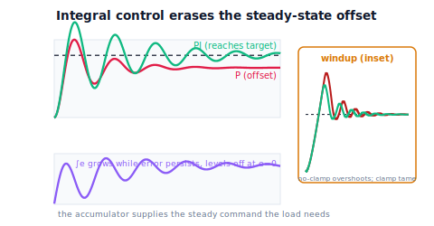

!!! abstract "You are here"
    **Module 8 — Feedback Control and Real-Time Execution (ROS 2)**  ·  **Unit 2 — Proportional, Integral, and Derivative Control**  ·  **Lesson 2.2 — Integral Control: Erasing Steady-State Error**

# Lesson 2.2 — Integral Control: Erasing Steady-State Error

> Proportional control left a residual offset under load — it physically *can't* close the last gap. Integral control closes it with a new idea: **remember the error and keep pushing harder the longer it persists**. As long as any offset remains, the integral term grows, until the offset is gone. We lead by watching the persistent P-offset get driven to zero, then meet the price: lag and windup.

---

## 1. Why This Matters
Proportional control's flaw was structural: at steady state it needs a nonzero error to generate the holding force, so it settles short of the target. Integral control fixes this with a fundamentally different mechanism — instead of responding to the *current* error, it responds to the *accumulated* error over time. As long as the joint sits even slightly short of target, the accumulation keeps growing, adding more and more command, *until the joint reaches the target and the error stops accumulating*. The steady-state offset is driven to zero.

This is the term that gives controllers their precision. The "I" in PID is what lets a robot joint actually reach its commanded angle under load, a thermostat actually hit the set temperature, a cruise control actually hold the set speed on a hill. But integral action isn't free: because it acts on history, it responds sluggishly and can overshoot, and it suffers a failure mode called **windup** — the accumulation building up uselessly while the actuator is saturated, then overshooting badly when released. This lesson builds the integral term, shows it erasing the offset, and shows how to tame windup. It is the second piece of the **correction** toolkit, and the one that buys zero steady-state error.

## 2. Physical Intuition
Picture the box-on-a-sloped-floor again. Proportional pushing left it stuck short of the line, your gentle near-the-line push exactly balancing gravity. Now add a stubborn rule: *the longer the box sits short of the line, the more extra push you add* — you keep leaning in harder the longer it refuses to reach. Eventually your accumulated extra effort exceeds gravity's pull and the box creeps to the line. The instant it reaches the line, you stop *adding* extra (the error is zero, nothing more accumulates), but you keep the extra you've already built up — exactly enough to hold against the slope. The box sits *on* the line, held by accumulated effort. That accumulated, persistent push is integral action.

A robot joint's integral term does this automatically: it sums the tracking error over time, and that running sum becomes extra command. Any lingering offset keeps the sum growing until the offset vanishes; then the sum holds steady at exactly the value needed to balance the load. The catch, in the analogy: if you keep leaning in *while the box is jammed against an obstacle* (the actuator is maxed out and can't move it), your accumulated effort grows enormous, and when the obstacle clears, the box lurches wildly past the line. That overshoot from over-accumulation is **windup**, and you have to guard against it.

## 3. Mathematical Foundations
**Integral control** commands an effort proportional to the *accumulated* error:

$$u_I(t) = K_i \int_0^t e(\tau)\,d\tau,$$

with $K_i > 0$ the integral gain. In discrete form (each cycle of period $\Delta t$): keep a running sum $E_i \mathrel{+}= e\,\Delta t$, and command $u_I = K_i E_i$.

**Why it erases steady-state offset.** Suppose a nonzero steady error $e_{ss}$ persisted. Then the integral $\int e$ would keep growing without bound, so $u_I$ would keep growing — but a growing command moves the joint, which *reduces* the error. The only steady state in which the integral *stops* changing is $e = 0$. Therefore integral action has an equilibrium only at **zero error**: it drives $e_{ss} \to 0$. Where proportional needed a residual error to hold the load, the integral *remembers* the load and supplies the holding command from accumulation, freeing the error to reach zero. (Combined with P, the proportional term handles the transient and the integral cleans up the offset — the "PI" controller.)

**The cost — lag and overshoot.** The integral responds to *history*, not the present, so it acts with delay: it keeps pushing based on past error even after the joint has caught up, causing overshoot and a slower, more oscillatory settle than P alone. More $K_i$ → faster offset removal but more overshoot.

**Windup.** If the actuator saturates ($u$ clipped at $u_{\max}$, Lesson 1.1/Unit 5), the joint can't respond, the error persists, and the integral keeps accumulating a huge sum that does nothing — until the joint frees up, when the enormous accumulated term drives a massive overshoot. **Anti-windup** prevents this: the simplest method **clamps** the integral sum to a limit (the engine's `i_clamp`), so it can't grow unboundedly while saturated; more advanced methods stop integrating when saturated ("conditional integration"). The engine's `PIDController(Ki=..., i_clamp=...)` implements the clamp; the notebook reproduces both the offset removal and a windup episode.

## 4. Visual Explanation

<figure markdown>
  { width="680" }
</figure>

## 5. Engineering Example
Integral action is why precise setpoint control works in practice. A modern thermostat reaches the exact set temperature (no droop) because of its integral term. Cruise control holds the set speed precisely on a long grade because the integral builds up the extra throttle the hill demands. Process controllers holding a tank level or pressure rely on integral action to eliminate offset against constant disturbances. And every one of these systems implements anti-windup, because saturation is universal: floor a car on a steep hill (throttle maxed) and a naive integral winds up, then surges past the set speed when the road levels — real cruise controls clamp or freeze the integral to prevent exactly this. For a robot joint, integral action is what lets the arm actually reach its grasp angle under a payload; anti-windup is what keeps it from lurching when it un-jams from a snagged branch (where the command had saturated).

## 6. Worked Example
Erase the proportional offset, then provoke and fix windup.

- **Offset removal:** the $K_p=10$ controller from Lesson 2.1 left $e_{ss} \approx 0.2$ rad at the $0\to1.0$ target under load $\ell=2.0$. Add integral, $K_i = 8$ (with a clamp): the joint now climbs all the way to **1.0 rad** — the steady-state error goes to ≈ 0. The integral built up the holding command the load required; the slight cost is a bit of overshoot before settling.
- **Windup episode:** lower the actuator saturation $u_{\max}$ so the command clips during the fast part of the move, and run **without** a clamp. The integral balloons while saturated, then drives a large overshoot when the joint frees up.
- **Anti-windup fix:** re-run with `i_clamp` set; the accumulator stays bounded, the overshoot is tame, and the offset is still erased.
- **Verdict:** integral erases the offset proportional couldn't, at the cost of some overshoot and the need for anti-windup. The notebook shows the offset → 0, then a windup overshoot, then the clamp taming it.

## 7. Interactive Demonstration
*(Conceptual — runnable in the companion notebook; the L07 PID Playground makes it interactive.)*

**Add integral.** In the notebook you:

1. Take the P-only run with its offset, add an integral term, and watch the steady-state error go to zero (with a little overshoot).
2. Plot the integral accumulator growing while error persists and flattening once it reaches zero.
3. Force actuator saturation and observe windup (big overshoot) without a clamp, then re-enable the clamp and see anti-windup tame it.

## 8. Coding Exercise

!!! tip "Run the hands-on notebook"
    `modules/module08/notebooks/lesson06_integral_control.ipynb` — open in JupyterLab and run **Kernel → Restart & Run All**.

*(Snippet / notebook task — uses `PIDController(Kp, Ki, i_clamp)`, `simulate_closed_loop`, `step_response_metrics`.)*

In the companion notebook:

1. Run P-only and PI on the same loaded step; assert PI's steady-state error is ≈ 0 while P-only's is ≈ $\ell/K_p$ — integral erases the offset.
2. Lower `u_max` to force saturation and run PI **without** a clamp; assert the overshoot is large (windup).
3. Re-run with `i_clamp` set and assert the overshoot drops substantially while the offset stays ≈ 0 — anti-windup works.

## 9. Knowledge Check

Formative — unlimited attempts, immediate feedback; does not affect your grade.

<iframe src="../../quizzes/module08/lesson06_quiz.html" title="Integral Control: Erasing Steady-State Error knowledge check" style="width:100%;height:720px;border:1px solid #e2e8f0;border-radius:12px"></iframe>

[Open this quiz in a new tab ↗](../quizzes/module08/lesson06_quiz.html)

1. State the integral control law and explain why it drives steady-state error to zero.
2. Why does integral action add lag and overshoot?
3. What is integral windup, and when does it happen?
4. How does an integral clamp (anti-windup) help?

## 10. Challenge Problem
Argue from the accumulator's behavior why integral action has an equilibrium *only* at zero error (so any constant disturbance is eventually fully rejected), and then explain the trade this buys: precision (zero offset) in exchange for slower, more oscillatory transients. Finally, explain why windup is fundamentally a *saturation* problem (the controller "asks" for more than the actuator can give and keeps asking), and why both a clamp and "stop integrating when saturated" address it. *(Integral = precision at the cost of speed, plus a saturation hazard.)*

## 11. Common Mistakes
- **Using integral alone.** Integral is sluggish; it's paired with proportional (PI) so P handles the transient and I cleans up the offset.
- **Too much $K_i$.** Excessive integral gain causes large overshoot and oscillation — precision bought at the cost of stability.
- **Ignoring windup.** Without anti-windup, saturation makes the integral balloon and the system overshoot wildly; always clamp or freeze the integral when saturated.
- **Expecting instant offset removal.** Integral erases the offset over time as the accumulator builds; it's not immediate.

## 12. Key Takeaways
- **Integral control** $u_I = K_i \int e$ commands effort proportional to *accumulated* error.
- Because the accumulator grows while any error persists and stops only at $e=0$, integral action **drives steady-state error to zero** — the gap proportional control couldn't close.
- The cost is **added lag and overshoot**, and the hazard is **windup** (the integral ballooning during actuator saturation), which **anti-windup clamping/freezing** prevents.
- P + I gives precision (zero offset) but can be oscillatory. Next we add the term that **damps** that oscillation: derivative control.

---

### AI Learning Companion

Copy any prompt below into your AI tutor.

- **Tutor (re-explain):** "Re-explain integral control using the 'keep leaning harder the longer the box sits short of the line' analogy. Stress that accumulated error drives steady-state error to zero, the cost is lag/overshoot, and windup happens during actuator saturation (fixed by clamping). Then ask me why the only equilibrium is zero error."
- **Practice (generate exercises):** "Give me scenarios (loaded joint with P-only offset, a saturating actuator) and ask me what integral action does, whether windup occurs, and how a clamp helps. Withhold answers until I respond."
- **Explore (connect to the real world):** "Explain how cruise control uses integral action to hold speed on a hill and why it implements anti-windup to avoid surging when the hill ends."

### Global Learning Support

Per-language explanation prompts — use whichever you think best in.

- **English (authoritative):** "Explain integral control u_I = Ki·∫e for a robot joint: why accumulating error drives steady-state error to zero, the cost (lag, overshoot), and integral windup during actuator saturation plus anti-windup clamping, at a robotics-course level (no formal control theory)."
- **Español:** "Explica el control integral u_I = Ki·∫e para una articulación de robot: por qué acumular el error lleva el error en régimen permanente a cero, su costo (retardo, sobreimpulso), y el windup integral durante la saturación del actuador junto con el anti-windup por saturación del acumulador, a nivel de curso de robótica (sin teoría de control formal)."
- **中文（简体）：** "用机器人课程的水平（不涉及形式控制理论），解释机器人关节的积分控制 u_I = Ki·∫e：为什么累积误差能把稳态误差驱动到零、其代价（滞后、超调），以及执行器饱和时的积分饱和（windup）和限幅抗饱和。"
- **Türkçe:** "Bir robot eklemi için integral kontrolü u_I = Ki·∫e açıkla: hatayı biriktirmenin kalıcı-durum hatasını neden sıfıra sürdüğü, bedeli (gecikme, aşım) ve eyleyici doygunluğu sırasında integral windup ile birikimi sınırlayan anti-windup — robotik dersi düzeyinde (biçimsel kontrol teorisi yok)."

---

*Next lesson: 2.3 — Derivative Control: Anticipate and Damp (with the PID Playground demo).*
