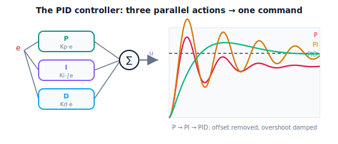

!!! abstract "You are here"
    **Module 8 — Feedback Control and Real-Time Execution (ROS 2)**  ·  **Unit 2 — Proportional, Integral, and Derivative Control**  ·  **Lesson 2.4 — The PID Controller: The Complete Single-Joint Tracker**

# Lesson 2.4 — The PID Controller: The Complete Single-Joint Tracker

> Three terms, three jobs: proportional pushes, integral erases offset, derivative damps. This lesson assembles them into the single most-used controller in engineering — **PID** — and shows it tracking a reference precisely and cleanly on one joint. We lead with the complete law in action, then recap Unit 2: you can now close the loop and make a joint *track*.

---

## 1. Why This Matters
You've built the three control actions one at a time and seen exactly what each contributes and where each falls short alone: proportional tracks but leaves an offset, integral erases the offset but overshoots, derivative damps but can't track or remove offset by itself. The **PID controller** combines all three into one law so their strengths cover each other's weaknesses — and the result is the workhorse of control engineering, running in an estimated majority of all feedback loops on Earth, from robot joints to chemical plants to aircraft.

For a robot joint, PID is the complete single-joint tracker: give it a reference and the measured angle, and it produces a command that drives the joint to follow the reference precisely (integral kills offset), responsively (proportional), and cleanly (derivative damps). This lesson assembles the full law, explains how the three terms interact and trade off, and applies it to track a Module 7 reference on one joint. It is the capstone of the module's **correction** stage: the building block that Unit 3 will analyze for stability, Unit 4 will replicate across all the arm's joints and combine with Module 7's feed-forward, and Unit 8 will package as a ROS 2 node. Master PID on one joint here and the rest of the module is deployment and scaling.

## 2. Physical Intuition
Return one last time to easing an object onto a target line under a load, but now combine all three instincts into one fluid motion. You **push proportional to the distance** (far → hard, near → gentle): that's P, getting you most of the way. You notice you're settling a little short under the load, so you **keep leaning in extra the longer you sit short**, building up just enough steady push to reach and hold the line: that's I, erasing the offset. And as you approach, you **brake against your closing speed** so you don't sail past: that's D, easing you cleanly onto the line. Done together, smoothly, the object glides to the line and stays — fast, precise, no overshoot. That coordinated three-part instinct *is* PID.

A robot joint's PID controller does all three every cycle: proportional effort from the current error, integral effort from the accumulated error, derivative braking from the error's rate — summed into one command. No single term could do it: P alone offsets, I alone is sluggish and rings, D alone can't even reach the target. Together they track a reference tightly, hit it exactly under load, and settle without overshoot. Tuning is balancing the three (Unit 3), but the structure — push, erase offset, damp — is this one intuitive combined motion.

## 3. Mathematical Foundations
The **PID control law** sums the three actions:

$$u(t) = \underbrace{K_p\,e(t)}_{\text{proportional}} + \underbrace{K_i \int_0^t e(\tau)\,d\tau}_{\text{integral}} + \underbrace{K_d\,\dot e(t)}_{\text{derivative}},\qquad e = q_d - q.$$

Each term's role, and how they interact:

- **$K_p$ (proportional) — the workhorse.** Provides the bulk of the corrective push, proportional to the present error. Sets responsiveness; alone, leaves offset $\ell/K_p$.
- **$K_i$ (integral) — the precision.** Accumulates error to drive the steady-state offset to zero. Adds lag/overshoot; needs anti-windup.
- **$K_d$ (derivative) — the damping.** Opposes fast change to suppress overshoot and oscillation, enabling higher $K_p, K_i$. Sensitive to noise; filter or take on measurement.

**Interaction and trade-offs.** The three gains are tuned *together* because they interact: more $K_p$ → faster but more overshoot (which $K_d$ can damp); more $K_i$ → less offset/faster offset removal but more overshoot (which $K_d$ can damp); more $K_d$ → more damping but more noise sensitivity and sluggishness. A good controller balances them: enough $K_p$ for responsiveness, enough $K_i$ for zero offset, enough $K_d$ to keep it clean — without crossing into oscillation or noise problems. That balancing is **tuning**, the subject of Unit 3.

**Discrete form** (what runs on a computer, each cycle of period $\Delta t$): maintain the integral sum $E_i \mathrel{+}= e\Delta t$ (clamped for anti-windup) and the previous error $e_{\text{prev}}$, then

$$u = K_p e + K_i E_i + K_d \frac{e - e_{\text{prev}}}{\Delta t}.$$

This is exactly the engine's `PIDController.command`. Common practical variants — derivative-on-measurement, anti-windup, output saturation — are refinements of this core (and appear in later units). For the whole arm, one PID runs per joint (Unit 4), optionally combined with Module 7's feed-forward $\ddot q_d$ (the feed-forward+feedback theme).

## 4. Visual Explanation

<figure markdown>
  { width="680" }
</figure>

## 5. Engineering Example
PID is the default controller of the engineering world. It runs the temperature loops in your home, the cruise control in cars, the attitude loops in drones, the axis servos in CNC machines and 3D printers, the flow and pressure loops in factories, and the joint controllers in most industrial and research robot arms. Its dominance comes from exactly what this unit built: three intuitive, complementary terms that need no model of the plant — just the error — yet deliver precise, stable tracking when tuned. Robot joint controllers are very often PID (or PD with gravity compensation, or PID plus feed-forward), one per joint, running at hundreds to thousands of hertz. For the greenhouse harvester, each joint's PID takes the Module 7 reference and the encoder reading and produces the torque command that makes the joint actually follow the planned motion — precisely (I), responsively (P), and smoothly (D). Everything after this in Module 8 — actuators, communication, real-time, ROS 2 — exists to *run this controller well* on real hardware.

## 6. Worked Example
Track a Module 7 reference on one joint with full PID.

- **Setup:** a Module-7-style reference (rest-to-rest move to a grasp angle under load $\ell$), one joint, a PID controller.
- **Build it up:** P-only tracks but settles short (offset $\ell/K_p$). Add I → reaches the target exactly (offset → 0) but overshoots. Add D → the overshoot is damped, the joint eases cleanly onto the reference.
- **Result:** the full PID tracks the moving reference closely throughout and lands precisely on the final angle with little overshoot — tight (P), exact (I), clean (D). The RMS tracking error is far below open-loop and below any single term alone.
- **Verdict:** PID is the complete single-joint tracker. The notebook builds P → PI → PID on the same reference, plots the progression, and reports the tracking metrics improving at each stage, ending with the clean PID track.

## 7. Interactive Demonstration

<iframe src="../../demos/module08/lesson08_pid_controller.html" title="The PID Controller: The Complete Single-Joint Tracker interactive demo" style="width:100%;height:520px;border:1px solid #e2e8f0;border-radius:12px"></iframe>

[Open this demo in a new tab ↗](../demos/module08/lesson08_pid_controller.html)

*(Conceptual — runnable in the companion notebook; revisit the L07 PID Playground.)*

**Assemble the controller.** In the notebook you:

1. Track the same reference with P, then PI, then PID, overlaying the responses and the metrics (offset, overshoot, settling time).
2. Confirm the progression: P leaves offset → I erases it (adds overshoot) → D damps the overshoot → clean PID track.
3. Perturb one gain at a time on the full PID and observe the trade-offs (more $K_p$/$K_i$ → overshoot; more $K_d$ → damping but noise) — the balancing act of tuning.

## 8. Coding Exercise

!!! tip "Run the hands-on notebook"
    `modules/module08/notebooks/lesson08_pid_controller.ipynb` — open in JupyterLab and run **Kernel → Restart & Run All**.

*(Snippet / notebook task — uses `PIDController(Kp, Ki, Kd, i_clamp)`, `quintic_reference`, `simulate_closed_loop`, `step_response_metrics`, `tracking_rms`.)*

In the companion notebook:

1. Track a reference with P, PI, and PID and assert the tracking metrics improve across the three: offset removed by I, overshoot reduced by D, lowest RMS error for PID.
2. Assert the full PID's steady-state error is ≈ 0 (integral) **and** its overshoot is small (derivative) — both strengths present.
3. Confirm the discrete PID command equals $K_p e + K_i \sum e\Delta t + K_d \Delta e/\Delta t$ for a hand-checked step (the law is exactly the three summed terms).

## 9. Knowledge Check

Formative — unlimited attempts, immediate feedback; does not affect your grade.

<iframe src="../../quizzes/module08/lesson08_quiz.html" title="The PID Controller: The Complete Single-Joint Tracker knowledge check" style="width:100%;height:720px;border:1px solid #e2e8f0;border-radius:12px"></iframe>

[Open this quiz in a new tab ↗](../quizzes/module08/lesson08_quiz.html)

1. Write the full PID control law and name each term's role.
2. Why is each term needed — what does each fix that the others don't?
3. How do the three gains interact and trade off?
4. What does "tuning" a PID controller mean?

## 10. Challenge Problem
For each of the three terms, state the specific failure that occurs if it is *removed* from a PID controller tracking a loaded reference (remove P: no responsiveness/the others can't carry the load alone; remove I: steady-state offset returns; remove D: overshoot/oscillation returns), and the specific failure if it is set *too high* (P: overshoot/oscillation; I: windup/overshoot; D: noise/jitter). Use this to argue why PID is a balance, not a maximization, of the three gains — setting up tuning (Unit 3). *(Each term is necessary; none is sufficient; balance is everything.)*

## 11. Common Mistakes
- **Maximizing instead of balancing the gains.** PID is a balance; cranking any single gain causes its characteristic failure (P/I overshoot, D noise).
- **Omitting anti-windup or derivative filtering.** The full PID inherits integral windup and derivative noise; the practical controller manages both.
- **Forgetting it's one law summed from three.** The command is the *sum* of the three terms each cycle — not three separate controllers.
- **Expecting one gain set to fit every situation.** Different loads, references, and plants need re-tuning (Unit 3); a single tune isn't universal.

## 12. Key Takeaways
- The **PID controller** sums all three actions: $u = K_p e + K_i \int e + K_d \dot e$ — proportional **pushes**, integral **erases offset**, derivative **damps**.
- The three terms **cover each other's weaknesses**; together they track a reference **precisely (I), responsively (P), and cleanly (D)** — the workhorse single-joint tracker.
- The gains **interact and trade off**, so a controller is **balanced, not maximized** — the act of **tuning** (Unit 3).
- **Unit 2 recap:** P (push, but offset) → I (erase offset, but overshoot) → D (damp) → PID (the complete tracker). You can now close the loop and make a joint track. Next, Unit 3 studies **stability, response, and tuning** — what makes a controller settle, oscillate, or diverge, and how to tune it.

---

### AI Learning Companion

Copy any prompt below into your AI tutor.

- **Tutor (re-explain):** "Re-explain the PID controller as the combined 'push proportional to distance, lean in extra the longer you're short, brake against your closing speed' motion. Give the law u = Kp·e + Ki·∫e + Kd·ė, each term's role, and why it's a balance not a maximization. Then ask me what each term fixes."
- **Practice (generate exercises):** "Give me PID controllers with one term removed or one gain too high and ask me to predict the failure (offset, overshoot, windup, noise). Withhold answers until I respond."
- **Explore (connect to the real world):** "Explain why PID is the most widely used controller in engineering, where it runs in everyday and robotic systems, and why it needs no plant model — just the error."

### Global Learning Support

Per-language explanation prompts — use whichever you think best in.

- **English (authoritative):** "Explain the full PID controller u = Kp·e + Ki·∫e + Kd·ė for a robot joint: each term's role (push / erase offset / damp), how the three gains interact and trade off, and that tuning is balancing them, at a robotics-course level (no formal control theory)."
- **Español:** "Explica el controlador PID completo u = Kp·e + Ki·∫e + Kd·ė para una articulación de robot: el papel de cada término (empujar / eliminar offset / amortiguar), cómo interactúan y se compensan las tres ganancias, y que sintonizar es equilibrarlas, a nivel de curso de robótica (sin teoría de control formal)."
- **中文（简体）：** "用机器人课程的水平（不涉及形式控制理论），解释完整的 PID 控制器 u = Kp·e + Ki·∫e + Kd·ė 对机器人关节的作用：每一项的角色（推动 / 消除偏差 / 阻尼）、三个增益如何相互作用与权衡，以及整定就是平衡它们。"
- **Türkçe:** "Bir robot eklemi için tam PID denetleyiciyi u = Kp·e + Ki·∫e + Kd·ė açıkla: her terimin rolü (itme / ofseti silme / sönümleme), üç kazancın nasıl etkileşip ödünleştiği ve ayarlamanın onları dengelemek olduğu — robotik dersi düzeyinde (biçimsel kontrol teorisi yok)."

---

*Next lesson: 3.1 — What Stability Means: Settle, Oscillate, or Diverge (Unit 3 begins — stability, response, and tuning). [Installment B]*
