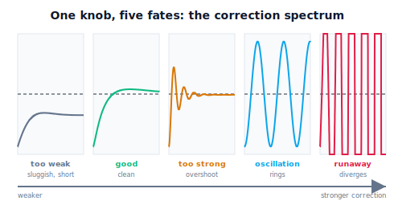

!!! abstract "You are here"
    **Module 8 — Feedback Control and Real-Time Execution (ROS 2)**  ·  **Unit 3 — Stability, Response, and Tuning**  ·  **Lesson 3.1 — When Correction Goes Wrong: From Too Weak to Runaway**

# Lesson 3.1 — When Correction Goes Wrong: From Too Weak to Runaway

> Unit 2 built a controller that works. Now we turn the knobs and watch what happens — **before** we name anything. Drive the same joint to the same target with weaker and weaker, then stronger and stronger correction, and a whole spectrum of behaviour appears: sluggish lag, clean tracking, overshoot, ringing, and finally runaway. The driving question for this unit is simply: **what happens when correction goes wrong?** You will learn to *recognise* each behaviour first; the terminology (overshoot, settling, stability) arrives in the next lessons, once your eye already knows what it is naming.

---

## 1. Why This Matters
You now have a PID controller, and three gains to choose. A natural question — the question every practitioner faces at the bench — is: *what happens if I get them wrong?* The honest answer is that the loop's entire character lives in those gains. The same hardware, the same reference, the same plant can crawl, track beautifully, overshoot, oscillate forever, or fly apart — depending only on how hard the controller corrects.

This lesson deliberately starts with **experience, not definitions**. We will not open with "stability is..." Instead we will drive one joint with a sweep of corrective strengths and *watch*. The goal is recognition: by the end you should be able to glance at a response curve and say "that's too weak," "that's about right," "that's overshooting," "that's oscillating," "that's running away" — without a single formula. That trained eye is the foundation everything else in Unit 3 (the response-shape vocabulary, the stability names, the tuning recipe) is built on. Good control, you will see, is never "as much correction as possible" — it is a **balance**.

## 2. Physical Intuition
Think about steering a car back to the centre of a lane after a gust pushes you sideways. **Correct too weakly** and you drift back slowly, never quite centring — lazy, sloppy, always a little off. **Correct about right** and you glide smoothly back to centre and stay there. **Correct too hard** and you yank past centre to the other side, then yank back, then past again — swerving. Push the aggression even higher and the swerves *grow* instead of shrinking: each correction overshoots worse than the last until you're all over the road. Add a slow reaction time (you respond to where the car *was* a moment ago, not where it is now) and even moderate aggression turns into that growing swerve.

A robot joint correcting its angle behaves identically. Weak correction → it sags toward the target and lingers short. Right correction → smooth arrival. Strong correction → it shoots past, comes back, shoots past again. Too strong (or with delay in sensing) → the overshoots grow and the joint runs away. The knob is the controller's strength; the behaviours are the same ones you feel in the steering wheel. This unit is about reading those behaviours and then learning to set the knob.

## 3. Mathematical Foundations
We keep this deliberately behavioural — **no transfer functions, no poles, no frequency response** (those are a later course). What you need here is the cause-and-effect chain, not a formalism.

The controller's command grows with its gains; the plant turns command into motion; the loop feeds the result back. As the gains rise:

- **Too weak.** The corrective push is small, so the joint approaches slowly and, under a load, settles short (the $e_{ss}=\ell/K_p$ offset from Lesson 2.1). Behaviour: **sluggish, lagging, sagging.**
- **Well-matched.** The push is strong enough to arrive promptly and (with integral) reach the target, and damped enough (with derivative) not to overshoot much. Behaviour: **clean tracking.**
- **Too strong.** The push is so large that the joint's momentum carries it *past* the target before the controller can reverse; it overshoots, comes back, overshoots less, and rings down. Behaviour: **overshoot and ringing.**
- **Way too strong, or delayed.** When corrections are huge — or when the loop acts on *stale* measurements (latency) — each swing can be *larger* than the last. Behaviour: **growing oscillation, divergence — runaway.**

That last case is the crucial one: feedback can make things *worse*, not just better. The single organising idea of this unit is that increasing corrective strength walks you along a one-way street: sluggish → good → overshoot → oscillation → runaway. The art is stopping at "good."

## 4. Visual Explanation

<figure markdown>
  { width="680" }
</figure>

## 5. Engineering Example
Everyone has met this spectrum in a shower. Turn the hot tap a tiny bit when the water is cold (**too weak**): it warms imperceptibly, you wait forever. Turn it the right amount (**good**): it reaches a comfortable temperature and stays. Crank it hard because you're impatient (**too strong**): it goes scalding, you yank it back, now it's freezing, you yank again — **oscillation**, made worse by the **delay** between the tap and the water reaching you. That plumbing delay is exactly the latency that turns aggressive correction into growing swings. Industrial temperature loops, cruise control, drone altitude hold, and robot joints all live on this same spectrum, and "it oscillates" is the single most common field complaint — almost always "correction too strong for the delay in the loop." Recognising the behaviour is the first step to fixing it.

## 6. Worked Example
Drive a joint $0\to 1$ rad with rising controller strength and watch the behaviour change.

- **Too weak** ($K_p=5$, light damping, load $\ell=2$): settles at ~0.6 rad — a big **offset**, slow approach. Under-correcting.
- **Good** ($K_p=30,\ K_i=20,\ K_d=10$): rises in ~0.5 s, ~10% overshoot, settles on target with ~0 offset. This is the balance.
- **Too strong** ($K_p=140,\ K_d=3$): ~50% overshoot, several rings before it settles. Aggressive.
- **Oscillation** ($K_p=80$, no damping/friction): sustained ringing about the target that never dies — marginal.
- **Runaway** ($K_p=50,\ K_d=6$, but the sensor is **delayed** ~60 steps): each swing grows; the joint's angle blows up past hundreds of radians — divergence.

Same joint, same target, five completely different fates — set entirely by corrective strength (and loop delay). The notebook reproduces all five and asks you to *label* each from its curve before revealing the gains.

## 7. Interactive Demonstration

<iframe src="../../demos/module08/lesson09_correction_spectrum.html" title="When Correction Goes Wrong: From Too Weak to Runaway interactive demo" style="width:100%;height:520px;border:1px solid #e2e8f0;border-radius:12px"></iframe>

[Open this demo in a new tab ↗](../demos/module08/lesson09_correction_spectrum.html)

*(Conceptual — runnable in the companion notebook.)*

**Walk the spectrum.** In the notebook you:

1. Drive the same step with five corrective strengths and overlay the responses with the target.
2. For each, decide by eye which behaviour it is — sluggish, clean, overshooting, oscillating, runaway — *then* check the numbers.
3. Add a sensor delay to a moderate controller and watch a previously-clean response slide toward oscillation and then runaway — feedback making things worse.

## 8. Coding Exercise

!!! tip "Run the hands-on notebook"
    `modules/module08/notebooks/lesson09_when_correction_goes_wrong.ipynb` — open in JupyterLab and run **Kernel → Restart & Run All**.

*(Snippet / notebook task — uses `track_reference`, `step_response_metrics`, `classify_stability`.)*

In the companion notebook:

1. Run the five-strength sweep on a step and assert the ordering of behaviours: the weak case settles short (large offset), the good case reaches the target with small overshoot, the too-strong case has large overshoot.
2. Assert the no-damping high-gain case is **not** cleanly settling (`classify_stability` returns "marginal" or worse).
3. Add `sensor_delay_steps` to a moderate controller and assert that beyond some delay the response becomes "unstable" — latency turns correction into runaway.

## 9. Knowledge Check

Formative — unlimited attempts, immediate feedback; does not affect your grade.

<iframe src="../../quizzes/module08/lesson09_quiz.html" title="When Correction Goes Wrong: From Too Weak to Runaway knowledge check" style="width:100%;height:720px;border:1px solid #e2e8f0;border-radius:12px"></iframe>

[Open this quiz in a new tab ↗](../quizzes/module08/lesson09_quiz.html)

1. Describe, in behaviour terms, what happens as a controller's corrective strength goes from too weak to too strong.
2. What does "too weak" correction look like in the response? What does "too strong" look like?
3. How can adding delay to the feedback turn a well-behaved loop into a runaway one?
4. Why is "maximum correction" the wrong goal?

## 10. Challenge Problem
Without any formula, sketch the five response curves (too weak, good, too strong, oscillation, runaway) on one set of axes from memory, then write one sentence per curve describing the *physical* reason it looks that way (e.g., "too weak settles short because the shrinking push balances the load before reaching target"). Finally, explain why two different knobs — raising the gain *and* adding loop delay — can both push a loop from "good" toward "runaway," even though one increases correction and the other doesn't. *(Hint: both effectively make the correction too aggressive for when it actually arrives.)*

## 11. Common Mistakes
- **Believing more correction is always better.** The spectrum ends in runaway; good control is a balance.
- **Confusing "too weak" (sluggish, offset) with "broken."** A weak loop still works — it just under-corrects.
- **Ignoring delay.** Latency, not just gain, is a leading cause of oscillation and divergence.
- **Naming before seeing.** Reach for the vocabulary only after you can recognise the behaviour by eye.

## 12. Key Takeaways
- A single knob — corrective strength — moves the loop through **sluggish → clean → overshoot → oscillation → runaway**.
- **Too weak:** slow, sags short. **Good:** smooth arrival. **Too strong:** overshoot/ringing. **Too far (or delayed):** divergence.
- **Feedback can make things worse** — increasing gain or loop delay can destabilise an otherwise-fine loop.
- Good control is a **balance**, not a maximum. Next we give these behaviours names and numbers.

---

### AI Learning Companion

Copy any prompt below into your AI tutor.

- **Tutor (re-explain):** "Re-explain the 'correction spectrum' for a robot joint using the steering-a-car-in-a-lane analogy: too weak (drifts, never centres), good (smooth), too strong (swerving overshoot), runaway (growing swerves, worsened by reaction delay). Keep it behavioural — no control-theory math — then ask me to predict the behaviour for a given strength."
- **Practice (generate exercises):** "Describe a joint response in words (e.g., 'rises slowly, settles 20% short') and ask me to label it: too weak, good, too strong, oscillation, or runaway. Withhold the answer until I respond."
- **Explore (connect to the real world):** "Explain why a shower with a long pipe oscillates between hot and cold when you adjust the tap aggressively, and connect the pipe delay to why latency destabilises a feedback loop."

### Global Learning Support

Per-language explanation prompts — use whichever you think best in.

- **English (authoritative):** "Explain, behaviourally and without control-theory math, the spectrum of a feedback loop as corrective strength rises — too weak (sluggish, offset), good (clean tracking), too strong (overshoot/ringing), oscillation, and runaway (divergence) — and how loop delay pushes a loop toward runaway, at a robotics-course level."
- **Español:** "Explica, de forma conductual y sin matemáticas de teoría de control, el espectro de un lazo de realimentación al aumentar la fuerza de corrección — demasiado débil (lento, con error), buena (seguimiento limpio), demasiado fuerte (sobrepaso/oscilación amortiguada), oscilación sostenida y descontrol (divergencia) — y cómo el retardo del lazo empuja hacia el descontrol, a nivel de curso de robótica."
- **中文（简体）：** "用行为化、不涉及控制理论数学的方式，解释反馈回路随校正强度增大时的行为谱：太弱（迟缓、有偏差）、良好（干净跟踪）、太强（超调/振铃）、持续振荡，以及失控（发散）；并说明回路延迟如何把回路推向失控——机器人课程水平。"
- **Türkçe:** "Düzeltme gücü arttıkça bir geri besleme döngüsünün davranış yelpazesini — çok zayıf (yavaş, kalıcı hata), iyi (temiz izleme), çok güçlü (aşım/sönümlenen salınım), sürekli salınım ve kaçış (ıraksama) — kontrol teorisi matematiği olmadan, davranışsal olarak açıkla; döngü gecikmesinin döngüyü nasıl kaçışa ittiğini de ekle — robotik dersi düzeyinde."

---

*Next lesson: 3.2 — The Shape of a Response: Rise, Overshoot, and Settling.*
