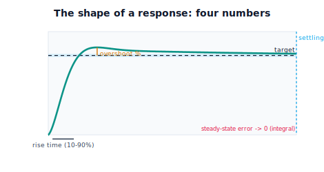

!!! abstract "You are here"
    **Module 8 — Feedback Control and Real-Time Execution (ROS 2)**  ·  **Unit 3 — Stability, Response, and Tuning**  ·  **Lesson 3.2 — The Shape of a Response: Rise, Overshoot, and Settling**

# Lesson 3.2 — The Shape of a Response: Rise, Overshoot, and Settling

> In 3.1 you learned to *see* a response — sluggish, clean, overshooting, ringing. Now we give that shape a vocabulary, because "looks about right" can't be tuned toward and "looks bad" can't be specified in a requirement. Four numbers describe almost any step response: **rise time** (how quickly it climbs), **overshoot** (how far it sails past the target), **settling time** (when it finally stops wiggling), and **steady-state error** (how far off it ends up). These are the language the rest of the unit — and every controls conversation — speaks.

---

## 1. Why This Matters
You can now recognise behaviours, but recognition alone can't carry a tuning decision or a design spec. A teammate can't act on "it felt a bit aggressive," and a requirement can't read "make it nice." Engineering needs numbers: *settle within 0.5 s, overshoot under 10%, zero steady-state error.* This lesson installs the four standard descriptors of a step response so that everything that follows — diagnosing failures (3.3), tuning (3.4), and judging whole-arm tracking (Unit 4) — rests on measurable quantities, not impressions.

Crucially, each number maps back to a behaviour you already understand from 3.1. Rise time is the "how fast" you saw; overshoot is the "sailed past"; settling time is the "stopped ringing"; steady-state error is the "ended short" offset. We are labelling the curve you can already read.

## 2. Physical Intuition
Picture an elevator answering a call to your floor. **Rise time** is how long until it's basically there — a snappy elevator has a short rise time. **Overshoot** would be the elevator going *past* your floor and coming back (uncomfortable! good elevators have none). **Settling time** is when the doors finally open because it has stopped adjusting. **Steady-state error** would be the floor not quite lining up with the hallway — a permanent offset you'd trip on. A good elevator: quick rise, no overshoot, fast settle, zero offset. A badly tuned one is slow, or overshoots and bounces, or stops a few centimetres low. Every one of those complaints is one of our four numbers.

For a robot joint, identical: rise time is how fast it reaches the commanded angle, overshoot is how far past it swings, settling time is when it stops oscillating within a small band, and steady-state error is the residual angle gap once it's done.

## 3. Mathematical Foundations
For a step from $q_0$ to target $q_d$ (span $\Delta = q_d-q_0$), define — **all read directly off the response curve**, no transforms:

- **Rise time $t_r$:** time to go from 10% to 90% of the span. Smaller = faster. Driven mostly by how strong the correction is.
- **Overshoot (%):** the peak excursion past the target as a fraction of the span,
$$\text{OS}\% = \frac{q_{\text{peak}} - q_d}{\Delta}\times 100\%.$$
Zero means it never crossed the target; large means an aggressive, under-damped response.
- **Settling time $t_s$:** the last time the response leaves a small band (e.g. $\pm 2\%$ of $\Delta$) around the target — after $t_s$ it stays inside. Long settling = lots of ringing.
- **Steady-state error $e_{ss}$:** the residual gap once settled, $e_{ss} = q_d - q(\infty)$. Under load, pure P leaves $\ell/K_p$; integral drives it to zero.

There is a built-in **tension**: pushing for a short rise time tends to *increase* overshoot (more aggressive correction sails further past), which *lengthens* settling time. A well-shaped response balances them — fast enough to rise promptly, damped enough to not overshoot much, integrated enough to zero the offset. The engine's `step_response_metrics(t, q, q_target, q0)` returns exactly these four numbers from a simulated response, so you can measure rather than eyeball.

## 4. Visual Explanation

<figure markdown>
  { width="680" }
</figure>

## 5. Engineering Example
These four numbers *are* the controls spec sheet. A pick-and-place robot's joint might be specified "rise time < 200 ms, overshoot < 5%, settling < 350 ms, steady-state error < 0.1°" — and acceptance testing literally measures them off a step response. Overshoot has real consequences: a welding head that overshoots gouges the part; a surgical tool that overshoots is dangerous; a camera gimbal that overshoots blurs the shot. Settling time sets throughput — a packaging line can't grab the next item until the arm has settled. Steady-state error sets precision — a 3D printer with joint offset prints dimensionally wrong. When a vendor says a servo is "fast," ask *which* number; "fast rise" with "huge overshoot" may be worse than a slightly slower, clean response.

## 6. Worked Example
Measure the shape of a tuned step ($0\to1$ rad, load $\ell=2$, $K_p=30,\ K_i=20,\ K_d=10$):

- **Rise time** $t_r \approx 0.5$ s — climbs promptly.
- **Overshoot** $\approx 10\%$ — sails to ~1.10 then comes back; modest, acceptable for most tasks.
- **Settling time** $t_s \approx 3.5$ s into a $\pm2\%$ band — a few gentle rings before it locks in.
- **Steady-state error** $\approx 0$ — the integral term erased the load offset.

Now compare an **aggressive** retune ($K_p=140,\ K_d=3$): rise time drops to ~0.07 s (much faster) but overshoot jumps to ~50% and settling lengthens — you bought speed with a worse shape. And a **timid** one ($K_p=5$): no overshoot, but a 0.4 rad steady-state offset and it never really settles. The four numbers make the trade explicit. The notebook computes all four for each and confirms the speed-vs-overshoot tension.

## 7. Interactive Demonstration

<iframe src="../../demos/module08/lesson10_response_shape.html" title="The Shape of a Response: Rise, Overshoot, and Settling interactive demo" style="width:100%;height:520px;border:1px solid #e2e8f0;border-radius:12px"></iframe>

[Open this demo in a new tab ↗](../demos/module08/lesson10_response_shape.html)

*(Conceptual — runnable in the companion notebook.)*

**Read the shape.** In the notebook you:

1. Take one step response and overlay the four annotations (rise bracket, overshoot peak, settling band, final gap).
2. Re-tune for speed and watch rise time fall while overshoot rises — the central trade.
3. Re-tune for calm and watch overshoot vanish while rise/settling lengthen.

## 8. Coding Exercise

!!! tip "Run the hands-on notebook"
    `modules/module08/notebooks/lesson10_response_shape.ipynb` — open in JupyterLab and run **Kernel → Restart & Run All**.

*(Snippet / notebook task — uses `track_reference`/`step_response_metrics`.)*

In the companion notebook:

1. Compute `step_response_metrics` for a tuned response and assert overshoot is modest (< ~15%) and steady-state error ≈ 0.
2. Make the controller more aggressive and assert rise time **decreases** while overshoot **increases** (the speed-vs-overshoot trade).
3. Make it timid (low $K_p$, no $K_i$) and assert a nonzero steady-state error appears.

## 9. Knowledge Check

Formative — unlimited attempts, immediate feedback; does not affect your grade.

<iframe src="../../quizzes/module08/lesson10_quiz.html" title="The Shape of a Response: Rise, Overshoot, and Settling knowledge check" style="width:100%;height:720px;border:1px solid #e2e8f0;border-radius:12px"></iframe>

[Open this quiz in a new tab ↗](../quizzes/module08/lesson10_quiz.html)

1. Define rise time, overshoot, settling time, and steady-state error in one sentence each.
2. Which metric measures speed? Which measures aggressiveness? Which measures precision?
3. Why does reducing rise time often increase overshoot?
4. Two responses have the same rise time but one overshoots 5% and the other 40%. Which is better tuned, and why?

## 10. Challenge Problem
You are handed two step responses with identical rise times. Response A overshoots 3% and settles in 0.4 s with zero steady-state error; response B overshoots 35%, settles in 1.2 s, with zero steady-state error. Argue which you'd ship for (a) a camera gimbal and (b) a heavy gantry that must not bounce, and explain using the four metrics. Then explain why "minimise rise time" alone is a dangerous objective, and propose a balanced spec (a target for each of the four numbers) for a general-purpose joint. *(There is no single best response — only best for a task.)*

## 11. Common Mistakes
- **Optimising one number.** Chasing rise time alone breeds overshoot and long settling; specify all four.
- **Confusing overshoot with steady-state error.** Overshoot is a transient excursion; steady-state error is the permanent offset.
- **Ignoring the settling band.** "Settled" only means inside a stated band ($\pm2\%$); without the band, the number is meaningless.
- **Reporting metrics without the target/step.** The numbers are relative to the span $\Delta$; quote the step they came from.

## 12. Key Takeaways
- Four numbers describe a step response: **rise time** (speed), **overshoot** (aggressiveness), **settling time** (when ringing stops), **steady-state error** (final offset).
- Each maps to a behaviour you already recognise from 3.1; together they turn impressions into a **spec**.
- There's a built-in **speed-vs-overshoot trade**: faster rise tends to mean more overshoot and longer settling.
- Good tuning balances all four — next we diagnose what makes them go bad, then how to set the gains.

---

### AI Learning Companion

Copy any prompt below into your AI tutor.

- **Tutor (re-explain):** "Re-explain rise time, overshoot, settling time, and steady-state error using the 'elevator answering a call' analogy, then ask me to point to each one on a described step response. Keep it to reading the curve — no Laplace or transfer functions."
- **Practice (generate exercises):** "Describe step responses with specific numbers (rise, overshoot, settling, steady-state error) and ask me to judge which is better tuned for a stated task, and why. Withhold answers until I respond."
- **Explore (connect to the real world):** "Give me real examples where each metric dominates the requirement — e.g., overshoot for a welding head, settling time for a packaging line, steady-state error for a 3D printer — and explain the consequence of getting each wrong."

### Global Learning Support

Per-language explanation prompts — use whichever you think best in.

- **English (authoritative):** "Define and explain the four step-response metrics — rise time, overshoot, settling time, steady-state error — for a robot joint, how to read each off the curve, and the speed-vs-overshoot trade, at a robotics-course level (no formal control theory)."
- **Español:** "Define y explica las cuatro métricas de respuesta al escalón — tiempo de subida, sobrepaso, tiempo de establecimiento y error en régimen permanente — para una articulación de robot, cómo leer cada una en la curva, y el compromiso velocidad-vs-sobrepaso, a nivel de curso de robótica (sin teoría de control formal)."
- **中文（简体）：** "为机器人关节定义并解释四个阶跃响应指标——上升时间、超调量、调节时间、稳态误差——如何从曲线上读出每一个，以及速度与超调的权衡，机器人课程水平（不涉及形式控制理论）。"
- **Türkçe:** "Bir robot eklemi için dört basamak-yanıtı ölçütünü — yükselme zamanı, aşım, yerleşme zamanı, kalıcı-durum hatası — tanımla ve açıkla; her birini eğriden nasıl okuyacağını ve hız-aşım ödünleşimini anlat — robotik dersi düzeyinde (biçimsel kontrol teorisi yok)."

---

*Next lesson: 3.3 — Stable, Marginal, Unstable — and What Tips a Loop Over.*
