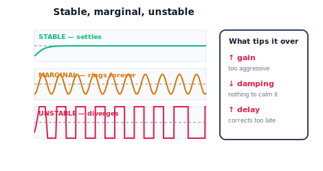

!!! abstract "You are here"
    **Module 8 — Feedback Control and Real-Time Execution (ROS 2)**  ·  **Unit 3 — Stability, Response, and Tuning**  ·  **Lesson 3.3 — Stable, Marginal, Unstable — and What Tips a Loop Over**

# Lesson 3.3 — Stable, Marginal, Unstable — and What Tips a Loop Over

> You can read a response's shape. Now we name how it *ends*. Every loop lands in one of three regimes: it **settles** (stable), it **rings forever** (marginal), or it **blows up** (unstable). This is the most important classification in feedback control, because the third one breaks hardware and hurts people. We name the three behaviours you already saw at the ends of the spectrum in 3.1, and — without any frequency-domain machinery — pin down the three things that tip a loop from safe to runaway: too much gain, too little damping, and too much delay.

---

## 1. Why This Matters
Of all the things a controller can do, one matters more than the rest: *does the error eventually shrink, or grow?* A loop whose corrections shrink the error settles and is **stable**. A loop whose corrections exactly sustain the error oscillates forever — **marginal**. A loop whose corrections *grow* the error diverges — **unstable** — and on real hardware that means a joint slamming its limits, a stripped gear, a thrown payload, or worse. Stability is the safety property of control.

This lesson does two things. First, it names the three regimes precisely so you can classify any response. Second — and this is the practical payoff — it identifies *what causes* a loop to cross from stable into marginal and unstable, so you can avoid it. We do this entirely through behaviour and cause-and-effect; the formal stability theory (poles, Routh, Nyquist, gain/phase margins) is a later course and explicitly out of scope here. What you need now is the engineer's working intuition: **too much gain, too little damping, and too much delay** are the three roads to runaway.

## 2. Physical Intuition
Push a child on a swing. If you push gently and in time, the swing settles into a steady arc — **stable**. If every push is timed to add *exactly* the energy lost to friction, the swing keeps the same height forever — **marginal**. If you push too hard, or push at the *wrong moment* (a beat late, when the swing is already coming back), you add more energy than friction removes and the arc grows and grows until the chains go slack — **unstable**. Notice that two completely different mistakes cause the blow-up: pushing too hard (too much gain) and pushing at the wrong time (delay). Both deliver the correction when it amplifies the motion instead of calming it.

A robot joint is the swing. A well-damped, sensibly-gained loop settles. Strip the damping and crank the gain and it rings without end. Make the corrections huge, or feed the controller stale measurements so it always corrects for where the joint *was* (delay), and the swings grow into divergence. The lesson's core insight: **instability is correction arriving too strong, or too late, to calm the motion.**

## 3. Mathematical Foundations
We classify by the **envelope** of the response — whether successive swings shrink, hold, or grow — not by any transform.

- **Stable:** the oscillation envelope **decays**; the response converges to a constant. Late-time wiggle is much smaller than early-time wiggle.
- **Marginal:** the envelope is **constant**; the response oscillates at roughly fixed amplitude indefinitely (sustained ringing). This is the boundary case.
- **Unstable:** the envelope **grows**; each swing is larger than the last and the response diverges (in simulation, off to huge values; on hardware, to the limits).

The three things that push a loop toward the bad regimes:

1. **Too much gain.** Large corrections inject lots of "energy"; with insufficient damping to remove it, swings grow. (On a frictionless double integrator, even pure proportional gain gives sustained — marginal — oscillation; add any aggressive term or delay and it diverges.)
2. **Too little damping.** The derivative term (and physical friction) *removes* energy by opposing fast motion. Remove it and there's nothing to calm the swings — ringing persists or grows.
3. **Too much delay (latency).** If the controller acts on measurements from $\tau$ seconds ago, its correction is computed for a stale state. By the time it's applied, the joint has moved on, so the correction can be in the *wrong direction* — adding energy. Enough delay turns even a modest, well-damped loop unstable. This is the swing pushed a beat late.

The engine's `classify_stability(q)` reports "stable"/"marginal"/"unstable" from the envelope, and `track_reference(..., sensor_delay_steps=d)` lets you watch increasing delay march a loop from stable through marginal to unstable at *fixed* gains — proof that latency alone destabilises.

## 4. Visual Explanation

<figure markdown>
  { width="680" }
</figure>

## 5. Engineering Example
Instability is the field engineer's nightmare and the lab's cautionary tale. A drone with too-high attitude gain wobbles and then flips — too much gain. A force-controlled robot pressing a surface chatters loudly and bounces — too little damping for the contact stiffness. A teleoperated arm over a laggy network oscillates wildly even with gentle gains — delay. The classic factory story is a perfectly good controller that goes unstable after someone adds a network hop, a digital filter, or a slower sensor: nothing about the gains changed, but the *delay* grew past the loop's tolerance. This is why control engineers obsess over loop timing (Unit 7), and why "it started oscillating after we changed the comms" (Unit 6) is a stability problem, not a wiring problem.

## 6. Worked Example
Hold the controller fixed and vary one cause at a time on a $0\to1$ step:

- **Stable:** $K_p=30,\ K_i=20,\ K_d=10$, normal friction → settles cleanly (`classify_stability` → "stable").
- **Marginal via lost damping + high gain:** $K_p=80$, **no** derivative, **no** friction → sustained ringing about the target that never decays → "marginal".
- **Unstable via delay:** $K_p=50,\ K_d=6$, normal plant, but a **sensor delay** of ~60 steps → swings grow, the angle blows past hundreds of radians → "unstable". The gains were fine; the *delay* broke it.

Same loop, three fates, each from one cause. The notebook sweeps sensor delay at fixed gains and shows the classification cross from "stable" → "marginal" → "unstable" — latency alone walking the loop off the cliff.

## 7. Interactive Demonstration

<iframe src="../../demos/module08/lesson11_stability_classes.html" title="Stable, Marginal, Unstable — and What Tips a Loop Over interactive demo" style="width:100%;height:520px;border:1px solid #e2e8f0;border-radius:12px"></iframe>

[Open this demo in a new tab ↗](../demos/module08/lesson11_stability_classes.html)

*(Conceptual — runnable in the companion notebook.)*

**Find the edge.** In the notebook you:

1. Classify three prepared responses (settling, ringing, diverging) by envelope and confirm with `classify_stability`.
2. Hold gains fixed and ramp up the sensor delay, watching the classification cross from stable to marginal to unstable.
3. Restore zero delay, then strip damping and raise gain to reach marginal ringing — the other road to the edge.

## 8. Coding Exercise

!!! tip "Run the hands-on notebook"
    `modules/module08/notebooks/lesson11_stable_marginal_unstable.ipynb` — open in JupyterLab and run **Kernel → Restart & Run All**.

*(Snippet / notebook task — uses `track_reference`, `classify_stability`.)*

In the companion notebook:

1. Build a clearly stable response and assert `classify_stability` returns "stable".
2. Strip damping/friction and raise the gain to produce sustained ringing; assert the classification is "marginal" (or "unstable").
3. At **fixed** gains, increase `sensor_delay_steps` and assert that beyond some threshold the classification becomes "unstable" — demonstrating that delay alone destabilises.

## 9. Knowledge Check

Formative — unlimited attempts, immediate feedback; does not affect your grade.

<iframe src="../../quizzes/module08/lesson11_quiz.html" title="Stable, Marginal, Unstable — and What Tips a Loop Over knowledge check" style="width:100%;height:720px;border:1px solid #e2e8f0;border-radius:12px"></iframe>

[Open this quiz in a new tab ↗](../quizzes/module08/lesson11_quiz.html)

1. Define stable, marginal, and unstable in terms of the response envelope.
2. Name the three things that tip a loop toward instability.
3. Why is latency as dangerous as excessive gain?
4. A loop was stable, then became unstable after a sensor was replaced with a slower one and no gains changed. What happened?

## 10. Challenge Problem
Explain, using the swing analogy, why *delay* and *excessive gain* both cause divergence even though one adds no extra correction strength. Then describe a real scenario where a stable robot loop is pushed unstable purely by a change elsewhere in the system (sensor, network, filter) with the controller untouched, and propose two distinct remedies that do **not** involve lowering the gain (hint: reduce the delay, or add damping/derivative). Finally, explain why "just lower all the gains" is a safe but often unacceptable fix. *(Stability is necessary; sluggishness is the price of buying it the lazy way.)*

## 11. Common Mistakes
- **Treating marginal as "fine."** Sustained ringing is the edge of the cliff; small changes push it over.
- **Blaming only the gains.** Delay and lost damping destabilise at unchanged gains — check loop timing and the derivative term too.
- **Assuming simulation stability means hardware stability.** Real loops add delay (sensing, comms, computation) that a naive sim omits — Unit 7 makes this precise.
- **Reaching for huge gain for speed.** Speed bought with gain spends your stability margin.

## 12. Key Takeaways
- A loop ends up **stable** (settles), **marginal** (rings forever), or **unstable** (diverges) — read it from the envelope.
- Three things tip a loop over: **too much gain, too little damping, too much delay.**
- **Latency is as dangerous as excessive gain** — stale measurements make corrections arrive in the wrong direction.
- Stability is the safety property of control. Next: a practical recipe for setting the gains to stay safely stable *and* responsive.

---

### AI Learning Companion

Copy any prompt below into your AI tutor.

- **Tutor (re-explain):** "Re-explain stable, marginal, and unstable using the 'pushing a child on a swing' analogy, and show how both pushing too hard (gain) and pushing a beat late (delay) cause the arc to grow. Keep it to envelopes and causes — no poles, Nyquist, or transfer functions — then quiz me on classifying responses."
- **Practice (generate exercises):** "Describe response envelopes (shrinking / constant / growing) and ask me to classify them stable/marginal/unstable, then ask which of gain, damping, or delay most likely caused a given instability. Withhold answers until I respond."
- **Explore (connect to the real world):** "Give me real cases where adding delay (a network hop, a slow sensor, a digital filter) destabilised a previously-stable robot or drone loop without any gain change, and explain why."

### Global Learning Support

Per-language explanation prompts — use whichever you think best in.

- **English (authoritative):** "Explain the three stability regimes — stable (settles), marginal (sustained oscillation), unstable (diverges) — by the response envelope, and the three causes of instability (too much gain, too little damping, too much delay), including why latency destabilises, at a robotics-course level (no formal stability theory)."
- **Español:** "Explica los tres regímenes de estabilidad — estable (se asienta), marginal (oscilación sostenida), inestable (diverge) — por la envolvente de la respuesta, y las tres causas de inestabilidad (demasiada ganancia, poco amortiguamiento, demasiado retardo), incluyendo por qué la latencia desestabiliza, a nivel de curso de robótica (sin teoría de estabilidad formal)."
- **中文（简体）：** "用响应包络解释三种稳定性状态——稳定（收敛）、临界（持续振荡）、不稳定（发散）——以及导致不稳定的三个原因（增益过大、阻尼过小、延迟过大），包括为什么延迟会引起不稳定，机器人课程水平（不涉及形式稳定性理论）。"
- **Türkçe:** "Üç kararlılık rejimini — kararlı (yerleşir), sınırda (sürekli salınım), kararsız (ıraksar) — yanıt zarfı üzerinden açıkla; ve kararsızlığın üç nedenini (çok fazla kazanç, çok az sönümleme, çok fazla gecikme), gecikmenin neden kararsızlaştırdığı dâhil — robotik dersi düzeyinde (biçimsel kararlılık teorisi yok)."

---

*Next lesson: 3.4 — Tuning a Controller: A Practical Workflow.*
