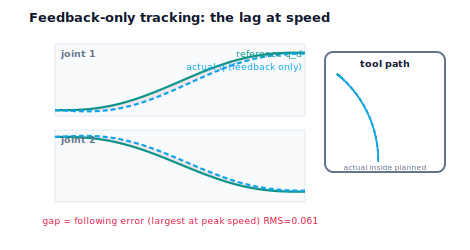

!!! abstract "You are here"
    **Module 8 — Feedback Control and Real-Time Execution (ROS 2)**  ·  **Unit 4 — Tracking the Whole Arm: Feedforward and Feedback**  ·  **Lesson 4.1 — From One Joint to Many: Tracking a Trajectory with Feedback**

# Lesson 4.1 — From One Joint to Many: Tracking a Trajectory with Feedback

> Units 1–3 controlled one joint to one target. A real greenhouse arm has several joints, and Module 7 doesn't hand them a single angle — it hands each joint an entire **trajectory**, $q_d(t)$ with its velocity $\dot q_d(t)$ and acceleration $\ddot q_d(t)$, sampled instant by instant. The natural first step is one tuned PID per joint, each chasing its own $q_d(t)$. It tracks — but during fast motion you'll see every joint trail slightly *behind* its reference. That lag isn't a tuning mistake; it's the inherent signature of feedback, and exposing it sets up the central idea of this unit: anticipation.

---

## 1. Why This Matters
This lesson is the bridge from "control a joint" to "make the arm follow the plan." Two things change at once. First, **one joint becomes many**: the simplest, most robust approach is to give each joint its own independent controller — no cross-coupling, no manipulator dynamics, just $n$ copies of the PID you already know. Second, **a setpoint becomes a trajectory**: instead of "go to 1.0 rad and hold," each joint gets a moving target $q_d(t)$ that changes every millisecond, straight from Module 7's reference layer. This is where Modules 7 and 8 physically connect — M7's output becomes M8's input.

It matters because it's where pure feedback first shows its limit. Regulating to a fixed setpoint, a good PID eventually nails it. But *tracking a moving target*, feedback is always a step behind: it can only react to an error after that error exists, and while the reference keeps moving, a gap opens. Seeing that gap — and understanding it's structural, not a bad gain — is the motivation for everything that follows.

## 2. Physical Intuition
Imagine following a friend through a crowd while only ever looking at where they *are right now*, never anticipating where they're heading. When they walk slowly, you keep up fine. When they speed up or change direction, you're always a beat behind — you react to their move after they've made it, so a gap opens that grows with their speed. You're doing pure feedback: correcting the gap you can see, never anticipating.

Now picture a multi-joint arm sweeping quickly to pick a fruit. Each joint's controller watches its own angle error and corrects it — but because the reference is sweeping fast, each joint is perpetually catching up to where its reference *was* a moment ago. At slow speeds the lag is invisible; during the fast part of the move, every joint trails its $q_d(t)$ by a small, speed-dependent amount, and the tool tip traces a path slightly inside the planned one. The faster and more dynamic the trajectory, the bigger the lag. That's feedback's honest limitation — and the reason Module 7 bothered to compute $\dot q_d$ and $\ddot q_d$, not just $q_d$.

## 3. Mathematical Foundations
**Per-joint independent control.** For an $n$-joint arm we run $n$ controllers, one per joint $j$:
$$u_j(t) = \text{PID}_j\big(e_j(t)\big), \qquad e_j(t) = q_{d,j}(t) - q_j(t).$$
Each joint is treated as its own plant (integrator + disturbance + saturation) with its own gains. We deliberately ignore inter-joint coupling — no mass matrix, no Coriolis terms (that's formal manipulator dynamics, out of scope). Treating joints independently and letting feedback reject the coupling *as a disturbance* is both standard practice and exactly the intuition-first stance of this module.

**Tracking vs regulation.** Regulation holds a constant $q_d$; tracking follows a time-varying $q_d(t)$. The difference is decisive. For a constant target, feedback eventually reaches zero error. For a *moving* target, feedback exhibits **following error**: at each instant it's correcting the gap that has *already* formed, while $q_d$ has moved on. The gap scales with how fast the reference moves — roughly, the faster $\dot q_d$, the larger the lag a given controller leaves. No finite set of PID gains removes following error during fast motion, because feedback has no information about where the reference is *going* — only where the joint *is* relative to where it *was* asked to be.

This is the precise gap Module 7's extra outputs fill. The reference includes $\dot q_d$ and $\ddot q_d$ — the trajectory's velocity and acceleration — which describe where it's *heading*. Feedback ignores them. The next lessons use them. The engine's `JointTracker` runs per-joint PIDs over a multi-joint reference; with feed-forward off (`ff="none"`) it is exactly this feedback-only tracker, and `track_arm` reports the overall tracking RMS so the following error is measurable.

## 4. Visual Explanation

<figure markdown>
  { width="680" }
</figure>

## 5. Engineering Example
Per-joint PID is the workhorse of industrial robotics — most arms ship with independent joint controllers, and they're perfectly good for slow, precise moves like careful placement. The following-error limitation shows up exactly where speed matters: a robot drawing or welding a fast contour traces slightly inside the path, rounding corners and cutting curves; a 3D-printer gantry running fast lays bead off the commanded line; a camera slew that whips to a new target arrives late. CNC and robotics vendors quote a "following error" or "tracking error" spec precisely because feedback-only systems have it. The universal fix in high-speed motion control is to feed the controller the planned velocity and acceleration — which is why motion planners (our Module 7) compute them. This lesson is the "before"; the rest of Unit 4 is the "after."

## 6. Worked Example
Track a fast two-joint move with feedback only.

- **Setup:** joint 1 $0\to1.0$ rad, joint 2 $0\to-0.8$ rad, both as smooth Module-7 quintics over 1.5 s; one tuned PID per joint ($K_p=30,\ K_i=12,\ K_d=8$); each joint has a load.
- **Result:** both joints follow the shape, but each trails its reference through the fast middle — overall tracking RMS ≈ **0.075 rad**, with the largest instantaneous gap at peak speed. The tool tip traces just inside the planned path.
- **Try to tune it out:** raising the gains shrinks the lag a little but invites overshoot and approaches the stability edge (Unit 3) — and the lag never reaches zero during the fast segment.
- **Verdict:** feedback alone tracks moving references with a speed-dependent following error that gains can reduce but not eliminate. The notebook measures the RMS and shows the gap swelling at peak $\dot q_d$.

## 7. Interactive Demonstration
*(Conceptual — runnable in the companion notebook.)*

**Watch the lag.** In the notebook you:

1. Track a multi-joint Module-7 reference with one PID per joint (feedback only) and overlay $q_d(t)$ and $q(t)$ per joint.
2. Plot the following error over time and see it peak where the reference moves fastest.
3. Speed up the trajectory (shorter duration) and watch the following error grow — confirming it's speed-dependent.

## 8. Coding Exercise

!!! tip "Run the hands-on notebook"
    `modules/module08/notebooks/lesson13_one_joint_to_many.ipynb` — open in JupyterLab and run **Kernel → Restart & Run All**.

*(Snippet / notebook task — uses `multi_quintic`, `JointTracker(ff="none")`, `track_arm`, `tracking_rms`.)*

In the companion notebook:

1. Build a two-joint Module-7 reference and track it with a feedback-only `JointTracker`; assert both joints reach near their final targets but with nonzero overall RMS.
2. Assert the instantaneous following error is largest near the time of peak reference speed.
3. Shorten the trajectory duration (faster move) and assert the tracking RMS **increases** — following error is speed-dependent and not tunable to zero.

## 9. Knowledge Check

Formative — unlimited attempts, immediate feedback; does not affect your grade.

<iframe src="../../quizzes/module08/lesson13_quiz.html" title="From One Joint to Many: Tracking a Trajectory with Feedback knowledge check" style="width:100%;height:720px;border:1px solid #e2e8f0;border-radius:12px"></iframe>

[Open this quiz in a new tab ↗](../quizzes/module08/lesson13_quiz.html)

1. How do you extend single-joint PID to a multi-joint arm, and what coupling do you deliberately ignore?
2. What is the difference between regulating to a setpoint and tracking a trajectory?
3. Why does feedback-only tracking lag during fast motion?
4. What two extra signals does Module 7 provide that feedback ignores?

## 10. Challenge Problem
Explain why following error grows with reference speed even for a well-tuned PID, framing it in terms of *when* feedback gets its information versus *when* the reference moves. Then argue why simply raising the gains is not a satisfactory cure (cite the Unit 3 stability edge and noise), and predict what additional information would let a controller stop lagging — connecting your answer to the specific signals $\dot q_d$ and $\ddot q_d$ that Module 7 computed. Finally, explain why treating inter-joint coupling as a disturbance (rather than modelling it) is consistent with this module's approach. *(You are deriving the need for feedforward from the limits of feedback.)*

## 11. Common Mistakes
- **Expecting feedback to track a fast reference perfectly.** Following error is structural; gains reduce but don't erase it.
- **Modelling inter-joint dynamics here.** We treat joints independently and let feedback reject coupling as a disturbance — no mass matrix.
- **Confusing following error with steady-state error.** Following error is a *moving-target* lag; it appears even when the setpoint version would settle perfectly.
- **Cranking gains to kill the lag.** That spends stability margin and amplifies noise — the wrong tool for this job.

## 12. Key Takeaways
- A multi-joint arm is controlled with **one independent PID per joint**, each tracking its own $q_d(t)$ — coupling handled as disturbance, no formal dynamics.
- **Tracking a moving reference is harder than regulating a setpoint:** feedback leaves a speed-dependent **following error**.
- The lag is **structural** — feedback reacts to errors after they form and ignores where the reference is heading.
- Module 7 already computed where it's heading ($\dot q_d,\ \ddot q_d$). Feedback ignores those. Next: use them — **feedforward anticipates.**

---

### AI Learning Companion

Copy any prompt below into your AI tutor.

- **Tutor (re-explain):** "Re-explain feedback-only trajectory tracking using the 'following a friend through a crowd while only watching where they are now' analogy. Stress per-joint independent PID, the difference between tracking a moving reference and regulating a setpoint, and why following error grows with speed. Then ask me what extra information would remove the lag."
- **Practice (generate exercises):** "Give me trajectory speeds and ask me to predict whether following error grows or shrinks and why, and whether raising gains is the right fix. Withhold answers until I respond."
- **Explore (connect to the real world):** "Explain why high-speed CNC and welding robots quote a 'following error' spec, and why motion planners compute velocity and acceleration profiles, not just positions."

### Global Learning Support

Per-language explanation prompts — use whichever you think best in.

- **English (authoritative):** "Explain extending single-joint PID to per-joint control of a multi-joint arm tracking a Module-7 trajectory, the difference between tracking and regulation, and why feedback-only tracking has a speed-dependent following error, at a robotics-course level (no manipulator dynamics)."
- **Español:** "Explica la extensión del PID de una articulación al control por articulación de un brazo multi-articulado que sigue una trayectoria del Módulo 7, la diferencia entre seguimiento y regulación, y por qué el seguimiento solo con realimentación tiene un error de seguimiento dependiente de la velocidad, a nivel de curso de robótica (sin dinámica del manipulador)."
- **中文（简体）：** "解释如何把单关节 PID 扩展为多关节机械臂对模块7轨迹的逐关节控制，跟踪与调节的区别，以及为什么仅靠反馈的跟踪会有随速度增大的跟踪误差——机器人课程水平（不涉及机械臂动力学）。"
- **Türkçe:** "Tek eklem PID'ini, bir Modül-7 yörüngesini izleyen çok eklemli bir kolun eklem-başına kontrolüne genişletmeyi, izleme ile düzenleme arasındaki farkı ve yalnızca geri besleme ile izlemenin neden hıza bağlı bir izleme hatası taşıdığını açıkla — robotik dersi düzeyinde (manipülatör dinamiği yok)."

---

*Next lesson: 4.2 — Feedback Reacts, Feedforward Anticipates.*
